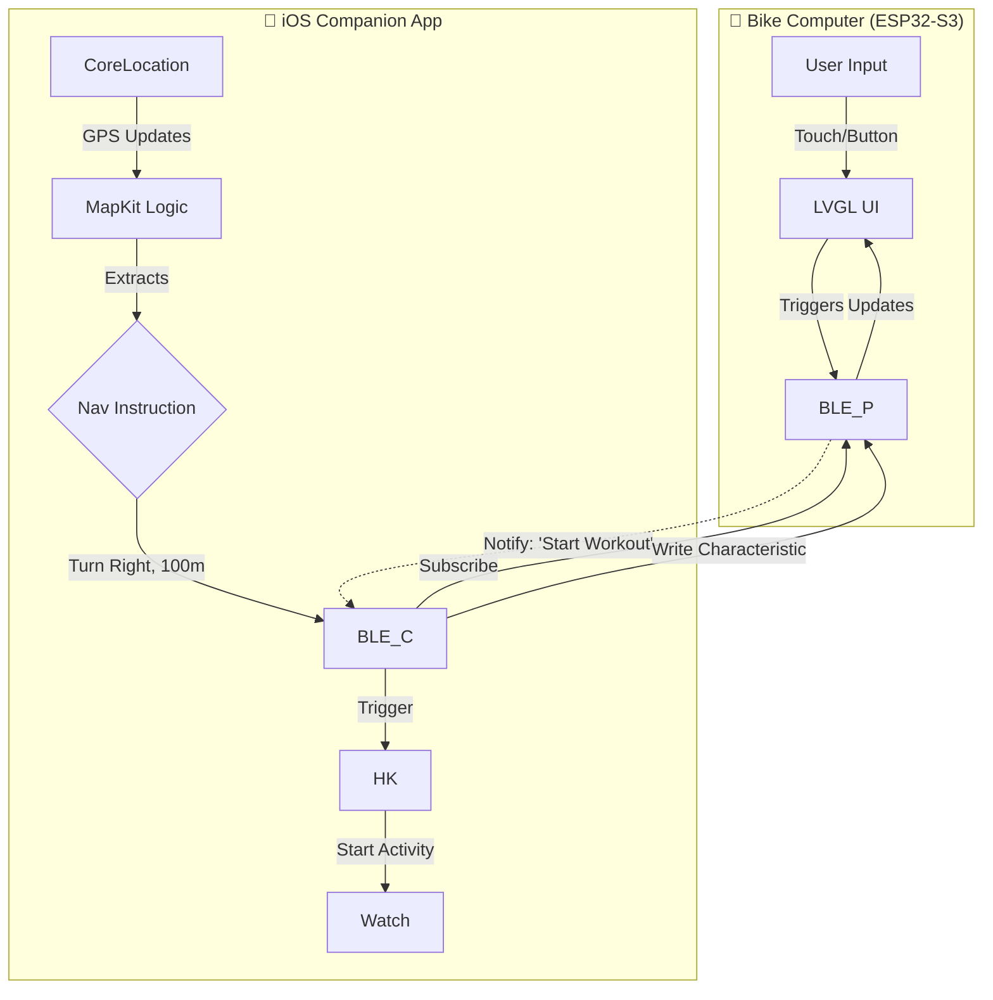

## TODO: Performance Optimizations

### BLE Route Geometry Debouncing
Multiple route geometry updates arrive during a single map render cycle:
```
BLE Route geometry received: 124 bytes
Route parsed: 30 points from 124 bytes
BLE Route geometry received: 124 bytes  <-- redundant
Route parsed: 30 points from 124 bytes
```
**Fix:** Debounce/batch route updates - only parse the latest geometry after rendering completes.
**Files:** `lib/ble_navigation/ble_navigation.cpp`, `lib/route_overlay/route_overlay.cpp`

### Display Rotation Issues (Legacy / Hardware Limitation)
We implemented 90° rotation, but encountered hardware limitations with the CO5300 driver/panel.
- **Problem:** When rotating 90° (MADCTL 0x22), a thin green strip appears at the bottom of the display.
- **Cause:** Likely a mismatch between the CO5300's internal 480x480 panel and our 466x466 display window when row/col swap (MV) is active. The driver's `writeAddrWindow` offsets may need custom adjustment for rotated modes.
- **Status:** 
    - 0°: Works perfectly.
    - 90°: Functional (touch & map correct), but has visual green artifact at bottom.
    - 180°/270°: Not supported by hardware (mirroring issues).
- **Tried fixes:** `fillScreen` after rotation, custom constructor offsets (made it worse), various MADCTL bits.
- **Future fix ideas:** Modify `Arduino_CO5300` driver to handle rotation offsets dynamically, or use LVGL software rotation.

---

## Other TODOs

- it says the GPS follow mode is activated by default, but it doesnt seem so?!
- zoom, also as setting in the app
- rerouting logic in the iOS app (after taking a wrong path)
also when starting a navigation, it should default to starting from the actual current gps location. Is that possible? vs right now it 'converts' our current location into a location name. And sometimes thats not accurately at our actual location. 


# esp32-bike-computer
A good-looking bike computer that shows data from Apple Workout & Apple Maps

Inspired by [Velo 2](https://beeline.co/products/beeline-velo-2) which doesn't work in China


Hardware:

- `ESP32 S3` should be easier to code, and has lots of screen + chip sets on taobao
    - `nRF52840` would have better BLE and less power draw, but harder to code ?! [Could try](https://gemini.google.com/u/2/app/507d553be920e123)

### Questions:

https://grok.com/c/c8a379bb-2070-43d8-aff1-c02bf472691d?rid=2cfcd67e-0cec-444c-b780-ae9703d6e815

### Research on similar open source code:

https://gemini.google.com/u/2/app/bbf4be62d0d00c6b

- https://www.thilinag.com/projects/esp32-bike-computer / https://github.com/thilinag/bikeapp-esp32-web-ble/tree/main
- Connects to Komoot app: https://github.com/euphi/TRGB-BikeComputer
- Cool but different: https://github.com/lspr98/bike-computer-32
- Sends Google Maps navigation notifications via BLE to the esp32: https://youtu.be/qGODX6ALO_U?t=145 , https://chronos.ke/ , https://github.com/fbiego/chronos-esp32?tab=readme-ov-file
- Full navigation with gps. Explains how to get vectorized maps: https://github.com/jgauchia/IceNav-v3
- Overcomplicated: https://github.com/m-gracia/esp32-bike-computer-main
- Overcomplicated: https://github.com/wilhelmzeuschner/esp32_gps_bicycle_computer

### MapKit Integration Strategy

1. **Route Generation:** The app uses MKDirections to calculate a route based on user input.
2. S**ession Management:** The app initiates a navigation session. As the user moves, the CLLocationManager updates the position.
3. **Step Matching:** The app logic compares the current location against the active MKRoute.Step.
4. **Metadata Extraction:** Instead of pixels, the app extracts semantic data:

   a.Maneuver Type: Left, Right, Sharp Left, U-Turn, Roundabout (Exit N).
   
   b. Distance: Meters/Feet to the maneuver.
   
   c. Street Name: The label of the next path.
   
   d. Lane Guidance: (If available) Which lane to occupy.
   
7. **Re-routing:** If the user deviates, MapKit handles the recalculation locally on the phone. The app then sends a "Route Update" flag to the ESP32.

### HealthKit Integration Strategy

1. **Inbound (Phone -> Bike Computer):** The cyclist often wears an Apple Watch. The iOS app starts an HKWorkoutSession on the Watch. It queries the current Heart Rate (HR) and Active Energy Burned. These integers are serialized and sent to the ESP32 for display. This solves the complex problem of trying to bond the ESP32 directly to the Watch (which is technically restricted).
2. **Outbound (Bike Computer -> Phone) (We can skip for now):** The ESP32 is connected to bike-specific sensors (Speed, Cadence, Power) via ANT+ or BLE. It aggregates this data. The iOS app receives this stream and uses HKLiveWorkoutBuilder to commit these samples to the user's Health database. This ensures the cycling workout in the Apple Fitness app contains rich data (Power/Cadence) that the Watch alone cannot capture.

### Custom BLE GATT Protocol

```
Characteristic,UUID Suffix,Type,Payload Structure,Function
Nav_Maneuver,...-NAV-01,Notify,``,Updates the turn arrow and distance count.
Nav_Text,...-NAV-02,Notify,``,Updates the street name label (Fragmented if > MTU).
Sensor_Fusion,...-SENS-01,Notify,``,Sends bike sensor data to Phone for HealthKit.
Biometric_In,...-BIO-01,Write,``,Phone pushes Watch HR to ESP32 display.
Sys_Control,...-SYS-01,Write,``,"Play/Pause Music, Start/Stop Workout."
```

More info under [4.2](https://gemini.google.com/u/2/app/bbf4be62d0d00c6b)

### ESP32 Firmware

- Graphics Engine: LVGL
- Should we use Square Line Studio?
- Assets in flash memory
- BLE Stack: NimBLE

### Special cases

- Predictive Interpolation, to offset latency
- Offline Scenarios

<details>
  <summary># Flow chart</summary>
    

</details>

---

<details>
  <summary># Board specs</summary>


ESP32-S3 1.75inch AMOLED ([specs](https://www.waveshare.com/esp32-s3-touch-amoled-1.75.htm?sku=31262) , [wiki](https://www.waveshare.com/wiki/ESP32-S3-Touch-AMOLED-1.75))

The ESP32-S3-Touch-AMOLED-1.75 is a high-performance, highly integrated MCU board designed by Waveshare. It is compact in size, onboard 1.75inch AMOLED capacitive touch display, power management IC, 6-axis sensor (3-axis accelerometer and 3-axis gyroscope), RTC chip, low power audio codec, echo cancellation circuit, and so on, which makes it easy for you to develop and integrate into the products quickly.

- Equipped with ESP32-S3R8 Xtensa 32-bit LX7 dual-core processor, up to 240MHz main frequency
- Supports 2.4GHz Wi-Fi (802.11 b/g/n) and Bluetooth 5 (LE), with onboard antenna
- Built in 512KB of SRAM and 384KB ROM, with onboard 8MB PSRAM and an external 16MB Flash memory
- Type-C connector, improving device compatibility, easier to use
- Onboard 1.75inch AMOLED capacitive touch display for clear color picture display, 466 × 466 resolution, 16.7M color
- Built-in CO5300 display driver and CST9217 capacitive touch chip, using QSPI and I2C communication respectively, effectively saving the IO resources
- Equipped with dual microphones array for audio algorithms such as noise reduction and echo cancellation, suitable for accurate speech recognition and near-field / far-field voice wake-up applications
- Onboard QMI8658 6-axis IMU (3-axis accelerometer and 3-axis gyroscope) for detecting motion gesture, counting steps, etc.
- Onboard PCF85063 RTC chip, powered by Lithium battery through AXP2101 chip for uninterrupted power supply
- Onboard PWR and BOOT programmable buttons for easy custom function development
- Onboard 3.7V MX1.25 Lithium battery recharge/discharge header
- Onboard 8PIN 2.54mm header adapting 3 × GPIO and 1 × UART, and reserved pads of I2C and 3 × expanded IO interfaces, for connecting peripherals and debugging
- Onboard TF card slot for extended storage and fast data transfer, suitable for applications such as data recording and media playback, simplifying circuit design
- Adopts AXP2101 IC for efficient power management, supports multiple voltage outputs, battery charging, battery management, and battery life optimization, etc.
- Adopts AMOLED screen, featuring advantages of high contrast, wide viewing angle, rich colors, fast response, thinner design, and low power consumption, etc.


---


Waveshare ESP32-S3 1.69 inch Touch-LCD

- Equipped with ESP32-S3R8 high-performance Xtensa 32-bit LX7 dual-core processor, up to 240 MHz main frequency
- Supports 2.4 GHz Wi-Fi (802.11 b/g/n) and Bluetooth 5 (LE), on-board antenna
- Built-in 512KB SRAM and 384KB ROM, additionally packaged with 8MB PSRAM and external 16MB Flash
- Uses Type-C interface, keeping up with the times, no need to worry about plug orientation
- On-board 1.69-inch LCD screen, 240×280 resolution, 262K colors, capable of displaying clear color images
- Built-in ST7789V2 driver chip, uses SPI without occupying excessive interface pin resources
- On-board QM18658 six-axis Inertial Measurement Unit (3-axis acceleration, 3-axis gyroscope), can detect motion posture, step counting, etc.
- On-board PCF85063 RTC chip, reserved SH1.0 battery socket (supports charging), easily enabling RTC functionality needs
- On-board RST, BOOT, and a side button with customizable function, convenient for custom function development using buttons
- On-board 3.7V MX1.25 lithium battery charge/discharge interface
- Exposes 5 GPIOs, I2C and UART pins for connecting external devices and debugging, allowing flexible configuration of peripheral functions
- Supports flexible clocking, independent power settings for modules, and other precise controls to achieve low-power modes for multiple scenarios

---


Waveshare ESP32-S3 2.06-inch AMOLED Watch

- Equipped with the ESP32-S3R8 high-performance Xtensa 32-bit LX7 dual-core processor, with a main frequency up to 240MHz.
- Supports 2.4GHz Wi-Fi (802.11 b/g/n) and Bluetooth 5 (LE), with an onboard antenna.
- Built-in 512KB SRAM and 384KB ROM, packaged with 8MB PSRAM, and external 32MB Flash.
- Uses a Type-C interface, improving user convenience and device compatibility.
- Onboard 2.06-inch capacitive touch HD AMOLED screen, 410 × 502 resolution, 16.7 million colors, capable of displaying color images clearly.
- Built-in CO5300 display driver chip and FT3168 capacitive touch chip, communicating via QSPI and I2C interfaces respectively, minimizing the use of interface pin resources.
- Onboard QMI8658 six-axis inertial measurement unit (3-axis accelerometer, 3-axis gyroscope), enabling motion detection, step counting, and other functions.
- Onboard PCF85063 RTC chip, connected to the battery via the AXP2101, enabling uninterrupted power supply.
- Onboard PWR and BOOT side buttons with customizable functions, facilitating custom function development via buttons.
- Onboard 3.7V MX1.25 lithium battery charge/discharge interface.
- Exposes one I2C, one UART, and one USB solder pad for connecting external devices and debugging.
- Onboard Micro SD card slot provides expanded storage, fast data transfer, and flexibility, suitable for data logging and media playback, simplifying circuit design.
- Benefits of using the AXP2101 include efficient power management, support for multiple output voltages, charging and battery management functions, and optimization of battery life.
- Using an AMOLED screen offers advantages such as higher contrast, wide viewing angles, rich colors, fast response times, slim design, low power consumption, and flexibility.

- Supports offline voice recognition and AI voice interaction
- Equipped with the ES8311 audio codec chip and the ES7210 echo cancellation circuit

---


ESP32-S3R8-1.8inch-Touch-LCD-360-Aida64

This dual-core MCU integrates Wi-Fi and Bluetooth BLE 5.0, with a main frequency of up to 240 MHz. The chip includes 520 KB SRAM, 8 MB PSRAM, 448 KB ROM, and an additional 16 MB Flash. The display resolution is 360x360 with capacitive touch. The module includes an LCD display, backlight control circuit, touchscreen control circuit, I2S digital microphone circuit, I2S DAC circuit, TF card interface, and wireless power supply circuit. It supports secondary development in Arduino IDE, ESP IDE, MicroPython, and GUITION environments.

Network Configuration https://chat.deepseek.com/a/chat/s/f322519d-2302-4584-82b6-ede1fa19927f
The AIDA64 secondary screen and weather clock functions require network configuration.
After powering on, the device automatically opens an AP named "My-Ap" with the password "12345678". Connect your phone to this AP. A network configuration page will pop up shortly, automatically searching for nearby hotspots. Select your hotspot, enter the password, and the configuration will be complete. After configuration, the screen will obtain an IP address, which can be viewed in the WiFi settings page.
Note: Some phones may automatically disconnect from the AP and switch to 5G if the hotspot has no internet connection. In this case, reconnect to the AP. If the configuration page does not pop up, enter "192.168.4.1" in your phone's browser to access it.

</details>

---

# esp32-bike-computer - based on xiaozhi AI

# Question: Implement this on top of Xiaozhi, or by itself without AI???? https://gemini.google.com/u/2/app/9c894e018995d34e

## Navigating inside xiaozhi

### First try to show a weather widget

- Put eg `weather_sunny.png` into the `assets` partition (Partition Table v2)
- Relevant File: `main/display/emote_display.cc` (or `emote_display.cc`)
    - `SetupUI()` initializes the screen. You can add a "Layer" on top of everything else for your widgets. See https://gemini.google.com/u/2/app/19825b80e1047669
- whenever the weather mcp tool answers, it shows the relevant icon

## Show AMap directions in xiaozhi UI

AMap API: https://console.amap.com/dev/key/app
AMap docs: https://lbs.amap.com/api/webservice/guide/api/newroute
Xiaozhi server: https://github.com/xinnan-tech/xiaozhi-esp32-server/blob/main/README_en.md
Xiaozhi client with AMap MCP: https://github.com/huangjunsen0406/py-xiaozhi/blob/6cad76501619f1b4eecd7645322615c47f0360e6/documents/docs/mcp/amap.md?plain=1#L3

- Run a xiaozhi server in the cloud.
    - Even if we do it via MCP, we still gotta run an MCP server ?!
    - So we try to do it all on our own custom xiaozhi server
    - Is railway with gemini accessible without vpn?
    - 
https://gemini.google.com/u/2/app/f6a08aefa2ab8999 :

1. Our App lets the user input a destination
    a. Deeplinks into Apple Maps, to drive this destination
    b. Deeplinks into AMap
2. Our App sends destination & current location to the server.
3. Server tells xiaozhi device where I am (and where I'm going)
   a. xiaozhi shows my location (on a cool graphic map, like simplified tiles, stored on a SD card?)
   b. shows the next moves ("In 50 meters left")

Baidu has a traffic light API: https://lbsyun.baidu.com/faq/api?title=webapi/countlight/base , https://gemini.google.com/u/2/app/92b8ff1362777065
- Shows me the next traffic light count down
- Tell me if I should speed up or slow down

---

Lets first build the iOs app with red light indicator. (Outside of xiaozhi.)
Then make it show on the thing using BLE.
Keep one esp32 for AI, and one for biking.

---

### FAQ

- `screen /dev/cu.usbmodem1101 115200` in cmd shows whats on the screen
