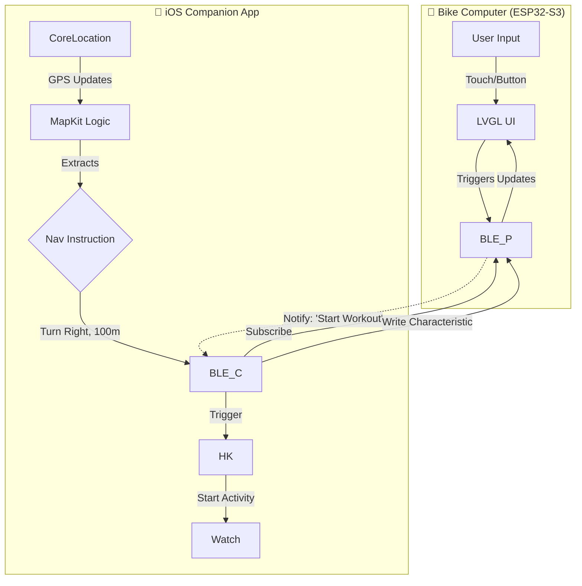

# esp32-bike-computer
A good-looking bike computer that shows data from Apple Workout & Apple Maps

Inspired by [Velo 2](https://beeline.co/products/beeline-velo-2)


Hardware:

- `ESP32 S3` should be easier to code, and has lots of screen + chip sets on taobao
    - `nRF52840` would have better BLE and less power draw, but harder to code ?! [Could try](https://gemini.google.com/u/2/app/507d553be920e123)

### Questions:

https://grok.com/c/c8a379bb-2070-43d8-aff1-c02bf472691d?rid=2cfcd67e-0cec-444c-b780-ae9703d6e815

### Research on similar open source code:

https://gemini.google.com/u/2/app/bbf4be62d0d00c6b

- https://www.thilinag.com/projects/esp32-bike-computer / https://github.com/thilinag/bikeapp-esp32-web-ble/tree/main
- Connects to Komoot app: https://github.com/euphi/TRGB-BikeComputer
- Cool but different: https://github.com/lspr98/bike-computer-32
- 

### MapKit Integration Strategy

1. **Route Generation:** The app uses MKDirections to calculate a route based on user input.
2. S**ession Management:** The app initiates a navigation session. As the user moves, the CLLocationManager updates the position.
3. **Step Matching:** The app logic compares the current location against the active MKRoute.Step.
4. **Metadata Extraction:** Instead of pixels, the app extracts semantic data:

   a.Maneuver Type: Left, Right, Sharp Left, U-Turn, Roundabout (Exit N).
   
   b. Distance: Meters/Feet to the maneuver.
   
   c. Street Name: The label of the next path.
   
   d. Lane Guidance: (If available) Which lane to occupy.
   
7. **Re-routing:** If the user deviates, MapKit handles the recalculation locally on the phone. The app then sends a "Route Update" flag to the ESP32.

### HealthKit Integration Strategy

1. **Inbound (Phone -> Bike Computer):** The cyclist often wears an Apple Watch. The iOS app starts an HKWorkoutSession on the Watch. It queries the current Heart Rate (HR) and Active Energy Burned. These integers are serialized and sent to the ESP32 for display. This solves the complex problem of trying to bond the ESP32 directly to the Watch (which is technically restricted).
2. **Outbound (Bike Computer -> Phone) (We can skip for now):** The ESP32 is connected to bike-specific sensors (Speed, Cadence, Power) via ANT+ or BLE. It aggregates this data. The iOS app receives this stream and uses HKLiveWorkoutBuilder to commit these samples to the user's Health database. This ensures the cycling workout in the Apple Fitness app contains rich data (Power/Cadence) that the Watch alone cannot capture.

### Custom BLE GATT Protocol

```
Characteristic,UUID Suffix,Type,Payload Structure,Function
Nav_Maneuver,...-NAV-01,Notify,``,Updates the turn arrow and distance count.
Nav_Text,...-NAV-02,Notify,``,Updates the street name label (Fragmented if > MTU).
Sensor_Fusion,...-SENS-01,Notify,``,Sends bike sensor data to Phone for HealthKit.
Biometric_In,...-BIO-01,Write,``,Phone pushes Watch HR to ESP32 display.
Sys_Control,...-SYS-01,Write,``,"Play/Pause Music, Start/Stop Workout."
```

More info under [4.2](https://gemini.google.com/u/2/app/bbf4be62d0d00c6b)

### ESP32 Firmware

- Graphics Engine: LVGL
- Should we use Square Line Studio?
- Assets in flash memory
- BLE Stack: NimBLE

### Special cases

- Predictive Interpolation, to offset latency
- Offline Scenarios


