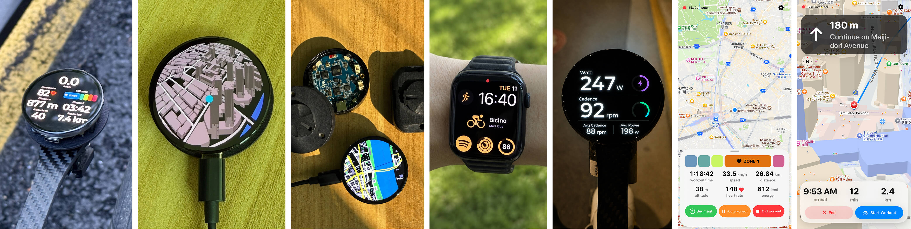
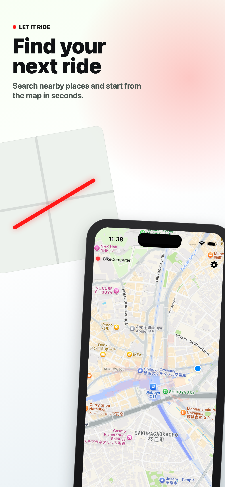
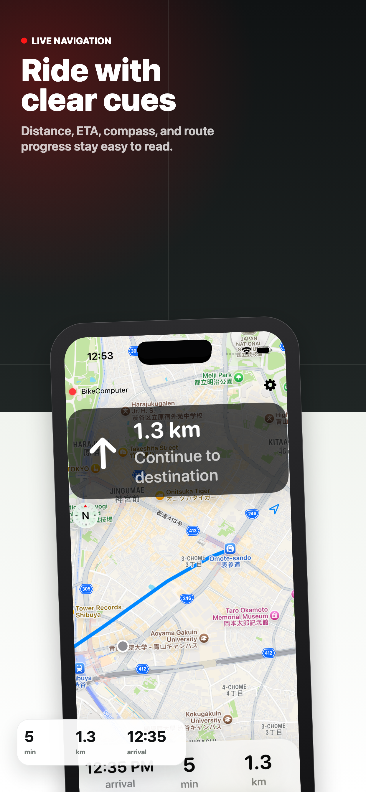
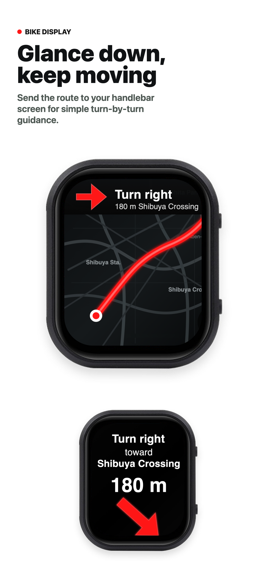

  
  
  

A sleek, Garmin-mounted bike computer.

🗺️ Navigation with Apple Maps.\
🚴 Workouts saved to Apple Health.\
🧭 Ride stats and turn-by-turn directions on your bike computer.\
📡 Connect your power meter and cadence sensor.

## Get started

1. **Buy your bike computer including Garmin mount at [bicino.com](https://bicino.com)** or get a generic [Waveshare 1.75"](https://www.waveshare.com/esp32-s3-touch-amoled-1.75.htm?sku=31262), or a [Waveshare 2.06"](https://www.waveshare.com/esp32-s3-touch-amoled-2.06.htm).
2. **Download** [**the Bicino iPhone and Apple Watch app**](https://geo.itunes.apple.com/app/id6788977349) and pair your bike computer.
3. **Ride.** Track your workout and check your live ride statistics on your bike computer.

## Contributing

Explore proposed and in-progress features on our
[open roadmap](https://github.com/seichris/open-bike-computer/issues?q=is%3Aissue%20state%3Aopen%20label%3Afeature).

Ideas and feature requests are welcome! [Open an issue](https://github.com/seichris/open-bike-computer/issues/new).

For code contributions, see
[CONTRIBUTING.md](https://github.com/seichris/open-bike-computer/blob/main/CONTRIBUTING.md).

## License

Open Bike Computer is a multi-license open source repository. Unless a more
specific notice applies:

- project-authored software, tests, scripts, and configuration in
  `map-platform/backend/` and `map-platform/config/` are
  [AGPL-3.0-only](LICENSES/AGPL-3.0-only.txt);
- all other project-authored software, tests, scripts, and configuration are
  [GPL-3.0-only](LICENSE); and
- `esp32/` and `tools/OSM_Extract/` retain the GNU GPL version 3 terms stated
  in their own [`LICENSE`](esp32/LICENSE) and
  [`LICENSE`](tools/OSM_Extract/LICENSE) files.

Component-level and file-level notices take priority. Third-party material
retains its own terms, including the
[Lucide Bike icon](LICENSES/Lucide-ISC.txt) and
[Montserrat fonts](LICENSES/Montserrat-OFL-1.1.txt). Documentation, artwork,
hardware reference material, and trademarks are not covered by the software
licenses above unless a specific notice says otherwise.

Contributors retain copyright and contribute under the
[Contributor License Agreement](CLA.md). The agreement keeps contributions
available under the applicable public license while allowing the repository
owner to offer separately licensed official builds, including App Store builds.
