A sleek, Garmin-mounted bike computer. Get yours at [Bicino.com](https://bicino.com).

🗺️ Navigation with Apple Maps.\
🚴 Live Apple Workout stats, on your iPhone, Apple Watch & bike computer.\
🔄 Auto-save workouts to Apple Health and Strava.\
🛣️ Import bike routes from Strava.\
📡 Connect your power meter and cadence sensor.

<table width="100%">
  <!-- First row: 5 images -->
  <tr>
    <td align="center" valign="top" colspan="6">
      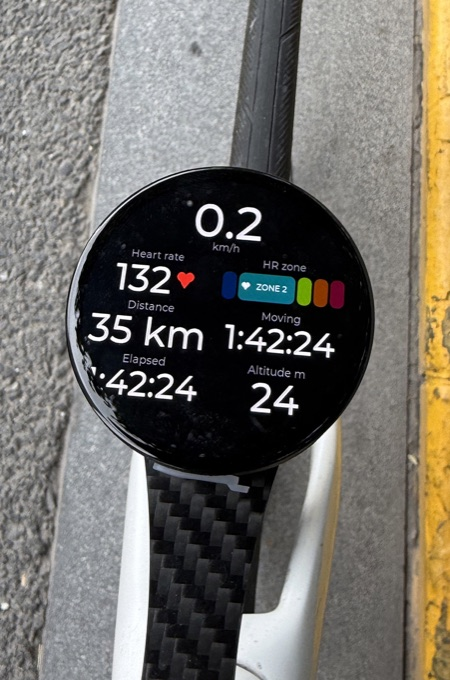
       
      <b>Apple Workout</b>
    </td>
    <td align="center" valign="top" colspan="6">
      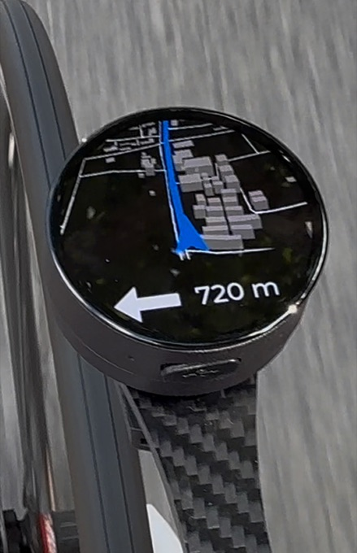
       
      <b>Apple Maps & Navigation</b>
    </td>
    <td align="center" valign="top" colspan="6">
      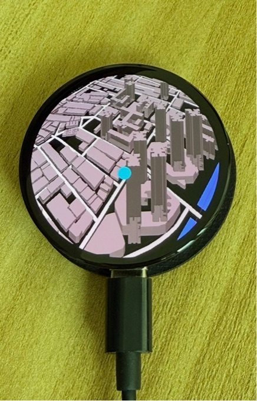
       
      <b>Global 3D maps</b>
    </td>
    <td align="center" valign="top" colspan="6">
      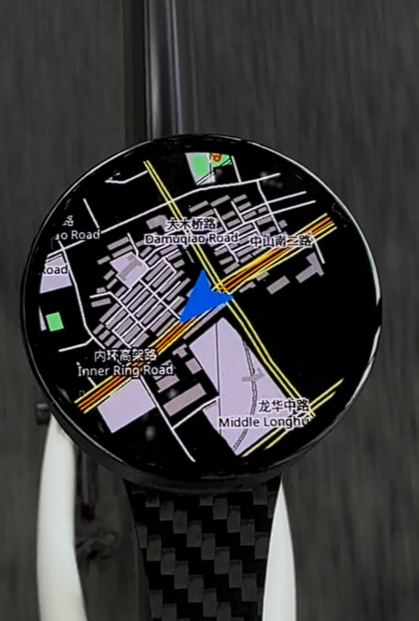
       
      <b>2D maps and global street names</b>
    </td>
    <td align="center" valign="top" colspan="6">
      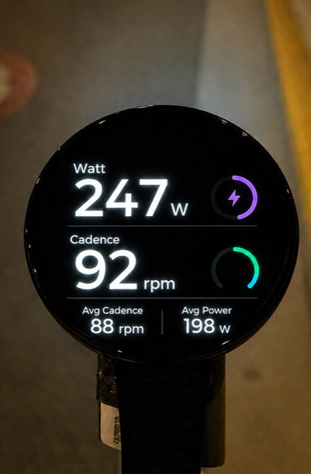
       
      <b>Connect your bike sensors</b>
    </td>
  </tr>

  <!-- Second row: 3 images -->
  <tr>
    <td align="center" valign="top" colspan="10">
      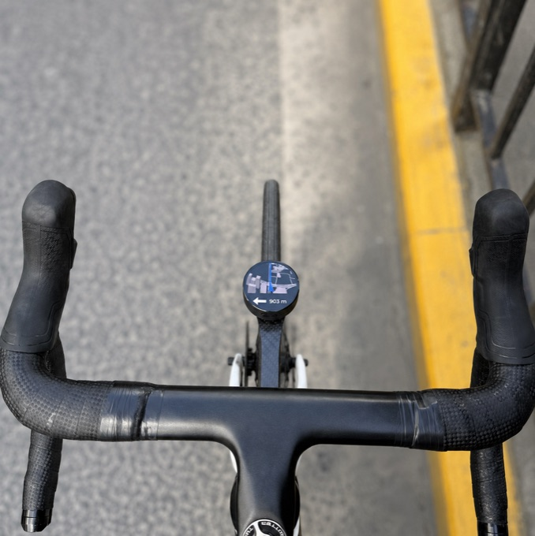
       
      <b>Mounted on a bike</b>
    </td>
    <td align="center" valign="top" colspan="10">
      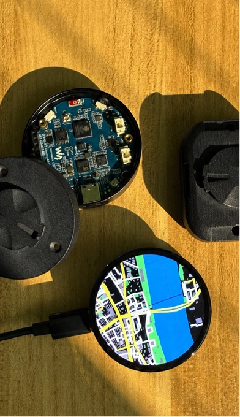
       
      <b>Bicino with custom protection sleeve</b>
    </td>
    <td align="center" valign="top" colspan="10">
      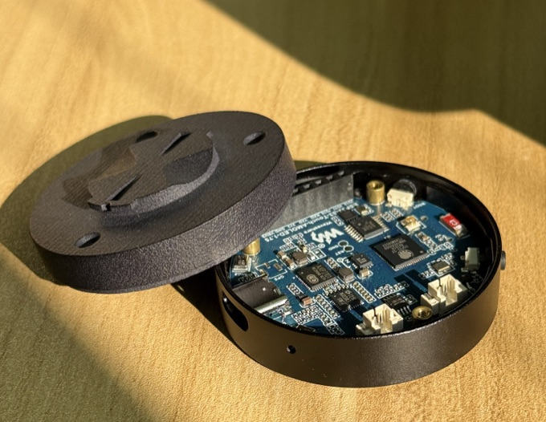
       
      <b>Open-source hardware and custom Garmin mount</b>
    </td>
  </tr>

  <!-- Third row: 4 app images and 2 Apple Watch images -->
  <tr>
    <td align="center" valign="top" colspan="5">
      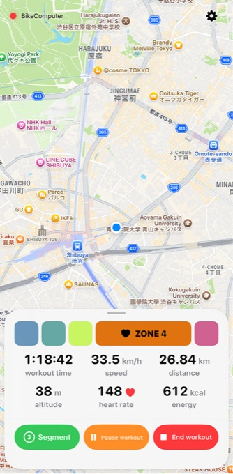
       
      iPhone app: <b>Apple Workout</b>
    </td>
    <td align="center" valign="top" colspan="5">
      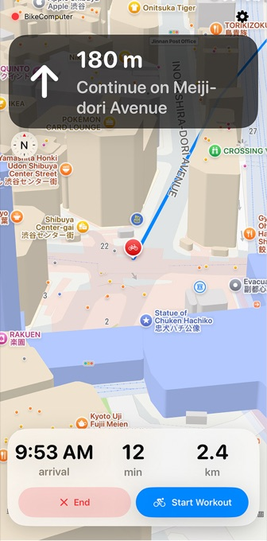
       
      iPhone app: Navigation
    </td>
    <td align="center" valign="top" colspan="5">
      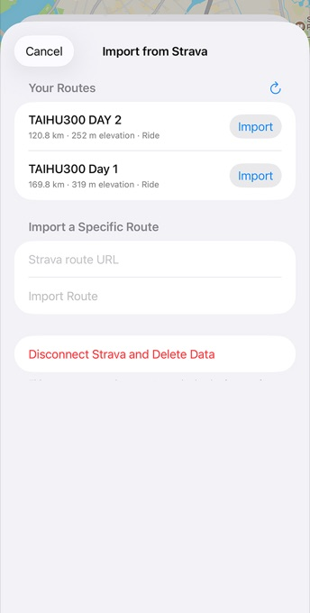
       
      <b>Strava route import</b>
    </td>
    <td align="center" valign="top" colspan="5">
      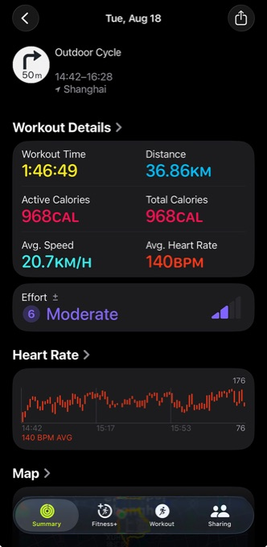
       
      <b>Automatically save rides to Apple Fitness</b>
    </td>
    <td align="center" valign="top" colspan="5">
      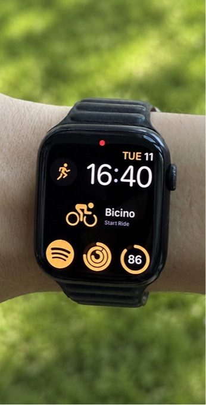
       
      <b>Start your workout on your Apple Watch</b>
    </td>
    <td align="center" valign="top" colspan="5">
      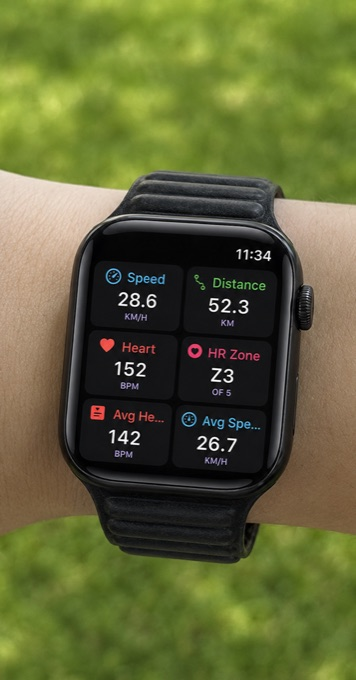
       
      <b>Apple Watch Live Workout Stats</b>
    </td>
  </tr>
</table>

## Get started

1. **Buy your bike computer including Garmin mount at [bicino.com](https://bicino.com)** or get a generic [Waveshare 1.75"](https://www.waveshare.com/esp32-s3-touch-amoled-1.75.htm?sku=31262), or a [Waveshare 2.06"](https://www.waveshare.com/esp32-s3-touch-amoled-2.06.htm).
2. **Download** [**the Bicino iPhone and Apple Watch app**](https://geo.itunes.apple.com/app/id6788977349) and pair your bike computer.
3. **Ride.** Track your workout and check your live ride statistics on your bike computer.
4. **Analyze.** Check your ride stats and GPS track in Apple Fitness and Strava.

## Contributing

Explore proposed and in-progress features on our [open roadmap](https://github.com/seichris/open-bike-computer/issues?q=is%3Aissue%20state%3Aopen%20label%3Afeature). Before starting code contributions, check our [CONTRIBUTING.md](CONTRIBUTING.md) for the best setup, custom device debugging and logging tools, and the [hardware docs](hardware/).

Ideas and feature requests are welcome, too! [Open an issue here](https://github.com/seichris/open-bike-computer/issues/new).

## License

Open Bike Computer is a multi-license open source repository. Unless a more
specific notice applies:

- project-authored software, tests, scripts, and configuration in
  `map-platform/backend/` and `map-platform/config/` are
  [AGPL-3.0-only](LICENSES/AGPL-3.0-only.txt);
- all other project-authored software, tests, scripts, and configuration are
  [GPL-3.0-only](LICENSE); and
- `esp32/` and `tools/OSM_Extract/` retain the GNU GPL version 3 terms stated
  in their own [`LICENSE`](esp32/LICENSE) and
  [`LICENSE`](tools/OSM_Extract/LICENSE) files.

Component-level and file-level notices take priority. Third-party material
retains its own terms, including the
[Lucide Bike icon](LICENSES/Lucide-ISC.txt) and
[Montserrat fonts](LICENSES/Montserrat-OFL-1.1.txt). Documentation, artwork,
hardware reference material, and trademarks are not covered by the software
licenses above unless a specific notice says otherwise.

Contributors retain copyright and contribute under the
[Contributor License Agreement](CLA.md). The agreement keeps contributions
available under the applicable public license while allowing the repository
owner to offer separately licensed official builds, including App Store builds.
