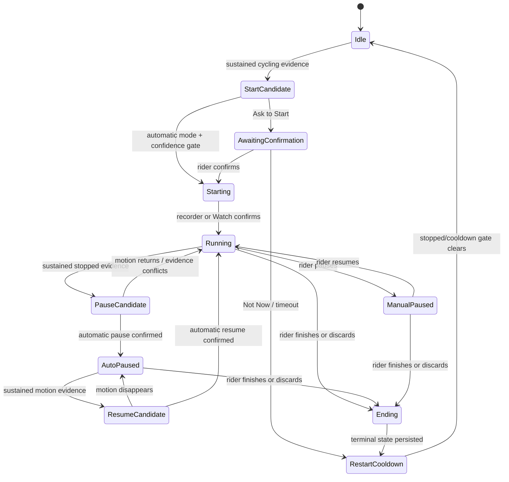

# Automatic Ride Start and Pause/Resume Implementation Plan

## Outcome

Add Apple-inspired automatic ride detection without making a proprietary Apple
algorithm or an unreliable GPS threshold part of the product contract.

The bike computer will:

- recognize sustained cycling before a ride exists;
- ask the rider to start by default, with an opt-in automatic-start mode;
- pause a running ride after a sustained stop and resume when cycling continues;
- prefer fresh wheel/cadence evidence, then good GPS, with the onboard IMU as a
  corroborating signal rather than a stand-alone reason to record a ride;
- preserve manual start, pause, resume, and finish as authoritative actions;
- keep elapsed time and moving time as separate values;
- show whether a pause was automatic or manual on the device, iPhone, and Watch;
  and
- store each confirmed transition in the Watch-owned HealthKit workout so
  recovery and the saved workout tell the same story.

The ESP32 is the ride-detection authority because it is the only component that
can observe the onboard IMU, onboard GPS, and future direct BLE cycling sensors.
Apple Watch remains the sole recorder and owner of the HealthKit workout. The
iPhone bridges authenticated device decisions to the existing mirrored Watch
workout when all three products are connected.

This plan is associated with
[issue #103, Automatically detect ride start and pause/resume](https://github.com/seichris/open-bike-computer/issues/103).

## Baseline

This plan was prepared on branch `plan/issue-103-auto-ride` from the freshly
fetched GitHub `origin/main` commit
`1e1899807f7ba10d5afc18788a3f24ec55401c40`.

### Already implemented

The current repository has several pieces this feature should extend rather
than replace:

1. `WatchWorkoutManager` owns an outdoor-cycling `HKWorkoutSession`, an
   `HKLiveWorkoutBuilder`, HealthKit save/recovery, and the saved workout route.
2. `WorkoutMirrorManager` mirrors Watch state to iPhone and supports manual
   pause/resume plus durable remote controls for segment, finish, and discard.
3. `WorkoutContract.swift` has a versioned session state with `running` and
   `paused`, but does not carry a transition origin or pause reason.
4. `WorkoutDeviceRelay` sends current Watch metrics to firmware in correlated
   core/extended workout frames. Firmware already renders a generic `PAUSED`
   state and keeps the display awake for a live workout.
5. The device can send an authenticated, best-effort `WREQ` start request to
   iPhone. It has no acknowledgement, retry identity, pause request, or resume
   request.
6. Watch HealthKit collection already prefers paired cycling speed over Watch
   location speed and carries cadence when a compatible sensor is reporting.
7. The iPhone has an Apple Watch/HealthKit-assisted cycling-sensor registry.
   It does not make the ESP32 a BLE central and therefore does not complete the
   direct sensor scope of issue #85.
8. The QMI8658 driver can configure and sample accelerometer/gyroscope data in
   `WAVESHARE_IMU_DIAGNOSTICS` builds. Ordinary and production builds explicitly
   power the IMU down.
9. The LC76G GPS parser publishes speed, location, fix mode, satellites, and
   dilution values. Its presentation struct retains old values when a new NMEA
   fix omits a field, so it is not yet a safe freshness-aware detector input.
10. `NavigationEngine` has navigation-scoped distance and start time. Those are
    independent of the Watch-owned workout and remain unchanged here.

### Explicitly deferred scope

Standalone device ride recording, ride history, and GPX/FIT export are not part
of this implementation. This plan controls and annotates the existing
Watch-owned HealthKit workout only and does not add a second recorder.

### Related issue boundaries

- [Issue #85](https://github.com/seichris/open-bike-computer/issues/85) remains
  the owner of direct ESP32 BLE sensor pairing. Issue #103 defines a source
  adapter now and uses direct wheel/cadence observations when #85 provides
  them; it must not embed a second BLE-central implementation.
- [Issue #19](https://github.com/seichris/open-bike-computer/issues/19) supplied
  the diagnostic QMI8658 path and its shared-I2C constraints. Issue #103 promotes
  a bounded part of that path to a production motion service only after a
  physical stability gate.

## What Apple does, and what is public

Apple exposes two distinct behaviors in the first-party Workout experience:

1. **Workout reminders** sense that a person is moving, ask whether to start a
   workout, and can give credit for activity already completed.
2. **Auto-Pause** is a separate setting that automatically pauses and resumes
   outdoor running and cycling workouts, such as at a road crossing or drink
   stop.

Apple's current support text describes start reminders across supported workout
types but does not explicitly promise a cycling start reminder. This plan adopts
the confirmation pattern; it claims cycling parity only for the documented
outdoor-cycling Auto-Pause behavior.

Apple also keeps manual pause/resume available at any time. Its Outdoor Cycle
workout uses activity-specific sensor tuning and accurate location data, and a
configured Bluetooth cycling accessory automatically connects when a cycling
workout starts.

Primary Apple sources:

- [Change settings in Workout on Apple Watch](https://support.apple.com/en-my/guide/watch/apde0be691be/watchos)
- [Go cycling with Apple Watch](https://support.apple.com/en-kw/guide/watch/apd4cbc876c7/watchos)
- [Running workout sessions](https://developer.apple.com/documentation/healthkit/running-workout-sessions)
- [HKWorkoutEvent](https://developer.apple.com/documentation/healthkit/hkworkoutevent)
- [HKWorkoutEventType](https://developer.apple.com/documentation/healthkit/hkworkouteventtype)
- [HKWorkoutEventType.motionPaused](https://developer.apple.com/documentation/healthkit/hkworkouteventtype/motionpaused)
- [HKWorkout.workoutEvents](https://developer.apple.com/documentation/healthkit/hkworkout/workoutevents)

### Conclusions for Bicino

- Apple does not publish its cycling-classification features, confidence model,
  speed thresholds, or pause/resume timing. Those values cannot be copied.
- The first-party start reminder and Auto-Pause setting are separate; Bicino
  should also keep start behavior and pause behavior independently configurable.
- Apple can credit activity detected before the user accepts its reminder.
  A third-party app cannot fabricate missing HealthKit sensor samples, so the
  Bicino Watch workout starts when the Watch accepts the launch request and is
  not backdated.
- Public HealthKit has `motionPaused`/`motionResumed` event types, but Apple’s
  developer text promises automatic generation for running sessions, not for a
  third-party cycling session. The first-party cycling Auto-Pause setting is not
  a dependable API contract for `BikeComputerWatch`.
- The Watch app must continue to call `HKWorkoutSession.pause()` and `resume()`
  itself, then wait for the session-state callback before publishing a confirmed
  transition.
- `HKWorkout.workoutEvents` determines active workout duration from pause and
  resume intervals. Bicino must preserve standard pause/resume events and add
  its own origin metadata without changing HealthKit’s timing semantics.
- Apple-paired cycling accessories normally become available after a cycling
  workout begins. They can improve auto-pause/resume, but they cannot be the
  only pre-workout start detector. Direct device sensors from #85 can.

## Product contract

### Settings

Expose a **Ride Detection** section on iPhone and on the device when its settings
UI supports it:

| Setting | Values | Default |
| --- | --- | --- |
| Detect ride start | Off, Ask to Start, Start Automatically | Ask to Start |
| Auto-Pause | On, Off | On |
| Start alerts | Sound + haptic, Haptic only, Visual only | Sound + haptic |

Thresholds, confidence weights, and freshness windows are versioned firmware
policy, not user-facing sliders. They need repeatable field calibration and
should not become an untestable collection of per-user magic numbers.

During development, the entire feature remains behind a build/runtime feature
gate. The production defaults above take effect only after the physical rollout
gates pass.

### Start behavior

- **Ask to Start** is Apple-like and is the safe default. The device shows a
  non-blocking prompt with **Start Ride** and **Not Now**. If iPhone/Watch are
  reachable, they may mirror the prompt, but loss of that mirror does not remove
  the prompt from the bike computer.
- **Start Automatically** asks `BikeComputerWatch` to start its outdoor-cycling
  session immediately after the stricter confidence gate.
- A detection decision is not a started workout. The device shows **Starting**
  until the authoritative Watch snapshot confirms the session.
- If iPhone or Watch is unavailable, no workout starts. The device keeps only
  bounded RAM detector state and shows **Open Bicino on iPhone to start the
  Watch workout**.
- The detector never silently starts Apple’s Workout app or attaches to a
  workout owned by another app.
- **Not Now** suppresses another prompt until the device has observed two
  continuous minutes stopped, or 15 minutes have elapsed, whichever comes
  first.

### Pause and resume behavior

- Auto-Pause acts only on a ride that is already confirmed running.
- A pause is published only after the Watch session confirms the state
  transition. Candidate states may be shown as subtle progress but are never
  saved as pauses.
- A ride that was automatically paused may be automatically resumed.
- A ride that was manually paused may only be manually resumed.
- A manual resume receives a 15-second grace period before another automatic
  pause can be requested. Positive motion may resume immediately.
- Conflicting fresh signals suppress an automatic pause. Fresh positive wheel,
  cadence, or qualified GPS-plus-IMU movement wins over stopped evidence.
- The five-second short pause path requires a fresh, definitively stopped wheel
  speed. Zero cadence is not stopped evidence: riders coast, and cadence can
  remain zero while the bicycle is moving.
- The detector never automatically ends or discards a ride.

### Manual precedence

Every explicit rider control surface tags its lifecycle request as `manual`,
and detector requests are `automatic`. Uncorroborated session callbacks remain
`unknown`; callbacks with explicit system attribution remain `system`.
The following rules are normative:

| Rider action | Automation consequence |
| --- | --- |
| Manual start | Start immediately; ignore start candidates and suppress Auto-Pause for 15 seconds. |
| Manual pause | Set a durable manual-pause latch; suppress all auto-resume requests. |
| Manual resume | Clear the manual-pause latch; suppress Auto-Pause for 15 seconds. |
| Manual finish/save | End normally and suppress start detection until two stopped minutes or a 15-minute cooldown. |
| Manual discard | Apply the same restart suppression; never recreate the discarded ride from retained evidence. |
| Not Now on start prompt | Dismiss the candidate and apply the prompt-suppression rule above. |

Delayed BLE notifications, old detector decisions, and process recovery must not
clear these latches. They are scoped by a ride UUID/generation and monotonic
decision sequence.

### Time semantics

Store two product values while keeping the existing contract compatible:

- **Elapsed time**: wall-clock time from confirmed ride start to finish,
  including pauses.
- **Moving time**: the existing `HKLiveWorkoutBuilder.elapsedTime`, which
  follows confirmed HealthKit pause/resume events.

The existing `WorkoutSnapshotV1.elapsedTime` remains HealthKit active/moving
time for wire compatibility. Add optional `wallElapsedTime` in a new schema
minor version and relabel the existing value as **Moving** where both timers are
shown. Do not silently change the meaning of the existing field. Neither timer
advances before the Watch session is confirmed.

## End-to-end architecture

```text
Direct wheel/cadence (#85 adapter) ---+
LC76G freshness-aware GPS ------------+--> ESP32 RideEvidenceFusion
QMI8658 motion windows ----------------+             |
Watch workout telemetry (when active)-+             v
                                          RideAutomationPolicy
                                                    |
                                        authenticated RAUT v2
                                                    v
                                      iPhone RideAutomationCoordinator
                                                    |
                                         mirrored workout control
                                                    v
                                          WatchWorkoutManager
                                                    |
                                         HKWorkoutSession + events
```

### Ownership rules

- ESP32 owns evidence fusion, candidate timing, manual-precedence latches for
  device-originated decisions, and the current mirrored presentation.
- Watch owns the HealthKit workout and HealthKit route.
- iPhone owns settings presentation, Watch launch orchestration, and reliable
  translation between authenticated device decisions and mirrored workout
  controls.
- No component guesses another component’s state. A requested transition and a
  confirmed transition are separate messages.
- The Watch session UUID is the only ride identity after start. Pre-start
  decisions use a separate device detection generation that cannot be replayed
  into a later Watch session.

## State model

Avoid one enum containing every combination. Use three orthogonal values:

```text
RideLifecycle = idle | starting | running | paused | ending | ended | failed
PauseOrigin   = none | automatic | manual | system | unknown
DetectorPhase = quiet | startCandidate | awaitingConfirmation |
                pauseCandidate | resumeCandidate | restartCooldown
```

`PauseOrigin` is meaningful only while paused. A confirmed manual control updates
the lifecycle first, then resets the detector phase. Only `automatic` is
eligible for automatic resume. `none`, `system`, and `unknown` fail closed until
durable evidence resolves them. The detector may request a transition but never
mutates a Watch session optimistically.

### Core transitions



Watch recovery reconstructs `RideLifecycle`, `PauseOrigin`, last confirmed
transition, and timer values from the existing recovery store plus HealthKit
events. After device reconnect, the authoritative Watch snapshot replaces any
RAM-only detector candidate.

## Evidence model and initial calibration values

Every observation carries a source, capture timestamp, freshness deadline,
quality, and optional value. Missing or stale is never converted to zero.

| Source | Fresh for | Positive moving evidence | Stopped evidence | Authority |
| --- | ---: | --- | --- | --- |
| Direct wheel speed | 3 s | `>= 1.5 m/s` | `< 0.5 m/s` with fresh revolutions | Highest |
| Direct cadence | 3 s | `>= 20 rpm` | Not authoritative; zero can mean coasting | Moving veto/start/resume only |
| Confirmed Watch paired speed | 3 s | Same wheel threshold while workout exists | Same wheel threshold | High, active ride only |
| Generic HealthKit cycling speed | 5 s | Display only | Display only | Never sets paired-sensor detector provenance |
| Raw Watch workout GPS | 3 s | `>= 2.0 m/s` during an active workout | `< 0.8 m/s`, accuracy `<= 12.5 m` | Primary active-workout pause/resume source in profile 4 |
| LC76G GPS | 3 s | valid 2D/3D fix, HDOP `<= 2.5`, speed `>= 2.8 m/s` | speed `< 0.8 m/s` and stationary radius | Medium |
| QMI8658 | 1 s | calibrated windowed vibration/motion score | low score over full window | Corroboration only |

These are seed values for data collection, not acceptance by assertion. Store
them in one versioned `RideDetectionProfile` and tune them only from replayed
traces plus the physical test matrix.

### Start gate

Accept a start candidate through either path:

1. **Sensor path**: fresh wheel speed or cadence is positive for at least 8 of
   the last 10 seconds, with no contradictory wheel/cadence source.
2. **GPS + IMU fallback**: good GPS is in a cycling-plausible range, net
   displacement is at least 30 metres beyond the fix uncertainty envelope, and
   IMU motion is positive for at least 8 of the last 12 seconds.

In **Ask to Start**, either path opens a prompt. In **Start Automatically**, the
sensor path starts after 10 seconds; the GPS + IMU path uses a stricter 20-second
window and at least 60 metres net displacement.

IMU alone must never open a prompt or start a ride. This prevents ordinary
handling, desk vibration, and vehicle transport from being interpreted as
cycling.

### Pause gate

With qualified raw Watch workout GPS, profile 4 uses distinct producer samples
spanning five seconds below `0.8 m/s`; BLE retries do not advance the span and
no source-sample gap may exceed three seconds. Fresh wheel/cadence or qualified
device GPS-plus-IMU movement vetoes the pause.

When Watch GPS is unavailable, a fresh, definitively stopped wheel-speed source requires
that stopped wheel evidence for five continuous seconds. Any positive fresh
wheel/cadence sample or qualified GPS-plus-IMU movement cancels the candidate.
Cadence-only evidence, cadence zero, missing cycling sensors, and wheel dropout
do not qualify for the short path.

Without fresh definitive stopped wheel evidence:

- require good GPS below `0.8 m/s`;
- require all accepted positions to remain inside `max(8 m, 2 x estimated
  horizontal uncertainty)`;
- require low IMU motion for 10 continuous seconds; and
- reset the candidate rather than pause when GPS quality disappears before the
  stationary window completes.

After an already-confirmed stop, GPS drift outside its uncertainty envelope does
not resume the ride unless the speed and IMU gates also pass.

### Resume gate

- Qualified Watch GPS `>= 2.0 m/s` across distinct samples spanning 2 seconds
  is the primary automatic-resume path.
- Wheel speed `>= 1.5 m/s` or cadence `>= 20 rpm` for 2 continuous seconds may
  resume an automatically paused ride.
- GPS `>= 2.0 m/s` plus positive IMU motion for 4 continuous seconds is the
  fallback.
- A manually paused ride ignores both gates.
- Use hysteresis: resume thresholds are higher than pause thresholds, and every
  confirmed transition clears the opposite candidate window.

### Source disagreement and degradation

- A fresh higher-authority positive source prevents pause.
- A fresh higher-authority stopped source does not suppress a lower-authority
  positive source immediately; wait for the positive source to expire or record
  a disagreement timeout.
- If all sources are stale, hold the current confirmed lifecycle. Do not start,
  pause, or resume.
- If IMU initialization fails, allow the direct sensor path but disable the
  GPS-only fallback and expose a non-fatal diagnostic.
- If GPS fails, direct wheel/cadence can still start, pause, and resume.
- Evidence is RAM-only apart from bounded diagnostics and confirmed transition
  metadata. Do not persist raw continuous IMU samples in ordinary rides.

## Firmware implementation

### 1. Add a production sensor-observation boundary

Create a small, allocation-free interface under `esp32/lib/ride_automation/`:

```cpp
struct TimedMetric {
  bool available;
  float value;
  uint32_t capturedAtMs;
  uint32_t maximumAgeMs;
};

struct RideEvidenceObservation {
  TimedMetric wheelSpeedMetersPerSecond;
  TimedMetric cadenceRpm;
  TimedMetric gpsSpeedMetersPerSecond;
  bool gpsFixValid;
  float gpsHdop;
  double latitude;
  double longitude;
  float imuMotionScore;
  bool imuAvailable;
  uint32_t capturedAtMs;
};
```

Adapters populate this model; the policy never reads globals directly.

Update `Gps::GPSDATA` or add a separate observation API that publishes validity
bits and per-field capture times. Invalidate speed and location when the NMEA
fix is missing or stale instead of leaving an old value looking current.

Define a `CyclingMotionSource` adapter that issue #85 can implement. Until then,
use Watch-relayed speed/cadence during an active workout and GPS + IMU for
pre-workout fallback.

### 2. Promote QMI8658 safely

Split the diagnostic UI/logging from the sensor driver:

- `begin`, bounded accel/gyro reads, health counters, and current sample become
  available to ordinary Waveshare builds;
- verbose raw register dumps remain diagnostic-only;
- preserve the proven separate six-byte accelerometer and six-byte gyroscope
  repeated-start reads; do not restore the unstable 17-byte burst path;
- sample into a fixed-size window at a measured low duty cycle sufficient for
  motion classification;
- calculate gravity-removed acceleration energy and gyro/vibration energy over
  the window instead of using one instantaneous threshold;
- cap retries and feed failures through the existing shared-I2C recovery path;
- stop or reduce sampling when the feature is off and no ride is active; and
- prove touch latency, BLE, display, SD, audio, and map rendering remain healthy
  during a long ride soak before enabling the feature in production profiles.

The production motion service reports a normalized score and sensor health. It
does not expose orientation or raw samples to the ride policy.

### 3. Implement a pure deterministic policy

Add:

- `ride_detection_profile.hpp` for versioned constants;
- `ride_evidence_window.hpp` for fixed-size time windows;
- `ride_automation_policy.hpp` for state and transition decisions; and
- `ride_automation_runtime.cpp` for the main-loop adapter and event queue.

The policy accepts an observation plus the current confirmed lifecycle and
returns at most one typed request. It has no LVGL, NimBLE, filesystem, HealthKit,
or wall-clock dependency. Use wrap-safe `uint32_t` monotonic elapsed arithmetic.

Each request contains:

- device detection generation and current Watch session UUID when one exists;
- non-zero decision sequence;
- requested transition;
- `manual` or `automatic` origin;
- evidence mask and profile version;
- candidate start time and confirmation time; and
- source-health summary without raw health data.

### 4. Add device UI

Extend the Ride Stats presentation with:

- start-candidate prompt and countdown/progress;
- **Auto-Paused** versus **Paused**;
- elapsed time and moving time as separately labelled values;
- a short **Ride resumed** confirmation;
- a clear distinction between a detection request and a confirmed Watch
  workout; and
- clear sensor, iPhone, or Watch-unavailable errors.

The screen stays awake for the prompt and while a ride is starting/running. An
auto-paused ride follows the existing active-workout display policy unless a
separate measured power policy changes it.

## BLE contract

### Capability and transport

Add a `CAP2` feature bit for `RIDE_AUTOMATION_V2` (the next unassigned bit after
the current baseline) and keep legacy clients unchanged.

Add a vendor characteristic
`9D7B3F30-3F6A-4D1C-9F6D-1FBF0E8B1004` with authenticated notify/write support.
Allocate ownership-v2 protected channel `7`, grow the firmware sequence arrays,
and add the matching Swift enum case and golden crypto/channel tests.

For cached GATT tables, define a bounded `RAUT` fallback over the existing
authenticated navigation/settings transport. Native and fallback payloads use
one parser. Old apps see neither messages nor new settings because the device
does not advertise the capability to them.

### `RAUT` v2 messages

Use fixed-size, explicitly versioned binary frames. Required message kinds are:

- `decision`: device requests start, pause, or resume;
- `acknowledgement`: iPhone accepts, rejects, or reports an unavailable Watch;
- `confirmation`: final authoritative Watch state plus origin;
- `configuration`: start mode, Auto-Pause, and alert mode with config generation;
- `configurationAck`: persisted normalized values; and
- `resynchronize`: exchange current ride generation, decision watermark, and
  confirmed state after authentication/reconnect.

Every transition message carries device detection generation, optional Watch
session UUID, decision sequence, requested state, origin, evidence mask, and
detector profile version. The device retains one unacknowledged current
decision, retries it with bounded backoff, and drops it only after a matching
acknowledgement, a contradictory manual transition, or a terminal Watch state.

Notifications are authenticated but are not themselves proof that the Watch
changed state. Only a Watch snapshot/acknowledgement confirms that half of the
transition.

### Extend workout snapshot and device telemetry

Bump `WorkoutSchemaVersion` by one minor version and add optional fields:

- `pauseOrigin`;
- `lastTransitionOrigin`;
- `lastTransitionAt`;
- `wallElapsedTime`; and
- detector profile version.

Older decoders must accept their absence. Add a capability-gated third device
telemetry frame for pause origin and wall elapsed time; the existing core
`elapsedSeconds` remains moving/HealthKit-active time. Do not set new state-byte
flags that old firmware would reject.

Update `docs/ble-protocol.md`, Swift codec validation, firmware parsers, reducer
transition rules, correlated frame scheduling, reconnect resynchronization, and
host golden vectors together.

## iPhone and Watch implementation

### 1. Add `RideAutomationCoordinator` on iPhone

The coordinator subscribes to authenticated `RAUT` events, current workout
presentation, Watch availability, and persisted settings.

It must:

- deduplicate by device ID, ride generation, and decision sequence;
- reject automatic pause/resume when the current Watch session identity does
  not match the associated ride;
- launch Watch only for an accepted start decision;
- send automatic pause/resume as versioned remote workout controls with origin;
- acknowledge only after admission, then send a later confirmation after the
  authoritative Watch state arrives;
- report a rejected/unavailable result if Watch launch or control fails, without
  presenting an active workout on the device;
- resynchronize both directions after app restart or BLE reconnect; and
- never translate a stale automatic event into a newer manual session.

Replace the unacknowledged `WREQ` path only when both peers advertise `RAUT`.
Keep `WREQ` as the legacy manual Start Workout button fallback.

### 2. Extend Watch workout control origin

Add an optional control context to `WorkoutEnvelopeV1` containing origin,
decision identity, and automatic reason. Persist the context before asking the
session to transition so crash recovery does not turn an automatic pause into a
manual one or replay it after manual resume.

`WatchWorkoutManager` should:

- call `session.pause()`/`resume()` only after the control gate accepts the
  request;
- wait for `HKWorkoutSessionDelegate.didChangeTo` before confirming;
- set/clear `PauseOrigin` in the same confirmed callback;
- add a zero-duration HealthKit marker event with versioned Bicino metadata for
  the transition origin, while allowing the standard session pause/resume event
  to remain authoritative for active duration;
- reconstruct the last origin marker during recovered-session adoption; and
- include origin/timing in mirrored snapshots and the final summary.

Inspect newly collected builder events in `workoutBuilderDidCollectEvent`.
Apple documents `pauseOrResumeRequest` as a rider request from the Watch buttons;
handle it idempotently as a manual pause/resume and give it precedence over any
pending automatic control.

### 3. Add settings and presentation

- Add a versioned `RideDetectionSettingsStore` on iPhone.
- Persist normalized settings on the device so it can detect movement and show
  an actionable reconnect prompt before iPhone is available.
- Sync the applicable settings to Watch using versioned `WCSession`
  application context, following the existing heart-rate-zone settings pattern.
- Show the settings under Workouts on iPhone and in Watch Settings as a mirror
  of the active device policy when available.
- Show **Auto-Paused**, **Paused**, elapsed time, and moving time consistently in
  `WorkoutCompactCard`, `WorkoutDashboardView`, the Live Activity, Watch live
  workout view, and firmware.
- Haptic/sound feedback occurs once per confirmed automatic transition, not on
  every repeated decision notification.

The Watch app does not continuously run a pre-workout Core Motion detector.
Without an active `HKWorkoutSession`, third-party watchOS background execution
does not provide the same first-party reminder contract Apple uses. Pre-workout
authority remains the bike computer.

## Concrete code map

### New firmware files

- `esp32/lib/ride_automation/ride_detection_profile.hpp`
- `esp32/lib/ride_automation/ride_evidence_window.hpp`
- `esp32/lib/ride_automation/ride_automation_policy.hpp`
- `esp32/lib/ride_automation/ride_automation_runtime.{hpp,cpp}`
- `esp32/lib/ride_automation/ride_automation_protocol.hpp`

### Existing firmware files to change

- `esp32/lib/waveshare_board/qmi8658.{hpp,cpp}`
- `esp32/lib/gps/gps.{hpp,cpp}`
- `esp32/lib/ble_navigation/device_capabilities_protocol.hpp`
- `esp32/lib/ble_navigation/device_ownership.{hpp,cpp}`
- `esp32/lib/ble_navigation/ble_navigation.{hpp,cpp}`
- `esp32/lib/ble_navigation/workout_telemetry_protocol.hpp`
- `esp32/lib/ble_navigation/workout_telemetry_state.hpp`
- `esp32/lib/ble_navigation/workout_telemetry_runtime.{hpp,cpp}`
- `esp32/lib/gui/src/rideTelemetryPresenter.hpp`
- `esp32/lib/gui/src/rideTelemetryScr.{hpp,cpp}`
- `esp32/src/main.cpp`
- `esp32/platformio.ini`
- `docs/ble-protocol.md`

### New Swift files

- `BikeComputer/Managers/RideAutomationCoordinator.swift`
- `BikeComputer/Managers/RideDetectionSettingsStore.swift`
- `BikeComputerWatch/Managers/WatchRideDetectionSettingsReceiver.swift`
- `WorkoutShared/RideAutomationContract.swift`
- `WorkoutShared/RideAutomationRuntimeLogic.swift`

### Existing Swift files to change

- `WorkoutShared/WorkoutContract.swift`
- `WorkoutShared/WorkoutRuntimeLogic.swift`
- `BikeComputerWatch/Managers/WatchWorkoutManager.swift`
- `BikeComputerWatch/Managers/WatchWorkoutRecoveryStore.swift`
- `BikeComputerWatch/Views/LiveWorkoutView.swift`
- `BikeComputerWatch/Views/WatchSettingsView.swift`
- `BikeComputer/Managers/BLEManager.swift`
- `BikeComputer/Managers/WorkoutMirrorManager.swift`
- `BikeComputer/Managers/WorkoutMetricsStore.swift`
- `BikeComputer/Managers/WorkoutDeviceRelay.swift`
- `BikeComputer/Views/WorkoutViews.swift`
- `BikeComputer/Views/SettingsView.swift`
- `BikeComputer/ContentView.swift`
- Live Activity shared state and views
- Xcode target membership in `project.pbxproj`

## Implementation sequence

### Phase 0: collect evidence before enabling behavior

1. Add a debug-only trace schema for timestamped, normalized evidence and policy
   output; exclude raw location and raw IMU values from normal logs.
2. Capture labelled physical traces for starts, traffic stops, walking the bike,
   loading it into a car, car/bus/train travel, GPS drift, urban canyon, tunnel,
   sensor dropout, and rough roads.
3. Replay every trace through the host policy and record false-start,
   false-pause, resume latency, and missed-transition counts.
4. Measure QMI8658 sampling impact on touch latency, I2C recovery, BLE gaps,
   display cadence, CPU, and battery.
5. Lock profile version 1 only after the physical gate below passes.

Deliverable: detector and replay harness in shadow mode; no ride state changes.

### Phase 1: freshness-aware sensors and deterministic detector

1. Add GPS validity/timestamps and production IMU motion score.
2. Add the source-neutral observation contract and future #85 adapter seam.
3. Implement start/pause/resume candidates, hysteresis, latches, cooldown, and
   wrap-safe timers.
4. Run in shadow mode on ordinary firmware and expose bounded counters.

Deliverable: device can explain what it would do, but cannot start or control a
ride.

### Phase 2: authenticated automation transport

1. Add channel 7, native/fallback `RAUT`, CAP2 feature, settings persistence,
   acknowledgements, retry, and reconnect resynchronization.
2. Extend workout schema/telemetry with origin and timing.
3. Preserve legacy `WREQ` and old workout frames when capability is absent.

Deliverable: device and iPhone can exchange idempotent decisions without acting
on them in production.

### Phase 3: Watch/iPhone control and UI

1. Add `RideAutomationCoordinator` and origin-aware remote controls.
2. Persist Watch transition intent, confirm from session callbacks, add HealthKit
   origin markers, and recover them.
3. Add settings, prompts, state labels, timers, error states, sound, and haptics.
4. Enable automatic pause/resume for internal builds; keep automatic start in
   Ask mode first.

Deliverable: end-to-end Ask to Start and Auto-Pause on internal builds.

### Phase 4: staged production enablement

1. Enable Ask to Start after false-start and recovery gates pass.
2. Enable Auto-Pause after traffic-stop and manual-precedence gates pass.
3. Offer Start Automatically only after a separate opt-in warning and the
   stricter false-start gate passes.
4. Record detector profile version in Watch transition metadata so later tuning
   does not make saved workouts ambiguous.

## Automated tests

### Firmware host tests

Add focused tests for:

- evidence freshness and missing-versus-zero behavior;
- start windows for sensor and GPS + IMU paths;
- no IMU-only start;
- GPS jitter within uncertainty;
- pause/resume hysteresis and source conflicts;
- manual-pause latch, manual-resume grace, finish cooldown, and prompt snooze;
- `millis()` wraparound;
- duplicate/out-of-order `RAUT` messages and reconnect resynchronization;
- capability and old-client compatibility;
- wall-elapsed/moving-time mapping across mixed manual and automatic
  transitions; and
- reducer parsing for origin and Watch-motion workout telemetry frames.

Suggested files:

- `esp32/tools/tests/test_ride_automation_policy.cpp`
- `esp32/tools/tests/test_ride_automation_protocol.cpp`
- `esp32/tools/tests/test_ride_trace_replay.py`

### Swift contract and platform tests

Add tests for:

- optional schema-minor decoding by old/new peers;
- origin-aware control validation and replay gates;
- automatic control never overriding manual pause/finish;
- session-callback confirmation rather than optimistic UI state;
- Watch-button `pauseOrResumeRequest` winning over an automatic request;
- recovery of pending automatic transitions and origin markers;
- Watch launch/control failure leaving the device in a non-running state;
- settings normalization and Watch/device synchronization;
- Live Activity, iPhone, Watch, and relay state mapping; and
- legacy `WREQ`/workout telemetry behavior when `RAUT` is absent.

Extend:

- `BikeComputerTests/WorkoutContractTests.swift`
- `BikeComputerTests/WorkoutMirrorManagerTests.swift`
- `BikeComputerWatchTests/WatchWorkoutManagerTests.swift`
- BLE and relay test suites
- `ios-app/scripts/run-workout-contract-tests.sh`
- `ios-app/scripts/run-workout-platform-tests.sh`

Run the full iOS/watchOS test scripts and both ordinary/production firmware
build matrices before physical testing.

## Physical validation matrix

Run on each supported Waveshare board before claiming support. Follow the repo
rule to identify the connected physical board before any build/upload/device
action.

### Start false-positive matrix

- Device stationary outdoors for 30 minutes with normal GPS drift.
- Device stationary indoors beside a window.
- Carry the device by hand and walk with/without the bike.
- Roll the bike a short distance without pedalling.
- Load the bike/device into a car; drive in city and highway traffic.
- Bus/train ride with the device in a bag.
- Elevator, escalator, desk vibration, and bike-maintenance spin.
- Genuine starts with no sensor, cadence sensor, wheel sensor, and combined
  sensor.

### Pause/resume matrix

- Stop signs of 2-5 seconds: no oscillation or premature pause.
- Traffic lights of 10, 30, 90, and 180 seconds: one pause and one resume.
- Stop for water while moving/handling the bike.
- GPS loss in tunnels and urban canyons.
- Wheel/cadence sensor dropout while moving and while stopped.
- GPS says stopped while the wheel sensor says moving, and the reverse.
- Rough road, cobbles, stationary bike vibration, and downhill coasting with
  zero cadence.

### Manual precedence and recovery

- Manually pause, then pedal: remain manually paused.
- Manually resume while stationary: grace period, then at most one auto-pause.
- Finish/save while moving: no immediate new ride or prompt.
- Discard while moving: no stale detector decision recreates the workout.
- Disconnect iPhone before each requested/acknowledged/confirmed boundary.
- Make Watch unavailable, deny HealthKit, or start another app’s workout.
- Reboot/power-loss during running, auto-pause candidate, auto-paused, manual
  pause, and finalization; recover from the Watch-owned session or show no
  workout when none exists.

### Long-run stability

- At least one 4-hour mixed navigation/workout ride per board.
- Touch remains interrupt-gated and responsive.
- No sustained I2C recovery loop or IMU zero-sample growth.
- BLE navigation/workout updates remain within existing freshness limits.
- Measure CPU, heap/PSRAM, loop gap, display cadence, and battery delta against a
  feature-off control build.

## Acceptance gates

The feature is complete only when all gates pass:

1. **Normal stops**: every accepted 10-180 second traffic stop in the physical
   matrix produces exactly one pause and one resume, within the calibrated
   latency budget, without ending the ride.
2. **No drift starts**: zero automatic starts and zero prompts in the stationary
   GPS-drift matrix.
3. **Transport false starts**: zero silent starts during car/bus/train cases.
   Prompts must also meet the agreed false-prompt budget before Ask mode ships.
4. **Manual precedence**: no automatic event crosses a manual pause, finish,
   discard, or Not Now generation boundary.
5. **Consistency**: device UI, iPhone, Watch, recovered state, saved HealthKit
   events, and HealthKit timing agree on confirmed pause intervals and origin.
6. **Timing**: elapsed and moving totals remain correct across recovery and are
   covered by deterministic tests.
7. **Compatibility**: old app/new firmware and new app/old firmware keep manual
   workout behavior; neither sends unsupported frames.
8. **Recovery**: every injected disconnect/relaunch point converges to the
   Watch-owned session or a clear unavailable state, never a fabricated ride.
9. **Hardware stability**: both supported boards pass build, boot, IMU/I2C,
   touch, BLE, SD, display, and long-run soak gates.
10. **Privacy**: no raw health, route, or continuous IMU data is uploaded or
    included in ordinary production diagnostics.

Green CI alone is not sufficient. Automatic behavior must remain feature-gated
until the trace replay and physical-device gates pass.

## Non-goals

- Reproducing Apple’s undisclosed classifier or claiming threshold parity.
- Automatically ending or discarding a ride.
- Running Apple’s Workout app and BikeComputer’s Watch workout simultaneously.
- Making Watch or iPhone the only detector while the bike computer is offline.
- Standalone device ride recording, ride history, GPX export, or FIT export.
- Implementing direct ESP32 BLE sensor pairing inside this issue; that remains
  #85.
- Uploading motion, route, or HealthKit data to a backend.
- Treating navigation start/stop as workout start/stop. Navigation may be an
  additional confidence hint later, but the lifecycle remains independent.
- Using a single instantaneous speed or IMU threshold as a product decision.

## Documentation and release work

- Update `docs/ble-protocol.md` with capability, channel, frame, sequencing,
  fallback, state, and compatibility rules.
- Document Ride Detection settings and exact elapsed/moving definitions in the
  iOS and device user guides.
- Add a release note that Start Automatically is opt-in and that Watch launch
  requires a reachable, authorized Watch.
- Record the calibrated profile version, trace-set hash, test matrix, firmware
  commit, iOS commit, board target, and physical validation evidence in the
  implementation PRs.
- Keep raw calibration traces local or explicitly scrubbed; commit only
  synthetic/redacted fixtures suitable for the repository.
