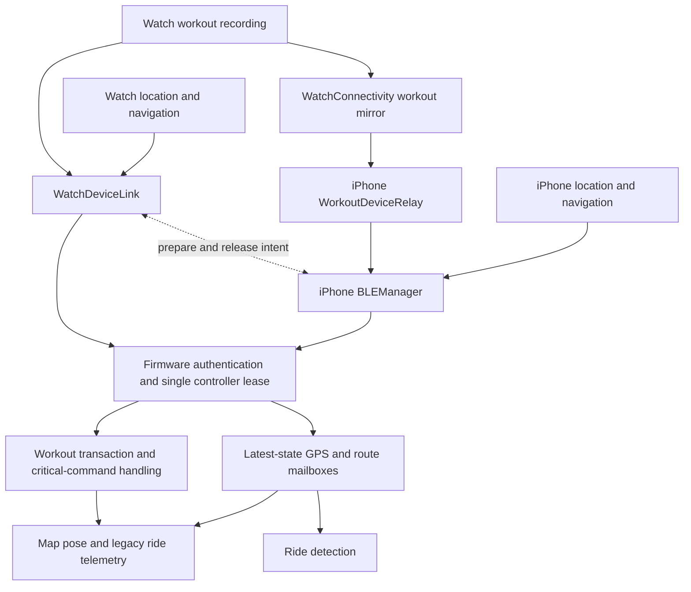

# Bluetooth data reliability and architecture implementation plan

- Date: 2026-09-26.
- Status: proposed implementation; this branch changes documentation only.
- Baseline: GitHub `main`, `eaee846393a1cd44214e23d9d9088a5c193a6b49`.
- Planning branch: `plan/bluetooth-data-reliability`.

## Outcome and scope

Make GPS, navigation, and workout delivery from iPhone or Apple Watch to Bicino
correct through stale location samples, queue delays, reconnects, backgrounding,
and controller handoffs. Make a stopped data stream distinguishable from a
healthy connection carrying an old position. Preserve independent Watch workout
recording when Bicino is unavailable.

Deliver the confirmed corrections first, then converge duplicated data and
recovery policy, then optimize only where measurements justify a change. The
recommended architecture evolves the existing authenticated transport rather
than replacing it or increasing timeouts to conceal failures.

This plan covers phone-to-device BLE, Watch-direct BLE, phone-relayed Watch
workout telemetry, their handoff coordination, and firmware consumers. It does
not implement a persistent archive of every BLE sample. Display snapshots may
coalesce; authoritative workout persistence is a separate responsibility.
Nothing in this audit establishes that saved HealthKit rides are deleted or
corrupted. End-to-end recording durability still needs its own acceptance test.

Related documents:

- [BLE protocol](../ble-protocol.md): wire-format and authorization authority.
- [Earlier architecture plan](bluetooth-connection-reliability-architecture-implementation-plan.md).
- [September reassessment](bluetooth-reliability-reassessment-2026-09-06.md).
- [Implemented shutdown repairs](bluetooth-reliability-implementation-2026-09-07.md).
- [Remaining architecture follow-ups](bluetooth-reliability-follow-ups-2026-09-07.md).
- [Ride diagnostics plan](ride-diagnostics-logging-implementation-plan.md).

The older documents contain historical findings and validation records. Do not
reimplement their resolved shutdown defects or treat their physical gates as
completed by this review. This plan adds the data-freshness findings below and
organizes the remaining convergence work around current source.

## Current system and preserved contracts



Current source already supplies shared transport state transitions, generated
Swift/C++ protocol constants, bounded queues, capability negotiation, protected
writes, controller leases, critical-command application acknowledgements,
Watch preparation persistence, and reconnect resynchronization. Retain these.

Required invariants:

1. Firmware authentication and the controller lease decide who may write.
   WatchConnectivity coordinates handoff; it never grants device authority.
2. Connection generation, navigation generation, workout identity, and source
   sample identity are distinct. A reconnect does not create a new physical fix.
3. Transport arrival proves communication activity, not GPS measurement freshness.
4. GPS and ordinary route/maneuver snapshots may replace older pending snapshots.
   Critical clear/terminal/control groups retain atomic admission and application
   acknowledgement. ATT completion alone is not application acceptance.
5. No timer, retry, capability refresh, or route-bearing update may revive an old
   position, navigation session, workout boundary, or retiring transport.
6. All queues and recovery waits have an explicit bound or a visible terminal
   state. A terminal state must preserve current user demand and explain recovery.
7. HealthKit workout saving is independent of BLE success. Ending navigation
   must not end a workout, and a BLE fault must not discard the workout summary.
8. Diagnostic additions contain durations, counts, reasons, and bounded opaque
   identities, not coordinates, route text, HealthKit values, keys, or payloads.
9. Preserve crypto/DMA headroom guards, owner/scoped permissions, maintenance
   transfer exclusivity, and the existing display/rendering architecture.

## Findings and evidence

Paths and symbols refer to the baseline above; revalidate before implementation.
P2 denotes a correctness/recovery issue. The fourth finding is conditional on a
missing platform callback, not evidence of how frequently that occurs on a ride.

| ID | Finding | Evidence and consequence |
| --- | --- | --- |
| DATA-01, P2 | Repeated old GPS becomes a fresh renderer observation. | `NavigationEngine.refreshRideTelemetry()` repeats the cached fix. Firmware `handleGpsPayload()` records arrival timing, and `Maps` assigns `Fix.timestampMs` from `lastGpsPacketMs`. The quality tail's sample age reaches ride detection but not map freshness. A component reproduction fed a 30-second-old Watch packet into the decoder and current renderer timestamp mapping: after another 500 ms, source age was 30,500 ms, renderer age 500 ms, prediction was not exhausted, and predicted displacement was 5 m. |
| DATA-02, P2 | Delayed phone startup retries overwrite a newer fix. | `NavigationEngine.sendInitialDeviceGpsPosition()` captures the initial location for 0.5/1.5-second callbacks, checking only `isNavigating`. A host reproduction advanced latitude from 37.000000 to 37.000100, then observed a retry send 37.000000 again. `sendDeviceGpsPosition()` also replaces the retained location, allowing subsequent heartbeats to repeat the rollback. A stop/start within the retry window can cross navigation generations. |
| DATA-03, P2 | Watch GPS uses measurement time as clock-sync time. | `WatchRidePacketEncoderV1.gps()` writes `sample.timestamp` into UnixTime. Firmware `handleGpsPayload()` passes UnixTime to `rtc::syncFromUnixTime()`. An encoded 30-second-old sample carried a UnixTime 30 seconds behind current time; this would backdate the clock when its sync gate runs. Dispatch currently refreshes quality age but not that clock field. No physical RTC write was performed. |
| DATA-04, P2 | Active Watch recovery can wait indefinitely for cancellation completion. | `WatchDeviceLink.fail()` enters `.recovering`, cancels its operation/write watchdogs, and requests peripheral cancellation. With a peripheral present, reconnect is scheduled by a later disconnect/failure callback. `beginIfNeeded()` rejects `.recovering`; there is no active-recovery cancellation deadline comparable to the existing graceful-stop deadline. An actual-adapter host test withheld that callback and advanced 60 simulated seconds: recovery remained blocked, with zero reconnects and zero outgoing writes despite new navigation demand/data. Phone preparation remained retained; an injected radio off/on boundary permitted recovery. |

### What “losing all data” means here

- **Temporary stream outage:** a failed write or radio link can require reconnect,
  authentication, lease acquisition, capabilities, and resynchronization. GPS,
  navigation, and workout display updates can all pause during this interval.
- **Sustained stream outage:** DATA-04 can retain the recovery state without
  progress until a disconnect/radio boundary arrives. Graceful shutdown already
  has a bounded missing-disconnect failure asking the user to toggle Bluetooth;
  that is an intentional safety fallback, not an automatic reconnect guarantee.
- **Missing intermediate samples:** bounded latest-state queues deliberately
  coalesce superseded samples. Resynchronization sends current state, not every
  sample produced while disconnected. This is appropriate for a display but
  cannot serve as a complete ride-recording archive.
- **Stored ride loss:** not demonstrated by these findings. Validate Watch
  recording/finalization independently, including BLE outages at pause/end/save.

## Target architecture

Keep the shared reducer and platform adapters. Add a small shared ride-data layer
and make the firmware distinguish transport health from source freshness.

| Component | Responsibility | Boundary |
| --- | --- | --- |
| Source adapters | Accept Core Location/HealthKit/navigation observations and their original timestamps. Assign a source epoch and local sample revision only on a new accepted observation. | Timers and BLE retries do not create samples. |
| Shared ride-data policy | Retain latest logical state; evaluate freshness; build GPS fields consistently for phone and Watch. | Pure Swift under `RideShared`; injected wall and monotonic clocks. |
| Outbound adapters | Check capability/MTU/role, perform final age/time encoding, protect bytes, serialize submission, and track completion. | Keep iPhone owner administration and Watch-specific lifecycle outside the shared payload layer. |
| Recovery coordinator | Own cancellation, deadlines, callback fencing, reconnect eligibility, and replay for one connection attempt. | Shared transition policy; platform objects stay in their adapters. No second Boolean state machine. |
| Firmware ingress | Authenticate, validate, record arrival and source-age metadata, and atomically replace bounded mailboxes. | No map rendering or storage work in BLE callbacks. |
| Firmware consumers | Independently consume transport diagnostics, position freshness, ride-detection evidence, and transactional workout state. | One decoded metadata model; explicit consumer policies rather than one universal “valid” bit. |

The existing quality `fixValid` flag requires speed as well as coordinate,
accuracy, and time evidence. Do not use it alone to reject a useful map location
with unavailable speed. Separate position usability, age availability, and
motion-prediction eligibility. Workout telemetry freshness and terminal-summary
retention must also remain independent of GPS freshness.

### Time model

- Wall time is for the device clock and original source timestamp interpretation.
- Monotonic time is for queue residence, recovery deadlines, sample aging after
  ingestion, presentation, and elapsed-duration measurements.
- Capture the source sample's initial age at ingestion, then add monotonic elapsed
  time at dispatch. Validate future/non-finite timestamps explicitly. An operating
  system wall-clock adjustment must not make a retained sample young again.
- For quality-v1, firmware estimates capture time as authenticated arrival minus
  encoded sample age. Owner-task delay then naturally adds to age. This excludes
  unknown radio transit time; do not describe the estimate as synchronized clocks.
- `0xFFFF` means unavailable age; saturated `0xFFFE` is definitely stale for map
  prediction. Neither may become a new fresh-fix claim. Handle `millis()` wrap
  using bounded unsigned duration arithmetic.
- Coordinate equality is not sample identity: new stationary measurements are
  legitimate. Quality-v1 has no stable sample sequence, so it cannot guarantee
  exact deduplication/order under variable transit delay. Keep that limitation
  explicit until a negotiated extension supplies identity.

## Implementation sequence

### Phase 0 — regression fixtures and reproducible baseline

Create deterministic tests for the four findings before changing their behavior.
Promote the audit's temporary reproductions into repository-owned tests; temporary
files and task transcripts are not the long-term acceptance artifact.

1. Add an injectable retry scheduler to `NavigationEngine` so tests can deliver
   a new fix, advance 0.5/1.5 seconds, and stop/start without wall-clock sleeps.
2. Add shared GPS packet fixtures covering fresh, old, saturated, unavailable,
   invalid, stationary, and future-dated samples. Exercise real Swift encoders
   and real C++ decoding with the same fixture bytes.
3. Test decoder → mailbox metadata → map pose policy as an integrated host path.
   A correct packet encoder and a correct standalone presenter are insufficient
   when the adapter between them discards source age.
4. Extend `ios-app/tests/watch-link-host` to withhold cancellation completion
   during an active writer failure, advance the manual clock, and assert the
   documented recovery outcome. Test late callbacks and a later radio boundary.
5. Keep existing shutdown, ACK ordering, lease, and terminal-workout tests green.

Exit: failures demonstrate the undesired baseline behavior through production
entry points; assertions describe the intended behavior after each repair.

### Phase 1 — correct freshness, retry, and clock semantics

**DATA-01: separate transport and measurement freshness.**

- Extend decoded GPS/mailbox metadata with age availability, conservative source
  capture estimate, and prediction eligibility. Preserve existing packet-count
  and gap metrics as transport statistics; do not silently change their meaning.
- Propagate metadata through `ble_navigation.cpp`, `ble_navigation.hpp`,
  `gps_position_protocol.hpp`, `gps_input_freshness.hpp`, and the map consumer.
- In `maps.cpp`/`mapPresentation.hpp`/`mapPoseInputPolicy.hpp`, evaluate the
  prediction horizon against source age. Repeated stale samples must not restart
  convergence indefinitely or make the pose fresh. Keep the last usable marker
  visible with explicit stale/unknown freshness; do not display fabricated speed
  zero as a measured stop. Fresh source data resumes normal presentation.
- Preserve the existing 1.5-second full-speed and 2.5-second maximum prediction
  windows initially. This fix changes what time they measure, not their duration.
- For legacy packets without age, label source freshness unknown. Do not promise
  GPS-loss detection from arrival alone. Prefer a retained marker with prediction
  disabled when source freshness cannot be established; qualify that visual
  compatibility change on older app/firmware combinations.
- Check legacy ride-stat fallback in `rideTelemetryScr.cpp` and ride detection so
  stale GPS does not remain a live measured speed or create conflicting evidence.
  Preserve valid independent workout metrics and retained terminal summaries.

**DATA-02: generation-scoped retries of current state.**

- Replace captured-position startup callbacks with retries that read the latest
  eligible location at execution time and check the captured navigation epoch.
- Cancel pending retry work on stop, replacement/start, simulation transitions,
  and disposal; retain epoch validation as protection against already-fired work.
- Do not overwrite retained source state when merely transmitting it. Separate
  accepting a source observation from requesting its publication.
- Preserve intentional GPS override ownership and current reconnect replay.
  Releasing an override must restore the latest physical fix, not a startup copy.

**DATA-03: encode current clock time at dispatch.**

- Give both GPS producers one shared field encoder with explicit `sentAt`, source
  sample age, and capability inputs. Keep route-derived fields and workout
  counters supplied by their existing owners.
- On Watch, replace capture-time UnixTime with current dispatch wall time; update
  both it and sample age after queue waiting, immediately before protection.
  Cover full resynchronization, navigation, and workout-only GPS paths.
- Confirm phone native and fallback GPS paths follow the same dispatch rule.
  Regenerate plaintext for replay/retry; never reuse connection-bound ciphertext.
- Preserve quality-v1 layout and capability gating. Do not add sample age to
  UnixTime unconditionally in firmware: phone packets already carry current time.
- Record that old Watch builds remain affected until updated. Firmware cannot
  infer old versus corrected UnixTime semantics reliably from a legacy packet.
  Document `UnixTime = current sender time at dispatch` in the protocol.

Exit: all three reproductions pass with fixed expectations; old-source input
cannot renew prediction, retry cannot roll back a new/session-successor sample,
and queued/replayed Watch packets carry current clock time with original age.

### Phase 2 — contain sustained stream outages

Repair DATA-04 without allowing ambiguous old callbacks to complete new work.

1. Model active cancellation as an explicit recovery substate in the existing
   reducer. Record connection identity, reason, start time, and deadline once.
2. Reuse the existing five-second cancellation deadline as the initial policy
   for this new substate. Measure it separately from ATT/application watchdogs.
   A deadline is a bound on waiting, not proof the platform disconnected.
3. On a matching disconnect, failed connection, or radio-off boundary, finalize
   idempotently and reconnect with existing backoff if demand remains. Preserve
   latest source state and critical logical state for normal resynchronization.
4. If the callback never arrives, publish an explicit recovery-blocked state and
   actionable Bluetooth-recovery instruction. Do not remain on a generic write
   failure message indefinitely, report Ready, or claim automatic recovery.
5. Do not reconnect the same peripheral merely because time expired. Only add a
   connection/delegate-generation isolation mechanism if actual adapter tests
   prove that every old callback is fenced; otherwise retain the visible safe
   fallback. Automatic central-manager replacement is not part of the first fix.
6. Retain matching phone preparation while active Watch demand still owns the
   recovery attempt. Define stop/cancel and later radio-boundary behavior so only
   the matching handoff is released; never let an old recovery release a successor.
7. Audit corresponding iPhone `cancelPeripheralConnection` paths and owner
   readiness publications with real adapter tests. DATA-04 is confirmed from the
   Watch path; do not label all phone paths defective without reproducing them.

Exit: every injected transport failure either progresses after a valid boundary
or reaches the documented visible blocked state by deadline, with no false Ready,
stale-callback acceptance, lost demand, or silently stolen phone handoff.

### Phase 3 — converge architecture incrementally

- Extract the shared GPS encoder/freshness policy first; migrate phone and Watch
  independently with byte parity fixtures for unchanged fields.
- Extract shared connection/write/recovery decisions only after adapter tests
  exist. Keep published readiness as a projection of authoritative lifecycle and
  negotiated prerequisites; remove duplicated mutable flags one boundary at a
  time. A reducer unit test alone does not establish adapter correctness.
- Standardize outbound metadata: connection generation, logical command identity,
  source epoch/revision, traffic class, replaceability, age deadline, and delivery
  requirement. Keep existing frame/byte limits and reserved critical capacity.
- Keep protected-frame construction at the final writable dispatch boundary.
  Coalesce plaintext logical state before encryption. Avoid consuming sequences
  or allocating encrypted data for snapshots that remain blocked or are replaced.
- Maintain one serialized writer per active connection across authentication and
  ride channels. Preserve whole workout transactions and critical boundaries;
  never interleave their members as a throughput optimization.
- Expand handoff tests across the actual WatchConnectivity coordinator and phone
  manager: durable prepare/release outbox, tombstones, activation/reachability,
  submission failure, process restart, and independent demand restoration.

Optional protocol follow-up: specify a negotiated GPS extension with source
epoch, sample sequence, explicit validity/freshness, and defined time semantics
if exact duplicate/out-of-order rejection is required. Define byte layout,
wrap/restart behavior, MTU budget, capability bit, generated Swift/C++ constants,
golden vectors, and mixed-version behavior before implementing it. Never append
bytes to quality-v1 without negotiation; its decoder accepts an exact length.
Do not block the compatible Phase 1 fixes on this extension.

### Phase 4 — measured improvements and optimizations

These are candidates, not additional confirmed defects or promised gains.

| Candidate | Measure first | Acceptance condition |
| --- | --- | --- |
| Avoid unchanged route retransmissions | Route bytes/writes per minute; route revisions; Watch dispatch cadence. | Skip only unchanged logical geometry, retain required refresh/replay, and send immediately on reconnect/route change. No stale route after clear or reroute. |
| Freshness-aware snapshot scheduling | Source age at dispatch/application, queue residence, coalesces, control latency under combined workout/navigation load. | Expired replaceable work is replaced/dropped before dispatch without dropping critical state or starving a traffic class. |
| Reduce packet/encryption allocation | Allocation count, CPU time, internal/DMA headroom, peak queue bytes. | Measured improvement with bounded memory, unchanged authentication and payload validity, and no callback/task ownership regression. |
| Separate status heartbeat from physical samples | Repeated unchanged GPS payloads, radio wakeups, stale-state presentation. | Keep liveness and counters without claiming a new fix; capability-gate any wire change and preserve older peers. |
| Tune write mode or cadence | ATT latency, callback loss, firmware application gaps, battery use on both controllers. | Preserve current acknowledged-write preference until comparison demonstrates benefit; no blanket switch to write-without-response or longer watchdogs. |
| Improve stale-data presentation | Time between source loss and visible stale state; independent workout/GPS availability. | Explain which data stopped, retain last known useful values as stale, and avoid reconnecting a healthy BLE link just because GPS is unavailable. |

Record baseline and candidate p50/p95/max dispatch age, ATT latency, firmware
mailbox residence, recovery duration, queue high-water frames/bytes, replacements,
rejections, and battery/thermal observations under the same scenario. Keep source
gap, transport gap, and render delay separate. Proposed optimization targets must
be agreed from those baselines; no throughput or battery improvement is claimed
by this document.

## Validation matrix and acceptance gates

| Scenario | Required assertion |
| --- | --- |
| Fresh source; stable link | Phone and Watch encode equivalent GPS semantics; normal marker, guidance, and workout refresh remain correct. |
| Source stops while BLE stays healthy | Old heartbeats cannot keep prediction or speed fresh. Source loss is visible; transport is not falsely blamed. |
| A newer fix arrives before startup retry | No rollback at either retry deadline; subsequent heartbeat retains the newer fix. |
| Stop/start, reroute, simulation, GPS override | Retired callbacks cannot alter successor state; latest permitted physical location is restored. |
| Queued packet or reconnect with old sample | Age includes queue residence; clock field is current; stale source does not become a fresh fix. |
| Invalid/future/saturated/missing quality | No numeric trap, false fresh claim, clock underflow, or unbounded prediction; documented legacy behavior. |
| Same coordinates with a genuinely new sample | Stationary valid observations remain usable; position equality is not mistaken for duplication. |
| Slow UI/mailbox drain; monotonic wrap; wall-clock jump | Source age, arrival metrics, and elapsed timing retain their separate meanings. |
| Missing ATT/application response | Existing bounded watchdog/retry/resync policy; no falsely completed critical command. |
| Missing cancellation callback in active recovery | Visible bounded recovery-blocked state; no unsafe reuse; a later valid boundary restores progress. |
| Phone/Watch handoff during failure or stop | Exact preparation identity survives; old release cannot cancel successor; only leased writer supplies state. |
| Mixed GPS, route, workout, settings traffic | Bounded queue and memory; coherent workout groups; protected critical capacity; latest valid data eventually delivered. |
| BLE outage during Watch pause/end/save | Workout persists and finalizes independently; terminal summary is not converted into idle by transport loss. |
| Old/new app and firmware combinations | No unsolicited new layout; truthful unknown freshness and documented old-Watch clock limitation. |

### Local and CI checks

Run the suites appropriate to each implementation slice, serializing runners
that share temporary files. Use the existing repository runners and host fixture
infrastructure rather than maintaining parallel copies of production logic.

```sh
python3 tools/generate_ride_ble_contract.py --check
./ios-app/scripts/run-navigation-tests.sh
./ios-app/scripts/run-ride-shared-tests.sh
./ios-app/scripts/run-workout-contract-tests.sh
./ios-app/scripts/run-ride-diagnostics-tests.sh
```

Add firmware regressions alongside `test_gps_input_freshness.cpp`,
`test_map_pose_input_policy.cpp`, `test_map_presentation.cpp`, and
`test_ride_delivery_protocol.cpp`; ensure the firmware host-test runner/CI selects
the new tests. Add a cross-language fixture check when introducing shared GPS
encoding. Run the Watch source typecheck and native iOS/watchOS platform suites
for adapter/refactor changes, followed by Debug and Release builds through
`ios-app/scripts/xcodebuild-cli.sh` with isolated DerivedData and no signing.

For firmware changes, use the repository's verified build helper after required
hardware-model clarification. Record validation separately for 1.75 and 2.06.
Automatic CI's 1.75 profiles are not evidence that 2.06 compiles. Inspect exact-head
GitHub checks and current `AGENTS.md` before requesting additional manual scope.

### Physical qualification

After implementation and separate device authorization, identify exact iPhone,
Watch, board model/serial, app builds, firmware SHA/profile, and installed versions.
Follow current repository build/install/flash rules; confirmation is required
immediately before the exact firmware write. No device work is authorized merely
by this plan.

Qualify both boards separately with phone navigation, Watch-only navigation,
workout-only, combined workout/navigation, and phone-relayed Watch workouts.
Cover phone lock/background, wrist-down Watch use, controlled signal loss, real
reconnect/handoff, source loss while BLE stays connected, and sustained riding.
Use deterministic adapter fault injection for callbacks that cannot be reliably
withheld on real hardware; do not equate that test with physical reproduction.

Observe the device's stale/recovery presentation and application acceptance, not
just app “sent” messages. Verify recorded workouts after a display outage and
after finalization. Store bounded, redacted evidence by artifact and scenario.
Keep cold-start, radio, recording, battery, and per-board results separate.

## Delivery, rollback, and completion

Suggested independently reviewable changes:

1. Regression fixtures plus compatible GPS freshness/startup/clock repairs.
2. Active recovery cancellation deadline and real adapter fault coverage.
3. Shared data-policy extraction and incremental lifecycle convergence.
4. Measured scheduling/allocation improvements, one decision per change.
5. Optional negotiated sample-identity extension, if its added complexity is
   justified by an agreed requirement and the compatibility matrix.

Do not make the concrete repairs wait for the broader refactor. Each change
records its base/head, tests, known limitations, and pending physical gates.
Roll back at those boundaries with coherent app/firmware versions; preserve
negotiation so an older peer fails safely. Reverting to old app/firmware also
reintroduces its documented freshness/clock behavior, so describe that explicitly.
Do not distribute a factory image while an affected hardware gate is unresolved.

Completion checklist:

- [ ] DATA-01/02/03 regressions pass against production paths.
- [ ] DATA-04 has a bounded, visible outcome and safe eventual recovery.
- [ ] Source freshness, transport activity, clock sync, and workout retention are separate contracts.
- [ ] Critical delivery, permissions, handoff identities, and independent recording remain intact.
- [ ] Exact-head local/CI results and mixed-version behavior are recorded.
- [ ] Physical validation is recorded per board/controller or explicitly remains pending.
- [ ] Optional optimizations have measurements; deferred architecture work is labeled deferred.

## Implementation status

The compatible repairs and first architecture/optimization slice are implemented
on `fix/bluetooth-data-reliability`; see
[implementation and validation record](bluetooth-data-reliability-implementation.md).
The original checklist above remains the full acceptance checklist, including
physical qualification; baseline results below must not be read as fix results.
Broader lifecycle migration, protocol extensions and hardware-dependent tuning
remain explicitly deferred as described in that record.

## Evidence available when this plan was written

The preceding source audit used the exact baseline above in a clean detached
worktree. `run-navigation-tests.sh`, `run-ride-shared-tests.sh` (including 43
actual Watch-adapter host cases and 214 assertions), generated BLE contract
consistency, and the GPS-freshness/map-presentation/ride-delivery C++ host tests
passed. Targeted temporary host reproductions demonstrated DATA-01 and DATA-02;
packet encoding and receiver inspection established DATA-03's clock mismatch.
The opt-in live MapKit snapshot smoke test was skipped by its runner.

For DATA-04, a temporary copy of the existing Watch host harness added one case
without changing production source: establish a ready fixture, invoke its real
writer-failure entry point, omit the disconnect callback, advance the manual clock
by 60 seconds, and offer fresh navigation demand/data. Observed output was
`phase=recovering, reconnects=0, writes=0`. The case also verified retained phone
preparation and progress after radio off/on. The augmented suite passed 44 cases
and 220 assertions because it explicitly asserted this baseline failure mode;
that pass does not mean recovery is fixed. Promote it with corrected deadline
expectations in Phase 0/2. Framework callbacks were doubled, so this establishes
the software consequence of callback loss, not its physical occurrence rate.

Those results are baseline evidence, not validation of the proposed fixes.
No full firmware build, physical Bluetooth ride, device install, flash, or stored
workout durability test was performed for this audit or documentation change.
