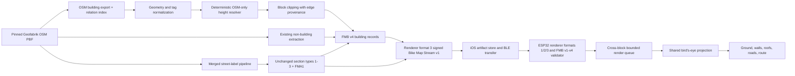

# Geofabrik/OSM 3D Buildings Implementation Plan

## Outcome

Add durable, offline 3D buildings to the device's **Map + Navigation** view using only the OpenStreetMap data already supplied through the Geofabrik extraction workflow.

The shipped system must:

- preserve OSM building outlines, parts, multipolygon holes, height-related tags, and enough edge provenance to render buildings correctly across map-block boundaries;
- resolve a deterministic height for every renderable building from OSM tags or documented OSM-only fallbacks;
- encode the result in a versioned, bounded binary format designed for the ESP32 renderer;
- render simple LoD1 buildings—flat roofs and shaded walls—through the existing shared bird's-eye projection;
- keep roads, the navigation route, and maneuver guidance legible;
- remain compatible with existing FMB v1/v2/v3 maps, renderer formats 1 and 2, older firmware, and the signed Bike Map Stream v1 container;
- expose coverage and fallback provenance rather than presenting estimated heights as measured data; and
- make no network calls to external height, building, imagery, terrain, or proprietary data sources.

This is the long-term implementation, not an overlay experiment. It treats 3D building data as a first-class, deterministic map artifact with explicit compatibility, validation, testing, rollout, and rollback contracts.

## Baseline

This plan is based on GitHub `origin/main` at:

```text
d688be51b5b0325b4ad1e06485f33e38f6a35dfc
```

That baseline already contains:

- the Dockerized Geofabrik/OSM extraction pipeline under `tools/OSM_Extract/`;
- FMB v1/v2 production plus the merged FMB v3 street-label format and its FMA1 font asset;
- signed Bike Map Stream v1 packaging and device transfer;
- renderer formats 1 and 2, exact target/file-composition validation in `map_artifact_validation.py`, target-aware reuse, and signed-manifest validation;
- firmware stream/file validation through `mapRendererFileValidator.hpp` and atomic renderer rollback during installation;
- a four-block, 4,096-metre block cache on the ESP32;
- a shared flat/bird's-eye projection in `map_projection.hpp`;
- near-plane clipping for projected map geometry;
- map-feature visibility settings, including Buildings;
- CAP2 schema v1, Map + Navigation setting IDs 27–34, target-aware iOS offline-map selection, and capability-gated settings synchronization;
- cross-block street-label collection, bounded PSRAM workspaces, cooperative interruption, renderer diagnostics, and a foreground canvas for labels and route geometry; and
- the isolated `compose.hardware-validation.yaml` stack used for physical map validation.

### Merged street-label foundation

Merged [PR #160](https://github.com/seichris/open-bike-computer/pull/160) assigns FMB v3 to the street-label extension directory. FMB v3 has exactly three required critical extension sections: string table, shaped runs, and road labels. The merged work also assigns Map + Navigation setting IDs 27–34 and establishes the extensible CAP2 schema-v1 32-bit feature bitmap.

For this implementation, renderer format 2 is treated as deployed and physically validated, per the production-state assumption supplied when implementation began. Its existing fail-closed default remains unchanged so environment configuration continues to control production generation.

This plan assigns 3D buildings to **FMB v4**, as an additive successor to that label-capable v3 layout. The first three v3 section types and payloads remain unchanged; buildings use a fourth required critical section. The corresponding artifact target is renderer format 3, without a parallel block-version field.

Renderer format 3 retains its own independent rollout gate. No renderer-format-2 deployment or validation recheck is required by this work, and no renderer-format-3 physical validation is implied by the renderer-format-2 assumption.

## Implementation status

Implemented on `agent/osm-3d-buildings` across extraction, map-platform packaging and validation, firmware parsing/rendering, BLE capability/settings, iOS target selection and saved-map compatibility, documentation, and host regression tests. Renderer-format-3 generation remains disabled by default through `MAP_PLATFORM_BUILDING_TARGET3_ENABLED=0`.

The target-3 physical-device matrix, timing/PSRAM capture, signed production pack transfer, and production gate enablement remain rollout work. They are intentionally not recorded as complete by this implementation-only branch.

## Product contract

### Where 3D appears

3D extrusion is active only when all of the following are true:

1. the device is showing Map + Navigation;
2. the Map + Navigation bird's-eye presentation is enabled;
3. Buildings are enabled in the map-feature visibility mask;
4. the new **3D Buildings** setting is enabled;
5. the loaded block is FMB v4 and contains building records; and
6. the renderer remains inside its validated geometry and timing budgets.

In every other state, buildings render as ordinary flat footprints. Map + Navigation keeps its configured bird's-eye perspective before and during guidance, while its maneuver strip appears only after navigation starts. The standalone Map view remains flat. FMB v1/v2 behavior remains exactly as it is at the baseline, and the merged v3 street-label behavior remains intact.

### User control

Add one capability-gated switch under iOS **Map + Navigation** customization:

```text
3D Buildings                       On
Show OSM buildings with height in bird's-eye navigation.
```

The first production version deliberately has no height-exaggeration, facade-detail, or roof-style controls. Those would complicate validation and visual consistency without improving the core navigation outcome.

The switch defaults to enabled. For a fresh settings profile on firmware that advertises 3D-building support, Buildings is also included in the default Map + Navigation visibility mask so the default is observable. Existing persisted `navVis` values are never overwritten or migrated: if an existing user has hidden Buildings, the 3D Buildings switch does not make them visible.

### Data-source boundary

Allowed inputs are:

- the selected Geofabrik `.osm.pbf` source snapshot;
- OSM tags, geometry, object identifiers, and relation membership contained in that snapshot;
- checked-in parsing rules and fallback constants; and
- statistics calculated from eligible OSM buildings in the same source snapshot and locality.

The pipeline must not query or merge any other building-height source. A build must succeed reproducibly without general internet access once the Geofabrik PBF and pinned build image are present.

## Decisions locked by this plan

1. **Use a new FMB v4 building section.** Do not overload the existing polygon record with optional bytes that old parsers could misread.
2. **Keep Bike Map Stream at v1.** Its signed container can carry FMB v4 blocks without a container-format change.
3. **Use the merged renderer-target contract.** Renderer format 1 carries legacy FMB v1/v2 with no FMA1 requirement; renderer format 2 carries FMB v3 plus exactly one FMA1 street-label asset; renderer format 3 carries FMB v4 plus exactly one FMA1 asset and the building profile.
4. **Keep FMB v1/v2/v3 readable indefinitely.** New firmware accepts v1, v2, v3, and v4.
5. **Use the existing shared projection.** Ground-level points in the enhanced projection must remain bit-for-bit equivalent to current output.
6. **Render LoD1 geometry only.** Flat roofs, solid walls, courtyards, and building parts are in scope; detailed roof meshes and textures are not.
7. **Resolve height during extraction.** The device receives bounded numeric heights and provenance codes, not raw strings or runtime estimation logic.
8. **Retain OSM semantic provenance.** Explicit height, level-derived height, inherited height, local OSM median, and class default are distinguishable in reports and records.
9. **Suppress artificial block-edge walls.** Clipping provenance is encoded per edge so block seams cannot become facade walls.
10. **Sort buildings across all loaded blocks.** Rendering each block independently would create incorrect painter order at block boundaries.
11. **Degrade dense scenes deterministically.** Reserve the validated extrusion budget nearest-to-rider, preserve the global painter order, render overflow records as flat footprints, and record a diagnostic. Never choose a random or input-order subset.
12. **Do not silently upgrade saved maps.** A renderer-format-1/2 artifact retains its target; the user regenerates/downloads a compatible renderer-format-3 artifact.

## Target architecture



The building pipeline is separate from the current generic polygon styling path. The existing GDAL flow remains suitable for roads and land-use polygons, but its current generic representation does not preserve all of the information needed for durable 3D buildings.

## OSM building model

### Extraction

Add a dedicated building stage for objects tagged with either:

- `building=*`; or
- `building:part=*`.

Use the existing `osmium-tool` image capability to assemble area geometry and export complete tags and OSM object identity. Add a pinned `pyosmium` dependency for a narrow second pass that indexes `type=building` relation membership, because a general area export cannot preserve every non-multipolygon relation semantic needed to associate outlines and parts.

Run that stage against an expanded source extract before the final user-area clip. The osmium extraction strategy must retain complete ways and required relation members at the buffer boundary; otherwise a building or relation touching a requested-area edge could be silently truncated before the seam-safe block clipper sees it.

The stage must retain:

- OSM object type and ID;
- outer and inner rings for polygons and multipolygons;
- `building` and `building:part` classification;
- `type=building` outline/part membership;
- all height-resolution tags listed below;
- source region and PBF checksum; and
- validation warnings tied to the source object ID.

Reuse the merged extractor's `parse_tags`, field-preserving `style_features`, progress reporting, and timing/statistics conventions where they fit. Extract a dedicated `building_tags` dictionary before styling; the merged `style_features()` copies feature dictionaries and can preserve that explicitly extracted field.

Building geometry still gets its own typed Python model and validation layer. Do not route it through the generic `get_geoms()` path: that helper still takes only a multipolygon's first exterior and does not preserve holes or complete multi-outer geometry. Emit a structured `BUILDING_STATS` record through the existing `BlockProgressReporter` pattern so backend progress and diagnostics stay consistent with street-label processing.

### Supported height tags

Parse and normalize at least:

- `height`;
- `min_height`;
- `building:levels`;
- `building:min_level`;
- `roof:height`;
- `roof:levels`;
- `building`;
- `building:part`; and
- relation/outline membership needed for controlled inheritance.

`height` is the total object height, including the roof. `min_height` is the bottom of an elevated part, not a value to add to total height. Level-derived total height includes the roof contribution exactly once.

The parser accepts:

- bare numeric values interpreted as metres;
- explicit metre suffixes; and
- unambiguous foot/inch values converted to metres.

It rejects and reports:

- lists or ranges without one unambiguous value;
- non-numeric descriptions;
- NaN/infinite values;
- negative values;
- `min_height >= height`;
- implausible values outside checked-in safety bounds; and
- contradictory part/outline combinations that cannot be resolved deterministically.

Rejected tags never crash or reject the entire map. They move that object to the next documented fallback and increment a reason-specific audit counter.

### Outline and part semantics

Resolve building topology before block clipping:

1. If an outline has no usable building parts, extrude the outline.
2. If usable parts cover the building, extrude the parts and retain the outline only as a flat footprint/base fill.
3. Preserve courtyards as inner rings; never fill them as roof area.
4. Treat overlapping parts as independent OSM geometry but apply deterministic draw ordering.
5. Use explicit `type=building` relations first for membership.
6. Use strict geometric containment only when relation membership is absent. Record that association method in extraction diagnostics.
7. Do not attach a part merely because bounding boxes overlap.

The fallback containment operation must use prepared geometries, an explicit tolerance, and a stable tie-breaker based on the smallest containing outline followed by OSM object identity.

## Deterministic OSM-only height resolution

Create `tools/OSM_Extract/conf/building_height_rules.yaml` as the single checked-in configuration for parsing bounds, floor-height assumptions, local-statistics thresholds, and building-class defaults. Its content hash becomes part of the map worker/build identity.

For each extruded outline or part, resolve `height`, `min_height`, and provenance in this order.

### Total height precedence

1. **Explicit height**
   - Use a valid `height` value directly.
   - Provenance: `explicit_height`.

2. **OSM levels**
   - Use valid `building:levels * floor_height_m`.
   - Add valid `roof:height`, otherwise valid `roof:levels * roof_level_height_m`.
   - Provenance: `levels`.

3. **Controlled parent inheritance**
   - A part may inherit a valid explicit or level-derived outline height only when it has no own height fields and the relationship is explicit or unambiguous.
   - Never let inherited part height exceed a valid explicit outline maximum.
   - Do not copy a part's height upward to its outline or sideways to sibling parts.
   - Provenance: `parent_inheritance`.

4. **Local OSM median**
   - Calculate a median from buildings whose height came from steps 1 or 2 in the same PBF snapshot, locality cell, and coarse building class.
   - Use a bounded calibration halo and require a configured minimum sample count.
   - Exclude inherited and fallback-derived values so estimates cannot recursively train other estimates.
   - Clamp the result to the configured class range.
   - Provenance: `local_osm_median`.

5. **Checked-in building-class default**
   - Use the deterministic default for the normalized `building=*`/`building:part=*` class.
   - Unknown classes use one documented generic default.
   - Provenance: `class_default`.

### Minimum-height precedence

1. valid `min_height`;
2. valid `building:min_level * floor_height_m`; then
3. zero.

Clamp fallback `min_height` below resolved total height. An invalid or contradictory minimum-height tag is reported before the object falls back.

### Local calibration rules

The locality calculation must be stable across requested map boundaries. Do not derive a median from only the final user-selected polygon, because two overlapping requests could then encode different heights for the same building.

Instead:

- assign source buildings to fixed Web Mercator calibration cells;
- include a fixed ring of neighboring cells;
- extract all intersecting calibration cells plus their fixed halo from the source PBF before clipping to the user's final polygon/corridor;
- calculate class-specific statistics from the same Geofabrik snapshot;
- cache the statistics by source checksum, rules hash, and cell ID; and
- use stable sort/order and explicit numeric rounding.

This gives nearby OSM data a role in the fallback while keeping results source-local, offline, repeatable, and independent of the shape of a user's requested area.

### Provenance and auditability

Every FMB v4 building record carries a compact provenance enum:

| Code | Meaning |
|---:|---|
| 0 | Explicit OSM `height` |
| 1 | Derived from OSM levels/roof tags |
| 2 | Inherited from an OSM parent outline |
| 3 | Local median of explicit/level-derived OSM buildings |
| 4 | Checked-in building-class default |

Each build also emits a machine-readable height-coverage report containing:

- unique outlines and parts;
- rendered fragments;
- counts and percentages by provenance;
- accepted height tag formats;
- rejected values grouped by reason;
- relation-based versus containment-based part associations;
- buildings with holes/courtyards;
- median, high percentile, and maximum resolved height;
- clipped edges versus original wall edges; and
- bytes and point counts contributed by the building section.

Include a compact summary in the signed map manifest. Keep the full report with backend build diagnostics.

## Block clipping without seam walls

The current pipeline clips polygons to 4,096-metre map blocks. A clipped building ring contains both real OSM boundary edges and artificial edges created by the clip rectangle. Extruding every resulting edge would create walls along invisible tile seams.

The building clipper must therefore:

1. perform outline/part resolution before clipping;
2. split the geometry against the exact block boundary;
3. preserve all resulting outer and inner rings;
4. classify every fragment edge as either `original_boundary` or `clip_boundary` using source-segment provenance and a fixed tolerance;
5. encode a wall bit only for original boundary edges;
6. canonicalize ring winding and start points for deterministic output; and
7. verify that adjacent blocks contain matching roof boundaries but no wall on their shared artificial edge.

Holes retain their original-boundary wall bits so courtyards can have inner walls. A building whose roof crosses a block edge still has a continuous roof visually, but neither fragment produces a facade at the seam.

## FMB v4 format

Add a normative byte-level specification at `docs/fmb-v4.md` before implementing writers or parsers.

### Compatibility shape

- Magic/version: `FMB\x04`.
- Existing generic polygon and polyline records retain their v2 wire layout.
- The v3 string-table, shaped-run, and road-label section types `1`, `2`, and `3` retain their IDs and payload wire layouts.
- Replace the fixed v3 `EXT3` directory contract with a specified `EXT4` directory containing required critical section types `1`–`4`; type `4` is the dedicated building section. The v4 directory has explicit criticality flags, offsets, lengths, checksums, ordering, and whole-payload validation.
- Generalize the merged `_DIRECTORY_HEADER`/`_DIRECTORY_ENTRY` serialization and validation into a shared helper used by v3 and v4. Do not copy a second directory implementation that can drift.
- A renderer-format-3 pack retains exactly one `VECTMAP/<mapId>/assets/street-labels.fma` asset and the v3 street-label profile fingerprint; adding buildings must not drop or reinterpret FMA1.
- In v4, extrudable building geometry is removed from the generic polygon collection and written to the dedicated building section.
- Flat building footprints used as bases remain in the dedicated building section with a canonical flat-base flag, preserved rings, and zero wall bits. This avoids the generic polygon path, which cannot preserve multipolygon holes.
- The v4 parser knows the permitted section graph and validates the complete payload; no extension-by-unstructured-trailing-bytes convention is used.
- There is no new ASCII FMP representation for v4 buildings. FMP remains a legacy/developer representation for old flat geometry; production v4 is binary-authoritative.

### Building record

The final specification should use fixed-width little-endian fields with this logical content:

```text
style/type id
flags
height in decimetres
minimum height in decimetres
height provenance
bounds in block-relative integer coordinates
ring count
  point count
  block-relative int16 x/y points
  packed one-bit wall mask for each edge
```

Flag bit 0 marks a `building:part`; bit 1 marks a flat outline base retained beneath a complete set of parts. The flags are mutually exclusive, all other bits are reserved, and flat-base wall masks must be zero.

Use unsigned 16-bit decimetres for heights: 0.1-metre resolution and a range well beyond accepted building bounds. `height` must be greater than `min_height`. Unknown/invalid height is never encoded because the build resolver must have chosen a documented fallback.

Do not bake literal source facade/roof colors into the first v4 format. Preserve color-related OSM tags in build diagnostics if useful, but derive the compact RGB565 roof and wall shades from the device style/type. That keeps styling centralized and avoids making today's visual palette a permanent map-data contract.

### Validation limits

Extend both the Python writer and ESP32 validator with explicit limits for:

- total block bytes;
- total features and building records;
- rings per building;
- points per ring and points per block;
- wall-mask bytes;
- resolved height and minimum height;
- integer-coordinate bounds; and
- arithmetic overflow before allocation or iteration.

All byte-size arithmetic uses checked addition/multiplication. The validator rejects truncated, overlong, self-contradictory, or budget-exceeding data before rendering begins. Parsing remains cooperative/interruptible so BLE and navigation work cannot be starved by a hostile or corrupted block.

Extend the merged backend `validate_renderer_artifacts` checks and firmware stream/file validator rather than adding a second validation path. The compact signed building summary uses integer counts and basis points only because canonical Bike Map Stream JSON does not permit floating-point JSON values. Richer percentages and distributions remain in the unsigned build-diagnostics report.

## Map target and artifact compatibility

### Request and manifest targets

The iOS/backend request uses the merged renderer-target vocabulary:

```json
{
  "target": {
    "renderer": "esp32-fmb",
    "rendererFormatVersion": 3,
    "firmwareVersion": "..."
  },
  "labels": {
    "profileVersion": 1,
    "preferredLanguages": ["..."],
    "internationalFallback": "en"
  }
}
```

Keep signed Bike Map Stream `schemaVersion: 1`. A renderer-format-3 manifest uses:

```json
{
  "target": {
    "renderer": "esp32-fmb",
    "formatVersion": 3,
    "minFirmwareVersion": "...",
    "labelProfileVersion": 1,
    "labelLanguages": ["..."],
    "internationalFallback": "en",
    "buildingProfileVersion": 1
  },
  "buildings": {
    "recordCount": 0,
    "explicitHeightCount": 0,
    "levelsHeightCount": 0,
    "inheritedHeightCount": 0,
    "localMedianHeightCount": 0,
    "classDefaultHeightCount": 0
  }
}
```

Do not introduce a second block-format field in request, manifest, status, or persisted metadata. Renderer format is the artifact compatibility contract and determines the permitted FMB/FMA composition. Building coverage may add integer totals and basis-point values, never JSON floats, without changing the stream schema.

Extend the strict backend, iOS, and firmware manifest decoders together: renderer format 3 requires the label fields, `buildingProfileVersion: 1`, and a bounded integer-only building summary; renderer formats 1 and 2 reject format-3-only fields.

### Capability and selection

Use CAP2 feature bit 12 for 3D-building support and extend the existing `OfflineMapJobRequest.forDevice(...)` selection matrix:

- bit 12 present: request renderer format 3;
- street-label support present without bit 12: request renderer format 2; and
- otherwise, including legacy or absent CAP2: request renderer format 1.

The existing `activeRendererFormat` status remains the device's renderer-format signal; extend its accepted/installed values to include 3 rather than adding a parallel supported-format list. iOS persists the verified renderer format with each saved artifact and refuses transfer when the connected device cannot activate it.

Backend generation rejects unknown target values rather than silently substituting another format. Persisted last-known capabilities may guide download UI, but transfer authorization is rechecked against the currently connected device.

### Exact target/file contracts

Reuse the merged backend and firmware exact-composition validators:

- renderer format 1: FMB v1/v2 files, optional legacy `.fmp`, and no FMA1;
- renderer format 2: FMB v3 files, exactly one FMA1 at `VECTMAP/<mapId>/assets/street-labels.fma`, and no `.fmp`; and
- renderer format 3: FMB v4 files, exactly one FMA1 at the same path, no `.fmp`, and `buildingProfileVersion: 1`.

Every FMB header in an artifact must match its renderer target. Firmware validates the signed target and file composition before atomic activation, so iOS gating is not the only defense against mislabeled or manually transferred artifacts.

### Existing maps and applications

- Existing firmware continues receiving and reading renderer format 1 or 2 according to its capability.
- New firmware reads v1, v2, v3, and v4.
- A v1/v2/v3 block on new firmware renders flat buildings even if 3D Buildings is enabled.
- Existing signed stream-v1 parsers continue to ignore new optional manifest fields where their decoder permits unknown keys.
- Saved renderer-format-1/2 artifacts remain usable; they are not relabeled or rewritten.
- No automatic backend regeneration occurs without a user request.

## ESP32 data model and renderer

### Parsed model

Add a bounded building model separate from the existing flat polygon structure. It must retain:

- block-relative rings;
- wall masks;
- bounding box;
- height and minimum height;
- style/type ID;
- provenance; and
- stable source ordering for deterministic draw ties.

Follow the merged `map_label_block::Block` pattern for explicit limits and PSRAM-backed vectors. Reuse `map_renderer_format::StreamValidator` and expose v4 section views to the existing `mapLabelBlock` decoder so label payload parsing is not forked for FMB v4.

The four-block cache limit remains unchanged unless physical profiling proves a change necessary. Include the new structures in existing PSRAM accounting and diagnostics.

### Projection extension

Extend `map_projection::Projection` with one authoritative world-at-height operation. Conceptually:

```cpp
projectWorldAtHeight(worldX, worldY, physicalHeightM, blockMercatorScale)
```

Requirements:

- a zero-height point produces exactly the current `projectWorld()` result;
- vertical screen displacement uses the same depth scale as the ground point;
- the point respects the existing near plane and perspective controls;
- fixed-point/range behavior is explicit and tested; and
- Web Mercator scale is calculated once per block from latitude, not per vertex.

The scale correction is required because horizontal block coordinates are Web Mercator metres while building tags describe physical metres. Clamp the correction at supported source latitudes and cover the boundary in tests.

### Cross-block render queue

Refactor the map draw path into bounded passes:

1. parse/collect visible geometry from every loaded block;
2. draw non-building ground polygons;
3. collect visible building fragments into one queue;
4. project and depth-sort visible building surfaces with a stable tie-breaker;
5. draw facade walls, then roof surfaces, back-to-front;
6. keep map road/line features on the ground plane beneath building solids on
   the base RGB565 canvas;
7. render retained street labels and route/navigation geometry through the merged foreground RGB565A8 canvas; and
8. composite the foreground over the base canvas using its existing priority and collision behavior.

One global building queue is essential: block-by-block drawing cannot correctly order a far building from one block against a near building from another. Reuse the label renderer's proven cross-block collection shape—bounded reserve, stable cache keys, cooperative interruption, and diagnostics—but keep building surfaces in a separate queue with their own budgets and invalidation key.

### Surface generation

For each visible fragment:

- clip the ground footprint against the existing near plane before surface generation;
- generate wall quads only for edges whose wall bit is set;
- project bottom vertices at `min_height` and top vertices at `height`;
- preserve outer/inner-ring winding so roof holes remain holes;
- triangulate or scan-convert roofs with deterministic bounded algorithms;
- use view-relative, style-derived light/mid/dark RGB565 facade shades; and
- use a stable depth key and source-order tie-breaker.

Projected courtyard rings capture the actual RGB565 underlay after walls and
before roofs. After the outer roof fill, the renderer restores those pixels
through each hole, preserving land-use color, roads, farther buildings, and
courtyard walls instead of painting holes with a fixed background color.

No runtime heap growth may scale without an encoded/validated upper bound. Prefer reusable PSRAM-backed buffers allocated with the map cache.

### Navigation legibility

Ground polygons and road lines render before building solids on the base
canvas, so roofs and walls naturally occlude ordinary streets. The
already-merged foreground canvas keeps street labels, the active route, and
navigation overlays above it. Validate that:

- the route line is never occluded by roofs or walls;
- retained v3 street labels remain readable and keep their existing collision/asset-health behavior;
- the label/route foreground canvas remains byte- and visually compatible when 3D Buildings is off;
- maneuver markers retain current priority;
- buildings behind the rider do not cover foreground guidance; and
- facade contrast remains subordinate to the route palette on both AMOLED sizes.

### Runtime degradation policy

Add hard budgets for visible building records, rings, points, generated wall faces, sort workspace, and render time. The implemented candidate bounds are 6,144 queued records, 49,152 rendered source points, 1,024 source points in one rendered record, 1,024 extruded records, 24,576 extruded source points/wall candidates, and a 10-second emergency building-pass deadline. Both-board physical profiling remains the gate for retaining or lowering those values before production enablement.

When a frame exceeds a hard geometry budget:

- discard any individually oversized record before surface projection;
- retain the nearest 6,144 candidates with a traversal-order-independent bounded heap;
- select the nearest candidates inside the total rendered-point budget and omit farther total-work overflow;
- reserve extrusion capacity nearest-to-rider using the stable depth order;
- draw selected and overflow records in the original global back-to-front painter order;
- draw extrusion overflow records as flat footprints instead of flattening the whole city;
- do not render a random or input-order subset in 3D;
- increment a reason-specific diagnostic counter; and
- keep roads and route rendering unchanged.

Extrusion is limited to runtime zooms `1...4` and projected footprint area of at least 6 square pixels, avoiding wall work on visually meaningless distant buildings. Those rules are deterministic for a given camera state. Polygon filling already checks the cooperative screen-cycle interrupt every 16 scanlines; the per-record point bound prevents one otherwise-legal 65,535-point ring from monopolizing a render between those checks.

### Diagnostics

Extend map diagnostics/serial logging with:

- loaded FMB version;
- parsed building records/rings/points;
- provenance counts;
- visible and extruded fragments;
- generated and suppressed wall faces;
- extrusion flat-overflow count plus record/point reasons and cumulative counters;
- total-work record/point/per-record/time overflow counts and cumulative counters;
- projection, sort, building-draw, and total map-draw timing;
- current/free/largest PSRAM allocation; and
- corrupt/unsupported block rejections.

## Settings and BLE protocol

Allocate the next Map + Navigation setting contract after the street-label range:

- setting ID `35`: 3D Buildings, boolean `0/1`;
- persisted NVS key: `nav3dBldg`;
- firmware default: enabled;
- CAP2 schema version: `1`;
- CAP2 feature flag: `BUILDINGS_3D_FEATURE = 1UL << 12`.

Do not consume legacy CAPS extended bit 3. CAP2 already provides the durable feature namespace, and older CAP2 clients can ignore an unknown feature bit while retaining the capabilities they understand.

The setting controls extrusion, not building visibility. The existing Buildings visibility bit remains authoritative for whether building geometry appears at all.

For a fresh profile on capable firmware, include Buildings in the Map + Navigation visibility default. Preserve every existing persisted `navVis` value without migration; a user-hidden Buildings category stays hidden even when `nav3dBldg` is enabled.

Extend the merged contracts in `device_capabilities_protocol.hpp`, `map_profile_protocol.hpp`, `map_profile_persistence.hpp`, `map_setting_redraw_policy.hpp`, `BLEManager.swift`, and `SettingsView.swift`. Old devices do not expose the switch. New devices acknowledge, persist, and report it through the existing fail-closed settings protocol. Document renderer-target capability and `activeRendererFormat` behavior in `docs/ble-protocol.md`.

## Backend and build identity

### Target-specific generation

The backend worker receives `target.rendererFormatVersion` through the merged normalized target:

- renderer format `1`: legacy FMB v1/v2 artifacts;
- renderer format `2`: FMB v3 street-label artifacts with FMA1; and
- renderer format `3`: building extraction, height resolution, retained street-label sections/FMA1, and FMB v4.

Extend `OfflineMapJobRequest.forDevice(supportsStreetLabels:firmwareVersion:)` with 3D-building capability and reuse the merged `map_artifact_validation.py`, `manifest.py`, `reuse.py`, job, and label-pipeline contracts. Renderer format 3 preserves the request's `labels` profile and languages. Do not make v4 a hidden global replacement; cache/reuse keys must distinguish renderer formats 1, 2, and 3.

### Reproducibility

The artifact/build identity must include:

- exact Geofabrik source URL/region metadata already in use;
- PBF checksum;
- extractor code/image identity;
- building-height rules hash;
- renderer target version and building-profile version; and
- relevant style/config hashes.

For the same complete identity, the generated FMB files and manifest building summary must be byte-identical. Stabilize feature ordering, relation ordering, ring canonicalization, float-to-decimetre rounding, median calculation, and JSON serialization.

### Feature gate

Add `MAP_PLATFORM_BUILDING_TARGET3_ENABLED=0` as a fail-closed renderer-format-3 generation gate. Initial production configuration permits it only for an explicit test allowlist. A request outside the allowlist receives a typed unsupported-target response so iOS can offer the newest explicitly supported renderer format 1 or 2 rather than mislabeling another artifact as format 3.

The format-3 gate is independent of `MAP_PLATFORM_LABEL_TARGET2_ENABLED`: a permitted format-3 build can invoke the shared label pipeline without requiring the client-facing format-2 gate to be enabled. Existing stream publication approvals and allowlists continue to govern artifact release.

The worker image must be rebuilt and promoted before enabling the target. Because extractor and configuration hashes participate in build identity, old cached artifacts cannot be reused as v4 results.

## Implementation phases

### Phase 0 — Fixtures, audit, and physical baseline

1. Select pinned Geofabrik snapshots and checksums for representative fixtures:
   - Singapore CBD: dense high-rises and frequent explicit heights;
   - Singapore residential: many fallback candidates;
   - Taipei: dense mixed building classes;
   - Berlin: multipolygons, courtyards, and building parts.
2. Add small license-compatible PBF/derived fixtures containing:
   - explicit metric and imperial heights;
   - level-derived heights;
   - `min_height` and `building:min_level`;
   - building outline/part relations;
   - holes and multipolygons;
   - invalid tags; and
   - a building crossing both horizontal and vertical block boundaries.
3. Record the supplied implementation assumption that renderer format 2 is deployed and physically validated; keep its rollout gate independent.
4. Record renderer-format-1 and FMB v2 baselines plus renderer-format-2 and FMB v3/FMA1 baselines through the isolated hardware-validation stack: block/asset sizes, extraction time, peak worker memory, parse time, map-render time, PSRAM headroom, label behavior, and navigation responsiveness.
5. Define physical ship budgets from those measurements before enabling renderer format 3 in production.

Exit gate: fixtures are reviewed, checksums are pinned, both Waveshare baselines are captured, and hard budgets are recorded in the plan's implementation PR or an attached benchmark document.

### Phase 1 — Typed extraction and height resolver

1. Add the dedicated osmium building export.
2. Add the narrow relation-membership index pass.
3. Normalize polygon/multipolygon rings and source identity.
4. Implement strict tag parsing and OSM-only fallback precedence.
5. Implement fixed-cell local calibration and caching.
6. Produce the detailed height-coverage report.
7. Prove deterministic output with repeated and shuffled-input tests.

Exit gate: every fixture building has a resolved height/provenance or a documented geometry rejection, and no network access is required after the source PBF is available.

### Phase 2 — Seam-safe clipping and FMB v4 writer

1. Reuse the merged FMB v3 documentation, golden tests, section validators, and FMA1 contracts; generalize the directory helper without changing v3 bytes.
2. Specify the additive normative v4 bytes and limits.
3. Add ring-preserving clipping with per-edge provenance.
4. Add the dedicated building records and validator in Python.
5. Keep renderer-format-1 and renderer-format-2 output byte-for-byte stable for unchanged inputs.
6. Add v4 golden files, corruption cases, and boundary-seam fixtures.

Exit gate: adjacent fragment roofs meet at the boundary, clip-created edges have no wall bits, inner rings survive, and all golden files round-trip deterministically.

### Phase 3 — Backend target negotiation and signed artifacts

1. Validate and normalize `target.rendererFormatVersion` values 1, 2, and 3.
2. Separate renderer-format-1/2/3 worker identities and reuse keys while retaining label-profile identity.
3. Add the signed renderer-format-3 target, building-profile version, and integer-only coverage summary.
4. Extend the exact artifact-composition validator and add the fail-closed format-3 production gate/allowlist.
5. Build and stage the new worker image.

Exit gate: identical geographic requests can produce distinct correctly signed renderer-format-1/2/3 artifacts, reuse never crosses targets or label/building profiles, and unsupported targets cannot be silently downgraded.

### Phase 4 — Firmware parser, projection, and renderer

1. Extend the validator/parser to v4 while retaining v1/v2/v3.
2. Add the bounded parsed building model.
3. Extend shared projection for physical height.
4. Add cross-block collection, depth sorting, wall generation, and roof rendering.
5. Draw buildings and roads on the base canvas while preserving the merged label/route foreground canvas and priority behavior.
6. Add deterministic budget fallback and diagnostics.

Exit gate: golden blocks pass on host tests, flat ground projection is unchanged, corrupt blocks fail closed, seam walls are absent, and the renderer stays within the Phase 0 budgets on both boards.

### Phase 5 — BLE capability, setting, and iOS artifact gating

1. Add setting ID 35 and CAP2 feature bit 12.
2. Extend `OfflineMapJobRequest.forDevice(...)` to choose renderer format 3, 2, or 1 from bit 12 and street-label capability.
3. Persist and verify the artifact's renderer format in iOS, and accept `activeRendererFormat: 3` in status.
4. Request renderer format 3 only for paired devices advertising CAP2 bit 12.
5. Refuse incompatible transfers before sending bytes.
6. Add the iOS 3D Buildings toggle, explanatory copy, redraw policy, and fresh-profile Buildings visibility default without migrating persisted `navVis`.

Exit gate: old devices continue to receive renderer format 1 or label-capable renderer format 2 with no new switch; compatible devices request/transfer renderer format 3 and round-trip the setting across reconnect and reboot.

### Phase 6 — End-to-end validation and staged rollout

1. Generate fresh renderer-format-1, renderer-format-2, and renderer-format-3 packs from the same pinned snapshots.
2. Compare coverage reports and visually inspect known fixtures.
3. Test all supported zooms, headings, perspective levels, and route states.
4. Run dense-route soak tests on both AMOLED board sizes.
5. Exercise gate-off, target downgrade, saved-artifact mismatch, and firmware-setting rollback paths.
6. Reconfirm the live renderer-format-2 production/physical state, enable a small format-3 allowlist independently, inspect production build and device diagnostics, then widen deliberately.

Exit gate: all acceptance criteria below are evidenced with artifacts, logs, screenshots, timings, and exact build/source identities.

## Expected file-level changes

| Area | Files | Purpose |
|---|---|---|
| Extractor image | `tools/OSM_Extract/tools/Dockerfile` | Pin relation-index dependency and keep the build reproducible. |
| Building extraction | `tools/OSM_Extract/scripts/pbf_to_geojson.sh`, new `extract_buildings.py` | Export typed building geometry/tags and relation membership. |
| Height resolution | new `building_height.py`, new `conf/building_height_rules.yaml` | Parse tags, resolve heights, calculate local OSM medians, report provenance. |
| Geometry | `tools/OSM_Extract/scripts/funcs.py` or new focused building geometry module | Preserve rings, parts, holes, canonical ordering, and edge provenance. |
| Map writer | `tools/OSM_Extract/scripts/map_format.py`, `extract_features.py` | Write renderer-format-3 FMB v4 building records while preserving renderer-format-1/2 output. |
| Extractor tests | `tools/OSM_Extract/tests/` | Tag, relation, clipping, determinism, corruption, and golden-format coverage. |
| Format docs | `docs/fmb-v3.md`, `docs/fma1-font-asset.md`, new `docs/fmb-v4-building-format.md` | Preserve v3/FMA1 bytes and specify additive v4 bytes, limits, invariants, and compatibility. |
| Backend target | `map-platform/backend/map_platform/pipeline.py`, `jobs.py`, `map_labels.py`, request models | Validate renderer format 3 and reuse the merged label pipeline. |
| Backend validation and identity | `map_artifact_validation.py`, `manifest.py`, `reuse.py`, worker/build-identity modules and tests | Enforce exact target/file composition, separate renderer-format-1/2/3 reuse, and sign the target/building summary. |
| Backend validation stack | `map-platform/deploy/compose.hardware-validation.yaml` | Exercise target generation and signed transfer through the isolated hardware stack. |
| Firmware format | `esp32/lib/maps/src/mapBlockFormat.hpp/.cpp`, `mapRendererFileValidator.hpp`, `mapLabelBlock.*`, `mapFontAsset.*` | Validate v4 building bytes, reuse v3 label payload/FMA1 decoders, and retain bounded cooperative parsing. |
| Firmware install | `esp32/lib/map_transfer/map_transfer.*`, stream manifest/parser/installer code | Reject unsupported or header/composition-mismatched renderer targets before atomic activation and preserve rollback. |
| Firmware model | `esp32/lib/maps/src/maps.hpp/.cpp` | Store building records and implement global render passes. |
| Building renderer | new focused `building_renderer.hpp/.cpp` if needed | Generate/sort/draw walls and roofs without bloating the map parser. |
| Projection | `esp32/lib/maps/src/map_projection.hpp` | Project physical building height through the shared camera model. |
| Settings/BLE | `device_capabilities_protocol.hpp`, `map_profile_protocol.hpp`, `map_profile_persistence.hpp`, `map_setting_redraw_policy.hpp` and tests | Advertise renderer-format-3/building support and implement setting ID 35 through CAP2. |
| iOS BLE | `ios-app/BikeComputer/BikeComputer/Managers/BLEManager.swift` and protocol tests | Parse capability/status and synchronize the setting. |
| iOS maps | `Models/OfflineMapPlatform.swift`, `Models/BikeMapStreamFormat.swift`, `Managers/OfflineMapManager.swift` and tests | Select renderer format 1/2/3, persist the verified format, and refuse incompatible uploads. |
| iOS UI | `Views/SettingsView.swift` and Map + Navigation view models/tests | Add the capability-gated switch and fresh-profile visibility behavior. |
| Protocol docs | `docs/ble-protocol.md`, `docs/map-stream-format-v1.md` | Document setting/capability, renderer-target status, and the format-3 manifest contract. |
| CI | relevant extractor/backend/ESP32/iOS workflows | Run deterministic golden, compatibility, and protocol tests. |

Exact filenames may follow the baseline module boundaries, but the separation of extraction, height policy, wire format, renderer, and product capability must remain.

## Test matrix

### Height resolver

- bare metres, metre suffixes, feet/inches, decimal values;
- explicit height precedence over levels;
- roof height versus roof levels without double counting;
- minimum height and minimum level;
- zero, negative, excessive, range, list, and malformed values;
- parent inheritance constraints;
- class-specific local median with minimum sample threshold;
- local median isolation from fallback-derived samples;
- class default and unknown-class default;
- stable cell-boundary behavior; and
- identical results across repeated/shuffled execution.

### Geometry and FMB

- way polygons, multipolygon relations, inner rings, and multiple outer rings;
- explicit building relations and containment fallback;
- parts with and without outline height;
- horizontal, vertical, and corner block crossings;
- no wall masks on clip-created seams;
- inner courtyard walls retained;
- canonical ring orientation/start point;
- maximum legal records/rings/points/masks/heights;
- truncated, trailing, overflowing, and contradictory records;
- v4 writer/parser golden round trip;
- retained v3 label-section payloads, FMA1 asset, and profile references inside renderer-format-3 packs;
- unchanged renderer-format-1 golden output; and
- unchanged renderer-format-2 FMB v3/FMA1 golden output.

### Firmware renderer

- renderer-format-1/2 activation regression, renderer-format-3 activation, and FMB v4 flat-mode rendering;
- zero-height projection equality with the baseline;
- physical-height projection at representative latitudes;
- near-plane crossings for roofs and walls;
- outer and inner rings;
- stable cross-block depth sorting;
- wall-mask enforcement at seams;
- all bird's-eye perspective settings, headings, and supported zooms;
- both display aspect ratios;
- ordinary roads beneath buildings on the base canvas and labels/route above
  the base through the foreground canvas;
- unchanged label collision, asset-health, route-priority, and foreground-compositing behavior;
- nearest-first geometry-budget reservation with flat overflow;
- corrupt-block rejection without reset or starvation; and
- repeated block load/eviction under the four-block cache.

### Backend, protocol, and iOS

- renderer target omitted, renderer formats 1, 2, 3, and unsupported 4;
- renderer-format-1/2/3 reuse separation and build identity;
- exact format-3 FMB v4 plus FMA1 file composition and rejection of missing/extra/mismatched files;
- signed manifest tamper rejection;
- manifest target/header mismatch and unsupported-target rejection on-device;
- legacy CAP2 payload without bit 12 selecting renderer format 1 or 2 as appropriate;
- iOS `forDevice` selection for legacy, street-label-only, and 3D-building devices;
- `activeRendererFormat` status values 1, 2, and 3, including unknown-value rejection;
- saved-artifact renderer-format persistence and compatibility checks;
- compatible and incompatible artifact transfer;
- setting write/ack/read, timeout, reconnect, and reboot persistence;
- fresh-profile Buildings visibility versus preservation of existing persisted `navVis`;
- old-device UI capability hiding; and
- failed/stale generation never overwriting a valid saved artifact.

### Physical-device validation

Run on both supported Waveshare environments using the same signed pack identities:

- dense Singapore CBD route;
- mixed residential route dominated by fallbacks;
- parts/courtyard fixture;
- route crossing a 4,096-metre block seam;
- zoom, pan, heading changes, perspective changes, and setting toggles;
- BLE navigation and map-transfer concurrency checks;
- 30-minute navigation soak with block churn; and
- measured render timings, free/largest PSRAM, resets, watchdogs, and dropped navigation updates.

Physical validation is required before production enablement; simulator images and host tests are not substitutes for the ESP32 memory/timing gates.

## Acceptance criteria

The implementation is complete only when all of the following are true:

1. Every encoded v4 building has a valid bounded height, minimum height, and provenance.
2. The complete height pipeline uses only the pinned Geofabrik/OSM snapshot plus checked-in deterministic rules; an offline build after PBF acquisition succeeds.
3. The same source checksum and build identity produces byte-identical FMB v4 blocks and manifest summary.
4. Explicit, level-derived, inherited, local-median, and class-default coverage is visible in signed/artifact diagnostics.
5. Multipolygon holes and building parts render correctly.
6. Buildings spanning blocks have continuous roofs and no artificial seam walls.
7. Building solids occlude ordinary ground-level roads, while street labels
   and the active route remain legible above them; foreground collision and
   priority behavior is unchanged.
8. Renderer-format-1/2 activation, FMB v1/v2/v3 parsing, street-label behavior, and flat-building rendering regressions are absent.
9. Old devices are never offered renderer format 3/FMB v4; iOS refuses an incompatible saved artifact before transfer; and new firmware rejects unsupported or mislabeled artifacts before activation.
10. The new setting is capability-gated, persisted, acknowledged, and documented.
11. Malformed or oversized building data fails closed without unbounded allocation, reset, or navigation starvation.
12. Both Waveshare targets pass the agreed render-time, PSRAM, responsiveness, and soak-test budgets.
13. The target-3-aware control-plane/API and worker images are promoted, renderer-target reuse is separated, and a real signed renderer-format-3/FMB v4 pack is regenerated and transferred end to end.
14. Format-3 gate-off, renderer-format-1/2 request, device setting-off, and saved-format-1/2 rollback paths are demonstrated.
15. Exact source checksums, build identities, firmware/iOS revisions, device targets, metrics, and visual evidence are attached to the delivery record.

## Rollout and rollback

### Rollout

1. Merge format docs and fixture tests before enabling production generation.
2. Record the supplied implementation assumption that renderer format 2 is deployed and physically validated; keep its rollout gate independent.
3. Ship new firmware support while iOS still requests the current compatible renderer format 1 or 2.
4. Build the shared target-3-aware image and complete its worker/hardware gates before promotion. The repository detects worker-input changes and deliberately prevents a new-control-plane/old-worker promotion for this release.
5. Co-promote the control-plane/API and worker digest with `MAP_PLATFORM_BUILDING_TARGET3_ENABLED=0`; verify typed unsupported-target responses and worker health while generation remains disabled.
6. Ship iOS capability negotiation and transfer refusal. Retain the exact legacy target-3 rejection fallback only for clients that reach a pre-promotion control plane during rollout.
7. Enable renderer format 3 for internal paired devices and regenerate packs from fresh requests.
8. Compare production coverage/size/timing with the pinned validation artifacts.
9. Widen the allowlist only after both hardware targets remain inside budgets.

### Rollback

Rollback does not require deleting or rewriting maps:

- disable `MAP_PLATFORM_BUILDING_TARGET3_ENABLED` so requests use an explicit compatible renderer-format-1/2 path;
- have iOS request renderer format 1 or 2 for subsequent generations according to device capability;
- turn off 3D Buildings on-device to render v4 footprints flat;
- continue using existing signed renderer-format-1/2 artifacts; and
- retain v3/v4 parsing in firmware so already transferred maps remain safe and readable.

Do not roll back by changing a manifest's declared renderer target or serving FMB v1/v2/v3 bytes under a renderer-format-3 identity.

## Non-goals

- external height enrichment, external building datasets, imagery-derived height, or live lookup APIs;
- terrain/elevation and ground-level correction from non-OSM sources;
- photorealistic textures, windows, shadows, ambient occlusion, or sky rendering;
- complex roof shapes or full OSM 3D roof geometry in the first production format;
- redesigning the merged street-label feature rather than preserving and reusing it in v4;
- indoor levels or floor-plan rendering;
- 3D buildings in the ordinary flat Map view;
- increasing the four-block cache without measured evidence;
- changing Bike Map Stream v1 merely to carry FMB v4;
- silently rewriting saved renderer-format-1/2 maps; or
- editing/uploading OSM data from the product.

## Reference semantics

Implementation and review should use the upstream specifications as semantic references:

- [`docs/fmb-v3.md`](../fmb-v3.md), [`docs/fmb-v4.md`](../fmb-v4.md), [`docs/fma1-font-asset.md`](../fma1-font-asset.md), [`docs/map-stream-format-v1.md`](../map-stream-format-v1.md), and [`docs/ble-protocol.md`](../ble-protocol.md) for the merged local format, asset, signed-stream, renderer-target, capability, and settings contracts;
- [OSM Simple 3D Buildings](https://wiki.openstreetmap.org/wiki/Simple_3D_buildings) for outline, part, height, level, and minimum-height meaning;
- [Osmium export](https://docs.osmcode.org/osmium/latest/osmium-export.html) for area assembly, tag export, and relation limitations; and
- [GDAL OSM driver](https://gdal.org/en/stable/drivers/vector/osm.html) for the behavior of the existing generic extraction path.

These references define how to interpret the Geofabrik/OSM input; they are not additional runtime or enrichment data sources.
