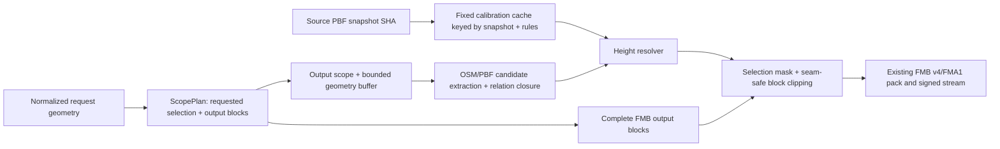

# Geofabrik/OSM 3D Selected-Area Preprocessing Implementation Plan

## Status and scope

This plan was authored from `origin/main` at
`a6da053cf502697a172c6025b4ffec78ff3016bf`. Its implementation branch was
rebased onto `origin/main` at `1e1899807f7ba10d5afc18788a3f24ec55401c40`
before implementation began. The proposals below remain the design record;
implementation status is tracked by code, tests, and rollout evidence rather
than by rewriting the original plan claims.

The plan addresses the expensive part of the existing renderer-format-3
(`FMB v4`) path: a small requested map causes a much larger raw PBF extraction
because the source rectangle is currently also the calibration window. The
long-term design separates the bytes that must be emitted from the source data
needed to resolve boundaries and the statistics needed to resolve missing
heights.

## Current evidence

### Observed Shanghai job

The following values are the supplied observation from the Shanghai 3D job.
They are approximate evidence, not constants that are already recorded by the
worker. The implementation must calculate the values from projected integer
geometry and persist them as diagnostics rather than rely on these rounded
figures.

| Scope | Current approximate area | Current meaning |
| --- | ---: | --- |
| Requested map | 23.84 km² | User-selected bbox/area before renderer alignment |
| Aligned output | 110 km² | Complete Web-Mercator 4,096 m block envelope needed by FMB v4 |
| Raw 3D source | 785 km² | 8,192 m calibration-cell envelope plus one-cell halo around the aligned output |

The current expansion is therefore approximately 4.6x from request to output
and 32.9x from request to raw source. The 785 km² figure is not a promise about
every latitude or geometry shape; it is the benchmark that the new policy must
explain and improve.

### Code path that produces the expansion

The current flow is observable in these files:

1. `map-platform/backend/map_platform/pipeline.py` calls
   `aligned_processing_bounds(job, complete_blocks=True)` for renderer format
   3. This expands the output envelope to complete fixed Web-Mercator blocks.
2. The same method loads `building_height_rules.yaml` and calls
   `expanded_building_source_bounds(...)`. The current checked-in rules use an
   8,192 m cell and one-cell halo, so the source rectangle is aligned to that
   grid and widened again.
3. `_extract_pbf(..., force_bounds=True)` invokes `osmium extract` with that
   source rectangle and `--option=types=multipolygon,building`. A custom
   polygon is intentionally not passed as an osmium polygon clip in this path.
4. `pbf_to_geojson.sh` runs `ogr2ogr -spat` for lines and multipolygons over the
   source rectangle and runs `extract_building_relations.py` over the clipped
   PBF. The result is a complete intermediate dataset for the large rectangle,
   not only the selected output blocks.
5. `extract_features.py` loads all intermediate lines and polygons, then
   `prepare_buildings(...)` collects, associates, resolves, calibrates, and
   normalizes every building in the source input. Only after that work does the
   current code apply `selection_geometry` to the resolved building list.
6. The block loop then visits the aligned output range, clips buildings to each
   4,096 m block, writes FMB v4, and emits `MAP_PROGRESS:<completed>:<total>`.

This means a building outside the requested polygon can participate in local
calibration, which is useful for stable statistics, but its full geometry and
height-resolution cost is paid inside every job. Calibration is not currently a
persistent source-snapshot cache: the same fixed cells are rebuilt from the
intermediate source data on overlapping requests.

### Why 3D differs from 2D

The 2D path does not run typed building collection, relation association,
height parsing, local-median sampling, or the FMB v4 building section. For a
custom polygon or route it can retain the request bounds rather than forcing the
format-3 complete-block envelope. A custom bbox may already align to complete
blocks in the generic path, but it still does not incur the calibration-cell
and halo expansion. Renderer format 3 currently needs complete blocks for its
binary block contract and adds the building preprocessing stages, so comparing
only the final requested area hides the dominant 3D input cost.

The solution must preserve the complete-block requirement while moving the
calibration work out of the per-request source rectangle. It must not solve the
problem by removing relation/part data or by silently reducing the FMB block
coverage.

### Progress and observability caveat

`MapBuildPipeline` enters `JobStatus.CONVERTING_FEATURES` before the extractor
starts, but `BlockProgressReporter` is created after file loading and building
preparation. Consequently, a job can remain in `converting_features` with no
`progress` update while `prepare_buildings()` is scanning the 785 km²-derived
intermediate data. The backend parser currently understands only
`MAP_PROGRESS`, `LABEL_STATS`, and `BUILDING_STATS`; the public job progress
object is block-oriented, and the iOS presentation reads that block fraction.

The new design must report preprocessing separately and must record a
time-to-first-progress metric. It must not make a long cache miss look like a
dead worker, and it must not reinterpret a preprocessing fraction as completed
output blocks for older clients.

## Goals

1. Make renderer-format-3 preprocessing proportional to the selected/aligned
   map area plus a bounded correctness buffer, not to an 8,192 m calibration
   cell envelope.
2. Keep heights deterministic for a fixed Geofabrik/OSM source snapshot, rules
   hash, extractor/build identity, and requested output semantics.
3. Make overlapping requests use the same local-median calibration values even
   when their selected boundaries differ.
4. Preserve complete boundary buildings, multipolygon holes, `building:part`
   relations, and source object identity.
5. Preserve seam-safe FMB v4 clipping: artificial block edges must not become
   facade walls, while real OSM outer and courtyard edges remain renderable.
6. Preserve existing FMB v1/v2/v3/FMA1 compatibility, Bike Map Stream v1,
   renderer target negotiation, target-aware subset reuse, and the default
   fail-closed target-3 gate.
7. Expose requested, output, source, calibration, cache, and preprocessing
   metrics so operators can explain cost and diagnose retries.
8. Establish a measurable Shanghai benchmark and a rollback path before any
   production target-3 enablement.

## Non-goals and constraints

### Non-goals

- No external building, height, imagery, terrain, ML, Google, Overture, GHSL,
  or proprietary enrichment. Only the selected Geofabrik `.osm.pbf`, OSM
  geometry/tags/relations, and checked-in rules are allowed.
- No redesign of the ESP32 building renderer, bird's-eye projection, FMB v4
  record layout, FMA1 labels, BLE capability contract, or Bike Map Stream
  container. A wire-format change is justified only if an implementation proof
  finds a strict compatibility defect.
- No exact arbitrary-polygon byte format. FMB remains a complete fixed-block
  format; selection geometry controls candidate/output policy around those
  blocks.
- No per-request learned or network-backed height model.
- No claim of implementation, deployment, production readiness, or physical
  device validation from this plan.

### Constraints

- `Geofabrik/OSM` is the source-of-truth boundary. The source PBF checksum must
  be available or computed before a cache key is accepted.
- Existing target-3 generation remains disabled by default through
  `MAP_PLATFORM_BUILDING_TARGET3_ENABLED=0` until the new gates pass.
- FMB blocks remain 4,096 m Web-Mercator blocks, with the existing FMB v4
  section limits and per-edge wall masks.
- FMA1 and the existing label profile remain present for target 3. Output must
  remain consumable by current FMB v4-capable firmware and rejected by clients
  that cannot accept renderer format 3.
- Once the source PBF, worker image, code revision, and rules are available,
  generation and calibration must be reproducible without an external network
  call.
- Source and cache operations must be atomic and retryable. A partial PBF,
  relation index, calibration cell, or pack must never be published as a
  complete input.

## Definitions and proposed scope contract

The implementation must stop using one `bounds` value for three different
purposes. A canonical `ScopePlan` should carry the following independent
objects, using projected integer metres for identity and WGS84 values only at
CLI/API boundaries:

| Name | Definition | Used for |
| --- | --- | --- |
| `requestedSelection` | Normalized bbox, polygon, or route corridor from the job | User intent, selection mask, stable map identity |
| `outputBlocks` | Deterministically ordered set of complete 4,096 m FMB blocks selected by the request | Block loop, pack contents, block progress, subset reuse |
| `outputScope` | Union/envelope of `outputBlocks` in EPSG:3857 | Output area and block-grid diagnostics |
| `sourceScope` | `outputScope` plus the smallest configured geometry/relation correctness buffer | PBF/GeoJSON building and ordinary feature extraction |
| `calibrationCells` | Fixed 8,192 m cells needed for output buildings, plus the configured statistics halo | Cache lookups only; never an automatic source rectangle |
| `selectionMask` | Exact projected request geometry, with route-corridor width applied | Candidate inclusion after relation/height preparation; not a block seam |

For a custom bbox, `outputBlocks` is the rectangular block range covering the
requested bbox. For a custom polygon or route corridor, it is the sorted set of
blocks whose block polygon intersects the normalized selection (a configurable
small navigation margin may be added only if product requirements justify it).
The map manifest continues to describe the requested map bounds; the signed
diagnostic scope describes the actual block IDs and source policy.

### Proposed initial configuration

These are explicit proposals for implementation and benchmark review, not
current production settings:

| Key | Proposed value | Rationale / decision gate |
| --- | --- | --- |
| `scopePolicyVersion` | `2` | Versions the reviewed increase from the initial 200 km² source-area cap |
| `blockSizeMeters` | `4096` | Existing FMB contract; changing it is out of scope |
| `geometryBufferMeters` | `256` | Initial candidate buffer for buildings and ordinary feature clipping |
| `relationClosureMode` | `source_snapshot_index` | Fetch complete relation members by ID instead of widening to a calibration cell |
| `relationRetryBufferMeters` | `512` | One bounded retry if a source index cannot satisfy a boundary closure |
| `maxGeometryBufferMeters` | `2048` | Hard safety cap; unresolved geometry after this fails closed |
| `calibrationCellSizeMeters` | `8192` | Preserve the existing checked-in height-rule cell size |
| `calibrationHaloCells` | `1` | Preserve the existing stable-neighborhood rule, but satisfy it from cache |
| `calibrationMinimumSamples` | `3` | Preserve the current rule; fewer direct samples use class defaults |
| `maxSourceToOutputAreaRatio` | `1.35` | Proposed benchmark safety bound using projected source/output areas |
| `maxSourceAreaKm2` | `500` | Controlled city-area validation cap; larger jobs still need an explicit policy review |
| `boundaryToleranceMeters` | `0.05` | Match the current seam-wall tolerance unless fixture evidence changes it |
| `maxRelationObjectsPerJob` | `200,000` | Protect worker memory/CPU; the pinned Shanghai benchmark requires 124,383 closure objects, leaving about 61% headroom; exceedance is a typed failure, not silent truncation |

The area limits apply to the actual source query envelope/union measured in
projected metres, not to the coarse `bbox_area_km2` approximation used for
request admission today. Thresholds can be tuned after the benchmark, but a
change must bump `scopePolicyVersion` and the build/reuse identity.

## Recommended architecture



### Scope planner

Add one canonical planner in the backend (a focused module beside `reuse.py`
is preferred) and use the same serialized plan in the extractor. It must:

1. Normalize the request exactly once and project bounds/geometry to EPSG:3857.
2. Enumerate output blocks by integer grid coordinates, sort `(x, y)`, and
   compute block polygons without repeated float round trips.
3. For a bbox, include every block intersecting the bbox. For a polygon or
   route, include only blocks intersecting the projected selection; do not loop
   over the entire bounding rectangle and discover empty blocks later.
4. Expand the block union by `geometryBufferMeters` for `sourceScope`, clamped
   to Web-Mercator limits and the source region bounds.
5. Derive the calibration cell IDs required by output buildings from fixed
   cell coordinates. The planner may conservatively request cells for all
   output blocks, but it must not turn those cells into a PBF extraction box.
6. Serialize a canonical `scopePlanSha256` from integer block IDs, policy
   version, buffer, selection semantics, and calibration policy. The same
   request/source/rules must produce the same plan bytes.
7. Measure `requestedAreaM2`, `outputAreaM2`, `sourceAreaM2`, ratios, block
   count, source bounds, and calibration-cell count. Use integer square metres
   or basis points in signed artifacts; human-readable API diagnostics may also
   expose rounded decimals.

The planner should reject a scope that exceeds the proposed ratio/area limits
with a typed `building_scope_exceeded` error. It must not fall back to the old
785 km² source expansion without recording an explicit operator override. A
future override, if approved, must be included in the policy hash and artifact
identity.

### Source extraction and candidate selection

The worker should pass the plan, not a single overloaded bounds tuple, through
the target-3 path:

1. Resolve and verify the immutable source PBF. Record the actual snapshot SHA
   even when a dynamic Geofabrik catalog did not provide a declared checksum.
2. Run `osmium extract --strategy=smart` over `sourceScope` with the existing
   building/multipolygon type options. Keep the source rectangle small and
   rectangular for tool compatibility; exact selection is applied later.
3. Run the existing line/polygon conversion over `sourceScope`, but pass the
   output-block list and selection geometry to feature extraction. Ordinary
   feature clipping and building clipping happen only for `outputBlocks`.
4. Add a source-snapshot building index pass (or extend the existing relation
   pass) that can rehydrate complete ways, nodes, multipolygon members, and
   `type=building` relation membership by OSM object ID. The index is an input
   cache, not an external data source.
5. Select a building if its complete geometry intersects an output block and
   satisfies the request's selection policy. A source-buffer-only building may
   contribute to boundary closure or diagnostics but must not be emitted unless
   it intersects the selected output scope.
6. For a custom polygon/route, do not clip emitted roofs to the user geometry
   by default. Include a complete building fragment in each selected block and
   let the FMB block boundary be the only clipping seam. Exact selection masking
   is an alternative described below.

The extractor CLI should accept a versioned scope document, for example:

```text
extract_features.py ... \
  --scope-plan /work/scope-plan.json \
  --selection-geometry /work/feature-selection.geojson \
  --calibration-cache /cache/building-calibration
```

The scope document must contain the sorted block IDs, projected block extents,
source scope, buffer policy, calibration key, and a canonical hash. Reject an
unrecognized scope-policy version rather than silently interpreting it as the
current behavior.

### Bounded geometry and relation buffer

The buffer is for correctness, not for statistics. The proposed algorithm is:

1. Start with `geometryBufferMeters=256` around the union/envelope of selected
   output blocks. This covers normal building footprints, ring closure, and
   quantization context without adding a full calibration cell.
2. The source index records complete way/relation extents. If a candidate
   outline or part crosses the source rectangle, fetch its complete members by
   ID from the same snapshot rather than silently clipping the object at the
   source edge.
3. For a `type=building` relation touching an output candidate, include every
   referenced outline and part member needed to resolve topology, even when the
   member's geometry lies outside `sourceScope`. Preserve relation identity and
   all rings before selection and block clipping.
4. If the index cannot satisfy closure, retry once with
   `relationRetryBufferMeters=512` and then at most one further expansion up to
   `maxGeometryBufferMeters=2048`. Record each retry and the reason. If closure
   is still incomplete, fail with `building_relation_incomplete`; do not emit a
   partial relation or invent a parent.
5. The planner must verify the resulting source scope against the area ratio
   and hard cap after any retry. A relation that would require a region-sized
   extraction is an explicit failure requiring policy review.

If a source index is not available in the first implementation, the fallback is
to use the bounded retries and `osmium` relation-aware extraction. That fallback
must be temporary, measured, and included in the policy hash; it must not
reintroduce the 8,192 m-cell source rectangle as a hidden default.

### Source-snapshot/rules-hash calibration cache

Local median calibration must be independent of the request boundary. Use a
fixed, immutable cache with a key containing:

```text
calibrationKey = SHA256(
  sourceSnapshotSha256 ||
  buildingHeightRulesSha256 ||
  calibrationAlgorithmVersion ||
  buildingProfileVersion ||
  calibrationCellSizeMeters ||
  calibrationHaloCells
)
```

The exact encoding must be canonical and documented; the pseudocode above is
not a wire format. A proposed filesystem layout is:

```text
building-calibration-v1/
  <sourceSnapshotSha256>/
    <rulesSha256>/
      <algorithmVersion>/
        manifest.json
        cells/<cellX>/<cellY>.json
```

Each immutable cell entry should include:

- source snapshot SHA, rules SHA, algorithm/profile versions, cell coordinates,
  cell size, and halo policy;
- sorted OSM sample identity/value digest;
- per normalized building class: eligible direct sample count, median in
  decimetres, and bounded min/max/sample digest;
- counts of rejected/malformed direct tags relevant to the cell; and
- a canonical entry SHA and creation tool identity.

The precomputation reader must validate all of those fields before use. Writes
must use a lock plus temporary file and atomic rename. A partial or corrupt
entry is invisible to readers and is rebuilt. A source snapshot or rules hash
change cannot read an old entry. `sourceSnapshotSha256` alone is insufficient:
the algorithm/profile version must also invalidate the cache after a resolver
semantic change.

Preferred operation is a source-snapshot precompute that scans the PBF once and
materializes all cells. A lazy read-through implementation is acceptable only
if it materializes the identical cell artifact under the same key, is
single-flight per cell, and never restricts samples to the current request.
Nightly/source-cache prewarming can be added later without changing the key.

Only direct OSM samples are calibration inputs: valid `height` or valid
`building:levels` plus roof contribution. Do not train the median from inherited,
local-median, or class-default values. Assign an object to one fixed cell using
a stable canonical anchor (for example its normalized representative point and
OSM object key); query the configured one-cell halo around the target cell.
Store integer decimetres and use a deterministic sorted median. A cell with
fewer than `calibrationMinimumSamples` direct samples has no median and is a
valid cache result, not an error.

Cache acquisition failure is different from missing samples. Missing samples
use the class default. A missing/corrupt cache entry must be rebuilt; after the
configured retry budget, fail the target-3 job with
`building_calibration_unavailable` rather than compute a request-local median.
This preserves overlapping-request stability even during partial cache
availability.

### Building resolution and topology

Refactor `building_pipeline.prepare_buildings()` into explicit stages so the
selection mask cannot accidentally change the statistics population:

1. Load complete source candidates and relation membership.
2. Normalize OSM tags, geometry, object identity, rings, and part/outline
   associations.
3. Load fixed calibration values for the candidate's cell/halo from the cache.
4. Resolve heights using the precedence below.
5. Apply relation/part coverage rules and retain complete outlines/holes.
6. Apply the output block and request selection mask.
7. Clip only to each complete output block, classify edge provenance, and write
   FMB v4 records.

Explicit relation membership is authoritative. If a part has no usable
relation membership, use strict prepared-geometry containment with a documented
tolerance and stable smallest-parent/object-key tie-breaker. Detect cycles,
multiple parents, missing members, and ambiguous relations; count them and
fail closed when they would make emitted topology incomplete.

For complete part coverage, retain the outline as the existing flat base and
emit parts. For partial coverage, subtract parts from the outline while
retaining the original outline boundary for wall provenance. Preserve all valid
outer rings and holes through normalization and block clipping. Never use the
generic polygon path for a building that would lose holes or multi-outer
geometry.

### Height precedence and missing-sample behavior

The resolver must document and test this exact order for total height:

```text
valid explicit height
  > valid OSM levels plus roof contribution
  > eligible parent outline inheritance
  > fixed-cell local OSM median
  > checked-in building-class default
```

The `>` notation means precedence, not a numeric comparison.

1. **Explicit height:** accept the existing unambiguous metres/feet parsing and
   safety bounds. A valid `height` is used directly.
2. **Levels:** use `building:levels * floorHeightMeters`, adding valid
   `roof:height` or `roof:levels * roofLevelHeightMeters` once. Invalid values
   fall through and are counted.
3. **Parent inheritance:** only a part with no own height fields may inherit a
   direct explicit or levels-derived outline height through an explicit
   `type=building` relation or unambiguous containment. Do not copy a part's
   fallback upward or sideways, and cap inherited height to a valid explicit
   outline maximum.
4. **Local median:** use only the immutable cache's direct samples for the same
   normalized class in the fixed cell plus halo. Never compute this from only
   the selected area or from fallback-derived samples. Clamp to the class range.
5. **Class default:** use the checked-in normalized-class default when there are
   insufficient direct samples, no eligible parent, or an object has no usable
   height data. Keep the current generic/class defaults unless a rules review
   changes them and invalidates the rules hash.

For minimum height, use valid `min_height`, then valid
`building:min_level * floorHeightMeters`, then zero; clamp it strictly below
the resolved total height. Preserve provenance counters for all five total
height sources and reason-specific malformed-tag counters.

## Seam-safe clipping contract

The existing FMB v4 edge-mask approach should be retained and made explicit in
the new source flow:

- Resolve full OSM geometry and relation topology before clipping to a block.
- Clip a source building only at the exact 4,096 m block boundary.
- Classify each encoded edge from pre-quantization source-segment provenance.
- Set wall bits for real outer/courtyard OSM boundaries; clear wall bits for
  synthetic block-clip edges. Use the proposed 0.05 m tolerance and retain
  fractional-coordinate facade edges after quantization.
- Keep hole winding/flags and flat-base wall masks unchanged.
- Do not create a wall at the user selection boundary in the default policy.
- Adjacent blocks must reconstruct one roof footprint without overlap gaps or
  artificial seam facades. A boundary building must have the same resolved
  height/provenance in every fragment.

The source buffer protects complete object retrieval; it does not authorize
rendering an extra ring of buildings outside the selected output blocks.

## Alternatives and trade-offs

### Alternative A: `source = processing/output bounds`

Extract only the aligned output rectangle and run the current resolver there.

*Advantages:* smallest immediate PBF, minimal code, no cache artifact.

*Costs:* buildings/relations crossing a block edge can be truncated; parent
outlines or parts outside the rectangle disappear; local medians change when
the request boundary changes; seam walls and missing courtyards become likely.
It is acceptable only as a diagnostic baseline, not as the durable design.

### Alternative B: exact selected-bbox/polygon masking

Keep a source buffer, but clip or mask emitted geometry exactly to the user
selection before writing blocks.

*Advantages:* fewer buildings outside the requested shape and a visually tight
map boundary.

*Costs:* it does not reduce calibration work unless combined with the cache;
selection edges become artificial geometry edges that need a second wall-mask
provenance system; a building crossing the boundary can lose its roof/part
integrity; and block reuse becomes shape-sensitive. It is useful for a future
strict area product, but is not the default FMB-compatible policy here.

### Alternative C: current full calibration-cell source expansion

Keep the current `expanded_building_source_bounds()` behavior and only improve
progress reporting.

*Advantages:* low correctness risk and stable medians within one job.

*Costs:* it retains the 785 km²-style extraction and preprocessing cost,
repeats work for overlapping jobs, and hides expensive work behind one status.
It does not satisfy the selected-area objective.

### Alternative D: full source-snapshot calibration precompute

Scan each immutable Geofabrik PBF once and publish all fixed-cell statistics;
jobs query cells while extracting only output plus a small geometry buffer.

*Advantages:* strongest overlap stability, best amortized cost, easy cache
identity/invalidation, and no request-local statistical drift.

*Costs:* first-source preparation is a separate expensive operation and needs
storage/retention policy. A source snapshot update invalidates the complete
calibration namespace.

### Alternative E: lazy per-cell calibration cache

Build only cells requested by jobs, with single-flight locks and immutable
entries.

*Advantages:* lower initial latency/storage for sparse regions; simple rollout
path from the current worker.

*Costs:* first jobs in a region still pay a scan; cache contention and retries
need careful observability; a lazy implementation must prove that its source
query is independent of the current selection. It is acceptable as a
materialization strategy under the same cache contract, not as a different
calibration definition.

### Recommendation

Adopt the scope planner plus bounded source/relation buffer, with the
source-snapshot/rules-hash calibration cache as the statistical boundary. Use
full precompute when source-cache operations can run ahead of user jobs; use
lazy single-flight cells during migration. Do not use exact selection clipping
until a product decision explicitly requires it.

## Detailed implementation plan

### Phase 0 — Baseline instrumentation and fixture contract

1. Add a read-only scope calculator and diagnostics to a benchmark branch or
   shadow mode. Do not change generated bytes yet.
2. Re-run the supplied Shanghai request and record requested area, aligned
   block IDs/area, current cell-expanded source area, source PBF bytes, feature
   counts, peak memory, `prepare_buildings` duration, time to first
   `MAP_PROGRESS`, and total block time.
3. Pin a small license-compatible fixture set containing: a building crossing
   horizontal and vertical block seams; an outer/part relation with members on
   both sides of the proposed source buffer; a multipolygon with holes and
   multiple outers; malformed/missing tags; and direct samples in neighboring
   calibration cells.
4. Define a reference source snapshot SHA, rules SHA, extractor revision,
   output policy, and expected FMB v4 records for every fixture.

**Exit gate:** the benchmark can show the three scopes independently and the
baseline's first-progress stall is measured rather than inferred.

### Phase 1 — Canonical scope planner

1. Add a `ScopePlan` model and projected integer-grid helpers. Reuse the
   existing `aligned_projected_extent()`/`required_blocks()` math only through
   the new canonical planner; avoid a second subtly different Mercator grid.
2. Add deterministic block selection for bbox, polygon, and route-corridor
   requests and a canonical scope-plan JSON/hash.
3. Add proposed buffer/ratio/area settings under a versioned config. Validate
   finite values, Web-Mercator limits, source-region containment, and hard caps.
4. Thread the plan through `pipeline.py`, `reuse.py`, and the extractor CLI.
   During migration, retain a feature flag that can calculate both old and new
   scopes and compare them without publishing new bytes.

**Exit gate:** repeated/shuffled request input produces identical scope bytes;
all selected blocks contain the requested geometry; source area stays within
the proposed cap; no old target-1/2 scope or reuse behavior changes.

### Phase 2 — Source index and calibration artifact

1. Extend the Pyosmium pass or add a focused source-index tool to retain
   complete building ways, nodes, relation members, source object keys, and
   relation/part roles. Index identity must include source SHA and extractor
   algorithm version.
2. Implement the immutable calibration cell schema, lock/atomic-write path,
   canonical median computation, per-class sample counts, and entry hashes.
3. Implement full-precompute and lazy single-flight readers behind one
   interface. Add a cache manifest describing complete/empty cells and
   algorithm/rules/source identity.
4. Make cache misses visible as preprocessing units. Make corrupt/stale entries
   rebuildable; make persistent cache I/O failures typed job failures.

**Exit gate:** two overlapping selections use byte-identical cell values and
heights; changing the PBF SHA, rules bytes, or algorithm/profile version cannot
reuse an entry; an empty/under-threshold cell deterministically selects class
defaults.

### Phase 3 — Extraction and building-pipeline refactor

1. Change `MapBuildPipeline.build()` to calculate `outputScope` and
   `sourceScope` separately. Stop calling `expanded_building_source_bounds()`
   as the default target-3 source rectangle.
2. Pass source bounds to `pbf_to_geojson.sh`, but pass output block IDs and the
   exact selection geometry to `extract_features.py`. Limit the block loop to
   the selected block set.
3. Refactor `building_pipeline.py` so direct calibration samples come from the
   cache, not from every source building loaded for the job. Keep source
   candidates for relation/geometry correctness and final emission only.
4. Preserve the current relation-first/containment-fallback rules, ring/part
   semantics, deterministic ordering, provenance counters, and seam masks.
5. Add explicit source-boundary/relation-closure checks and bounded retry logic.
6. Keep target 1/2 extraction byte-compatible and keep FMB v4 records/wire
   limits unchanged unless a reviewed defect requires a profile bump.

**Exit gate:** fixture output has no missing boundary members, no artificial
seam walls, stable height/provenance, and a source area close to output area
plus the configured buffer.

### Phase 4 — Artifact identity and reuse

Update `reuse.py`, manifest construction, and stream metadata so target-3
identity binds all inputs that can change output bytes:

- source provider/region, URL/published timestamp, declared checksum, and the
  verified actual source snapshot SHA;
- producer worker build SHA and image digest;
- extractor/source-index algorithm revisions;
- `building_height_rules.yaml` SHA, calibration algorithm/profile version, and
  calibration cache key/entry hashes;
- FMB/building profile version and label profile/languages;
- `scopePolicyVersion`, canonical `scopePlanSha256`, block-grid version,
  geometry/relation buffer policy, and selection-mask semantics; and
- exact requested geometry/route data and display name for the exact key.

Add a signed integer-only `buildingPreprocessing`/`scope` summary to target-3
manifests. It should include requested/output/source area in square metres,
block count, source buffer, calibration-cell count, cache hit/miss counts,
relation-closure counts, and policy/cache hashes. The stream canonicalizer
rejects floats, so use integer metres, E7 bounds, counts, and basis points.
Rich timings and human-readable diagnostics remain in the ZIP/job metrics.

Target-3 subset reuse may copy a parent block only when its compatibility key
matches the child policy/source/calibration identity and the parent manifest
has the requested FMB v4/FMA1 composition. The child still derives its own
selected block set and manifest. A parent built with the old cell-expanded
policy must not satisfy the new policy key.

**Exit gate:** same complete identity produces byte-identical FMB/ZIP/manifest
content; any source/rules/cache/scope policy change produces a different key;
target 1/2 reuse remains isolated; corrupt parent blocks still fall back to a
full build.

### Phase 5 — Backend status, API, and observability

Keep `status=converting_features` for the first compatibility release so old
iOS clients continue to recognize the job, and add an optional nested progress
shape:

```json
{
  "phase": "building_preprocessing",
  "unit": "calibration_cells",
  "completed": 2,
  "total": 5,
  "fraction": 0.4,
  "completedBlocks": 0,
  "totalBlocks": 12,
  "indeterminate": false
}
```

When the block encoder starts, set `phase=block_encoding` and continue the
existing `completedBlocks`/`totalBlocks` fields. Older clients may ignore
`phase`, but the server must not report calibration units as completed blocks.
If a later client can accept a new status, `building_preprocessing` may be
introduced as an alias after the optional shape is deployed; it is not required
for this plan.

Add structured output markers alongside existing markers:

```text
BUILDING_SCOPE:{canonical JSON}
BUILDING_PREPROCESS_PROGRESS:{canonical JSON}
BUILDING_STATS:{canonical JSON}
```

`BUILDING_SCOPE` is emitted once after planning; preprocessing progress is
emitted for source-index/cache/normalization units; `BUILDING_STATS` remains
the final encoded-artifact summary. Extend `pipeline.py` parsing and
`MapJob.phase_timings()` without changing the meaning of existing label
timings.

Expose in job `artifactMetrics`/internal diagnostics at minimum:

- requested/output/source area and expansion ratios;
- output block count and canonical scope hash;
- source bytes, source feature/object counts, relation closure/retry counts;
- calibration key, cells requested/hit/miss/rebuilt, direct sample counts,
  under-threshold cell counts, and default fallbacks;
- preprocessing, source extraction, conversion, block encoding, packaging,
  first-progress, cache wait, and retry durations;
- selected/emitted building counts, provenance counts, rejected-tag reasons,
  hole/part/seam wall counters; and
- whether the job used exact or subset reuse and the source artifact identity.

Typed errors should include `building_scope_exceeded`,
`building_relation_incomplete`, `building_calibration_unavailable`,
`building_source_snapshot_changed`, and `building_scope_policy_invalid`.
Messages must include the stable job/scope/cache IDs but must not expose local
filesystem paths or secrets.

**Exit gate:** a client can distinguish a cache wait from block encoding; an
operator can explain the 785 km² baseline versus the new source scope from one
job record; and old clients still complete existing target-1/2 jobs.

### Phase 6 — Retry, failure, and cleanup behavior

1. Freeze a `ScopePlan` and calibration key at job start. Retries of the same
   job use the same values; a new source SHA creates a new job identity.
2. Keep source/cache locks single-flight. A waiting job reports a cache-wait
   phase and can be cancelled without publishing partial entries.
3. Verify source PBF SHA before and after extraction. If the file changes,
   discard the attempt and fail/retry with `building_source_snapshot_changed`.
4. On osmium/GDAL/Pyosmium failure, remove only the attempt's temporary
   directory and retain valid source/calibration cache entries.
5. On relation closure failure, retry the bounded buffer policy; after the
   cap, fail closed. Never render a partial relation because a retry is
   expensive.
6. On cache corruption, quarantine the invalid entry, rebuild atomically, and
   make the event visible. Do not mix old and new rules in one job.
7. On cancellation or worker loss, existing terminal-artifact cleanup remains
   authoritative; no incomplete ZIP/stream is eligible for reuse.

## Tests and acceptance gates

### Scope and area tests

- Bbox, polygon, and route plans select the expected complete blocks and no
  unrelated blocks; order is stable across input ordering and JSON formatting.
- Projected output/source areas use integer geometry and stay within the
  configured ratio/cap. A 23.84 km² Shanghai fixture reports approximately
  110 km² output and rejects/flags the old approximately 785 km² source scope.
- Buffer-at-boundary, Web-Mercator limit, high-latitude, empty-intersection,
  and source-region-edge cases are covered.
- A source-area ratio breach returns `building_scope_exceeded` and never falls
  back silently to the old calibration expansion.

### Calibration determinism and invalidation

- Repeated and shuffled PBF/object input produces byte-identical cell entries,
  medians, cache hashes, resolved heights, and FMB records.
- Two overlapping requests whose boundaries split a calibration cell use the
  same median and provenance for the same source object.
- Explicit/levels samples are included; inherited, median, default, malformed,
  and out-of-range values are excluded from calibration samples.
- Fewer than three eligible samples use the checked-in class default and emit a
  diagnostic; this is distinct from a missing/corrupt cache entry.
- Changing source snapshot SHA, rules bytes, calibration algorithm version,
  profile version, cell size, or halo creates a cache miss and new identity.
- Concurrent readers/writers never observe partial JSON or mixed key fields;
  stale locks and failed rebuilds are tested.

### Boundary buildings and relations

- An outline crossing the source buffer and an output-block edge is complete in
  both adjacent blocks, with equal height/provenance and matching roof area.
- A `type=building` relation whose outline/parts straddle the source buffer is
  rehydrated with all members, holes, and roles; missing members fail closed.
- Multipolygon multiple outers, courtyard holes, closed `building:part` ways,
  partial part coverage, ambiguous containment, and relation cycles are tested.
- A building touching but not intersecting an output block is not emitted;
  source-buffer-only candidates do not inflate output records.

### Seam and fallback behavior

- Every synthetic block-clip edge has a clear wall bit; real outer and hole
  edges retain wall bits after fractional Mercator quantization.
- Adjacent-block golden output reconstructs a continuous roof with no artificial
  seam wall, gap, or duplicate facade.
- Height precedence tests cover explicit height, levels/roof, parent inheritance,
  local median, class default, malformed tags, invalid minimums, and missing
  samples.
- Selection masking does not create walls at a polygon/route boundary in the
  default policy.

### Progress, retries, and artifacts

- `BUILDING_SCOPE` and preprocessing progress arrive before the first block
  progress; block fractions remain semantically correct for old clients.
- Cache-hit, cache-miss, cache-rebuild, relation-retry, cancellation, worker
  loss, source-change, and terminal-failure paths preserve job ownership and
  cleanup behavior.
- A retry of the same immutable job has the same scope/cache identity and
  produces the same bytes; a changed source/rules/scope policy cannot reuse the
  old job's artifacts.
- ZIP manifest, FMB v4 summary, signed stream manifest, artifact object key,
  `manifestReceipt`, `signedManifestReceipt`, producer build SHA, and image
  digest agree. Tampering or mismatched scope/cache metadata fails validation.
- Existing FMB v1/v2/v3/FMA1 and target-1/2 tests remain green; target 3 stays
  fail-closed when the feature gate is off.

### Shanghai approximately 24 km² benchmark gate

Run the same pinned source snapshot and request through the old instrumented
baseline and the proposed policy on the same worker class. Proposed initial
acceptance thresholds are:

- requested area remains approximately 23.84 km²;
- aligned output remains approximately 110 km² and contains the same required
  output block IDs;
- source query area is `<= 1.35 * outputArea` and `<= 500 km²` (expected near
  output area plus the proposed 256 m buffer, not near 785 km²);
- source expansion is at least 80% smaller than the supplied 785 km² baseline;
- time to first preprocessing progress is `<= 10 s` after entering
  `converting_features` on the pinned benchmark worker, and time to first block
  progress is at least 50% lower than the old baseline after the baseline is
  measured;
- direct/parent building heights and selected block bytes match the reference
  policy; local-median values match the immutable cache rather than the old
  request-local sample population; and
- retries, cache hits, source bytes, peak memory, total wall time, and artifact
  receipts are recorded for review.

The `10 s`, 80%, 50%, 1.35, and 500 km² values are policy gates. They must be
reviewed against measured hardware/worker variance before production gating,
but a relaxed threshold must be documented and versioned rather than silently
accepted.

## Operational risks and mitigations

| Risk | Impact | Mitigation / rollback trigger |
| --- | --- | --- |
| Buffer too small | Missing boundary ring, part, or relation member | Source-index closure, bounded retry, fixture gate, fail closed after 2,048 m |
| Buffer too large | Cost regression returns | Ratio/area cap, `BUILDING_SCOPE` alert, no silent old-policy fallback |
| Cache stale or mixed | Different heights for overlapping maps | Snapshot/rules/algorithm key, immutable entries, post-read validation |
| Cache cold-start | First job remains slow | Prewarm source snapshots, single-flight cells, visible cache-wait phase |
| Sparse OSM height tags | Visually inaccurate estimates | Explicit provenance, direct-only medians, class defaults, coverage report |
| Relation explosion/hostile geometry | Worker CPU/memory exhaustion | Object/point/ring limits, relation cap, cooperative cancellation, typed failure |
| Selection semantics regress | Extra/missing buildings or shape surprises | Keep default block-only clipping, golden selection tests, explicit product decision for masking |
| Client progress incompatibility | iOS appears stuck or rejects unknown status | Keep `converting_features`, add optional progress fields first, test old decoder |
| Reuse crosses policies | Wrong source/calibration bytes reused | Scope/cache/policy hashes in compatibility and exact keys; reject old parents |
| Source snapshot changes during retry | Non-reproducible artifact | Verify SHA before/after, fail/re-resolve with new identity |
| Artifact metadata drift | Device accepts a misleading pack | Signed integer scope/cache summary and FMB/statistics cross-checks |
| Rollout worsens production cost | Worker saturation or queue growth | Keep target-3 gate/allowlist, canary only, disable policy version and rebuild |

## Rollout and rollback

1. **Shadow measurement:** calculate and log the new `ScopePlan` and cache
   requirements while still generating with the current target-3 policy. Do
   not publish new bytes; compare areas and relation candidates.
2. **Offline fixture gate:** pass all unit, relation, seam, cache, artifact,
   and progress tests. Review the pinned Shanghai benchmark and source-scope
   ratios.
3. **Worker canary:** ship the code/image through the normal PR/image digest
   workflow, keep `MAP_PLATFORM_BUILDING_TARGET3_ENABLED=0`, and run an
   explicit test-installation allowlist with signed diagnostics.
4. **Production observation:** enable only the smallest reviewed target-3
   allowlist, monitor source-area ratios, cache errors, time-to-first-progress,
   worker memory, retries, artifact validation, and device transfer/render
   behavior. Expand only after the benchmark and hardware gates remain green.
5. **Rollback:** disable the new policy/allowlist before changing artifacts.
   Existing signed FMB v4 maps remain readable; new jobs can use the previous
   policy only if its separate `scopePolicyVersion` and reuse identity are
   explicitly retained. Do not reuse new-policy blocks under the old identity.
   Preserve immutable calibration entries for forensic comparison and retain
   old artifacts until active jobs and retention windows are complete.

## Open decisions

These must be resolved before implementation is declared complete:

1. Is the initial 256 m buffer sufficient for all supported Geofabrik regions,
   or should the source index make the buffer fully object-extents-driven?
2. Should production use full source-snapshot precompute, lazy cells, or both
   with a prewarm scheduler? What is the retention/eviction policy?
3. Is the 1.35 ratio/500 km² cap appropriate for large polygon and
   route requests, or should limits be per geometry mode?
4. Should a relation that cannot be closed after the bounded retry fail the
   entire job, or be omitted with a typed partial-map result? The default in
   this plan is fail closed for correctness.
5. Do product requirements eventually need exact polygon masking, or is the
   complete-block map contract sufficient? The default here is no selection-edge
   clipping.
6. Is an optional `progress.phase` shape sufficient for current iOS, or should a
   new public `building_preprocessing` status be added after client support?
7. Should scope/cache diagnostics be added to the existing signed stream
   manifest under schema v1 (integer-only), or remain ZIP/job-only until a
   reviewed manifest extension is approved? This plan recommends signing the
   minimal identity/area summary because it affects artifact reproducibility.
8. Does the changed source-selection/calibration policy require a new
   `buildingProfileVersion`, or is `scopePolicyVersion` plus cache identity
   sufficient while FMB bytes remain unchanged?
9. What worker memory/time budget should replace the proposed relation/object
   caps after the real Shanghai and dense multipolygon fixtures are measured?

## Execution checklist

- [ ] Confirm the implementation branch starts from the reviewed current
      `origin/main` and record its commit in the implementation PR.
- [ ] Capture the old Shanghai requested/output/source areas and phase timings.
- [ ] Add the canonical `ScopePlan`, policy hash, projected area metrics, and
      bounded source/relation buffer.
- [ ] Build and validate the source-snapshot building/relation index.
- [ ] Implement immutable calibration cache/precompute keyed by source SHA,
      rules SHA, algorithm/profile, cell size, and halo.
- [ ] Refactor extraction/building preparation to use output blocks plus cache,
      not calibration-cell PBF expansion.
- [ ] Preserve height precedence, missing-sample defaults, relation/part
      integrity, and seam-safe wall masks.
- [ ] Bind scope/cache identity into reuse keys, manifests, and signed artifacts.
- [ ] Add preprocessing progress/status fields and structured diagnostics while
      preserving legacy block progress semantics.
- [ ] Pass all unit, integration, retry/failure, artifact, compatibility, and
      benchmark gates.
- [ ] Run shadow/canary rollout with target 3 still fail-closed by default,
      then obtain the separate production and physical-device approvals.

## Definition of done

The work is complete only when all of the following are evidenced in code,
tests, and retained benchmark artifacts:

- The Shanghai approximately 24 km² request processes a source scope bounded by
  the reviewed output-buffer policy rather than the old 785 km² calibration
  envelope.
- A canonical scope plan distinguishes requested selection, output blocks,
  source scope, and calibration cells, and its hash participates in identity.
- Calibration values are deterministic and stable across overlapping requests,
  with explicit source/rules/algorithm invalidation and safe missing-sample
  defaults.
- Boundary outlines, parts, holes, and relations remain complete; adjacent
  blocks have no artificial seam walls or roof gaps.
- Height precedence is exactly explicit height, levels, parent, local median,
  then class default, with provenance and malformed-tag diagnostics.
- Retries, cache locks, source changes, cancellations, and relation failures
  fail safely without publishing partial or cross-identity artifacts.
- Existing target-1/2/FMB/FMA1 behavior and current FMB v4/stream contracts are
  compatible, and new metadata is integer-canonical where signed.
- Job/API progress explains preprocessing before block progress without
  breaking existing iOS clients.
- The target-3 allowlist, production image/digest workflow, and physical-device
  validation gates have passed; rollback to the previous policy remains tested.
