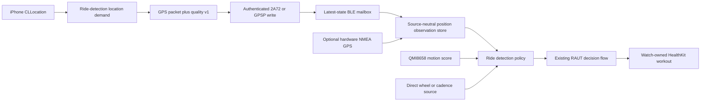

# iPhone GPS Ride Detection Integration Implementation Plan

## Outcome

Make the existing automatic ride detector use authenticated iPhone
Core Location samples as the pre-workout GPS source on Waveshare bike
computers.

With **Ride Start** set to **Ask to Start**, a connected bike computer will:

- ask the iPhone to maintain an appropriately fresh location stream while ride
  detection is armed;
- send location, speed, horizontal accuracy, and sample age over the existing
  authenticated GPS characteristic;
- combine that iPhone GPS evidence with the bike computer's onboard QMI8658
  motion evidence;
- hide the current `Detection limited` state once both sources are healthy;
- open the existing **Start Ride?** flow only after the versioned sustained
  cycling policy passes; and
- continue treating Apple Watch as the sole owner and recorder of the HealthKit
  workout.

The implementation must not invent an NMEA HDOP value from Core Location,
start a second workout, turn navigation on, or make a stale queued location
look fresh. Direct wheel/cadence evidence remains the higher-authority path
when it is genuinely available.

## Baseline

This plan was prepared from freshly fetched `origin/main` at
`343b752fca84101e23447c5387736196701355ea`.

Current `main` has the following relevant behavior:

1. `WAVESHARE_AMOLED_175` and `WAVESHARE_AMOLED_206` development profiles
   compile `RIDE_AUTOMATION_SHADOW` and `RIDE_AUTOMATION_INTERNAL_CONTROL`.
   Their production profiles deliberately omit the feature until physical
   acceptance gates pass.
2. `ride_automation_runtime.cpp` considers its sensor fallback degraded when
   neither fresh wheel/cadence nor a complete GPS-plus-IMU observation is
   available. After 15 seconds, a non-Off start mode exposes that state on Ride
   Stats.
3. The GPS-plus-IMU availability gate requires a fresh valid fix, speed, HDOP
   at or below `2.5`, and a fresh usable IMU motion score.
4. The detector reads only `currentGpsRideObservation()`. That snapshot is
   populated by the NeoGPS/NMEA path in `gps.cpp`.
5. The Waveshare profiles do not inherit `HAS_HARDWARE_GPS`, so they do not
   initialize the NMEA GPS task that populates that snapshot.
6. Authenticated iPhone GPS packets already arrive over `2A72` or the `GPSP`
   fallback. Firmware applies them to `gps.gpsData` for map and legacy Ride
   Stats presentation, but does not publish them to `GpsRideObservation`.
7. The existing 30-byte GPS packet carries latitude, longitude, send time,
   optional speed, altitude, distance, elapsed time, and route remaining. It
   does not carry Core Location fix validity, horizontal accuracy, or source
   sample age.
8. `NavigationEngine.processExternalLocation(_:)` already sends a GPS packet
   when a location update arrives, even when navigation is inactive. However,
   `CurrentLocationManager` requests continuous updates only for navigation,
   an actively viewed map, an active workout, or a device destination request.
   Merely arming ride detection does not currently keep location updates alive.
9. Wheel/cadence evidence currently comes from an active Watch workout. The
   future `CyclingMotionSource` boundary is not installed by any production
   adapter, so it cannot solve pre-workout start detection on current `main`.
10. The GPS characteristic is ownership-authenticated, delivered through a
    latest-state mailbox, and records BLE ingress time before the mailbox is
    drained. Those existing security and freshness boundaries should be reused.

The observed warning is therefore not evidence that the iPhone lacks a GPS
fix. It is caused by the missing bridge between the authenticated phone GPS
path and the detector, plus the absence of an idle ride-detection location
demand on iPhone.

## Product contract

### Source behavior

- When a compatible bike computer is authenticated and **Ride Start** is not
  **Off**, iPhone GPS is the normal pre-workout position source for current
  Waveshare hardware.
- The detector may use an iPhone sample only when the coordinate, speed,
  horizontal accuracy, and sample timestamp are explicitly valid and fresh.
- The onboard IMU remains mandatory for the GPS fallback. Phone GPS alone must
  never open a start prompt.
- IMU alone must never open a start prompt.
- Fresh direct wheel speed or cadence remains independent of phone GPS and can
  satisfy the direct-sensor path when issue #85 eventually supplies a real
  pre-workout adapter.
- Losing iPhone GPS, authentication, or the BLE writer lease invalidates the
  external position source; it must not stop, pause, resume, or start anything
  from retained coordinates.
- A valid zero speed and a valid zero motion score are healthy stopped
  observations, not missing data.

### Location and permission behavior

- Ride detection becomes a first-class reason for
  `CurrentLocationManager` to maintain location updates. It must not pretend
  that navigation or a workout is active.
- Continuous pre-workout location begins only while all of these are true:
  - an authenticated bike computer is connected;
  - the device advertises both ride automation and GPS-quality support;
  - the synchronized start mode is not **Off**; and
  - location permission permits updates in the current app state.
- Turning **Ride Start** off, disconnecting, losing authentication, losing the
  writer lease, or connecting to an incompatible device stops this location
  demand promptly unless navigation, map viewing, workout collection, or a
  destination request still needs it.
- The app may operate with When In Use permission while it is foregrounded.
  Reliable detection while the app is backgrounded requires Always permission
  and the existing location background mode.
- Never request Always permission from the background. Present the reason from
  a foreground settings/onboarding surface after the rider has elected to use
  ride detection.
- Existing installs whose stored/default mode is **Ask to Start** must receive
  a one-time explanation before high-accuracy background tracking is armed.
  Do not silently convert a historical default into a new continuous location
  behavior.
- Permission-denied or reduced-availability states remain fail-closed and are
  shown honestly; they must not be reported as a device sensor failure.

### UI behavior

- A healthy iPhone GPS plus healthy onboard IMU clears `Detection limited`
  without requiring navigation or an already-running workout.
- Sensor degradation is informational. It must not permanently cover the Ride
  Stats metrics with a full foreground panel.
- Start prompts, start-in-progress, pause/resume candidates, confirmations, and
  actionable errors may continue to use the automation panel.
- A prolonged unavailable-source state should use a compact status or settings
  diagnostic with reason-specific copy, for example:
  - `Open Bicino on iPhone for ride detection`;
  - `Allow precise location for ride detection`;
  - `Waiting for a more accurate location`;
  - `Motion sensor unavailable`; or
  - `Waiting for a cycling sensor`.
- Normal stationary behavior with healthy sensors must not be described as
  degraded.

### HealthKit and control behavior

- Apple Watch remains the only HealthKit workout owner and writer.
- The ESP32 remains the detector and decision authority because it combines
  phone position with device motion.
- The iPhone remains an authenticated transport and control bridge; supplying
  GPS evidence does not give it authority to declare a workout started,
  paused, or resumed.
- All existing RAUT generation, sequence, retry, acknowledgement,
  resynchronization, manual-precedence, and recovery rules remain unchanged.

## Decisions locked into this plan

1. Extend the existing authenticated `2A72`/`GPSP` packet. Do not add a second
   location characteristic or send location inside RAUT control frames.
2. Negotiate the quality extension through a new CAP2 feature bit and client
   version. Do not infer support from packet length alone on the sender.
3. Preserve the original 8-, 10-, 14-, and 30-byte GPS packet forms. Old apps
   and firmware remain map-compatible.
4. A legacy packet without explicit quality can update map/legacy stats but
   cannot refresh ride-detection evidence.
5. Represent source quality as horizontal uncertainty in metres. Do not divide
   Core Location accuracy by a constant and label the result `HDOP`.
6. Convert hardware NMEA HDOP to the same uncertainty model at the NMEA adapter
   boundary using the existing `HDOP * 5 m` estimate. This preserves current
   policy behavior while making the policy source-neutral.
7. Treat one position observation as an atomic sample. Never combine speed from
   one source with accuracy, coordinates, or timestamps from another.
8. Derive firmware freshness from authenticated BLE arrival time minus the
   sender-reported sample age. Do not trust wall-clock synchronization for
   monotonic policy timing.
9. Clear the BLE observation on disconnect, authentication reset, writer-lease
   transfer, and firmware session reset.
10. Bump the ride-detection profile and trace schema because source-quality
    semantics change. Preserve replay support for existing schema-1 traces.
11. Update the Watch direct GPS encoder to understand the same optional quality
    tail when it already sends a location. This prevents the shared `2A72`
    contract from diverging, but adding new always-on pre-workout Watch location
    collection is outside this iPhone-focused change.
12. Keep automatic start and the production firmware capability gated until
    real stationary, walking, transit, normal-ride, GPS-loss, and long-run
    physical traces pass on both supported boards.

## End-state data flow



The source-neutral store owns source selection and freshness. The policy sees
one coherent position observation plus IMU and direct-sensor observations; it
does not know Core Location, BLE, NeoGPS, or LVGL types.

## BLE protocol evolution

### Capability negotiation

Add:

- CAP2 feature bit `17`: `GPS_POSITION_QUALITY_V1_FEATURE`;
- capability client version `15` to request bit 17;
- iPhone `supportsGPSPositionQualityV1`; and
- Watch direct `supportsGPSPositionQualityV1`.

Firmware advertises bit 17 only when it can decode, validate, and publish the
quality tail. Ride automation remains separately controlled by bit 15. This
separation keeps the GPS contract useful for future position consumers without
claiming that production ride automation is enabled.

Update the CAP2 golden vectors and both iPhone and Watch capability decoders.
Disconnect and invalid-capability handling must reset the new support flag.

### GPS quality v1 tail

Append this six-byte optional tail to the existing 30-byte payload only after
bit 17 is negotiated:

| Offset | Field | Encoding |
| ---: | --- | --- |
| 30 | Quality schema | `UInt8`, value `1` |
| 31 | Flags | `UInt8`; bit 0 fix valid, bit 1 accuracy available; bits 2...7 zero |
| 32 | Horizontal accuracy | `UInt16LE` decimetres; `0xFFFF` unavailable |
| 34 | Sample age | `UInt16LE` milliseconds; `0xFFFF` unavailable |

The resulting packet is 36 bytes before ownership-v2 protection.

Sender rules:

- `fix valid` requires a valid coordinate, finite nonnegative horizontal
  accuracy, a finite timestamp, and a sample timestamp that is not materially
  in the future.
- Encode Core Location `horizontalAccuracy` directly in decimetres, rounded and
  clamped below the sentinel.
- Compute sample age when building the packet from `now - location.timestamp`.
  Small negative clock jitter may clamp to zero; a materially future timestamp
  invalidates the fix.
- Preserve the existing `0xFFFF` speed sentinel for unavailable or negative
  Core Location speed.
- Keep the current Unix-time field as sender time for RTC synchronization.
  Sample age, not Unix time, controls detector freshness.
- WGS-84 coordinate conversion must not replace the original Core Location
  accuracy or timestamp.

Firmware rules:

- Continue accepting legacy lengths exactly as today.
- Decode the v1 tail only when the full 36 bytes are present.
- Reject the quality tail for an unknown schema, non-zero reserved flags,
  inconsistent availability/sentinel combinations, invalid coordinates, or an
  impossible sample age.
- A malformed quality tail rejects the packet before it mutates either map or
  detector state. Do not partially apply its legacy prefix.
- A valid legacy packet updates map state but does not publish external
  detector evidence.
- The latest payload and its `ArrivalBatch.lastPacketMs` refer to the same
  mailbox value. Compute `capturedAtMs = lastPacketMs - sampleAgeMs` with
  wrap-safe bounded arithmetic.
- Authentication and owner-lease admission remain prerequisites. No new
  unauthenticated fast path is allowed.

Update `docs/ble-protocol.md` with the tail, negotiation matrix, exact golden
bytes, old/new peer behavior, and protected payload size.

## Firmware implementation

### 1. Introduce a source-neutral position observation

Replace the detector-facing HDOP-shaped model with a complete sample, for
example:

```cpp
enum class RidePositionSource : uint8_t {
  None = 0,
  HardwareNmea,
  AuthenticatedBle,
};

struct RidePositionObservation {
  RidePositionSource source = RidePositionSource::None;
  bool fixAvailable = false;
  bool fixValid = false;
  bool speedAvailable = false;
  float speedMetersPerSecond = 0.0F;
  bool locationAvailable = false;
  double latitude = 0.0;
  double longitude = 0.0;
  bool horizontalUncertaintyAvailable = false;
  float horizontalUncertaintyMeters = 0.0F;
  uint32_t capturedAtMs = 0;
};
```

Keep whole-source slots in a fixed-size, allocation-free store. Publish and
copy complete observations under one bounded synchronization boundary.

Selection requirements:

- discard stale or structurally invalid slots before selection;
- prefer a valid fresh sample over an invalid one;
- when multiple valid sources exist, prefer lower horizontal uncertainty, then
  the newer sample;
- use a small source stickiness margin if needed to prevent equal-quality
  sources from flapping every second;
- never merge fields across slots; and
- return no observation after all slots expire.

The current Waveshare path will normally select `AuthenticatedBle`. The design
still permits hardware GPS boards without baking phone-specific logic into the
policy.

### 2. Adapt NMEA without changing its parser contract

In `gps.cpp`, publish a hardware observation only from the fields valid in the
current NMEA fix:

- source = `HardwareNmea`;
- capture time = current parse time;
- fix validity = existing 2D/3D quality rule;
- speed and location availability = current NeoGPS validity bits; and
- horizontal uncertainty = `HDOP * 5 m` only when HDOP is valid and positive.

Do not retain an old speed, coordinate, or quality field as if it belonged to a
new fix. The presentation `gpsData` can retain its compatibility behavior; the
detector observation cannot.

### 3. Publish authenticated BLE observations

Extend `gps_position_protocol::Packet` with explicit quality fields and add a
pure conversion helper from a decoded packet plus BLE arrival time to
`RidePositionObservation`.

After `handleGpsPayload()` successfully decodes a quality-v1 packet:

1. apply the legacy fields to `gps.gpsData` as today;
2. validate and publish one `AuthenticatedBle` observation;
3. retain transport cadence metrics from every accepted packet; and
4. wake the ride-automation/UI scheduler without forcing navigation active.

Clear the BLE source from all disconnect/session teardown paths that clear
authenticated navigation state. Also clear it when device ownership changes,
because an observation from the previous writer must not survive a new lease.

### 4. Generalize policy quality semantics

Replace `gpsHdop` in `RideEvidenceObservation` with
`gpsHorizontalUncertaintyMeters`. Rename `maximumGpsHdop` to a source-neutral
profile limit.

To preserve the current initial policy envelope:

- start with `maximumGpsHorizontalUncertaintyMeters = 12.5F`, equivalent to the
  existing `2.5 * 5 m` estimate; and
- calculate the stationary radius as
  `max(8 m, 2 * horizontalUncertaintyMeters)`.

Do not tune this threshold merely to make a desk test turn green. Any change
from the equivalent baseline requires captured outdoor traces and an updated
profile version.

Bump the ride-detection profile from v1 to v2. The RAUT decision continues to
carry the profile version, keeping recovery and diagnostics attributable to
the policy that produced them.

### 5. Version trace and source-health diagnostics

Emit trace schema 2 with:

- selected position source;
- fix validity and sample age;
- GPS speed;
- horizontal uncertainty metres;
- IMU health/motion score;
- direct-sensor health; and
- the existing evidence, decision, and lifecycle fields.

The replay tool must:

- continue accepting schema-1 fixtures by converting valid HDOP to the old
  `HDOP * 5 m` uncertainty estimate;
- emit schema 2 for new captures;
- reject unknown schemas and invalid quality fields fail-closed; and
- scrub exact coordinates from ordinary diagnostic artifacts as it does today.

Replace the single `sensorFallbackDegraded` boolean with a small pure health
resolver that distinguishes at least:

- no external position observed;
- stale position;
- invalid/low-quality position;
- IMU unavailable/stale;
- direct cycling sensor unavailable; and
- healthy GPS-plus-IMU or direct-sensor evidence.

Keep this health resolver separate from the decision policy. Diagnostics and
copy must not change transition thresholds.

### 6. Make degraded UI non-blocking

Update `rideTelemetryScr.cpp` so only decision/action phases move the automation
panel to the foreground. A degraded source state should use a compact status
surface or a row in device ride-detection settings.

The UI should become hidden promptly after the health resolver reports fresh
iPhone GPS plus IMU. It should also remain hidden when Ride Start is Off.

## iPhone implementation

### 1. Add a ride-detection location demand

Extend `RideActivityPolicy` and `CurrentLocationManager` with an explicit
`isRideDetectionArmed` input. Do not overload `isNavigating` or
`isWorkoutActive`.

Derive the demand from synchronized runtime state:

```text
authenticated navigation-ready connection
AND CAP2 ride-automation support
AND CAP2 GPS-quality-v1 support
AND confirmed/local start mode is not Off
AND location consent is acknowledged
```

Create one coordinator/binding that observes BLE readiness/capabilities,
`RideDetectionSettingsStore`, and permission state, then calls
`CurrentLocationManager.setRideDetectionArmed(_:)`. Keep this decision out of
SwiftUI views.

Because `BikeComputerCoordinator` currently owns `CurrentLocationManager` while
`RideAutomationCoordinator` owns the settings store, inject the shared settings
store or a narrow demand publisher into the coordinator. Do not instantiate a
second settings store or location manager.

Update the location-demand truth table so navigation, visible map, workout,
destination refresh, and ride detection are independent reasons. Stopping one
reason must not stop updates required by another.

### 2. Use a detection-appropriate Core Location profile

The detector's three-second GPS freshness window is incompatible with relying
on a five-metre distance filter to emit stationary updates. Add an aggregated
tracking profile rather than scattering CLLocationManager mutations across
features.

When ride detection is armed:

- use `kCLLocationAccuracyBest` and precise location when available;
- use a distance filter/profile that yields frequent enough samples for the
  versioned detector freshness window, including while stationary;
- prevent automatic location pausing while background ride detection is
  explicitly active;
- keep `activityType = .fitness`; and
- restore the less demanding profile when no high-frequency consumer remains.

Core Location does not provide a guaranteed interval. Measure actual cadence
on physical iPhones and change firmware freshness only through a new calibrated
profile if the three-second window is unrealistic.

### 3. Permission and consent flow

Add ride-detection-specific explanatory copy to Settings/onboarding and update
both `Info.plist` and `Info.plist.template` so background location usage names
ride detection as well as navigation.

The flow is:

1. rider selects or confirms **Ask to Start** or **Start Automatically**;
2. app explains that the connected bike computer combines iPhone location with
   device motion and that background use requires Always permission;
3. request When In Use first if needed;
4. request Always only from the foreground after the first grant and explicit
   explanation; and
5. show foreground-only or unavailable status when the rider declines.

Persist only a consent/migration marker and settings state. Do not persist raw
location for detection.

### 4. Carry the original CLLocation quality to BLE

Refactor the send boundary so the packet builder receives:

- the WGS-84 coordinate that firmware should render;
- the original `CLLocation` speed, horizontal accuracy, and timestamp; and
- existing optional navigation/workout telemetry.

Add pure encoders for legacy and quality-v1 payloads. `BLEManager` chooses the
quality form only when the device advertises bit 17. Continue using the current
GPS coalescing key so queued positions remain latest-state rather than an
ordered backlog.

On reconnect/capability refresh, resend the newest still-usable CLLocation with
quality. Do not stamp a retained old sample as age zero.

### 5. Expose actionable status without leaking location

Publish a small ride-detection location status for Settings, such as:

- disabled;
- waiting for compatible device;
- permission needed;
- foreground only;
- waiting for precise location;
- sending; or
- stale.

Do not show coordinates, retain a location history, or send raw location to a
backend. Existing logs may report state transitions and bounded accuracy/age
buckets, but not latitude/longitude.

## Watch direct compatibility

The Watch already encodes 30-byte GPS packets when it owns live navigation or
has workout GPS. Update `WatchRidePacketEncoderV1` and capability negotiation so
those existing writes append quality v1 when supported.

Requirements:

- use `NavigationLocationSampleV1.horizontalAccuracyMeters` and timestamp;
- preserve the legacy 30-byte form for old firmware;
- use the same flags, units, age rules, and golden vectors as iPhone; and
- keep Watch and iPhone packet encoders behaviorally equivalent through shared
  tests or a shared source file where target membership permits.

This plan does not begin always-on Watch GPS before navigation or a workout.
If phone-free pre-workout start detection is required, plan and validate that
separately because it changes Watch location lifecycle, battery use, and
permission behavior.

## Expected file map

### Firmware

- `esp32/lib/ble_navigation/gps_position_protocol.hpp`
- `esp32/lib/ble_navigation/gps_input_freshness.hpp`
- `esp32/lib/ble_navigation/device_capabilities_protocol.hpp`
- `esp32/lib/ble_navigation/ble_navigation.cpp`
- `esp32/lib/gps/gps.cpp`
- `esp32/lib/gps/gps_ride_observation.hpp` or its source-neutral replacement
- `esp32/lib/ride_automation/ride_automation_runtime.cpp`
- `esp32/lib/ride_automation/ride_automation_policy.hpp`
- `esp32/lib/ride_automation/ride_detection_profile.hpp`
- `esp32/lib/ride_automation/ride_automation_trace.hpp`
- `esp32/lib/gui/src/rideTelemetryScr.cpp`
- focused host tests under `esp32/tools/tests/`

Prefer a new small `ride_position_observation.hpp/.cpp` under
`esp32/lib/ride_automation/` if keeping source-selection policy inside
`gps_ride_observation.hpp` would make the GPS library own BLE concerns.

### iPhone and shared Watch code

- `ios-app/BikeComputer/BikeComputer/Utilities/NavigationProtocol.swift`
- `ios-app/BikeComputer/BikeComputer/Managers/BLEManager.swift`
- `ios-app/BikeComputer/BikeComputer/Managers/NavigationEngine.swift`
- `ios-app/BikeComputer/BikeComputer/Managers/CurrentLocationManager.swift`
- `ios-app/BikeComputer/BikeComputer/Managers/BikeComputerCoordinator.swift`
- `ios-app/BikeComputer/BikeComputer/Managers/RideDetectionSettingsStore.swift`
- the app composition boundary in `BikeComputerApp.swift`/`ContentView.swift`
- `ios-app/BikeComputer/RideShared/WatchDirectBLEContract.swift`
- `ios-app/BikeComputer/BikeComputerWatch/Managers/WatchDeviceLink.swift`
- `ios-app/BikeComputer/BikeComputer/Info.plist`
- `ios-app/BikeComputer/BikeComputer/Info.plist.template`
- `ios-app/BikeComputerTests/NavigationProtocolTests.swift`
- `ios-app/BikeComputerTests/RideSharedTests.swift`

### Documentation

- `docs/ble-protocol.md`
- `docs/ride-automation-traces.md`
- `docs/plans/automatic-ride-detection-implementation-plan.md` with a short
  follow-up note pointing to this corrective integration
- `docs/releases/automatic-ride-detection.md` only when rollout gates pass

## Implementation sequence

### Phase 1: pure contracts and compatibility

1. Add quality-v1 packet types, flags, units, and pure encoders/decoders.
2. Add CAP2 bit 17/client version 15 on firmware, iPhone, and Watch.
3. Add legacy/new peer compatibility and exact-byte tests.
4. Update BLE protocol documentation.

Gate: all legacy GPS packet tests remain green, malformed v1 tails fail closed,
and no runtime uses phone GPS for decisions yet.

### Phase 2: source-neutral firmware observation

1. Add the atomic observation store and selector.
2. Adapt NMEA to publish uncertainty metres.
3. Publish authenticated quality-v1 BLE samples.
4. Clear external samples on every ownership/session teardown.
5. Convert policy/runtime quality checks to horizontal uncertainty and profile
   v2.
6. Version trace replay and source-health diagnostics.

Gate: host tests prove fresh phone samples become detector evidence, stale or
legacy samples do not, source fields never mix, and existing NMEA thresholds
remain equivalent.

### Phase 3: iPhone location lifecycle

1. Inject the shared settings/demand dependency into
   `BikeComputerCoordinator`.
2. Add ride detection to the location-demand and background truth tables.
3. Add consent and permission state.
4. Add the detection-appropriate Core Location profile.
5. Encode/send quality-v1 packets and preserve sample age across queueing and
   reconnect.
6. Update Watch encoder parity for its existing GPS writes.

Gate: simulator/host tests prove exact start/stop behavior for every combination
of connection, authentication, capability, setting, app activity, permission,
navigation, and workout state.

### Phase 4: UI and diagnostics

1. Replace the full-screen degraded overlay with non-blocking status.
2. Map source-health reasons to honest device/iPhone copy.
3. Ensure healthy stationary data clears degraded state.
4. Preserve current prompts, confirmations, and errors.

Gate: deterministic LVGL/state tests prove metrics stay visible and only
actionable automation phases take foreground priority.

### Phase 5: internal physical validation

Build only the internal development profiles first. Capture real traces and
complete the physical matrix below. Keep production capability bit 15 clear.

### Phase 6: production rollout

Only after all gates pass:

1. enable the complete detector capability in the intended production profiles;
2. retain server/app-side ability to normalize start mode back to Off/Ask;
3. stage rollout by app/firmware compatibility cohort;
4. monitor opt-in, permission, source-health, false-prompt, and failed-start
   rates without collecting coordinates; and
5. publish the release note with an explicit compatibility statement.

## Automated verification

### Firmware host tests

Add focused coverage for:

- 8-, 10-, 14-, and 30-byte legacy decoding unchanged;
- exact 36-byte v1 decoding;
- unknown schema and reserved flags;
- accuracy/age sentinels and inconsistent flags;
- invalid latitude/longitude, NaN/negative speed, and uncertainty boundaries;
- arrival time minus sample age, including `uint32_t` wrap;
- legacy packets never refreshing detector evidence;
- authenticated BLE source clear on disconnect/ownership transfer;
- hardware and BLE source selection without field mixing;
- valid zero speed and motion;
- stale GPS, stale IMU, inaccurate GPS, and healthy GPS-plus-IMU health states;
- profile-v1 trace conversion and profile-v2 replay; and
- Ride Stats degraded presentation remaining non-blocking.

Extend existing tests rather than creating a second test harness where
possible:

- `test_workout_telemetry_state.cpp` or a focused
  `test_gps_position_protocol.cpp`;
- `test_gps_input_freshness.cpp`;
- `test_ride_automation_policy.cpp`;
- `test_ride_trace_replay.py`;
- `test_device_capabilities_protocol.cpp`; and
- `test_firmware_profile_config.py`.

### iPhone and Watch tests

Cover:

- exact legacy and quality-v1 packet bytes;
- Core Location accuracy rounding/clamping and sample age;
- materially future/stale timestamps;
- coordinate conversion retaining original quality/timestamp;
- capability reset/reconnect and legacy fallback;
- GPS queue coalescing with the 36-byte payload plus authentication overhead;
- ride-detection location-demand truth table;
- independent navigation/workout/detection demands;
- When In Use foreground behavior;
- Always-permission background behavior;
- denial, reduced availability, disconnect, Off, and incompatible firmware;
- one-time consent migration for existing Ask-mode installs;
- resend retaining real sample age; and
- Watch encoder parity.

Run the repository's existing suites, including:

```sh
cd ios-app
./scripts/run-navigation-tests.sh
./scripts/run-ride-shared-tests.sh
./scripts/run-watch-online-navigation-tests.sh
./scripts/run-workout-contract-tests.sh
```

Run all existing ESP32 host tests and build both development and production
profiles through the tracked firmware wrapper:

```sh
cd esp32
python3 tools/build_firmware.py WAVESHARE_AMOLED_175
python3 tools/build_firmware.py WAVESHARE_AMOLED_206
python3 tools/build_firmware.py WAVESHARE_AMOLED_175_PRODUCTION
python3 tools/build_firmware.py WAVESHARE_AMOLED_206_PRODUCTION
```

Successful builds and host tests are not physical validation.

## Physical acceptance matrix

Do not flash either board without identifying the connected model and obtaining
the required explicit flash confirmation immediately before the write.

Use matching firmware, iPhone, and Watch builds from one exact clean SHA. Record
firmware build/upload provenance and confirm boot metadata after reset.

### Functional cases

Validate on both Waveshare 1.75 and 2.06:

1. **Healthy stationary:** authenticated iPhone, precise fresh location, and
   healthy IMU clear `Detection limited` without navigation or a workout.
2. **Normal ride:** sustained outdoor cycling opens exactly one Ask prompt at
   the profile-v2 threshold; acceptance starts exactly one Watch workout.
3. **Not Now:** dismissal applies the existing suppression contract and does
   not immediately reprompt from retained samples.
4. **Walking/handling:** walking with the device and ordinary desk/hand motion
   do not open a ride prompt.
5. **Vehicle/transit:** car, bus, and train GPS speed plus vibration do not
   create unacceptable false prompts; record every candidate trace.
6. **Urban accuracy:** poor horizontal accuracy freezes or rejects the
   candidate and recovers after accuracy improves.
7. **GPS loss/stale queue:** disabling location, entering a tunnel, force-
   quitting the app, and BLE backpressure invalidate evidence within the
   bounded freshness window.
8. **Disconnect/lease handoff:** phone disconnect and Watch/phone writer changes
   clear the prior external observation and recover only from a new authenticated
   quality sample.
9. **Background/locked iPhone:** Ask mode works with Always permission while the
   iPhone is locked and the app is backgrounded; the location indicator and
   Settings explanation match actual behavior.
10. **Permission denial:** foreground-only and denied states remain safe,
    actionable, and non-blocking on Ride Stats.
11. **Navigation coexistence:** starting/stopping navigation does not duplicate
    GPS sources, reset ride evidence incorrectly, or alter route/map freshness.
12. **Workout coexistence:** running/paused workouts preserve direct sensor,
    GPS/IMU pause/resume, manual precedence, and Watch confirmation semantics.
13. **Reboot/recovery:** ESP32 reset, iPhone relaunch, Watch relaunch, and RAUT
    resynchronization never revive stale GPS or duplicate a transition.

### Stability and power cases

- Measure iPhone battery impact for connected idle detection, a normal ride,
  and an eight-hour connected standby window.
- Measure ESP32 power/thermal impact from continuous IMU plus BLE GPS handling.
- Run a long ride/soak with BLE, touch/I2C, display, SD/map reads, audio, workout
  telemetry, navigation, and GPS-quality traffic active together.
- Confirm the latest-state GPS mailbox remains bounded during map rendering and
  transfers.
- Confirm no continuous degraded UI causes unnecessary full-screen AMOLED
  refreshes.
- Capture source-health and decision traces without retaining exact routes in
  review artifacts.

## Rollout and rollback

### Compatibility matrix

| iPhone/Watch | Firmware | Result |
| --- | --- | --- |
| Old | Old | Existing map/stats behavior |
| New | Old | Sender uses legacy 30-byte GPS; no phone-GPS ride detection |
| Old | New | Legacy GPS updates map; detector does not treat it as quality evidence |
| New | New, internal | Quality-v1 phone GPS may feed profile-v2 detection |
| New | New, production before gate | GPS quality may be understood, but RAUT bit 15/control stays off |

### Rollback controls

- Turning **Ride Start** Off immediately stops the detection-specific iPhone
  location demand and hides degraded detector UI.
- Clearing CAP2 bit 17 makes new clients return to legacy GPS packets without
  breaking maps.
- Clearing RAUT bit 15 or using production profiles without internal control
  disables automatic decisions while retaining navigation/workout behavior.
- Profile v2 can be disabled as one complete unit; do not mix its uncertainty
  semantics with v1 trace/profile identifiers.
- A rollback must not delete the rider's Watch workout or alter manual workout
  controls.

## Acceptance criteria

Implementation is complete only when all of the following are true:

- [ ] A compatible authenticated iPhone connection with Ride Start enabled
      becomes an explicit location-tracking demand.
- [ ] The iPhone sends quality-v1 GPS with coordinate, speed, horizontal
      accuracy, and honest sample age.
- [ ] Firmware publishes only authenticated, valid, fresh quality-v1 packets to
      the ride detector.
- [ ] Legacy GPS packets remain map-compatible and cannot masquerade as
      detector-quality fixes.
- [ ] Core Location accuracy is represented in metres, never as fabricated
      HDOP.
- [ ] Hardware NMEA and BLE observations remain atomic and source-isolated.
- [ ] Disconnect, authentication loss, lease transfer, Off, and stale samples
      fail closed.
- [ ] Healthy stationary iPhone GPS plus device IMU clears the current warning.
- [ ] Ride Stats remain readable during non-actionable source degradation.
- [ ] Ask, Not Now, start confirmation, auto-pause/resume, manual precedence,
      and Watch-owned HealthKit behavior remain intact.
- [ ] iPhone/Watch/firmware compatibility and malformed-packet tests pass.
- [ ] Both development and production profiles build through the locked
      repository runtime.
- [ ] The full physical false-start, loss/recovery, coexistence, power, and soak
      matrix passes on both Waveshare boards.
- [ ] Production RAUT capability remains gated until those physical results are
      recorded against the exact release SHA.
