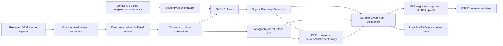

# Issue #190: Topographic Map Support Implementation Plan

## Planning snapshot

- Issue: [#190 — Add topographic map support to the device and iOS MapKit](https://github.com/seichris/open-bike-computer/issues/190)
- Baseline: GitHub `origin/main` at `ce3c5a0cfa1c5bdd428197e71a15d3d3d7973157`, fetched 2026-09-12
- Previous baseline: `9ef7f09fce0e0d95e349e6ef9c54da137fcff286` (2026-08-31)
- Planning branch: `plan/issue-190-topographic-maps`
- Plan PR: [#374](https://github.com/seichris/open-bike-computer/pull/374)
- Architecture refresh: 2026-09-12; the branch includes the baseline above
- Provider research date: 2026-08-31; this code-integration refresh does not renew the source terms/access reviews
- Status: implementation plan only; the PR changes documentation, with no topography implementation or enablement

## Outcome

Add an optional, genuinely topographic layer to both Bicino map surfaces:

- **ESP32:** offline contour lines stored in the selected map pack and rendered beneath roads, labels, routes, markers, and maneuver guidance;
- **iPhone:** matching contour styling over Apple MapKit, backed by a Bicino-owned offline companion asset for the same selected area; and
- **map platform:** deterministic elevation-source selection, preprocessing, attribution, packaging, compatibility, and rollout rather than a dependency on a public tile server.

The first production version should ship **contours only**. Hillshade remains a separately versioned follow-up after storage, SD I/O, render-time, power, and route-contrast measurements prove it fits both Waveshare targets. The source pipeline should be designed for hillshade from the beginning, but an unmeasured raster layer must not hold back the useful vector layer or destabilize navigation rendering.

This is a durable offline-map capability, not a screenshot or web-tile experiment. It must work for rectangle, polygon, and route-corridor map selections; preserve all existing FMB v1-v4 maps; remain independently switchable on the device and iPhone; and expose the exact data provenance and attribution of every generated map.

## Executive recommendation

1. Use raw, version-pinned elevation rasters, not a third-party rendered topographic tile service.
2. Use **Copernicus DEM GLO-30** as the initial worldwide baseline. Prefer reviewed regional bare-earth DTMs where they provide materially better data and fall back to the global source across gaps.
3. Generate a single canonical contour intermediate per map job, then encode it separately for the ESP32 and iPhone. This makes the two surfaces visually consistent without forcing either client to consume the other's binary format.
4. Assign **renderer format 4 / FMB v5** to the first contour-capable device artifact. Keep Bike Map Stream v1 and canonical manifest schema v1; both are already extensible.
5. Produce a separate, content-addressed `topography-ios-v1` companion asset for MapKit. Do not send iPhone raster tiles to the ESP32.
6. Treat “Offline Topographic Maps” as a good premium candidate because generation, storage, source operations, and delivery create continuing cost. Keep the firmware decoder and renderer universal; gate new premium generation/download at the app and backend, never with a firmware lock or a local boolean.
7. Keep Apple's existing **3D Terrain** setting free and distinct. It selects MapKit's realistic elevation presentation; it is not a contour map and it cannot provide the device's offline layer.

## Current-main baseline

Renderer formats 1, 2, and 3 still cover legacy vectors, street labels, and street labels plus 3D buildings. FMB v3 has extension sections 1-3; FMB v4 requires section 4 for buildings. Current generation policy, promotion, and app readers still support only renderer formats 1-3. Renderer format 4 / FMB v5, the elevation registry, contours, and the iPhone companion remain proposed work.

The following changes since the original plan affect implementation directly. These are findings from the recorded source revision and checked-in configuration, not fresh deployment or physical-device verification.

| Area | Current implementation / evidence | Consequence for this feature |
| --- | --- | --- |
| OSM acquisition | [Source cache](../../map-platform/backend/map_platform/source_cache.py), [provider transport](../../map-platform/backend/map_platform/source_http.py), and [OSM.fr fallback contract](../osm-source-fallback.md); #396, #412, #416, #425 | Preserve resumable, checksum-verified acquisition and actual source URL/snapshot provenance. OSM.fr is an OSM/PBF availability fallback, not an elevation provider. |
| Shared map library | [Catalog](../../map-platform/catalog/src/catalog.ts), [reader validation](../../map-platform/catalog/src/validation.ts), and [production Compose lock](../../map-platform/deploy/compose.yaml); #317, #405, #410, #417 | R2/D1 publication, grants, sharing, retention, generation classes, and development/production visibility already exist. Extend these contracts to companion assets. |
| Automatic promotion | [Scheduler](../../map-platform/backend/map_platform/automatic_promotion.py), [converter](../../map-platform/backend/map_platform/catalog_promotion.py), and [promotion image contract](../../map-platform/deploy/promotion/README.md); #411, #413, #414, #425 | Development ZIPs can be discovered and converted to production-signed streams. Target 4 needs an explicit eligibility gate and companion promotion before this path accepts it. |
| Durable map lifecycle | [OfflineMapManager](../../ios-app/BikeComputer/BikeComputer/Managers/OfflineMapManager.swift), [JobStore](../../map-platform/backend/map_platform/jobs.py), and [#425 integration](../reviews/pr-425-integration-2026-09-08.md) | Reuse durable background downloads, attempt ownership, Application Support storage, replacement journals, and backend publication intents. Add companion-specific identity and recovery tests. |
| MapKit route ownership | [MapView](../../ios-app/BikeComputer/BikeComputer/Views/MapView.swift) and [SavedRouteMapPolicy](../../ios-app/BikeComputer/BikeComputer/Utilities/SavedRouteMapPolicy.swift); #429 | Route updates already remove only owned overlays. Integrate terrain with calculated routes, alternatives, saved-route previews, offline area selection, and the existing camera policy. |
| Firmware camera | [Stable camera contract](../map-stable-camera.md) and [mapCamera.hpp](../../esp32/lib/maps/src/mapCamera.hpp); #407 | Development profiles use accepted-camera projection and reusable decoded scenes; production still uses the legacy path. Contours must support both without implicitly enabling the new camera in production. |
| Render/storage ownership | [Render scheduler](../firmware-map-render-scheduler.md), [MapRenderJob](../../esp32/lib/maps/src/mapRenderJob.hpp), and [runtime integration](../reviews/pr-424-integration-2026-09-08.md); #424 | Rendering, map-root probing, and activation share the existing worker. Position updates coalesce; semantic changes cancel. Contours must not introduce starvation or a second SD/cache owner. |
| Benchmark and release evidence | [Renderer benchmark](../renderer-benchmark.md), [gate file](../../esp32/tools/renderer_benchmark_gates.json), and [factory qualification](../firmware-factory-release.md); #344, #368-#373, #384, #400, #401, #438 | Extend window-scoped diagnostics and existing memory/DMA/crypto gates. Qualify both boards and record the actual profile; production boot acceptance uses authenticated evidence rather than diagnostic serial output. |
| BLE negotiation | [Generated ride contract](../../protocol/ride-ble-contract-v1.json), [capabilities](../../esp32/lib/ble_navigation/device_capabilities_protocol.hpp), and [visibility normalization](../../esp32/lib/ble_navigation/map_profile_protocol.hpp) | Client version is now 23, with CAP2 feature bits 0-25 allocated. New capability allocation must preserve these and stay distinct from the map-visibility mask. |

MapKit already offers Standard, Satellite, Hybrid, and realistic elevation presentation. Its delegate still treats `MKPolyline` overlays as route content, including separate saved-route/alternative styling. Add a dedicated tile-overlay renderer while retaining those identities, ordering, hit testing, and camera behavior. The original blanket-overlay-removal finding is resolved by #429 and is no longer implementation work.

All feature phases below remain planned. Merged infrastructure does not mean any part of topographic generation or rendering has shipped. Provider choices and the optional premium boundary remain unchanged pending the dated source reviews and product decisions below.

## What “topographic” means here

The terms are deliberately separated:

| Term | Meaning in this plan |
| --- | --- |
| DEM | Generic gridded elevation input. Each source is also classified as DSM, DTM, or hybrid. |
| DSM | Surface heights that may include trees and buildings. Copernicus GLO-30 and ALOS AW3D30 are DSMs. |
| DTM | Bare-earth terrain with buildings and vegetation removed. Reviewed regional DTMs are preferred where available. |
| Contours | Backend-derived lines at fixed elevation intervals. This is the v1 device and iPhone layer. |
| Hillshade | Backend-derived illumination raster. It is not in the first renderer format. |
| Apple 3D Terrain | MapKit's realistic elevation presentation. It remains a separate iPhone-only appearance option. |

The UI must not call Apple's existing realistic elevation setting “topographic maps.” Conversely, a contour-capable Bicino map does not promise surveyed bare-earth precision when its source is a 30 m DSM. The saved-map details screen should show a simple quality label and the exact sources behind it.

## Elevation-provider research

### Eligibility gate

A source adapter is production-eligible only after a checked-in review proves all of the following:

1. commercial use, modification, and distribution of derived contours are allowed;
2. required attribution and disclaimers can be shown in the app, archive, catalog, and shared-map page;
3. bulk or automated acquisition is permitted, or an operator can lawfully stage a pinned release in Bicino-controlled storage;
4. coverage can be represented by a versioned machine-readable polygon, including gaps and exclusions;
5. release/version, checksum, horizontal CRS, vertical datum, units, no-data encoding, and DSM/DTM classification are known;
6. access does not depend on an anonymous public tile server or a request-time provider call for each user job;
7. the source can be retained long enough to reproduce a published map; and
8. the legal/operational review records the date and exact terms URL rather than relying on a provider name alone.

“Free to view” is not enough. A source may be technically excellent but remain disabled until its automation and redistribution rights are explicit.

### Recommended source registry

This table is the research shortlist, not final legal approval. “Initial” means the adapter is worth implementing first; “candidate” means it should remain disabled until its terms, access method, and representative tiles pass the gate above.

| Coverage | Source | Terrain model / nominal grid | Terms and access finding | Recommendation |
| --- | --- | --- | --- | --- |
| Worldwide land | [Copernicus DEM GLO-30](https://dataspace.copernicus.eu/explore-data/data-collections/copernicus-contributing-missions/collections-description/COP-DEM) | DSM, 30 m | Worldwide free license; the [GLO-30 license](https://documentation.dataspace.copernicus.eu/APIs/SentinelHub/Data/DEM/resources/license/License-COPDEM-30.pdf) permits reproduction, distribution, communication, and adaptation with exact notices. Registered bulk access is available. | **Initial global baseline.** Stage one immutable release and its quality masks in Bicino-controlled object storage. |
| Worldwide, with release-map exceptions | [JAXA ALOS AW3D30](https://www.eorc.jaxa.jp/ALOS/en/dataset/aw3d30/aw3d30_e) | DSM, about 30 m | Commercial and non-commercial use is free; [JAXA's research-data terms](https://earth.jaxa.jp/en/data/policy/) allow modification/distribution but require attribution and advance notification for commercial use. Registration is required, and current coverage combines versions. | Candidate secondary global source after commercial-use notification and automated-release ingestion are recorded. |
| About 60°N to 54°S | [NASA/USGS SRTM 1 arc-second](https://www.usgs.gov/centers/eros/science/usgs-eros-archive-digital-elevation-srtm-coverage-maps) | Radar surface model, about 30 m | US public-domain data with broad mid-latitude coverage. | Last-resort gap/regression fallback, not the default where newer global or regional data exists. |
| United States and territories | [USGS 3DEP](https://www.usgs.gov/3d-elevation-program/about-3dep-products-services) | Bare-earth DEM; about 10 m nationwide, finer products where available | Products are free of charge and without use restrictions; fine-resolution coverage is heterogeneous. | **Initial regional override.** Start with the uniform 1/3 arc-second layer, then add reviewed higher-resolution coverage polygons. |
| Canada | [NRCan HRDEM](https://open.canada.ca/data/dataset/957782bf-847c-4644-a757-e383c0057995) | LiDAR-derived DTM/DSM, typically 1-2 m, partial coverage | Open Government Licence permits commercial reuse with attribution. Coverage is incomplete. [Legacy CDEM](https://open.canada.ca/data/en/dataset/7f245e4d-76c2-4caa-951a-45d1d2051333) is explicitly no longer supported. | Regional override inside current HRDEM coverage; Copernicus elsewhere. |
| England | [Environment Agency LiDAR Composite DTM 1 m](https://www.data.gov.uk/dataset/01b3ee39-da3f-47b6-83da-dc98e73a461f/lidar-composite-digital-terrain-model-dtm-1m) | Bare-earth DTM, 1 m, about 99% of England | Open Government Licence. | **Initial regional override.** Do not label this “United Kingdom”; Scotland, Wales, and Northern Ireland need separate adapters or the global fallback. |
| France | [IGN RGE ALTI](https://geoservices.ign.fr/rgealti) | DTM, 1 m / 5 m products | Reuse under France's [Etalab Open Licence 2.0](https://www.data.gouv.fr/pages/legal/licences/etalab-2.0), including commercial reuse with attribution. | **Initial regional override** after the bulk-download adapter pins the exact product edition. |
| Spain | [CNIG MDT05](https://centrodedescargas.cnig.es/CentroDescargas/novedades?codSerie=MDT05) | Bare-earth DTM, 5 m COG | IGN/CNIG says lawful commercial publication is free with attribution, and its [data policy](https://www.ign.es/web/politica-datos) is compatible with CC BY 4.0. | Strong regional candidate. |
| Denmark | [Danmarks Højdemodel (DHM)](https://dataforsyningen.dk/asset/PDF/produkt_dokumentation/dhm-prodspec-v1.0.0.pdf) | Nationwide LiDAR-derived elevation products | Denmark's [free-geodata terms](https://sdfe.dk/media/2916594/vilkaar-for-brug-af-frie-geografiske-data_2016.pdf) permit copying, modification, distribution, and commercial use with source/date attribution. | Strong regional candidate after the current download/API contract is verified. |
| Mainland Norway | [Kartverket DTM 10](https://register.geonorge.no/register/versjoner/produktspesifikasjoner/kartverket/dtm-10-terrengmodell) | Bare-earth DTM, 10 m | Official product material reports mainland coverage and no stated use restrictions; newer detailed elevation access mixes open and restricted datasets. | Use the explicit open DTM 10 product first. Do not ingest every layer exposed by the high-resolution portal. |
| Finland | [National Land Survey Elevation Model 10 m](https://www.maanmittauslaitos.fi/en/maps-and-spatial-data/datasets-and-interfaces/product-descriptions/elevation-model-10-m) | DTM, 10 m; 2 m where separately covered | CC BY 4.0 with attribution. | Strong regional candidate; keep 10 m and 2 m coverage/version policies separate. |
| Switzerland | [swissALTI3D](https://www.swisstopo.admin.ch/en/height-model-swissalti3d) | Bare-earth DTM, 0.5 m / 2 m | [Free-geodata terms](https://www.swisstopo.admin.ch/en/terms-of-use-free-geodata-and-geoservices) allow commercial use with attribution. | Strong regional candidate. |
| Netherlands | [Actueel Hoogtebestand Nederland](https://www.ahn.nl/open-data) | LiDAR terrain/surface rasters, 0.5 m / 5 m products | Official portal describes the raster and point-cloud data as freely reusable without restrictions. | Strong regional candidate after the precise raster product and attribution text are pinned. |
| New Zealand | [LINZ national elevation data](https://www.linz.govt.nz/products-services/data/types-linz-data/elevation-data/access-elevation-data) | National 1 m DEM plus source collections | Free bulk/open-data access. LINZ's [licensing guidance](https://www.linz.govt.nz/products-services/data/licensing-and-using-data) allows commercial reuse but warns that elevation attribution can differ by underlying supplier. | Strong regional candidate; preserve per-tile supplier attribution rather than reducing it to “LINZ.” |
| Australia | [Geoscience Australia elevation data](https://www.ga.gov.au/scientific-topics/national-location-information/digital-elevation-data) | National processed 1-second DEM plus partial 5 m LiDAR-derived DTM | The current [national 1-second service metadata](https://services.ga.gov.au/gis/rest/services/DEM_SRTM_1Second_2024/MapServer) uses CC BY 4.0; high-resolution coverage is partial and source-specific. | Candidate regional source. Prefer reviewed 5 m coverage; use the current 30 m product only where it materially improves the global baseline. |
| Arctic land north of 60°N | [ArcticDEM](https://www.pgc.umn.edu/guides/stereo-derived-elevation-models/pgc-dem-products-arcticdem-rema-and-earthdem/) | High-resolution DSM mosaics | CC BY 4.0 generally, with release/area caveats including restricted newer Alaska inputs. | Research candidate, not an automatic polar override. Enable only exact cleared mosaic releases. |

For Singapore, mainland China, Hong Kong, Japan, most of Africa, South America, and Asian regions without an approved national adapter, the initial source policy uses the global baseline. That is a source-coverage statement, not yet a release promise: the iPhone overlay still needs geography-specific MapKit alignment and local-law gates, especially in mainland China.

### Inputs explicitly not used

- **Geofabrik as an elevation raster.** Geofabrik publishes raw OpenStreetMap extracts such as `.osm.pbf`; its [technical description](https://download.geofabrik.de/technical.html) describes pure OSM data. Sparse OSM `ele=*` tags are useful features but cannot form a continuous terrain surface. Geofabrik remains the vector-map source alongside a separate DEM source.
- **OpenStreetMap's public raster/vector tiles.** The [raster tile policy](https://operations.osmfoundation.org/policies/tiles/) prohibits bulk/offline downloading. These servers are not a map-pack backend.
- **Public OpenTopoMap tiles.** A rendered community service does not provide an offline redistribution SLA. Its style can be studied separately, but production must derive and host Bicino's own artifacts.
- **FABDEM under its public license.** [FABDEM v1.2](https://research-information.bris.ac.uk/en/datasets/fabdem-v1-2/) is CC BY-NC-SA and therefore unsuitable for a commercial/premium path without a separate license.
- **Apple map or terrain export.** MapKit remains the iPhone base map. No Apple map bytes are copied into the ESP32 pack or Bicino's offline companion asset.
- **Request-time point-elevation APIs.** They are slow, hard to reproduce, hard to attribute per pack, and inappropriate for contour generation.

## Deterministic source policy

Add `map-platform/config/topography-source-policy-v1.json` as the only production source registry. Each entry contains:

```text
id
enabled
priority
coverageGeometrySha256
datasetRelease
tileIndexSha256
horizontalCrs
verticalDatum
verticalUnits
surfaceModel             # dtm, dsm, or hybrid
nominalResolutionMm
noDataPolicy
downloadAdapter
upstreamTermsUrl
termsReviewedAt
commercialUseAllowed
derivedRedistributionAllowed
bulkAccessAllowed
attributionTemplate
disclaimerTemplate
operatorPrerequisites    # account, accepted license, notification, etc.
```

Selection is server-owned. The client asks for a topography profile, never for “Copernicus” or “USGS.” For the buffered requested geometry, the resolver:

1. intersects enabled source coverage polygons;
2. uses the highest-priority reviewed bare-earth source where it has valid pixels;
3. fills uncovered or invalid pixels from the global baseline;
4. may use a secondary global source only when its exact release is enabled;
5. normalizes all inputs into the job's working horizontal CRS and one declared vertical datum;
6. emits source coverage in integer millionths so the canonical manifest needs no JSON floating point; and
7. fails the job if unresolved no-data exceeds the profile ceiling or if any contributing source lacks current terms/provenance.

One map pack uses one contour interval policy across its full geometry. A high-detail tile beside a global tile must not create a visible density seam or imply false precision. If a job mixes source qualities, the profile uses the coarsest interval supported by every contributing source.

Source rasters are fetched into a checksum-addressed, read-only elevation cache before jobs use them. User jobs never receive provider credentials and never make arbitrary upstream URLs. The downloader uses a fixed host allowlist, bounded raster dimensions, compressed/uncompressed byte limits, timeouts, checksum verification, and atomic publish into the cache.

Reuse the resource, locking, cancellation, and atomic-publication patterns of `SourceCache`; give DEM adapters their own exact provider-origin policy. `source_http.py` is deliberately restricted to Geofabrik/OSM.fr and must not gain a generic arbitrary-URL escape hatch. Validate the initial URL and every redirect, and keep resume bytes and HTTP validators scoped to the same immutable provider object.

The OSM side keeps its existing fallback eligibility: pinned snapshots do not switch providers, and an unpinned Geofabrik latest extract may use one researched OSM.fr candidate after an eligible availability failure. Matching region names do not prove identical coverage or data. Bind the actual PBF checksum and provenance into the combined build, preserve source-boundary checks, and resolve elevation coverage independently of whichever OSM host supplied the bytes.

## Product contract

### Map creation

Offline map creation gains a detail choice:

```text
Map detail
○ Standard
● Topographic contours                         Premium
  Adds offline terrain contours on iPhone and Bicino.
```

- Standard continues to request renderer format 3.
- Topographic requests renderer format 4 and the `topographic-contours-v1` profile.
- Existing maps never upgrade silently; users regenerate an area to add contours.
- The UI shows the estimated device and iPhone companion sizes before submission.
- A provider picker is intentionally absent. Saved-map details show quality and attribution after generation.
- If the connected firmware cannot read format 4, the UI explains the required firmware update before creating the pack.

The first profile has two backend-selected data-quality modes:

- `standard-20m-v1`: 20 m minor contours and 100 m index contours for 30 m-class global DSM input;
- `detail-10m-v1`: 10 m minor contours and 50 m index contours for a reviewed regional DTM whose resolution and vertical accuracy support it.

The mode is recorded in the manifest. It is not chosen by marketing geography or by a client-side guess. A profile change requires a new version and build identity.

### iPhone controls

Keep these as independent settings:

```text
Map Style
Standard / Satellite / Hybrid
3D Terrain                                      On
Topographic Contours                            On
```

`3D Terrain` continues to control MapKit's `.realistic`/`.flat` elevation style. Apple's documentation describes [`ElevationStyle.realistic`](https://developer.apple.com/documentation/mapkit/mkmapconfiguration/elevationstyle-swift.enum/realistic) as realistic ground contours, but it does not add Bicino contour lines or offline device data.

`Topographic Contours` appears when a healthy, downloaded companion asset covers the current map area. If multiple saved topographic maps overlap, select the newest compatible asset by immutable creation/release metadata, not filesystem order. Outside its bounds, the overlay is transparent.

### Device controls

Propose `MAP_VISIBILITY_CONTOURS` at map-visibility bit 13 for both Map and Map + Navigation profiles; bits 13-14 are still unallocated in that mask at the recorded baseline. Reserve visibility bit 14 for a later hillshade contract; it remains zero and hidden until that contract exists. This is a different namespace from CAP2 capability bits: CAP2 bit 13 is already GPS-heading support.

Extend `normalizedFeatureVisibilityMask`, effective feature masks, render-job identity, persistence/migration, and iOS mask serialization together so bit 13 is not silently stripped. Preserve the bit-12 extended-visibility marker and current service-road/track compatibility behavior. Recheck allocations before implementing against a later main.

Under the existing **Places & Terrain** settings group, show:

```text
Contours                                         On
Show elevation contours when the active map includes them.
```

The toggle is capability- and active-map-gated. It can remain persisted while an older map is active, but the UI explains why no contours are drawn. There is no contour-interval control on the device.

## Premium recommendation

The app/backend/catalog source at this baseline still has no StoreKit, RevenueCat, subscription, or purchase-entitlement implementation. Existing App Attest, library credentials, and Keychain entitlements are separate from purchase authorization. Monetization remains a product track, not a boolean added to the map request.

Recommended boundary:

- keep Standard maps and Apple's existing 3D Terrain option free;
- sell **Offline Topographic Maps** as access to new contour-map generation and iPhone companion downloads;
- keep format-4 decoding, transfer, and rendering available in every firmware build;
- allow already installed device maps and already downloaded iPhone companions to keep working offline after entitlement expiry;
- require an active entitlement for a new generation or a fresh companion download; and
- charge for Bicino's processing/storage/delivery service, never imply ownership of the underlying public data.

If enabled, use StoreKit 2 and a backend-verified App Store transaction/entitlement. App Attest proves an app installation, not a purchase. The backend authorizes job submission, and the shared catalog must also enforce entitlement when granting/resolving a companion download or a claimed shared map; API-only checks would leave an independent delivery path. A client-only `isPremium` value is not authoritative. Recheck the applicable storefront rules in Apple's [App Review Guidelines](https://developer.apple.com/app-store/review/guidelines/) when specifying the purchase flow.

The premium track also needs restore purchases, Family Sharing policy, grace-period behavior, refund/revocation handling, App Store Server Notifications, review credentials/demo content, privacy disclosures, and localized paywall copy. None of those concerns should leak into the FMB decoder.

If the product decision is to launch contours for free, the same architecture remains valid: the entitlement policy returns allowed for every eligible installation and the premium UI is omitted.

## Target architecture



The contour intermediate is job-local and not a public artifact. It records elevation, index/minor classification, source-quality flags, and unclipped line geometry in the normalized working CRS. Both encoders consume those exact lines, style/profile version, and source receipt.

The diagram shows generation and consumption. The existing production promotion path separately validates the development ZIP, converts/signs its device bytes, and publishes through the same catalog. Extend that path to verify and copy the matching companion by receipt; promotion must not rerun DEM acquisition or contour generation.

## Job and generation-profile contract

Extend a normalized job request with:

```json
{
  "target": {
    "renderer": "esp32-fmb",
    "rendererFormatVersion": 4
  },
  "topography": {
    "profileVersion": 1,
    "layers": ["contours"],
    "sourcePolicyVersion": 1
  }
}
```

Unknown keys, layer orders, profile versions, or client-supplied source IDs fail closed. Renderer format 4 requires this exact object; formats 1-3 reject it.

First version the generation-policy contract. `GenerationProfilePolicy.load` currently accepts schema 1 only, requires exactly formats `{1, 2, 3}`, and requires every profile to appear in each channel's global or canary list. Merely appending target 4 to the JSON would prevent startup.

Introduce `generation-profile-policy-v2.json` and an explicit `disabledProfiles` channel list. Global, canary, and disabled lists must be disjoint and together contain every declared profile. Continue accepting the unchanged v1 policy for older deployments. Initially put target 4 in both channels' disabled lists; after reader and gate work, move it to development canary while production stays explicitly disabled. Update startup validation, health policy hashes, image/config packaging, and capability tests together.

The proposed new profile is:

```json
{
  "id": "topographic-contours-v1",
  "rendererFormatVersion": 4,
  "features": ["3d-buildings", "contours", "street-labels"]
}
```

Use the sorted new feature set in manifests/catalog reader requirements. Preserve existing format-1/2/3 policy identities and behavior; do not reorder old configuration merely to add this profile. Development canary membership is an explicit installation allowlist. Reader support, generation eligibility, production promotion, and catalog delivery are separate gates; adding support to one must not enable the others.

The build exact key and compatibility key must add:

- topography request/profile version;
- selected contour-quality mode and interval values;
- source-policy file hash;
- ordered contributing source IDs, releases, tile checksums, and coverage millionths;
- normalization CRS/vertical datum and transformation-grid hashes;
- smoothing, void-fill, contour, clipping, simplification, and tile-renderer versions; and
- iPhone companion encoder version.

A source release, terms-approved source set, datum transform, or algorithm change must never reuse stale bytes.

Keep the catalog's `mapEntryId`/`contentReceipt` and compatibility-class identities authoritative. The legacy display/map-folder ID is not sufficient to distinguish Standard and topographic artifacts. Extend both generated and promoted artifact validation, including `catalog_promotion.py`, catalog publication validation, `OfflineMapReaderCompatibilityPolicy`, and signed-manifest-derived reader requirements in `BikeMapStreamFormat.swift`; those paths independently recognize formats 1-3 today.

## Terrain preprocessing

Add an additive terrain stage around the existing extraction pipeline rather than pretending DEM acquisition is OSM extraction:

1. Expand the user geometry by a profile-defined source and contour buffer.
2. Resolve and stage every required DEM tile before starting expensive vector extraction.
3. Verify CRS, datum, units, dimensions, coverage, and checksum against the source registry.
4. Reproject and mosaic onto a deterministic grid aligned to the full map, not independently per FMB block.
5. Normalize vertical datum with pinned PROJ grids. Reject an unknown or silently missing transform.
6. Apply profile-versioned water flattening, spike/noise filtering, and DSM smoothing. Record the algorithm and parameters.
7. Generate contours over the buffered mosaic.
8. Simplify consistently in projected metres before block clipping.
9. Clip to the requested polygon/corridor and then to FMB blocks using a canonical half-open ownership rule.
10. Deduplicate coincident boundary segments and verify matching endpoints across adjacent blocks.
11. Produce source/no-data/contour density statistics and the canonical intermediate receipt.
12. Delete job scratch data after artifacts and receipts are durably published; retain only the approved source cache and normal build evidence.

Generating contours independently inside each 4,096 m device block is forbidden because it creates edge discontinuities. Likewise, interval selection is map-wide, not block-wide.

Give each expensive terrain subprocess an explicit `CommandExecutionPolicy`, with bounded output, progress, wall/idle limits appropriate to that stage, and cancellation. Current building calibration has a separate policy because it can be quiet for long periods. Contour generation must not accidentally inherit source-index or building-calibration timing, nor weaken the existing generic-geometry failure isolation and retry rules.

## Device byte contract

### Renderer format 4 / FMB v5

FMB v5 retains all FMB v4 bytes and canonical extension sections 1-4 unchanged. It adds required critical section type 5 under a new directory magic. Section 5 is present even for a valid zero-contour block and contains a non-empty header.

The section contract includes:

- section/profile version;
- minor and index intervals in metres;
- contour record count and total point count;
- per-record signed elevation metres;
- flags for index/minor and source/no-data boundary quality;
- a bounded point count; and
- delta-encoded signed block-local coordinates using the existing map quantization.

All fields are fixed-width little-endian. Reserved bits/bytes must be zero. The encoder and readers enforce checked arithmetic, exact section length, canonical record ordering, maximum contours, maximum points, maximum segment length, and the existing 2 MiB FMB block ceiling before allocation. Records sort by elevation, classification, bounding box, then encoded points so repeated builds are byte-identical.

Index elevation is stored even though v1 does not draw numeric contour labels. That preserves a useful future without changing what v1 promises.

New firmware reads FMB v1-v5. Old firmware rejects renderer format 4 before installation and never partially activates it. FMB v5 corruption, unsupported flags, or an invalid contour section rejects the candidate map atomically while preserving the active map.

### Signed manifest

Keep Bike Map Stream v1 and manifest `schemaVersion: 1`. The current parsers already tolerate unknown top-level metadata while requiring target-specific fields, and target 3 established the additive `buildings` precedent.

Renderer format 4 requires `target.topographyProfileVersion: 1` and a top-level object shaped as follows, using canonical integers and strings only:

```json
{
  "topography": {
    "profileVersion": 1,
    "qualityMode": "standard-20m-v1",
    "minorIntervalM": 20,
    "indexIntervalM": 100,
    "recordCount": 1234,
    "pointCount": 56789,
    "noDataMillionths": 0,
    "sourcePolicySha256": "...",
    "intermediateSha256": "...",
    "sources": [
      {
        "id": "copernicus-dem-glo30",
        "release": "2024_1",
        "coverageMillionths": 1000000,
        "surfaceModel": "dsm",
        "horizontalCrs": "EPSG:4326",
        "verticalDatum": "EPSG:3855",
        "datasetReceiptSha256": "...",
        "licenseId": "cop-dem-glo30"
      }
    ]
  }
}
```

The existing singular `source` object remains the vector-source contract. Preserve its actual acquisition receipt, including a qualifying OSM.fr fallback where used; do not relabel fallback bytes as a Geofabrik snapshot. DEM provenance belongs in `topography.sources`, without replacing the OSM field. Update catalog promotion's source/attribution consistency checks for the additional DEM notices.

`ATTRIBUTION.txt`, `LICENSES/`, catalog metadata, saved-map details, and sharing pages include every contributing elevation source's exact required notice and disclaimer. The firmware needs only bounded display metadata and validation counts; full license text stays in the archive/app.

## iPhone companion format and MapKit integration

### Companion artifact

Generate a separate content-addressed `topography-ios-v1` artifact with a `.btopo` extension. It is a read-only SQLite container with a versioned schema:

- canonical metadata table for map ID, bounds, profile, zoom range, source receipt, attribution receipt, and tile count;
- tile table keyed by `(z, x, y, scale)` containing transparent PNG bytes and their SHA-256;
- only non-empty tiles;
- fixed 256-point MapKit tile geometry with scale-1 and scale-2 image variants;
- canonical TMS/Web-Mercator conversion rules; and
- deterministic insertion, page-size, vacuum, and timestamp rules so identical inputs produce identical bytes.

The initial zoom range is a checked-in profile value, provisionally z9-z16. Phase 0 benchmarks can change it before the schema is shipped. Once shipped, a changed zoom/style contract gets a new companion profile version.

The companion has its own byte ceiling, SHA-256, source receipt, retention record, and short-lived authorized download URL. Link it to the exact catalog map entry/content receipt and the same topography intermediate receipt, rather than only the legacy map-folder ID. Bind its digest/length/profile to authenticated publication metadata and a verifiable offline receipt before use. It is excluded from Bike Map Stream and device transfer over HTTPS.

### Durable download and local publication

Extend the existing lifecycle instead of adding a second download manager:

- `DurableMapDownloadCoordinator` owns catalog/job background downloads by immutable digest/length and transport constraints. Route companion downloads through it, preserving per-attempt UUIDs, waiter cancellation identity, renewed-URL handling, and rejection of callbacks from superseded attempts.
- Store completed companions in the existing backup-excluded Application Support map storage. Only disposable decoded tiles/previews belong in Caches. Preserve the legacy-map migration and recovery directory.
- `SavedMapReplacementJournal` currently commits an artifact/metadata pair. Add a versioned companion association transaction, or a companion-specific journal with the same durable commit/rollback rules. Never attach a newly downloaded companion to old device bytes merely because their filenames match.
- Stage and validate complete bytes before publishing the association. A companion failure leaves the previously verified companion and device map usable; first-time absence is an explicit unavailable state. Recovery and deletion must be idempotent and respect active download/read leases.
- Preserve `SavedMapListScope`: an unpromoted development-only map belongs in Developer Settings in the production app. Companion availability must not reintroduce it into ordinary Saved Maps. Extend the existing ZIP/BMAP freshness policy without treating a missing `.btopo` as proof that the device map is stale.

Companion schema/receipt validation remains distinct from FMB stream validation. Background download completion does not prove that SQLite content, source binding, or reader compatibility passed. Real iOS suspension/relaunch, grant expiry, storage exhaustion, and force-quit behavior remain platform qualification items.

### MapKit

Implement a `BicinoTopographyTileOverlay` subclass of [`MKTileOverlay`](https://developer.apple.com/documentation/mapkit/mktileoverlay). Apple's API supports asynchronous custom tile loading from local or remote data through [`loadTile(at:result:)`](https://developer.apple.com/documentation/mapkit/mktileoverlay/loadtile%28at%3Aresult%3A%29). The implementation reads `.btopo` through a serialized, read-only store and returns transparent PNG data. Set `canReplaceMapContent = false` so Apple remains the base map.

Add the contour overlay at `.aboveRoads`, below every calculated route, alternative, and saved-route polyline, with a dedicated `MKTileOverlayRenderer`. Use [level-aware indexed insertion](https://developer.apple.com/documentation/mapkit/mkmapview/insertoverlay%28_%3Aat%3Alevel%3A%29) when adding or replacing a companion so late terrain arrival cannot cover an existing route. Preserve `installRouteOverlays`, `removeSavedRouteOverlay`, and the selected-alternative remove/reinsert behavior; they already manage only their owned overlays.

Keep terrain orthogonal to `SavedRouteMapPolicy`'s navigation/calculated/saved-route precedence and one-time camera fit. It must survive route clearing, saved-route expiry/deselection, and route calculation without recentering the map or becoming a hit-test candidate. Offline-area selection may suppress a saved-route preview under the existing rule without deleting terrain. Maintain the existing WGS-84 route identity and main-map preview flow from #429.

MapKit work must also:

- bound decoded-tile memory with `NSCache` and purge on memory pressure;
- keep SQLite/file reads off the main thread;
- return transparent/missing tiles without retry storms;
- cancel obsolete tile requests when the selected companion changes;
- validate the companion receipt before first use and after cache restoration;
- preserve routes, annotations, offline-selection overlays, and camera behavior;
- show source attribution from the selected companion; and
- verify flat and realistic MapKit elevation modes independently.

The existing WGS84-to-GCJ-02 behavior requires a release gate. Test a known control grid, route, and contour bundle on mainland-China MapKit. If the custom overlay cannot be aligned without corrupting the device's WGS84 contract, suppress the iPhone contour overlay for that geography and state the limitation; do not apply an unverified global offset. Device contours can remain available under a separately reviewed regional policy.

## ESP32 rendering

Add a bounded `mapContourBlock` decoder/index and contour draw stage to the existing render worker.

Use the current semantic-epoch/backpressure model: map-root, style, projection, and navigation-session changes invalidate incompatible work; ordinary position/route-window updates coalesce so a useful render can finish. A strict "cancel on every newer sequence" rule would starve dense contour scenes. Publication must pass the existing semantic, coverage, dimension, and accepted-camera checks.

The development-only `MAP_STABLE_CAMERA` path reuses decoded scenes and projects live route/marker content against the accepted camera. Add contours to the worker-owned scene and invalidate their cache with its map-root/scene lease; use the same camera projection as roads. Keep the production legacy path working while stable-camera production qualification is pending. Do not add a second full-screen terrain buffer or rotate a completed perspective frame to simulate a new camera.

Map-root probe/activation work remains a control job on that same worker, with UI completion through its mailbox. Control jobs honor shutdown but are not cancelled by ordinary camera/style supersession. Preserve enqueue retry, failed-probe redraw, late-exit recovery, and quiescence before resizing persistent buffers. Terrain must not reintroduce UI-thread SD traversal or call into an independent block loader during activation.

Render order is:

1. background and area fills;
2. future hillshade, if a later format enables it;
3. minor contours, then index contours;
4. water edges, roads, paths, tracks, rail, buildings, and street labels under their existing ordering rules;
5. navigation route, current-position marker, and destination marker; and
6. maneuver/navigation UI.

At far zoom or excessive projected density, deterministically suppress minor contours before index contours. Never drop route geometry or navigation markers to make room for terrain. The admission order depends on distance/visibility and stable contour identity, never source iteration order.

Contour code must:

- parse and index on the map worker;
- draw only into the raw RGB565 back surface;
- make no LVGL calls from the worker;
- retain cancellation checkpoints inside block, record, clipping, projection, and segment loops;
- reuse bounded PSRAM workspaces rather than allocate per segment;
- clip before drawing and avoid artificial block-edge segments;
- include style/profile and visibility bits in render-job hashing;
- report corrupt, suppressed, admitted, and rendered counts through renderer diagnostics scoped to the captured window ID; and
- publish only complete, still-compatible frames under the existing coalescing policy.

Use muted brown minor lines and a darker/thicker index line, with day/night palette values in the checked-in style profile. Exact colors and widths are accepted from real-device captures, not an iPhone screenshot alone.

## BLE capability, status, and settings

Extend `protocol/ride-ble-contract-v1.json`, regenerate Swift/C++ constants, and advance the client capability version from the current 23. At this baseline, CAP2 bit 26 and client version 24 are the next candidates; reserve them only after rechecking the current contract at implementation time. Never overwrite the existing orientation or Watch-motion capabilities, and do not confuse CAP2 bit numbers with visibility-mask bits. The new capability denotes implemented renderer-format-4/topographic-contour support, not firmware text or a successful HTTPS connection.

Update the active-map status contract to report at least:

- active renderer format;
- topography profile version;
- contour quality mode/intervals;
- contour section health;
- source-policy receipt prefix suitable for diagnostics; and
- whether the active map actually contains contours.

`BLEManager.swift` exposes `supportsTopographicContours` and active-map health. Settings writes continue through the existing map visibility masks. A toggle is enabled only when the BLE capability, active renderer format, and active-map health agree.

Keep format rejection in `MapInstallProtocolSelector` distinct from trust, producer, app-reader, and transport failures. Existing compatibility-error classification must explain why a map cannot install without retrying an unsupported format as a Wi-Fi failure. Development-signed maps require Bicino Dev and firmware that explicitly includes development trust (currently opt-in remote-debug profiles); ordinary and production firmware remain production-trust-only. No new signing bypass is implied by contour support.

## Backend, catalog, and operations

### Components

Add focused modules rather than growing target-3 building logic into a generic conditional maze:

- `topography_sources.py`: registry validation, coverage resolution, legal/access gates;
- `topography_cache.py`: allowlisted acquisition, checksums, atomic cache publication;
- `topography_identity.py`: exact and compatibility identity material;
- `topography_pipeline.py`: mosaic, datum normalization, filtering, contour generation, seams;
- `topography_artifacts.py`: FMB v5 and `.btopo` validation/summaries;
- `topography_rollout.py`: target-4 gate, allowlist, and benchmark evidence; and
- corresponding CLI/monitoring surfaces and fixtures.

Pin GDAL/PROJ and every required transformation grid in the worker image. Add them to the immutable producer build identity and software bill of materials. A host library found outside the container must not change production results.

`map_stream_build_identity.py` currently hashes backend code/config and OSM extraction inputs, but not the whole top-level `map-platform/config/` directory. Explicitly include the terrain algorithm/style and source-policy inputs (and their hash-bound grids/data receipts); do not assume placing a policy there makes it part of the producer identity. Keep mutable rollout/approval control files separate. Requalify the converter image when terrain validation/conversion changes: the existing scheduler-only image preserves its qualified `/app` tree and cannot carry such a converter change under the old producer identity.

### Job lifecycle

Add progress phases for source resolution, elevation staging, terrain normalization, contour generation, device encoding, and iPhone companion encoding. Preparation estimates and admission control include DEM bytes, expected contour density, output bytes, CPU, scratch space, and companion tile count.

Reject impossible jobs before expensive processing. Existing user cancellation, retry, retention, and terminal-state semantics apply to both outputs. A device artifact can be ready while a companion fails only if the catalog represents that partial state honestly and the UI offers retry; it must never claim “iPhone + Bicino” when only one output exists.

Extend `JobStore`'s durable pending-write intent and serialized index-repair path for terrain state and companion receipts. Crash/retry recovery must repair before idempotency/admission lookup and must never publish a second generation for the same request because one index lagged. Persist both output outcomes before reporting complete readiness; preserve independent retry without changing the canonical contour identity. Any incompatible journal/index migration needs a coordinated writer upgrade, as documented for #425.

### Catalog

Extend exact feature maps everywhere currently hard-coded to formats 1-3:

- renderer format 4 maps exactly to `3d-buildings`, `contours`, and `street-labels`;
- reader requirements advertise format 4 and `contours` only after the app supports them;
- map entries expose quality mode, contour intervals, source attribution summary, and companion state;
- compatibility selection never sends format 4 to an older app/firmware;
- aliases/reuse include the full topography identity; and
- storage stays format-agnostic, without `is_topographic` database columns or filename inference.

The companion artifact is related to the same catalog map entry but has its own immutable identity and retention lease. The current final-artifact publication/readers understand ZIP and Bike Map Stream semantics; add explicit companion-role/schema validation and an iPhone companion reader contract instead of pretending a `.btopo` is a firmware-installable stream. Update publication, grants, R2 byte/hash verification, generation-class selection, and retention together. Preserve the existing 16-class bound and transactional supersession; device and companion heads must not supersede one another.

Sharing a map includes its contour description and attribution. Shared companion access follows the existing owner/share authorization model and premium policy; possession of an object key is not authority. Preserve development/production library scopes and the current preview-based sharing flow. Older clients must still list/download supported Standard artifacts and ignore unsupported companion roles without a decoder crash.

### Promotion and delivery gates

Automatic promotion is already configured separately from map generation. `listPromotionCandidates` discovers eligible development ZIPs; `promote-catalog-map` then checks exact receipts and currently rejects any feature set outside formats 1-3. Do not remove that rejection until a format-4 promotion policy is enforced at discovery, grant/conversion, and final publication, including manual CLI entry. Reader support alone is not approval to promote a source or profile.

For an approved topo map, promotion must verify the development device ZIP and companion's matching intermediate/source-policy receipts, validate both formats, and publish the production stream plus verified companion under the proper production ownership and retention leases. Copy the immutable companion bytes; do not regenerate DEM/contours or claim a device-only promotion has complete iPhone content. Retry of partial publication must be idempotent and cannot silently pair a newer companion with an older map.

Add target/profile-scoped delivery eligibility to both backend and catalog paths before development canary publication. Catalog library/share grants and bearer resolution need the same format-4 policy and, if selected, entitlement checks. The current global `MAP_DELIVERY_ENABLED` protects all map delivery; disabling only backend rollout does not stop catalog downloads. Add a topo-specific incident control that leaves Standard delivery available, while retaining the existing global shutdown for broader incidents. Already issued R2 URLs can remain valid for their bounded lifetime; neither switch revokes downloaded/offline bytes.

### Observability

Record bounded, non-sensitive metrics for:

- source selection and coverage millionths;
- cache hit/miss and upstream acquisition failures;
- no-data and fallback ratios;
- source, normalization, contour, FMB, and companion durations;
- contour record/point density and suppression counts;
- device and companion byte deltas versus Standard maps;
- rejected oversize/unsupported jobs;
- companion download/cache health;
- format-4 install/activation failures; and
- real-device decode/render timing and PSRAM high-water marks.

Alert on changed upstream terms/access, checksum drift for a supposedly immutable release, abnormal no-data, output-size regressions, generation failure rate, or a source adapter returning data outside its coverage/version contract.

## Hillshade follow-up

Hillshade is intentionally absent from renderer format 4. Phase 0 may generate experimental samples for measurement, but production must not package or advertise them.

A later proposal must choose and version:

- precomputed raster block format and quantization;
- opacity/blending that does not bury roads or the blue route;
- block-edge behavior;
- SD read and decompression budget;
- PSRAM/cache budget;
- render-time and power impact on both boards;
- MapKit appearance parity; and
- independent visibility/capability/status contracts.

If it changes device bytes, use renderer format 5 / FMB v6 with a sixth required section and feature `hillshade`. Do not make format-4 file composition optional after release.

## Implementation phases

These are future implementation slices, based on the refreshed source above. Phase 1's profile/promotion/delivery gates must land before any Phase 2 development publication can become an automatic production-promotion candidate. Existing format-3 infrastructure is reused; none of these topo phases is marked complete by this planning PR.

### Phase 0 — Evidence and source approval

1. Check in the source-policy schema and review template.
2. Complete formal terms/access reviews for Copernicus GLO-30 and the first regional adapters.
3. Exercise full bulk acquisition with non-personal operator credentials and document renewal/notification requirements.
4. Build deterministic contour samples for steep Alps, flat Netherlands, urban London, Colorado, Singapore, Shanghai, a regional/global source boundary, and a no-data/polar case.
5. Measure contour intervals, smoothing, simplification, FMB size, companion size, seam quality, route contrast, and generation cost.
6. Validate MapKit overlay ordering, tilt, scale-1/scale-2 tiles, offline behavior, and mainland-China alignment.
7. Choose the production zoom range and checked-in device/companion budgets from evidence.
8. Decide whether the first public release is premium. If yes, approve the StoreKit product and entitlement contract before implementation reaches production paths.
9. Record the current format/capability allocations, source-policy hashing boundary, converter/promotion image split, and saved-map journal schema. Confirm a target-4 experiment cannot be auto-promoted by adding a reader feature alone.

Exit only when the global baseline and at least one regional override pass the gate, sample outputs are reproducible, and no unresolved MapKit/geography issue is being called “global.”

### Phase 1 — Contracts and fail-closed readers

1. Add generation-policy v2 with explicit disabled profiles; retain v1 behavior and keep target 4 disabled in both channels.
2. Define renderer format 4, FMB v5 section 5, manifest topography metadata, companion role/reader/receipt contracts, and golden vectors.
3. Add source/topography identity schemas and producer-input hashing; update backend, catalog, promotion, Swift, and C++ validation together.
4. Add capability/status/settings protocol fields and regenerate both languages, including visibility normalization/persistence tests.
5. Implement target-4 promotion and backend/catalog delivery gates with denied-path tests, including direct/manual promotion and existing grant resolution.
6. Keep generation disabled until the development reader, source, and publication contracts can all be exercised together.

### Phase 2 — Backend generation

1. Implement source registry/cache and global baseline adapter.
2. Implement normalized mosaic, filtering, contour generation, seam-safe block clipping, and statistics.
3. Encode/validate FMB v5 and `.btopo` from one intermediate.
4. Extend admission, progress, durable job intents, reuse, manifest, packaging, catalog, retention, sharing, and monitoring.
5. Add the first regional adapter only after its independent source review.
6. Enable development canary generation for selected installations while target-4 production promotion and delivery remain disabled. Exercise the real ZIP/stream/companion publication path and resumable partial outcomes.

### Phase 3 — Firmware

1. Implement FMB v5 validation/decoder and contour block cache.
2. Add renderer stage, visibility bit, style profiles, suppression, window-scoped diagnostics, and active-map health to the existing worker/scene/control-job ownership model.
3. Add host tests/fuzz fixtures for coalescing, activation/rollback, both camera paths, and resumed SD-byte verification. Build ordinary and production profiles for both boards and check linked firmware size as well as runtime memory.
4. Transfer and validate signed development artifacts on each physical target only under the normal device-confirmation workflow.

### Phase 4 — iOS and MapKit

1. Add topographic job selection, estimates, compatibility, saved-map metadata, and attribution.
2. Extend durable downloads and journaled Application Support storage to verify, retain, recover, and delete `.btopo` and its exact map association.
3. Implement the local tile overlay/cache within the existing route-overlay ownership, saved-route preview, alternative selection, and camera policy.
4. Add iPhone and device settings with accurate unavailable states.
5. Exercise route changes, saved-route selection/expiry, navigation start/stop, offline area selection, background recovery, late callbacks, memory pressure, offline launch, overlapping maps, and corrupt companions.

### Phase 5 — Premium track, if selected

1. Configure StoreKit 2 product/subscription metadata.
2. Add purchase, restore, current-entitlement, transaction-update, and revocation handling.
3. Add backend App Store transaction verification and server notifications.
4. Gate job and companion authorization in both backend and catalog/share paths while preserving local installed-map use.
5. Add App Review notes/demo path, localized disclosure, privacy updates, and support/runbook material.

### Phase 6 — Canary and production rollout

1. Retain renderer format 4 in development canary until all source, app, backend, and hardware gates pass.
2. Expand by installation allowlist, then development global profile.
3. Qualify the exact worker and production converter images, source policy, app reader, and firmware profiles. Promote through the existing digest-pinned deployment workflow; scheduler-only changes do not authorize a changed converter identity.
4. Enable a small production cohort in both promotion and backend/catalog delivery. Verify matching device and companion receipts end to end; monitor generation, publication, download, install, render, and entitlement metrics.
5. Expand regional adapters independently. A failing regional adapter falls back only if the manifest truthfully records that fallback and quality tier.
6. Exercise coordinated target-4 generation, promotion, and catalog-delivery shutdown, including queued/manual promotions and already-issued grants. Document the bounded lifetime of R2 URLs. Already installed maps continue offline.

Topography acceptance must include its own recorded source, artifact, and both-board evidence. Existing stream hardware requirements permit an optional matrix, and the general renderer gate measures buildings; neither is proof of contour acceptance. Add an explicit format-4 gate without silently changing existing format-1/2/3 approvals or declaring pending stable-camera qualification complete.

## Verification matrix

### Source and pipeline

- registry rejects unknown keys, duplicate priorities, invalid polygons, missing terms, non-commercial sources, and ambiguous datum/units;
- URL allowlist, redirect, timeout, decompression, dimension, checksum, and atomic-cache tests;
- preserve Geofabrik/OSM.fr pinned-source and fallback rules; no cross-provider resume bytes/validators, and a fallback changes the recorded OSM receipt rather than elevation coverage;
- fixed DEM fixtures for DTM, DSM, mixed source, void, water, negative elevation, very high elevation, and datum conversion;
- byte-identical outputs across repeated runs, worker counts, input tile order, and cache hit/miss;
- adjacent-block contour endpoints and classifications match exactly;
- polygon holes and route-corridor clips do not leak contour geometry;
- source-boundary fallback and coverage millionths match raster provenance;
- attribution and license files include every source and no source that contributed zero pixels;
- existing renderer-format-1/2/3 golden outputs remain unchanged; and
- oversize estimates and actual limits fail before artifact publication.

Inject interruption between backend canonical-job and each derived-index update with both output states present. Recovery must retain idempotency and the correct device/companion readiness. Exercise terrain subprocess cancellation/timeouts, scratch admission, and failed publication without relaxing current building/generic-geometry limits.

### Binary, manifest, and catalog

- shared Python/Swift/C++ golden vectors for valid format 4 / FMB v5;
- truncation, CRC, length, count, ordering, reserved-bit, overflow, path, hash, and signature rejection;
- format 4 requires exactly the target-4 feature/profile/topography contract;
- generation-policy v1 remains valid; v2 rejects overlapping/missing channel assignments and never advertises a disabled profile;
- formats 1-3 reject topography-only fields where they would create an ambiguous target;
- old readers reject format 4 cleanly and keep the active map;
- stable identity changes for every source/profile/algorithm change and stays stable for equivalent requests;
- catalog, promotion, sharing, retention, and reader compatibility all agree on exact features;
- device stream excludes `.btopo`, while the companion catalog link binds the exact content/intermediate receipts;
- promotion discovery, direct CLI/grants, conversion, and final publication reject unapproved target-4 content even when a reader supports it;
- approved promotion validates both outputs without refetching OSM/DEM, handles lost finalize responses/partial retry, and retains matching attribution;
- device/companion generation classes, leases, and the 16-class bound prevent cross-role replacement or deletion while in use; and
- catalog grant creation and resolution enforce delivery/entitlement independently of backend rollout, including previously issued library/share grants.

### iOS

- `.btopo` schema/hash/tile validation, corrupt/missing tile behavior, cache eviction, and recovery;
- contour overlay survives route replacement, navigation stop, saved-route expiry/deselection, offline-area selection, and alternative-route reselection;
- route renderer never mistakes contour content for the blue route;
- late companion arrival stays below every route/marker and remains readable on Standard, Satellite, Hybrid, flat, and realistic elevation modes;
- terrain replacement never changes saved-route identity, hit-test selection, one-time camera fitting, or free-pan ownership;
- airplane-mode use after a completed download;
- memory-pressure and rapid pan/zoom cancellation without main-thread file I/O;
- overlapping companion selection is deterministic;
- attempt A cancellation or late delegate callbacks cannot replace/delete attempt B's verified companion, including renewed URL and changed-host-policy cases;
- process death at each journal boundary recovers an old or new valid artifact/metadata/association; storage pressure never treats downloaded companions as disposable tiles;
- missing companions are shown independently of ZIP/BMAP freshness; unpromoted development maps remain in Developer Settings;
- entitlement allowed/expired/revoked/offline/restore states, if premium;
- attribution accessible from the map and saved-map details; and
- coordinate alignment control points inside and outside mainland China.

### Firmware host and simulator

- FMB v1-v5 parser/validator compatibility and fuzz corpus;
- zero-contour, maximum-density, corrupt, source-boundary, and cross-block fixtures;
- cancellation during decode, admission, projection, clipping, and drawing;
- position coalescing makes forward progress under rapid GPS/route-window updates; semantic invalidation and atomic publication reject incompatible frames;
- contours share roads' accepted-camera projection and scene lease, with both `MAP_STABLE_CAMERA` paths tested independently;
- control-job activation/probe/rollback, failed-probe redraw, worker resize/quiescence, and resumed SD-prefix rehash/compare retain the current ownership and recovery contract;
- deterministic density suppression retains index contours before minor contours;
- visibility masks and persistence for Map and Map + Navigation;
- capability/status/settings round trips without stripping contour bits or clobbering current CAP2 bits; and
- no LVGL call from the worker and no unbounded render-path allocation.

### Physical acceptance

Test the 1.75-inch and 2.06-inch Waveshare boards separately with the exact signed artifact, app identity, firmware SHA, and firmware profile. Keep development-trust/remote-debug evidence separate from ordinary and production evidence. Production boot confirmation follows the authenticated `boot/acceptance` and `verify_firmware_boot_acceptance.py` path in the [factory qualification guide](../firmware-factory-release.md); serial `BOOT_META` describes diagnostic-profile bytes only.

- build, upload, boot, SD initialization, map transfer, activation, reboot persistence, and rollback;
- mountainous, flat, urban/DSM-noise, regional/global boundary, and maximum-admitted packs;
- day/night colors, flat/bird's-eye views, Map/Map + Navigation profiles, and contour toggle;
- route/maneuver/marker readability over the densest accepted contour scene;
- pan, pinch, heading, navigation start/stop, reroute, BLE control/HTTPS transfer, and worker cancellation stress;
- extend the existing secure iPhone benchmark controller and fixture validator for format 4, capturing block decode, contour admission/draw, frame completion, PSRAM/DMA/internal-RAM headroom, SD I/O, and accepted-camera metadata;
- compare contours on/off with the same topographic map receipt, board/profile, and route in separate identified diagnostic windows; retain the existing format-3 regression run separately;
- reject stale/cross-window or incomplete checkpoint evidence, and preserve existing memory, crypto, UI/flush, and route-freshness thresholds. Add contour density/seam acceptance independently of the building-reach ranking;
- no watchdog reset, incomplete frame, black screen, corrupt active map, or regression in touch/route responsiveness;
- UI input latency p95 no worse than 10% from the same-map contour-off baseline and no new stall above 50 ms; and
- battery/power comparison long enough to detect sustained hill/contour rendering cost.

Account for remote HTTPS capture overhead and confirm performance through the supported ordinary-profile BLE metrics path with a production-trusted map. Stable-camera lag targets and its production-disabled status remain governed by its own qualification. Runtime gates do not replace linked-image/OTA partition-size checks for both ordinary and production firmware; recent runtime work already required size remediation.

Physical evidence from one board does not validate the other. Simulator, host, CI, and iPhone evidence do not substitute for either device.

## Rollback

Rollback is layered:

1. Disable the affected regional source adapter; new jobs use the next reviewed source and a different identity.
2. Disable target-4 generation and its automatic/manual promotion eligibility in development/production policy; reject queued work at execution as well as discovery.
3. Disable target-4 backend and catalog delivery, including new companion grants and resolution of previously issued catalog grants. Use the existing global `MAP_DELIVERY_ENABLED=0` and stop automatic promotion only when the incident affects all maps.
4. Remove format 4 from compatible catalog responses without deleting user Standard maps or mutating retained immutable bytes. Previously issued R2 URLs may work for their bounded lifetime; local/downloaded maps are not remotely revoked by these controls.
5. Ship an app-side overlay kill switch for a MapKit-only rendering defect.
6. If firmware rendering is unsafe, default the contour visibility bit off or ship a firmware fix; the atomic installer preserves the prior active map when a new artifact is invalid.

Never mutate or silently republish an immutable artifact under the same receipt. A correction creates a new source/profile/build identity.

## Definition of done

Issue #190 is complete only when:

1. a reviewed global elevation baseline and production source registry are live;
2. rectangle, polygon, and route-corridor jobs deterministically produce contour artifacts;
3. renderer format 4 / FMB v5 and its signed manifest are documented, golden-tested, and backward compatible;
4. the ESP32 renders contours below navigation content with bounded memory/time and independent visibility;
5. MapKit renders the matching selected-area companion offline through durable storage and download recovery, preserving routes, saved-route previews, camera ownership, and Apple's separate 3D Terrain setting;
6. provenance, source quality, required attribution, and disclaimers survive generation, catalog, download, archive, map details, and sharing;
7. compatibility, active-map health, settings, and failure states are truthful;
8. both Waveshare targets and representative iPhones pass the physical matrix on exact artifacts/SHAs;
9. production promotion binds both artifacts correctly, and coordinated backend/catalog/promotion canary monitoring and rollback are exercised;
10. unsupported countries/MapKit coordinate cases are suppressed or accurately disclosed rather than called global; and
11. if premium, StoreKit/backend entitlement, restore/revocation, App Review, and expired-local-map behavior are complete.

## Deliberate non-goals for the first release

- numeric contour labels;
- on-device DEM-to-contour generation;
- slope angle, avalanche, hazard, or elevation-accuracy claims;
- public tile-server scraping;
- Apple map export to the device;
- user-selectable elevation providers;
- a global high-detail promise where only a 30 m DSM exists;
- terrain mesh or 3D ground extrusion on the ESP32; and
- production hillshade before its separate hardware budget is proven.

## Decisions requiring product approval before implementation

1. Launch contours as free or as **Offline Topographic Maps** premium. This plan recommends premium generation/download with universal firmware decoding.
2. Choose the first regional-adapter set after the global baseline. Recommended first set: US 3DEP, England EA DTM, France RGE ALTI, and one small-country high-detail adapter for seam/cost validation.
3. If premium, choose subscription versus non-consumable purchase, price, Family Sharing, grace period, and fresh-download behavior after expiry.
4. Decide whether a later iPhone-only online contour preview is valuable. It is not required for the offline selected-area v1 and must not become an anonymous public tile dependency.
