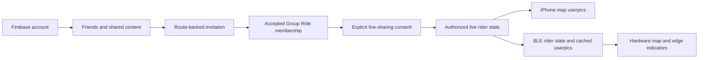

# Friends and social riding implementation plan

- Issue: [#380 — Friends and social riding](https://github.com/seichris/open-bike-computer/issues/380)
- Dependency: [#376 — Temporary Group Rides](https://github.com/seichris/open-bike-computer/issues/376)
- Status: implemented in the accompanying application, backend, firmware, and website changes; production activation and physical acceptance remain rollout gates.
- Updated: 2026-10-03.
- Source baseline: `open-bike-computer` main at `0f6fc8c6f0238d5508df199f2a50b1482b62ca1d`; `bicino` main at `502705be626b5e4c82d9e38df9d99b5e49282a47`.
- Additional requirement from Chris: users choose a profile picture; friends appear with that picture on the map, or at the round display's edge in their direction with a distance below when outside the visible map.

## Implementation record

The accompanying change implements native Firebase sessions, profiles and private
avatar variants, mutual friendship and blocking, authorized route/activity
publication, private-zone clipping, scheduled Group Rides and invitations,
explicit location/stat consent, authenticated live snapshots, quick statuses,
phone map portraits, and the bounded GRUP BLE portrait/edge-indicator protocol.
The required #376 session contracts are included here rather than assumed to be
available from another branch. Large route bodies are fetched on demand instead
of loaded with every list. PostgreSQL is the shared authority; notification,
deletion, orphan-media, and external-identity cleanup run in a durable worker.

The companion bicino change adds safe Universal Link landing pages and a signed
server-to-server deletion handoff. Both pull requests target main. Nothing in
this delivery configures provider consoles, deploys services, or flashes hardware.
See [rollout and acceptance instructions](../social-riding-operations.md). Native
social configuration defaults off, and hardware capability advertisement remains
limited to diagnostic firmware until the physical acceptance matrix is recorded.
The baseline inventory below describes the original inspected code, not the
post-implementation source tree.

## 1. Outcome and decisions

Deliver the complete flow: **sign in → choose a userpic → add friends → share a route or completed ride → invite friends → ride together with recognizable map markers**.

Reuse the Firebase project and accounts used by `bicino.com`. Add a native iOS session and server-side Firebase ID-token verification. Reuse identity and provider configuration; the website's HTTP-only session cookie is not the native app's authentication mechanism.

Keep three permissions distinct:

1. A mutual friendship permits the content its owner explicitly shares with friends.
2. An accepted Group Ride membership grants access to that session's route and permitted participants.
3. A participant separately enables live location and basic-stat sharing for that ride. Friendship, invitation acceptance, and account sign-in never start tracking.

Recommended implementation choices:

| Area | Decision |
| --- | --- |
| Identity | Firebase Authentication, same production project as the website; separate development configuration. |
| Social API | Modular FastAPI routers in the existing backend, with a dedicated account-authentication dependency. |
| Durable social data | PostgreSQL with versioned migrations, constraints, transactions, and a notification/deletion outbox. This is new infrastructure, not something assumed to exist. |
| Media and route objects | Private object storage with authenticated delivery; reuse existing object-storage patterns, with separate social credentials and namespace/bucket. |
| Live transport | #376 owns the authenticated WebSocket service, membership, consent, expiry, and rider-state protocol. |
| Routes | Existing `NavigationRouteV1` / `NavigationRouteArchiveV1` and `PhoneRouteLibrary`, plus a social metadata envelope and explicit redistribution policy. |
| Profile picture | User-selected image, sanitized variants, versioned asset identity, initials fallback. |
| Hardware | Required delivery milestone for userpics and off-screen direction/distance indicators; capability-gated independently from the phone feature. |

PostgreSQL is recommended because friendship uniqueness, invitation acceptance, block revocation, and reliable deletion need transactional state shared by API processes. Avoid putting person identity into the map job SQLite databases or the map catalog's library credentials. Reuse Firebase Auth without introducing a second social backend in Firestore. Record deployment capacity, backups, and migration operations before enabling this new store.

No account is required for existing local navigation, maps, BLE pairing, or workout recording. Public discovery, a social feed, comments, followers, clubs, contact uploads, permanent tracking, and sensitive live health metrics remain outside this delivery.

## 2. What already exists, and what must be added

The following are verified source facts at the baselines above, not claims about deployed configuration or working provider-console setup.

| Existing code | Reuse and constraint |
| --- | --- |
| Website `lib/firebase/client.ts`, `lib/firebase/admin.ts`, `app/components/auth/sign-in-buttons.tsx` | Firebase Web/Admin SDKs and Apple/Google flows exist. Confirm deployed project, enabled providers, Apple association, and feature flag before native rollout. |
| Website `lib/auth/session-route.ts`, `lib/auth/account-route.ts` | ID-token exchange, browser cookies, recent-auth checks, account deletion, and Apple revocation exist. Extend account deletion across both products. |
| `ios-app/BikeComputer/BikeComputer/Services/BicinoServiceSession.swift` | Installation credential registration and `X-Installation-Token`; not a person identity. Preserve it for maps and other existing managed services. |
| `map-platform/backend/map_platform/api.py` | Existing FastAPI application and installation/App Attest boundaries; no Firebase social router in this baseline. |
| `map-platform/catalog/README.md` | D1/R2 offline-map library and claim/share system already exists. Its library principal, shared map Keychain group, and presigned map downloads are not social-account authorization. |
| `ios-app/BikeComputer/RideShared/NavigationRouteContract.swift`, `NavigationRouteArchive.swift`, `RouteProviderContract.swift` | Route geometry, revision, hash, provider, and retention contracts. Local durable storage is not permission to redistribute. |
| `ios-app/BikeComputer/BikeComputer/Managers/PhoneRouteLibrary.swift` | Validated import/save and Watch delivery. Social imports must enter this library rather than create another navigation store. |
| `BikeComputerCoordinator.currentLocation`, `MapViewContainer` in `Views/MapView.swift` | Existing location stream and map renderer. Reuse them; do not introduce a social `CLLocationManager`. |
| `Managers/PhoneWorkoutRecorder.swift`, `WorkoutRecordingStore.swift` | Native HealthKit recording and a recovery record, not an existing completed-activity cloud library. |
| `BikeComputer.entitlements`, `ContentView.onOpenURL` | `applinks:bicino.com` and existing device setup, Strava, and map-share routing. Extend dispatch without stealing those links. |
| `esp32/lib/maps/src/maps.hpp`, `map_projection.hpp`, `esp32/lib/route_overlay/route_overlay.hpp` | Existing projection and foreground presentation contracts. Friend markers must use the same visible map frame and rotation. |

There is no existing `BicinoUserSession`, `SocialGraphStore`, or `LiveRideService` implementation in the inspected app source. These names in the issues describe proposed components. #376 is a real dependency, not an available SDK to call today.

The current iOS privacy policy explicitly says HealthKit workouts and routes are not uploaded. Completed-ride publication therefore requires a new consent flow and revised disclosures before release. MapKit routes can be active-only or phone-only, and Strava routes have a seven-day retention contract; neither becomes shareable merely by adding a social wrapper.

## 3. Shared account authentication

### Native setup and session boundary

1. Inventory the website's deployed Firebase project ID and Apple/Google provider configuration without copying server credentials into the app. Register the production iOS bundle `LetItRide.BikeComputer` in that same production project. Register `LetItRide.BikeComputer.dev` in the development project. Confirm Apple web Services ID/native App ID association so repeat web/native sign-in resolves to the same provider identity and Firebase UID.
2. Add pinned, deployment-target-compatible Firebase Core/Auth and Google Sign-In Swift packages to the phone target. Do not add Auth to Watch, widgets, or firmware. Configure native Sign in with Apple, its nonce flow, and Google's callback scheme; preserve existing callback routing. Validate both Debug and Release configurations.
3. Add `BicinoUserSession` with an app-owned user DTO and states such as restoring, signed out, signed in, and reauthentication required. Keep Firebase SDK types inside the authentication adapter. Let the SDK manage its session credentials; do not put tokens in UserDefaults or the existing map-library shared Keychain group.
4. Build a separate `BicinoSocialClient`. Send `Authorization: Bearer <Firebase ID token>` to the configured Bicino social origin only. Coalesce refresh, retry an auth failure once, and partition/cancel requests and caches by account generation so late responses cannot populate another user's session.
5. Keep installation credentials and App Attest independent. An installation token alone cannot read social data; a Firebase token alone cannot take ownership of existing installation-scoped map jobs. If app-integrity checks are added to social writes, specify their own request binding rather than treating a map assertion as proof for a different endpoint.

Native integration follows Firebase's [Apple](https://firebase.google.com/docs/auth/ios/apple) and [Google](https://firebase.google.com/docs/auth/ios/google-signin) guides. A web login need not automatically log in the app; the acceptance test is the same account identity after each surface's own sign-in.

### Server verification and account linking

- Add a small `AccountPrincipal` derived only from a verified Firebase token. Validate signature, expected project/audience/issuer, expiry, and subject through the Admin SDK. Verify disabled/deleted/revoked account state on social requests; fail closed when required verification is unavailable. ID-token verification without a revocation check is insufficient for account removal. See Firebase's [verification](https://firebase.google.com/docs/auth/admin/verify-id-tokens) and [session revocation](https://firebase.google.com/docs/auth/admin/manage-sessions) guidance.
- Key the internal auth mapping by issuer/project plus Firebase UID; use an opaque public `profileID` for API references. Do not expose emails, raw UIDs, provider subjects, or tokens in profiles, URLs, push payloads, BLE, or logs.
- Add an active/deleting/deleted account state checked by every social handler and live connection. A long-running socket must not keep authority indefinitely from its initial handshake: #376 must handle token expiry/re-authentication and account-revocation events.
- Provision the social account/profile idempotently after sign-in. Reserve normalized unique usernames transactionally; define allowed characters, reserved names, change cooldown, and whether an old name can be reused. Stable profile links use `profileID`; username changes do not break friendships.
- Preserve the website's prove-control-before-linking behavior. Apple relay email and Google email are not identity keys. Account conflicts show a recovery/linking flow; never merge accounts by matching email. Test the selected SDK against Firebase's [account-linking behavior](https://firebase.google.com/docs/auth/ios/account-linking), including existing-user conflicts.
- Signing out stops this installation's live-sharing session, unregisters its push binding, cancels account work, and clears social caches. It does not erase local routes or end a private workout. Display shared-account effects separately for account deletion.

### Account deletion across web and iOS

Before any social launch, update the website's deletion route as well as iOS. Deleting only the Firebase user would leave social records and shared media orphaned.

Use a durable, idempotent deletion operation: require recent sign-in and bind the target to the displayed account; perform required Apple reauthentication/revocation; transactionally mark the social account deleting, deny access, revoke links/invites, and enqueue cleanup; delete the Firebase account; then retry object/database cleanup until complete. Preserve retriable state when provider or storage calls fail. Native Apple revocation uses the documented authorization-code flow, not a copy of the website's access-token request shape.

Both surfaces must call the same backend deletion lifecycle through an authenticated, account-bound contract. The website retains cookie, origin, and CSRF controls when bridging to it; no unauthenticated UID-based deletion webhook. Add reconciliation for Firebase users deleted externally. End organized sessions or follow an explicit organizer-transfer policy; remove memberships, pictures, private geometry, and notification tokens. Retain only minimal deletion/audit tombstones without coordinates, image data, or identifying profile fields. Document backup expiry and that another rider's deliberately saved copy cannot be recalled.

## 4. Profiles and userpics

Profile editing includes display name, unique username, **Choose photo**, crop preview, replace, and remove. Use the system photo picker so selecting one image does not require reading the whole photo library. Default to initials; provider photos may be imported only through an explicit choice and the same sanitization pipeline.

Proposed upload flow:

1. The signed-in owner uploads a cropped image to `PUT /v1/social/me/avatar` with an idempotency key and expected profile version.
2. Enforce a proposed 5 MiB compressed limit and 16-megapixel decode limit, sniff actual format, reject animated/SVG/invalid images, correct orientation, strip EXIF/GPS metadata, and re-encode. Bound decoder resources and upload frequency. Keep the old picture until the replacement is ready.
3. Produce a 256-pixel profile variant, a 96-pixel phone-marker variant, and a 40-pixel hardware source variant. Store only sanitized versions in private object storage; remove temporary originals. These sizes are initial budgets to validate visually.
4. Atomically publish `avatarAssetID`, `avatarVersion`, and content hashes. Updating or removing a picture invalidates prior references, issues a profile-change event, and schedules old-object cleanup. Consumers compare versions so an old download cannot replace a newer image.
5. Serve images through a policy-checked media endpoint. A profile picture is visible to the audience explicitly described in profile setup: authenticated exact-profile lookup, accepted friends, and permitted ride members. Blocks override access. Do not return external provider URLs or fetch arbitrary user-supplied avatar URLs.

Use the social profile as the source of truth, not Firebase `photoURL`; both website and app can eventually edit the same profile. Cache validated thumbnails by asset/version/hash. Purge relevant caches on block, sign-out, deletion, or removal. Initials must work offline or if download/decode fails. Photos must never be required to join, navigate, or display a friend.

Once an authorized viewer has downloaded an image, immediate recall of those bytes is impossible. Revocation denies new reads and sends best-effort cache-removal events; do not promise screenshot or offline-copy removal.

## 5. Social model and authorization

Use database constraints and service transactions rather than client-selected state transitions. The schema below is proposed; group-session tables and runtime state belong to #376.

| Entity | Key fields and invariants |
| --- | --- |
| `accounts` | Internal account ID; unique Firebase issuer/UID; opaque public profile ID; lifecycle state; authorization version. |
| `profiles` | Account FK; normalized unique username; display name; avatar asset/version; profile version; privacy defaults. |
| `friendships` | Ordered account pair with a unique constraint and no self-pair; requester; pending/accepted/declined/expired/removed state; timestamps/version. |
| `blocks` | Directed blocker/blocked pair with a unique constraint. Either direction denies social access. Keep separate from friendship state so unblocking never restores an old friendship. |
| `social_routes`, `route_revisions` | Owner; source/provenance; immutable validated archive/hash; visibility; redistribution eligibility; created/updated times. |
| `activities`, `activity_variants` | Owner; local-source deduplication key; allowlisted stats; sanitized geometry; privacy-policy version; publication state and visibility. |
| `share_links` | Content/revision reference; hashed random secret; expiry/revocation; optional explicit claim. No UID or geometry in the URL. |
| `ride_invites` | Sender/recipient; group ID; route revision; pending/accepted/declined/revoked/expired; expiry and idempotency key. |
| `notification_devices`, `outbox`, `deletion_jobs` | Account/environment-bound push delivery, retryable events, and cleanup. Event payloads exclude coordinates and sensitive metrics. |

Relationship rules:

- Sending a reverse request while one is pending returns the existing request with an explicit accept option. It must not silently create mutual consent. Only the recipient can accept or decline; either member can remove an accepted friendship.
- A block transaction removes friendship access, cancels pending requests/invitations in both directions, bumps authorization versions, and emits revocation events. Unblock leaves users unrelated.
- Removing a friendship revokes friend-audience content and pending friend invitations, but does not by itself undo an independently accepted Group Ride membership. Show that distinction in the removal UI.
- **Blocking takes precedence inside shared live sessions.** Agree this contract with #376: prevent future co-membership; if the blocker organizes the session, remove the blocked member; otherwise end the blocker's participation in that shared session. Immediately stop mutual streams and hide both parties' cached markers. Do not leave a whole-room broadcaster that ignores the block.
- Profile lookup starts with exact username, profile link, QR, or opaque invite, not a broad public directory. Use bounded cursor pagination, per-account/IP limits, request cooldowns, and notification suppression. Avoid account/email enumeration through errors.

Content defaults are **Only me**. `Friends` is checked against the current accepted relationship on every read. `Anyone with link` uses a revocable capability for that content only; possession grants neither friendship nor live access. Public content is deferred. A signed-in blocked user is denied, but a bearer link forwarded to an anonymous viewer cannot identify that viewer: explain the link audience clearly and require rotating/revoking such links when stronger control is needed.

Do not use the existing map catalog's 15-minute presigned-download behavior for private activities if claiming immediate server-side revocation. Social protected downloads, previews, thumbnails, bounds, and metadata use the same authorization gate. Deny new reads immediately after committed revocation; already delivered bytes and in-flight responses cannot be recovered.

## 6. API contract

All endpoints below are proposed. Document them in OpenAPI and keep Swift DTO fixtures synchronized. Use opaque public identifiers, server timestamps, bounded payloads/pages, mutation idempotency keys, version-conflict responses, and structured errors.

```text
GET/PATCH /v1/social/me
PUT/DELETE /v1/social/me/avatar
POST      /v1/social/me/deletion
GET       /v1/social/profiles/by-username/{username}
GET       /v1/social/profiles/{profileID}
GET       /v1/social/friends
GET/POST  /v1/social/friend-requests
POST      /v1/social/friend-requests/{requestID}/accept
POST      /v1/social/friend-requests/{requestID}/decline
DELETE    /v1/social/friends/{profileID}
PUT/DELETE /v1/social/blocks/{profileID}
GET/POST  /v1/social/routes
GET/PATCH/DELETE /v1/social/routes/{routeID}
GET       /v1/social/routes/{routeID}/revisions/{revision}/archive
POST      /v1/social/routes/{routeID}/copies
GET/POST  /v1/social/activities
GET/PATCH/DELETE /v1/social/activities/{activityID}
POST      /v1/social/share-links
DELETE    /v1/social/share-links/{linkID}
GET       /v1/social/shared/{secret}
GET/POST  /v1/social/ride-invites
POST      /v1/social/ride-invites/{inviteID}/accept
POST      /v1/social/ride-invites/{inviteID}/decline
DELETE    /v1/social/ride-invites/{inviteID}
GET       /v1/social/media/{assetID}/{variant}
PUT/DELETE /v1/social/notification-devices/{bindingID}
```

Friend-profile routes/activities can use an owner `profileID` filter on the list endpoints, still authorized per item. Invitation acceptance delegates to the single #376 membership service; do not maintain a second notion of acceptance. An invitation grants a narrow preview of its pinned route to its intended recipient, not access to the owner's library. Revalidate block state, expiry, route permission, and session state transactionally at accept time. Idempotent retries return the same membership.

Push notifications are optional hints. Start with APNs using separate development/production device bindings and an outbox. Provide per-category settings for friend requests and ride invitations, rate limits, quiet/mute controls, and generic lock-screen copy. Fetch the authoritative inbox after opening a notification; never put coordinates, route geometry, tokens, or private stats in its payload. Denying push permission must not break the in-app inbox.

## 7. Shared routes and completed rides

### Routes

- Add `SocialRouteMetadata` beside the existing navigation archive: owner/profile, source social ID/revision, provenance, and permissions. Do not change the meaning of existing route hashes or encode account credentials in an archive.
- Implement `canRedistribute` separately from `allowsDurableStorage`, enforced by the backend as well as iOS. Initially permit only eligible user-owned/imported content whose sharing rights are confirmed. Keep MapKit and Strava payload publication disabled until their provider-specific redistribution contract is established; do not relabel them as GPX to bypass restrictions. Revalidate current provider terms before enabling those sources.
- **Save route** downloads a permitted immutable archive, verifies size/schema/hash/provenance/expiry, and commits through `PhoneRouteLibrary`. **Duplicate route** creates a new local route identity while retaining provenance and any provider restrictions. Preserve the source route's expiry; copying must not renew a limited lease.
- Explain when a downloaded copy becomes independent of the source's sharing setting. Source revocation stops future server access; it cannot reliably recall a deliberate saved copy. Hide ephemeral preview caches promptly.
- **Ride together** references a permitted immutable revision. Do not silently replace it when the source changes. #376 owns route locking, preview grants, participant route import, and canonical progress calculations.

### Completed activities

Add an explicit **Share completed ride** action after saving or from an activity picker. This is a new feature: the recovery store is not a completed-ride archive. First define a narrow export adapter for the selected Bicino workout/route with user permission. Do not upload all Health history, silently mirror workouts, or serialize existing workout DTOs wholesale.

Separate OS permission to read HealthKit from consent to upload/share this particular ride. Show the exact map and basic fields before publication. Allow only selected distance, moving/elapsed time, elevation gain, and average speed. Exclude heart rate, power, cadence, calories, raw sensor samples, device identifiers, and arbitrary HealthKit metadata. For live statistics, use explicitly consented GPS/session-derived fields; do not pass through HealthKit-derived metrics without a separate future consent contract.

Privacy processing must happen before any other account receives geometry:

1. Configure owner-only home/privacy zones and start/end trimming; use a proposed 200 m endpoint trim and configurable larger zones as the initial product default.
2. Preview clipping locally and validate/process the publication on the server. Clip crossing segments even when both endpoints lie outside a zone; split geometry into separate segments rather than drawing a line across removed areas. Preserve no hidden points in thumbnails, export files, bounds, cues, or alternate representations.
3. Store a versioned sanitized publication artifact; raw owner data, if temporarily needed for processing, is private and deleted after processing. Compute visible-map bounds and location-linked summaries from the sanitized track. Clearly label any separately consented full-ride aggregate.
4. Changing a privacy zone or visibility immediately hides affected publications and invalidates derivatives until rebuilt. If raw data was discarded, require the owner's device to resubmit/reprocess rather than keep serving an outdated publication. A client-supplied `privacyProcessed=true` is never sufficient.

Route sharing also needs an explicit preview because a planned route can reveal home. Default it to private and offer trimming/editing or a warning when it intersects an owner privacy zone; do not silently alter the canonical route participants will navigate. Privacy processing reduces exposure and does not promise that a home location cannot be inferred.

## 8. Ride-together integration with #376

Share these primitives between the two issues first: `AccountPrincipal`, public rider profile/userpic, route snapshot, block policy, invitation recipient, and deletion/revocation events.



The social layer supplies identity, photos, route permissions, friend selection, and invitations. #376 supplies the session, live transport, quick statuses, membership, consent, expiry, adaptive publishing, and map rider state. Friends milestones can ship before #376; the Ride together button stays unavailable until the group contracts work end to end.

Required shared behavior:

- Subscribe to `BikeComputerCoordinator.currentLocation`; use canonical WGS-84 on the wire and convert only at the appropriate rendering boundary.
- Keep last received location, capture time, server receive time, sequence, accuracy, consent, and session authorization separate. Expired/out-of-order updates cannot revive a departed rider.
- Treat location and basic live stats as independently consented. Joining starts both off. Joining an invitation is distinct from **Start sharing**.
- Stop publication on stop-sharing, leave, organizer end, workout/ride end, sign-out, account deletion, block resolution, or expiry. An offline client stops locally immediately; a short renewable server lease removes abandoned live state even when a stop request cannot be delivered.
- Compute ahead/behind against the same immutable route revision with progress continuity through loops and crossings. Off-route/uncertain projection yields bearing and straight-line distance instead of a fabricated route gap.
- Reuse a single `LiveRideService` and annotation model. API instances require a shared revocation/fan-out mechanism; process-local dictionaries alone are not a multi-instance authorization design. #376 should choose and qualify that runtime, including reconnect and stale-lease behavior.
- Test real connectivity in mainland China for both Firebase sign-in/refresh and Bicino's transport. A Bicino-hosted WebSocket does not eliminate the Firebase dependency. Unavailable social networking leaves local navigation usable and never downgrades authentication.

## 9. Userpics on the map and around the round screen

This is required scope from Chris's follow-up, not an optional cosmetic enhancement. Only riders currently visible under accepted live-session permissions are eligible; do not show a friend's last known position just because the friendship persists.

### Intended presentation

| Friend state | Presentation |
| --- | --- |
| Inside the visible map | Circular userpic at the friend's projected location; subtle heading/state accent. Tap on iPhone for name, freshness, permitted stats, and route gap. |
| Outside the visible map | Userpic just inside the display perimeter, in the friend's direction; straight-line distance below it, e.g. `240 m`. A small outward tick can clarify direction. |
| No photo/download failure | Stable initials/color badge in exactly the same place. |
| Stale | Muted badge and update-age treatment; do not animate it as current. |
| Offline/expired/left/not authorized | Remove the directional map marker. An offline rider may remain in the session list without a current distance claim. |

Interpret “outside of the round screen” as **at the visible edge, inset enough to keep the whole picture and distance readable**. Pixels physically beyond the circle cannot be shown. At the bottom edge, move the picture inward enough to fit the label below it. Keep labels upright even while the map rotates.

The edge number means **straight-line geodesic distance from me to my friend**, not distance from the map center and not route distance. Display metres below 1 km and compact kilometres above it; distinguish an optional route card's `350 m ahead on route`. At near-zero separation show a co-located state instead of an unstable bearing. Avoid false precision when GPS accuracy is poor.

### Geometry and layout contract

1. Determine whether the friend's projected point is inside the actual visible map mask, accounting for round clipping, overlays, and the active viewport. Include the full avatar/label footprint and a small hysteresis band so the badge does not flicker between modes at the boundary.
2. On-map placement uses the existing map's visible projection, rotation, scale, pan, and bird's-eye transform. Never apply north/heading rotation twice or position a marker against a frame that has not yet been presented.
3. For an off-map compass indicator, calculate bearing **from the rider's current WGS-84 position to the friend**, expressed in the displayed map's orientation. In north-up, north is at the top. In heading-up, directly ahead is at the top. Use the renderer's orientation/projection basis; define a bearing-only fallback for an invalid/horizon projection. If rider position or orientation is unusable, suppress or mark direction unknown.
4. The edge cue remains rider-relative even while the map is panned. Keep that distinct from projected map-center direction, and offer recenter on iPhone. Verify this interaction explicitly rather than silently mixing origins.
5. Intersect the direction ray with an inset safe perimeter. For the round 1.75-inch screen, fit the **whole avatar plus the below-avatar label** within the safe circle. For each footprint corner offset `q`, center `C`, unit direction `d`, and radius `R`, choose the largest nonnegative `t` satisfying `||t*d + q|| <= R` for all corners; position the badge at `C + t*d`. Reserve existing controls/navigation banners as additional exclusion zones.
6. Define a corresponding rectangular safe boundary for the 2.06-inch display and the iPhone viewport; do not force a circular mask on those targets. Parameterize by actual runtime viewport and display orientation.
7. Start with at most eight independently drawn hardware badges. Prioritize selected rider, then relevant nearby riders, with stable ordering. For nearly identical bearings, use a bounded cluster/count; keep a direction tick at the true bearing if a badge is nudged. Do not move a friend to an unrelated bearing just to make space. Expand/select on the phone.
8. Use proposed freshness thresholds of under 15 s fresh, 15–60 s stale, and over 60 s no directional marker. Share the policy with #376 and qualify it outdoors. Advance age on the hardware even if BLE stops; new phone packets carrying old data must not reset freshness.

Phone annotations should update in place by session-scoped rider ID. Incoming positions must not steal the map camera. Add accessibility labels containing name, distance type, and freshness; do not make avatar recognition the only way to identify someone.

### Firmware and BLE implementation

- Add a versioned capability for group rider state and a separate avatar-cache capability. An older device still navigates normally; supporting group state without pictures falls back to initials.
- The phone fetches authorized sanitized variants, converts the hardware thumbnail to a fixed pixel format, and preloads it when joining/before riding. Firmware never receives a Firebase token or downloads arbitrary profile URLs.
- Use short session-scoped rider tokens, avatar version/hash references, WGS-84 fixed-point coordinates, location age/accuracy, sequence, validity flags, and optional selected statistics. Firmware derives placement from its own visible map transform so display rotation/panning does not desynchronize overlays.
- Transfer an image once per version through bounded low-priority chunks with byte count, offsets, integrity hash, acknowledgement, and retry limits. Position/status packets reference the cached asset; never resend images on each GPS update. Navigation and stop/revocation messages take priority.
- Initial budget: eight 40×40 RGB565 images are 25,600 bytes before metadata. Target a bounded approximately 32 KiB avatar pixel/cache allocation in suitable memory, plus explicitly measured protocol/UI overhead. Use an existing circular LVGL clip/mask and avoid decoding network image formats on the firmware. Fall back to initials on allocation or validation failure.
- Keep the cache in session memory initially, clear it on session end/account change/owner disconnect, and use a fresh session epoch so late chunks cannot resurrect a previous account's image. Avoid SD writes in the normal live-update path.
- Add a lightweight foreground overlay adjacent to the existing route/map presentation, preserving the current renderer and full-screen refresh strategy. Do not rebuild the base map for every avatar update or allocate per frame.
- Update `docs/ble-protocol.md`, firmware BLE implementation/headers, `BLEManager.swift`, `NavigationProtocol.swift`, and host/Swift fixtures together. Wire-format byte layouts and measured packet budgets are a milestone deliverable before enabling firmware support.

## 10. Implementation milestones and file ownership

Each milestone is a reviewable change with tests and a feature gate. These are implementation steps, not instructions to provision services or change live accounts while writing this plan.

### A. Account and persistence foundation

- Confirm Firebase web/native identity setup in both environments and document non-secret configuration.
- Add phone `Services/BicinoUserSession.swift`, auth adapters, and `BicinoSocialClient.swift`; integrate app startup and Settings account UI.
- Add backend `map_platform/user_auth.py` and a cohesive `map_platform/social/` package for routers, models, repositories, policies, media, and outbox workers. Update Python package discovery so the new subpackage is included in the built image.
- Add PostgreSQL driver/migration dependencies, schema/migrations, lifecycle state, and isolated test fixtures. Configure secret injection, backups/restore, and health checks; keep social initialization lazy when disabled.
- Coordinate `seichris/bicino` changes to shared deletion and authenticated account bridging before social data can be created by production users.
- Exit: native and web sign-in resolve to the same UID for Apple and Google; wrong-project/revoked tokens fail; account deletion is durable; existing account-free map/navigation behavior passes.

### B. Profiles, pictures, and mutual friends

- Add profile DTOs, `SocialGraphStore`, profile editor/photo picker, Friends list, request inbox, friend profile, and privacy/notification settings.
- Implement transactional friendship/block operations, exact lookup and stable links, upload sanitization, private image delivery, push bindings, and notification outbox.
- Extend the website's `public/.well-known/apple-app-site-association` with narrow profile/invite paths and add safe landing pages. Existing entitlements are a starting point; test installed/uninstalled, signed-out, expired, and wrong-environment links.
- Exit: create/edit/remove userpic; request/accept/decline/remove/block work on two accounts; reverse-request races produce one pair; revoked profiles/pictures cannot be freshly fetched.

### C. Shared route library

- Add `SocialRouteStore`, social metadata/redistribution policy, owner visibility controls, friend route lists, map previews, save/duplicate, and revocable link sharing.
- Integrate `PhoneRouteLibrary`, `SavedRoutesLibraryView`, and `RideShared` validation. Preserve provider attribution, expiry, revision/hash checks, and existing Watch rules.
- Exit: an eligible route survives the authorized upload → friend preview → local save → normal navigation flow; unauthorized and ineligible provider exports fail server-side.

### D. Completed-ride publication

- Implement explicit activity selection/export, consent, sanitized preview, privacy-zone settings, allowlisted summary fields, and publication/reprocessing jobs.
- Update `ios-app/PRIVACY_POLICY.md`, relevant app-store disclosures/privacy manifests, and website privacy text for actual new collection and retention before enabling uploads.
- Exit: another account receives only the sanitized map/fields; no hidden segment, preview, bounds, or export leaks trimmed coordinates; old publications are hidden during privacy changes.

### E. Friends-to-Group-Ride flow

- Land or coordinate #376 account, route snapshot, membership, live-state, and revocation contracts. Add `RideInviteStore`, friend picker, acceptance/decline/expiry UI, and route/activity entry points.
- Integrate friend names/userpics with #376's `LiveRideService`, in-place `GroupRiderAnnotation`, rider card, and the normal `MapViewContainer`.
- Exit: two accepted riders navigate the same revision, explicitly share, see userpics and permitted statistics, and lose access correctly on stop/leave/block/end/expiry. Friendship alone reveals no position.

### F. Round-screen userpics and edge indicators

- Add shared projection/layout fixtures, firmware foreground marker rendering, negotiated BLE rider frames, and the bounded avatar cache/transfer protocol.
- Implement and test both on-map pictures and edge pictures with the distance below. Initials are a fallback, not a substitute for delivering actual selected userpics on supported hardware.
- Exit: a friend moves on/off the map, remains directionally correct through rotation and zoom, and has a readable label at every edge; overlapping and stale riders behave predictably. Physical qualification is separate for 1.75 and 2.06.

### G. Release qualification

- Exercise staging with multiple users/installations, retry/restart/failure injection, account switching, denied notifications, poor network, and image/route corruption.
- Enable production cohorts in order: accounts/profiles/friends → routes → activities → group integration → qualified firmware capability. Keep quick disable gates per capability.
- Optional Riding now/Ask to join is later: presence remains off by default and must not reveal coordinates or a route before session acceptance.

## 11. Verification and acceptance matrix

| Area | Required evidence |
| --- | --- |
| Identity | Apple and Google first/repeat native/web sign-in, relay-email case, same-account UID, conflict/link recovery, token refresh, wrong project, logout/account switch, disabled/deleted/revoked account. |
| Authorization | Owner/friend/unrelated/blocked/deleting-account matrix for every list, detail, preview, media, archive, invite, and live path. Test mutations racing with block, removal, and deletion. |
| Database | Concurrent duplicate/reverse requests, username collisions, retry idempotency, migration rollback compatibility, durable outbox recovery and backup restore. |
| Pictures | Orientation/crop, metadata stripping, oversized/decompression-heavy/malformed images, replace/remove races, stale hashes, lost chunks, account cache isolation, initials fallback. |
| Routes | Invalid schema/hash/size, immutable revision, duplicate save, provider policy/expiry preservation, revoked links, independent saved-copy disclosure, shared route consistency. |
| Activities | Denied Health permission, no implicit upload, field allowlist, zone-crossing segments, tiny/fully hidden rides, multiple hidden sections, antimeridian/polar geometry, derivatives/exports, privacy edits while processing. |
| Invitations/live | Expiry, route preview scope, accept/remove races, consent off, membership revocation, reconnect/re-auth, process restart, stale leases, route crossings/loops, off-route fallback, no live access from a friend link. |
| Marker geometry | Eight compass directions; north/heading-up; stationary/unknown heading; every display rotation; zoom/pan/bird's-eye; circle/rectangle clipping; bottom label; clusters; near-zero/long distances; meter/km transition. |
| Freshness | Delayed/out-of-order state, clock skew, BLE loss, stale phone state in fresh packets, session epoch replacement, removal clearing picture/location on both phone and device. |
| Hardware | Navigation responsiveness, frame timing, BLE queue pressure, full-screen refresh correctness, memory/DMA headroom, eight-avatar stress, repeated joins/leaves, actual picture and text readability outdoors. |

Register new meaningful checks in `tools/development/checks.json` and Swift source graphs rather than duplicating compiler lists. Start implementation validation with `tools/dev-check --plan` and affected `tools/dev-check` suites; run explicit iOS full checks for package/entitlement/UI integration and scoped backend/database tests for social changes. Use OrbStack for local database/container work. Website changes run that repository's lint/tests/build requirements.

Firmware full builds and device qualification follow the repository's board-identification and attested-build rules. Validate both supported targets explicitly; automatic 1.75 CI is not proof for 2.06. An image/build/unit-test result does not prove physical placement, BLE throughput, or road behavior. For the implementation release, retain source SHA, image/app identity, device identity, screenshots, and observed end-to-end results separately.

Issue completion requires all of A–G, including the userpic hardware behavior. A phone-only release is an intermediate milestone and must leave the firmware requirement visibly open.

## 12. Operations, limits, and rollout

- Use feature flags for accounts/social, media, route sharing, activity publication, and group/hardware integration. Existing navigation must start when Firebase/social configuration is absent or unavailable.
- Define deployment resource limits for image processing, object bytes per account, requests/invites, publications, and pending jobs. Expose aggregate queue age, error rates, denied requests, stale-session cleanup, and cache/transfer performance without recording tokens or raw locations.
- Initial retention proposal: incomplete uploads expire within 24 h; expired requests/invites are cleaned within 30 days; profile pictures/shared content persist until replaced, unpublished, or deleted; deleted objects target purge within 24 h with retries; backups expire within 30 days. Agree and implement these values before publishing the policy. Session location expiry belongs to #376 and must be enforced on reads even if physical cleanup is delayed.
- Follow digest-pinned backend image promotion and Compose changes through the existing deployment workflow. Add social database/migration and worker roles deliberately; do not bypass map-worker provenance or qualification gates when sharing an image.
- Rollback disables affected writes/read features and stops sharing, while retaining revocation, expiry, and deletion workers. Additive schema changes must remain compatible with the previous app/API during rollout. Rollback is not permission to resurrect deleted data or stale live state.
- Main implementation risks are unverified provider-console identity association, new PostgreSQL/media operations, redistribution rights, HealthKit consent/disclosure changes, #376 availability, Firebase reachability, and measured firmware resource budgets. None is verified merely by writing this plan.

## References

- [Issue #380 and its privacy/visual requirements](https://github.com/seichris/open-bike-computer/issues/380)
- [Issue #376 session, transport, route, and hardware contract](https://github.com/seichris/open-bike-computer/issues/376)
- [Bicino web Firebase implementation plan at the inspected revision](https://github.com/seichris/bicino/blob/502705be626b5e4c82d9e38df9d99b5e49282a47/docs/firebase-auth-implementation-plan.md)
- [Bicino web session exchange](https://github.com/seichris/bicino/blob/502705be626b5e4c82d9e38df9d99b5e49282a47/lib/auth/session-route.ts) and [account deletion](https://github.com/seichris/bicino/blob/502705be626b5e4c82d9e38df9d99b5e49282a47/lib/auth/account-route.ts)
- [Existing route provider contract](../../ios-app/BikeComputer/RideShared/RouteProviderContract.swift), [iOS privacy policy](../../ios-app/PRIVACY_POLICY.md), and [BLE protocol](../ble-protocol.md)
- [Development checks](../development-checks.md) and [backend deployment process](../../map-platform/deploy/README.md)
