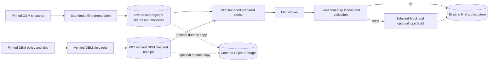

# Reusable map preparation and finished-map reuse

Status: implementation plan, 2026-09-28. Based on `origin/main` at
`01fd51d7377137e2494b926f4d8de0cd20d8e55b`. No cache migration or
production configuration change is implied by this document.

Tracks [issue #508](https://github.com/seichris/open-bike-computer/issues/508)
for reusable OSM source preparation. The finished-map work in this plan covers
both standard maps and the optional topographic format. The rider reports that
the Sichuan map has now downloaded and that topographic selection is deployed;
that map is a useful benchmark artifact, not proof of a reusable source or an
eligible exact-reuse candidate. Repository policy still distinguishes the
development topography rollout from production qualification; see
[topography-pipeline.md](../topography-pipeline.md#remaining-release-gates).

## Outcome and scope

For every supported map format:

1. A new map inside **ready** source coverage reads verified prepared OSM data
   and starts selected-block work without scanning a country or planet PBF in
   the request path. Adjacent and overlapping requests resolve the same
   buildings, relations and calibrated heights from the same snapshot.
2. A repeated request with the same output identity can reuse a complete,
   verified final map, including its topographic companion when requested.
   Neither OSM conversion nor DEM sampling runs on that hit.
3. Different map geometries can share prepared source, DEM tiles and reusable
   building blocks. Reusing a *whole finished map* across different geometry,
   format, source version or embedded display name requires a separate identity
   and validation decision; a shared input is not automatically a shared output.
4. A miss, corrupt object or changed input follows a bounded rebuild path and
   never silently serves an older map.

This plan preserves the current final-artifact store and shared library design
in [the R2 plan](cloudflare-r2-final-map-library-and-sharing-implementation-plan.md).
Use the existing VPS SSD for the bounded regional prepared-source cache first.
Contabo Object Storage is an optional durable cross-host copy when cold restore,
retention or capacity measurements justify a separate purchase. A final ZIP,
stream and topographic companion continue through the existing signed artifact
publication path; changing that store is a separate migration. The local pilot
does not assume that 500 GB is mounted or that the current 80 GB free fits a
planet generation.

## Current constraints

Read-only Coolify inventory on 2026-09-28 found development and production map
containers on `cool-ts` sharing one host. The block device reports 500 GB, but
the mounted root partition is only 199 GB with about 80 GB free; no separate
data mount was present. Development already has complete China source-index
files around 4.1 GB each and calibration generations around 137,000 cells;
one measured pair occupied about 3.9 GiB for the index and 563 MiB for the
calibration directory. These are useful regional pilot inputs, not a planet
capacity estimate. Do not start a planet build or expand the live partition as
an incidental step of this rollout.

The development job record for `Chengdu 2` (`fc0f241b3fd0455b9615`) shows a
format-4 China-source map created 2026-09-26 07:58:46 UTC and ready at
09:13:43 UTC: about 75 minutes end to end, with one recorded download. The
earlier `Chengdu 1` job (`1c7ad7be7ef54c4f8555`) took about 21 minutes and
also has one download. These are read-only job-record measurements for two
different requests; neither proves which download the user called Sichuan.

- The backend already has exact and subset reuse for eligible standard maps.
  `map_platform/reuse.py` deliberately returns no reuse key for renderer format
  4 because the DEM receipts and compiled topographic intermediate are absent
  at the early lookup point. Preserve this fail-closed behavior until the new
  identity and candidate validation are implemented.
- Exact standard reuse includes the immutable `packDisplayName`, preview,
  geometry, source and producer. `mapId` also contains a name slug. The shared
  library's mutable user alias does not make two differently named signed packs
  byte-identical. First support exact same-output reuse; separately design
  canonical payload identity if cross-name reuse is wanted.
- `JobStore.find_exact_reuse_candidate` and `complete_exact_reuse` currently
  require a local `pack_path`. A remote final artifact may remain valid after
  local cleanup, so the candidate catalog and hydration must use verified
  durable artifact receipts rather than local-file existence alone.
- The current full-source building calibration can dominate a small job.
  Issue #508 records roughly 50 minutes **for calibration before block
  conversion** in the Sichuan run; it does not claim the job took 50 minutes
  end to end. The source-index and calibration code is not yet proven to fit a
  planet build. The complete-domain calibration tool caps one generation at
  250,000 cells.
- The Contabo VPS has 12 vCPU, 48 GB RAM and 500 GB total SSD, shared with the
  running backend. [Contabo's published default object-store bandwidth](https://help.contabo.com/en/support/solutions/articles/103000411100-object-storage-limits-and-how-to-expand-your-capacity)
  is 10 MB/s. Size
  shard uploads/downloads and prewarm scheduling for that limit; do not place
  a planet-scale SQLite file on the VPS or expect the object store to act as a
  mounted database. A 256 MiB transfer takes at least about 27 seconds at
  10 MB/s before protocol overhead; capacity and headroom still need live
  measurements.
- OSM source snapshots and DEM releases have independent provenance and
  refresh cycles. A topographic map pins both; do not infer DEM identity from
  an OSM checksum or vice versa.

## Architecture

The local prepared cache holds sealed blobs and manifests. An optional object
store can retain immutable copies across hosts. The job database holds
small keys, state, leases, refcounts or retention pins, and receipt references;
it does not hold PBFs, indexes, tiles or finished maps. The worker downloads a
needed shard into a local temporary file, checks its size and SHA-256, then
opens its SQLite/index data locally. A content-addressed blob can be shared
between snapshot manifests when its bytes are unchanged; a manifest still
pins one exact snapshot and preparation algorithm. Publish a manifest only
after every referenced object is present and verified.

### OSM preparation identity and geometry

Define an immutable preparation manifest containing:

- source provider, release timestamp, source PBF SHA-256 and licence;
- normalization/index schema and tool versions, building rules/profile,
  calibration algorithm, cell size and halo policy;
- a deterministic global spatial partition, each shard's canonical ownership
  range, complete relation/way closure dependencies, bounds, bytes and hash;
- calibration-cell identifiers and output hashes, including valid empty cells;
- a complete coverage bitmap and manifest hash.

Choose one canonical OSM snapshot for a coverage generation. **Do not stitch
independently dated country extracts into a supposedly seam-free worldwide
generation.** A regional pilot may use one pinned China source for Sichuan and
nearby requests, but global coverage requires one consistent planet snapshot
or a provably equivalent set of shards cut from it. Define ownership by stable
global cell/feature IDs, not request rectangles. Store whole geometry/relation
closure once with an owner and let neighboring shards reference it; include
all calibration samples needed by the fixed cell halo. Tests must show that a
building crossing shard boundaries has the same resolved height and complete
geometry whichever side requested it.

Make preprocessing bounded and resumable: one active producer per source and
rules identity; small leased units with fencing tokens; separate download,
index, closure, calibration, verification and publication states. Interrupted
units retry idempotently. A manifest becomes `ready` only after all required
units pass hash, schema, ownership and coverage checks. Old in-flight jobs stay
pinned to their original manifest. A `preparing` or `failed` area reports that
state honestly; it must not trigger an unbounded full-source scan inside a
normal user request. A deliberately enabled bounded fallback may serve an
unprepared area only with explicit admission and progress reporting.

Before the planet rollout, benchmark and if necessary redesign the current
SQLite spool and pyosmium passes. A single SQLite source index has a planning
size of hundreds of GB to low TB in issue #508 and cannot be assumed to fit
alongside scratch on this VPS. Test external/offline preparation capacity;
keep production API/worker service latency protected. Shard size is a measured
choice, provisionally tens to a few hundreds of MiB compressed, not a fixed
global constant. Keep mutable SQLite files local during creation, upload only
sealed files, and validate them after download before query.

### DEM inputs and topographic identity

Cache only required DEM tiles initially, with immutable source URL/release,
policy digest, bytes, SHA-256, coverage and licence/attribution receipts.
Warm likely demand regions ahead of requests. Do not mirror all global DEM
tiles as a prerequisite for normal maps. Policy approval remains the existing
topographic gate; a cache hit must never bypass it.

For format 4, introduce a **preflight input key** available before rendering:

- all existing exact vector-map inputs, producer/renderer versions, geometry,
  display name, preview and source manifest;
- approved DEM policy/index identity, the exact selected tile IDs and verified
  tile hashes/bytes, including fallback and no-data decisions;
- grid, sampling, contour, clipping, quality and attribution algorithm inputs.

The compiled topographic intermediate cannot be claimed in this preflight
key. On a candidate hit, verify its sealed pair receipt against the preflight
inputs and check the actual ZIP/stream, contour FMB hashes, companion bytes,
manifest/signature, source notices and final compiled-intermediate digest.
The receipt and final hashes are the *post-build* identity. A failed or missing
tile/receipt, policy mismatch, or a changed production approval must cause a
miss or typed failure. Do not derive a format-4 key from vector inputs alone.

### Finished-map lookup and ownership

Separate a content/output identity from a user's job and library alias in the
new catalog. A hit creates the requesting installation's own completed job and
authorized artifact reference; it never hands out another installation's job
credentials. Keep the original signer and production eligibility checks. A
development map may enter a production library only through the existing
validated promotion and re-signing path. Candidate objects must be immutable,
retained and readable in the configured final-artifact store even if the local
pack was deleted. Hydrate local bytes only where current validation or ZIP
assembly needs them, under a bounded scratch reservation.

Start with exact, same-output reuse for formats 2, 3 and 4. Preserve existing
format-2/3 subset reuse and the chunk/block reuse path. Do not enable topo
subset reuse until tests prove that a subset keeps its map-wide DEM grid,
quality mode, contour clipping, companion, notices and signature valid. For
cross-name reuse, first move rider-visible naming wholly to a mutable alias
or prove that reassembly/re-signing from canonical payload bytes is cheaper
and safe; do not silently return a pack with the wrong embedded name or mapId.

## Resource, retention and failure policy

Before setting quotas, read live `df`, existing volumes, peak scratch and,
when used, object-store occupancy. Budget the VPS for active jobs plus one bounded shard
download/build, hot-cache quota, service data and a safety reserve. Admission
must reject or queue work before disk/RAM exhaustion. Reuse the existing
resource reservations and fenced leases in
[Shanghai orchestration](shanghai-city-scale-3d-map-orchestration-implementation-plan.md),
but give source-prep storage its own quota rather than consuming the current
20 GiB building-block cache ceiling. No production planet build starts until
measured peak RAM, scratch and I/O fit the chosen prep host.

Retain current and previous pinned source manifests plus blobs referenced by
in-flight jobs and rollback windows. Garbage collection is mark-and-sweep
from verified manifest/job references, with a grace period and dry-run report.
Never delete a blob during an active lease. Preserve DEM source receipts for
every retained finished map. If enabling Contabo, test restore with a cold local
cache and corruption recovery; an object-store outage may delay new builds, but
it must not make a corrupt cache hit. Use conditional immutable writes and a
manifest-last publish, after a real Contabo compatibility check of conditional
PUT, metadata/HEAD, ranges, multipart, concurrent writers and error behavior.
Contabo [describes its Ceph API](https://help.contabo.com/en/support/solutions/articles/103000411092-object-storage-s3-compatibility-protocols-and-connection-settings)
as S3-compatible, not fully identical to AWS S3.

The 10 MB/s transfer limit is acceptable for background preparation when
uploads are incremental and foreground requests read small hot shards. Log
transferred bytes and time separately from compute time. For perspective,
uploading 1 TB of *new* data at a constant 10 MB/s takes at least about 28
hours; schedule refresh with the old manifest still serving requests. Avoid
one new full upload for every source release by hashing and reusing unchanged
content blobs. Measure actual throughput and request limits on the selected
Contabo region before choosing a shard size or refresh cadence.

## Delivery sequence

| Milestone | Implementation | Gate to continue |
| --- | --- | --- |
| 0. Baseline and contracts | Record the completed Sichuan job's stage timings, final bytes, source and DEM receipts, cache paths, disk/RAM peaks if available; sample dense, sparse and shard-edge regions. Define versioned manifest and preflight identity schemas. Inventory live SSD headroom and current final-artifact retention. | Measurements, no mutation of the Sichuan artifact, and written capacity/admission limits. |
| 1. Exact topo reuse | Put cheap pinned-source and DEM-receipt lookup ahead of expensive calibration, add verified DEM preflight and a sealed-pair candidate validator. Keep format-2/3 behavior. Make catalog lookup work when only durable final artifacts remain and create installation-owned completion records. | Same-input second topo request skips conversion and DEM sampling; all changed-input/corruption cases miss or fail closed; standard reuse regression tests pass. |
| 2. Optional Contabo cache foundation | If cross-host durability is needed, prove provider semantics in an isolated bucket; add immutable blobs/manifests and checksum-checked local hydration. Mirror sealed prepared data only after validation. This does not block the local pilot. | Cold-local restore, interrupted upload, concurrent producer and corrupt-object drills pass within measured resource limits before enabling remote restore. |
| 3. Regional source pilot | Precompute one pinned China generation into consistent local shards/cells, including Sichuan and boundary samples. Move lookup before full-source work and remove full-source preparation from requests in ready coverage. Add `preparing/ready/failed` progress. | Fresh Sichuan-area and adjacent requests start selected-block work without a China scan; seam and overlapping-map outputs match; cold/warm latency and SSD use meet the measured budget. |
| 4. Global generation | Build from one pinned planet snapshot on a host with measured scratch capacity; publish resumable coverage in waves; prewarm DEM tiles by demand; add incremental refresh and retention. | Planet, seam, rollback, restore and throughput measurements support the worldwide SLO before expanding production coverage. |
| 5. Optional wider output reuse | If needed, decouple embedded display identity from canonical payload or add verified reassembly/re-signing for different names. Evaluate topo subset reuse separately. | Names, mapId, signatures, notices, ownership and companion stay correct for every reused artifact. |

Milestone 1 is intentionally independent of a completed planet precompute.
Milestones 2 and 3 can follow while exact topo reuse is being rolled out. Keep
all changes behind server-side gates, ship through the existing PR, image
promotion and worker/hardware gates, and enable by measured region and format.
Rollback disables new cache lookups while retaining already-pinned input and
final artifacts for running jobs.

## Verification and observability

Add integration tests for exact standard/topo hits, missing local pack with
valid remote artifact, name/geometry/source/producer/DEM-policy/tile/quality
changes, corrupt companion or receipt, cross-installation ownership, concurrent
jobs, cancellation, lease expiry and storage outage. Verify the same building
and calibrated height on overlapping maps and both sides of a shard edge,
including complete multipolygon relations and valid empty calibration cells.
For topography, compare cold and reused ZIP, stream, companion and signed
manifest identities; preserve the independent production source/hardware gates.

Expose stage timings and outcomes: `source_preparing`, source-manifest/shard
hit or miss, Contabo bytes/time, local hydration, calibration readiness,
selected-block conversion, DEM tile hit or fetch, exact/subset/final-map hit,
validation rejection reason, local/object bytes, peak RAM and disk. Report
cache misses separately from ordinary block progress. Benchmark first and
second normal/topo builds for Sichuan, a dense urban area, a sparse area and
two cross-boundary areas. Acceptance is zero country/planet scans after ready
coverage, zero conversion and DEM sampling on exact topo hits, equal output
for equivalent requests, and no VPS resource-limit breach. Record actual p50,
p95 and peak resource results before setting numeric latency SLOs.

## First implementation PRs

1. Add the manifest/preflight schemas and targeted tests, plus read-only
   instrumentation for the Sichuan baseline.
2. Implement format-4 exact reuse and remote-artifact-aware candidate
   validation without changing the final storage service.
3. Add the optional Contabo compatibility test and immutable cache adapter with
   restore/corruption tests; keep local prepared caches usable without it.
4. Publish the pinned regional source generation on the existing VPS and remove
   full-source work from ready-area request handling.

Each PR should identify its exact cache/version migration, deployment gate and
measured acceptance result. Do not mark issue #508 complete after only the
finished-map work; its worldwide source-preparation acceptance remains open.
