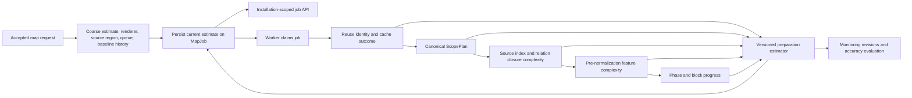

# Offline Map Preparation-Time Estimates Implementation Plan

## Status and scope

This plan was authored from `origin/main` at
`15d806613b680621b923b311ec30b2470fd4b349`. It is an implementation proposal,
not a description of functionality that is already deployed. Any thresholds,
field names, model versions, rollout modes, or performance targets below are
proposals until code, tests, benchmark evidence, and production rollout records
prove them.

The feature replaces the iOS app's requested-area-only preparation copy with a
server-owned estimate for the time between accepting a map job and publishing
its ready map artifact. The estimate must account for queueing, renderer and
pipeline behavior, aligned output blocks, selected source scope, reuse and
cache outcomes, and feature/geometry complexity. It must become more accurate
as the worker learns more about the job without pretending that the server can
know an exact completion time.

The first accuracy target is selected-area renderer-format-3 3D maps because
their cost is least correlated with requested area and final archive size. The
contract should remain general enough for renderer formats 1 and 2 without
changing their output bytes or reuse behavior.

## Current evidence

### Current iOS behavior

`SettingsView` shows an `Estimated Preparation` row for every nonterminal job
that has `geometry.areaKm2`. `OfflineMapPreparationTimeEstimate` converts only
that requested area into one of four static strings:

| Requested area | Current copy |
| ---: | --- |
| `< 10 km2` | `Usually under a minute` |
| `< 1,000 km2` | `Usually a few minutes` |
| `< 15,000 km2` | `May take 15-90 minutes` |
| `>= 15,000 km2` | `May take several hours` |

This calculation does not know the renderer format, aligned output block
count, selected source scope, Geofabrik region, source/cache state, building or
label density, reuse strategy, queue state, current phase, or elapsed time. A
small dense 3D selection and a sparse 2D selection therefore receive the same
copy when their requested areas are similar.

`OfflineMapJob` currently decodes geometry, source, progress, artifacts, and
reuse strategy. It does not decode the backend's `serverTiming`,
`phaseTimings`, or `artifactMetrics`. `OfflineMapJobProgress` does understand
selected-area preprocessing units such as `scope_plan`, `source_index`,
`relation_closure`, and `calibration_cells`, but it has no remaining-time
contract.

### Selected-area scope is not requested area

The checked-in Shanghai benchmark records the following renderer-format-3
selected-area scopes for a request of approximately 23.84 km2:

| Measurement | Recorded value |
| --- | ---: |
| Requested area | 23.840377 km2 |
| Aligned output area | 100.663296 km2 |
| Selected source area | 111.411200 km2 |
| Output blocks | 6 |
| Selected warm wall time | 57.257 s |
| Selected cold wall time | 100.570 s |
| Legacy warm wall time | 831.795 s |

Requested area is useful for admission control and user explanation, but the
worker actually pays for complete output blocks and a source/correctness
scope. The estimator must use the canonical `ScopePlan` rather than infer work
from the requested square kilometres.

### Read-only production observation on 2026-08-10

A successful selected-area Shanghai renderer-format-3 job observed on the
production server had:

| Measurement | Observed value |
| --- | ---: |
| Requested area | 15.970484 km2 |
| Aligned output area | 100.663296 km2 |
| Selected source area | 111.411200 km2 |
| Output blocks | 6 |
| Final ZIP bytes | 3,919,574 bytes |
| Processing time | 2,511.794 s (41m 51.8s) |
| Building normalization | 2,215.150 s (36m 55.1s) |
| Source extraction | 59.487 s |
| Selected preprocessing | 74.706 s |
| Feature conversion | 48.039 s |
| Building block encoding | 36.818 s |
| Packaging | 1.317 s |
| Calibration generation | 0.038 s, cache hit |
| Source buildings | 24,279 |
| Building outlines | 21,612 |
| Building parts | 2,667 |
| Encoded building points | 164,973 |

The final archive was only about 3.92 MB, and packaging took about 1.3 seconds,
while server preparation took almost 42 minutes. Final artifact MB is therefore
primarily a transfer/storage signal and cannot be the primary preparation-time
signal. The whole Shanghai source snapshot was about 25.5 MB, but that is also
not request-specific and did not explain the normalization cost.

The same observation reported 2 explicit relation associations, 2,600
containment associations, and 65 unassociated parts. Under the current
containment fallback, approximately 2,665 parts can scan 21,612 prepared
outlines, or roughly 57.6 million candidate checks before geometry costs are
considered. The checked-in benchmark had 279 parts, 70 relation associations,
202 containment associations, 7 unassociated parts, and 16,493 outlines. Its
corresponding fallback search space was roughly 3.45 million checks and its
building normalization took about 16.1 seconds.

These requests used different selections and source snapshots, so they are not
an apples-to-apples performance comparison. They do establish that total
building count alone is not a sufficient predictor. Part/outline association
shape and geometry complexity are important, and the estimator must be
versioned so a future spatial-index or topology optimization does not reuse
timing history from the current algorithm.

### Existing backend timing and monitoring surfaces

`MapJob.to_dict()` already returns:

- `serverTiming` with queue, processing, total seconds, and attempt count;
- `phaseTimings` with lifecycle and building/label durations;
- `artifactMetrics` with final scope, cache, building, label, point, block, and
  packaging measurements; and
- `progress` with phase/unit and block counters.

Those values are mostly retrospective. Final `artifactMetrics` are persisted
when `complete_job()` publishes the build result, after the estimate was needed.
Selected preprocessing does emit early scope and dependency progress, but it
does not persist an ETA or publish the feature-complexity counters immediately
before the expensive normalization pass.

The admin-only `GET /v1/admin/map-monitoring` endpoint and
`map-monitoring.sqlite3` retain terminal timing records for 90 days by default.
Schema version 1 stores renderer format, geometry mode, requested area, reuse
strategy, attempts, phase timings, and queue/processing/total duration. Its
summary query currently selects and groups only timing, status, attempt, and
renderer fields. It therefore cannot answer a cohort question such as
"successful selected-area renderer-3 jobs on this worker profile with six
blocks, a warm calibration cache, and dense building parts."

The production snapshot inspected for this research contained 32 terminal
runs, only 4 renderer-format-3 runs, and only one successful current
selected-area renderer-format-3 run. Legacy, selected, full-build, reuse,
failed, and retried observations must not be pooled into a learned estimate.
There is not yet enough comparable production evidence to advertise a narrow,
data-trained range.

## Product definition

### Preparation interval

For this feature, preparation begins when `POST /v1/map-jobs` durably accepts a
new job and ends when the job becomes `ready` with its immutable artifact
published. It includes:

- queue wait;
- source resolution/cache wait;
- exact/subset reuse validation;
- source extraction and dependency preprocessing;
- feature normalization/conversion;
- block and label encoding; and
- packaging, signing, hashing, and artifact storage.

It excludes downloading the ready artifact to the iPhone and transferring or
activating it on the ESP32. Those stages already have separate byte/progress
signals, and conflating them would make the estimate impossible to explain.

### Estimate semantics

The public estimate is a range for remaining preparation time as of the
server's `generatedAt` timestamp. It is not an SLA or exact countdown. The
range may be revised when the worker learns that reuse is available or
unavailable, the selected scope is larger than the request implied, the source
index reports dense data, a cache is cold, a retry begins, or a phase finishes.

The UI should say `Estimated Preparation` while queued and `Estimated
Remaining` after processing starts. Terminal jobs do not show the row.

## Goals

1. Replace requested-area-only copy with a server-authoritative, localized
   range that reflects the actual requested job and current worker pipeline.
2. Produce a useful coarse range at job creation or a clear `Estimating...`
   state, then refine it from canonical scope, reuse/cache, and feature
   complexity signals.
3. Keep estimates comparable only across compatible renderer, preprocessing,
   rules, algorithm, and worker-performance profiles.
4. Treat exact reuse, subset reuse, cold/warm dependencies, full builds,
   retries, and failures as distinct outcomes.
5. Quantify uncertainty and avoid false precision. A broad truthful range is
   preferable to an inaccurate minute count.
6. Persist enough safe telemetry to measure interval coverage, systematic
   underestimation, overestimation, revision stability, and phase error.
7. Preserve installation-scoped authentication. The app must not use an admin
   endpoint or contain a server-wide credential.
8. Preserve map artifact bytes, stable map IDs, reuse identities, manifests,
   signatures, renderer compatibility, and download behavior.
9. Make the estimator optional and backward-compatible so backend and iOS can
   roll out and roll back independently.

## Non-goals and constraints

### Non-goals

- No exact completion-time promise, SLA, or second-by-second countdown.
- No estimate derived primarily from final ZIP/stream bytes. Those bytes are
  not known until the expensive work is nearly complete.
- No single `features * constant` formula across renderers, regions, or
  pipeline versions.
- No external ML service, analytics SaaS, OSM enrichment, or third-party map
  data. Estimation uses the job, local source/index/cache state, and the
  backend's own retained timing records.
- No exposure of `/v1/admin/map-monitoring`, raw job history, other users'
  queue entries, source paths, cache paths, source URLs, or internal hashes to
  the iOS app.
- No change to FMB/FMA1/Bike Map Stream formats, firmware rendering, artifact
  signing, or map selection semantics.
- No performance fix to the building containment algorithm in this feature.
  Profiling and optimization may proceed separately, but their rollout must
  invalidate incompatible estimator history.
- No estimate before the user creates a job in the first release. A picker
  preflight endpoint is an optional later extension.

### Constraints

- API and worker images may be pinned to different immutable digests during a
  production promotion. An API process must not pretend that its own code
  identity describes the active worker.
- Job storage is file-backed and shared with worker/maintenance processes;
  estimate updates must use existing job locks and atomic writes.
- Monitoring SQLite runs in WAL mode with bounded retention and must remain
  safe across API, worker, and maintenance restarts.
- Old iOS clients must ignore the new optional field and continue completing
  jobs. New iOS clients must behave safely when talking to an old backend that
  omits it.
- Estimation must add negligible work compared with map generation and must
  never make artifact publication depend on monitoring availability.
- Estimate data is advisory and must be excluded from every artifact/reuse
  identity.

## Recommended architecture



Add a backend `PreparationEstimateCoordinator` with one pure, versioned
estimator used by both job creation and worker refinement. The API owns only
coarse request/queue context. The worker owns claims about actual reuse,
selected scope, source/cache identity, and feature complexity because it knows
the immutable producer and pipeline that will perform the build.

The current estimate is stored on `MapJob` and returned by the existing
installation-scoped job endpoints. Estimate revisions are written separately
to monitoring storage for evaluation; the public job payload exposes only the
latest validated revision.

The estimator should be hybrid:

1. A checked-in, versioned conservative baseline profile provides a range when
   compatible production history is sparse.
2. Compatible successful monitoring cohorts may refine, but never silently
   cross, renderer/preprocessing/performance boundaries.
3. Job-specific scope and complexity signals scale the relevant phase
   components.
4. A monitoring failure falls back to the baseline or `unavailable`; it never
   fails the map job.

Do not fit mutable regression coefficients online inside request handling.
Model/profile changes should be reviewed, versioned artifacts or checked-in
configuration so the same fixed model, job context, clock, and monitoring
snapshot produce the same range.

## Public job API contract

### Proposed optional field

Add the following optional object to `MapJob.to_dict()`:

```json
{
  "preparationEstimate": {
    "schemaVersion": 1,
    "modelVersion": "map-preparation-v1",
    "revision": 3,
    "state": "available",
    "generatedAt": "2026-08-10T03:15:00Z",
    "attempt": 1,
    "basedOnPhase": "building_preprocessing",
    "confidence": "medium",
    "remaining": {
      "lowerSeconds": 1500,
      "upperSeconds": 2700
    },
    "queue": {
      "lowerSeconds": 0,
      "upperSeconds": 30
    },
    "basis": [
      "baseline_profile",
      "historical_cohort",
      "scope_plan",
      "source_index",
      "feature_complexity",
      "calibration_hit"
    ],
    "sampleCount": 24
  }
}
```

Proposed semantics:

- `schemaVersion`: public decoding contract. Unknown versions are ignored by
  iOS rather than guessed.
- `modelVersion`: identifies estimator/profile behavior, not artifact bytes.
- `revision`: monotonically increases for a job, including retries.
- `state`: `pending`, `available`, or `unavailable`. Only `available` has a
  `remaining` range.
- `generatedAt`: UTC timestamp from which `remaining` is measured.
- `attempt`: attempt number whose evidence produced the estimate.
- `basedOnPhase`: current job status or progress phase used by the estimate.
- `confidence`: `low`, `medium`, or `high` under explicit sample/validation
  rules. It is diagnostic in v1; the UI need not print the word.
- `remaining`: estimated time from `generatedAt` until `ready`. When the job is
  queued, it includes queue wait.
- `queue`: optional informational subset of `remaining`; it is never added a
  second time by the client.
- `basis`: stable non-sensitive enums. It must not expose paths, job IDs,
  source hashes, model coefficients, or other installations' work.
- `sampleCount`: number of compatible successful historical observations used,
  or `0` for baseline-only estimates.

For `pending`, return the identity/revision/state/generated timestamp and omit
range fields. For `unavailable`, add only a stable optional reason enum such as
`insufficient_data`, `incompatible_worker`, or `temporarily_unavailable`.
Do not return exception messages.

Proposed validation limits are integer seconds with
`0 <= lowerSeconds <= upperSeconds <= 604800` (seven days). If a valid range
cannot be produced within that bound, publish `unavailable` rather than clamp a
misleading estimate. The seven-day cap is a proposal to review against the
largest admitted map job.

### Backward compatibility

- Existing clients ignore `preparationEstimate`.
- New clients decode it as optional and tolerate unknown `basis` values.
- An absent, pending, invalid, or unsupported estimate never blocks polling,
  cancellation, download, installation, or recovery.
- The API continues filtering stream artifact metrics under the existing
  rollout policy. The estimate contains no stream trust decision.
- A repeated idempotent `clientRequestId` returns the same job and latest
  estimate revision; it does not create a second estimate history.

## Estimation inputs and stages

### Stage 0: accepted/queued job

Available immediately from `MapJobService.create_job()`:

- target renderer and renderer format;
- normalized geometry mode and requested area;
- resolved source region ID/provider;
- current active/queued job inventory;
- current compatible worker heartbeat/profile, when available; and
- historical queue and coarse renderer/source-region cohorts.

This stage may return a broad low-confidence range. Requested area can be a
fallback feature for renderer formats 1/2, but it must not be the sole target-3
feature. If the control plane cannot identify a compatible active worker, use
`pending` or a deliberately broad baseline rather than an API-image estimate.

Publish a companion atomic worker-capability record beside the existing
timestamp heartbeat. Keep the current heartbeat file format intact for health
checks. The capability record is keyed by worker ID and contains a non-secret
`performanceCompatibilityKey`, configured worker-class token, supported
renderer/preprocessing modes, estimator model version, and expiry/heartbeat
time. This lets an API and worker pinned to different images detect
compatibility instead of assuming it. The public health response need not
expose these values.

For queue estimation, use estimates already persisted for jobs ahead and the
number of compatible active workers. If that topology is unavailable, use the
compatible historical queue p50/p95 and lower the confidence. Never expose
another job's position, ID, source, or duration to the client.

### Stage 1: worker claim and reuse resolution

When a worker claims the job:

- remove elapsed queue time from remaining work;
- bind the estimate to the worker performance profile;
- report source-cache wait separately when known; and
- retain a broad full-build envelope until reuse is confirmed under the
  existing source lease and compatibility validation.

Only emit `reuse_exact` or `reuse_subset` basis after the current fail-closed
reuse checks succeed. A candidate lookup is not enough. If reuse validation
fails and the job continues as a full build, publish a new revision before the
long build begins and record the prediction miss.

Exact and subset reuse have separate historical cohorts. They must never train
or narrow a full-build estimate.

### Stage 2: canonical scope plan

Selected target 3 already calculates a canonical `ScopePlan` containing output
blocks, output/source area, calibration cells, buffer, and policy identity.
After `scope_plan` progress, refine with:

- output block count;
- output and source area in integer square metres;
- source-to-output ratio;
- geometry mode;
- calibration/sample cell counts; and
- selected versus legacy preprocessing mode.

For formats 1/2, add an equivalent lightweight processing-scope summary rather
than pretending requested area equals processed work. This summary is
estimator telemetry only and does not change map selection or identity.

### Stage 3: source index, closure, and cache state

Selected preprocessing already knows source snapshot bytes, source-index
counts, closure candidate/way/node/relation counts, relation retries,
calibration cells, and cache hits/misses. Persist a safe estimator snapshot as
soon as those stages finish instead of waiting for final `artifactMetrics`.

The request-specific source-index query should additionally report, using
bounded integer counters:

- building seed ways/relations;
- provisional outline and part counts from tags/roles;
- explicit parent associations;
- candidates requiring containment fallback;
- total way-node/member counts; and
- invalid/over-limit counters.

The whole source-index node/way totals describe the Geofabrik snapshot and are
useful for cache cost, but request-specific closure counts are the more useful
job signal.

### Stage 4: pre-normalization feature complexity

Add a structured marker before `prepare_buildings()` enters the expensive
association/height pass:

```text
BUILDING_COMPLEXITY:{canonical bounded JSON}
```

Proposed counters:

- collected source buildings;
- outlines and parts;
- explicit-parent and unresolved-part counts;
- `unresolvedPartCount * outlineCount`, checked for integer overflow and
  capped for telemetry;
- polygon/multipolygon/ring/hole counts;
- source coordinate/vertex count;
- maximum coordinates per object; and
- invalid geometry/tag counts known before resolution.

Collect these while materializing the list already required by
`prepare_buildings()`; do not add a second full geometry parse. The marker must
appear before the current all-outlines containment loop. The worker parses it,
updates the estimate, and persists the revision before continuing.

Label candidate/glyph counts become available later and refine label/packaging
phases. Building record/point/block counts refine encoding after normalization.

### Stage 5: phase progress

Use phase-specific remaining components rather than multiplying one overall
percentage. Proposed components are:

1. queue/source-cache wait;
2. source index and calibration dependency preparation;
3. relation closure/source extraction;
4. building association and normalization;
5. ordinary feature conversion and label preparation;
6. building/label block encoding; and
7. packaging, signing, hashing, and artifact storage.

When a component finishes, replace its prediction with zero and use observed
elapsed time for accuracy reporting. During block encoding, use remaining
blocks plus compatible per-block history. Indeterminate preprocessing remains
indeterminate progress; an ETA must not manufacture a fake percentage.

Throttle durable revisions to phase changes or a material range change
(proposed: at least 60 seconds or 10%), and no more frequently than once every
5 seconds. A normal full build should produce at most 16 retained estimate
revisions. Retry, reuse confirmation, and terminal transitions bypass the
throttle.

## Versioning and compatible cohorts

### Performance compatibility key

Introduce an internal canonical key distinct from artifact identity:

```text
performanceCompatibilityKey = SHA256(canonical JSON of:
  estimatorFeatureSchemaVersion,
  runtimePerformanceProfileVersion,
  rendererFormatVersion,
  preprocessingMode,
  scopePolicyVersion,
  buildingProfileVersion,
  buildingRulesSha256,
  sourceIndex/closure/normalization algorithm versions,
  relevant GDAL/osmium/Shapely runtime profile,
  configured workerClass,
  workerConcurrencyClass
)
```

Record the exact producer build SHA/image digest separately for audit. Do not
key usable history only by exact image digest, because harmless releases would
discard every sample. Conversely, do not reuse history across an algorithm or
worker-class change merely because the renderer format stayed the same.

`runtimePerformanceProfileVersion` is a reviewed checked-in/configured value.
Changes to containment lookup, source indexing, geometry libraries, worker CPU
allocation, concurrency, or phase boundaries require a bump. CI should fail if
known performance-sensitive constants change without a reviewed profile
decision.

The performance key does not participate in stable map ID, build cache keys,
artifact manifests, stream signatures, or device compatibility.

### Cohort hierarchy

Choose history through a fail-closed fallback hierarchy:

1. exact performance key, renderer, preprocessing mode, outcome class, source
   region/density bucket, scope/block bucket, and cache class;
2. exact performance key and outcome/cache class with neighboring density and
   block buckets;
3. exact performance key and renderer/preprocessing mode;
4. versioned baseline profile; or
5. `unavailable` when no safe baseline exists.

Only terminal `ready` jobs with one successful attempt enter normal full-build
cohorts. Exclude failed, cancelled, expired, manually overridden, incomplete
telemetry, retrying, and known-regression runs. Keep retry outcomes in a
separate operational cohort. Exact/subset reuse are separate outcome classes.

Do not use raw bbox coordinates in cohort keys. Use source region ID,
integer scope metrics, and a derived density bucket to reduce location leakage
and avoid overfitting individual requests.

## Proposed deterministic range model

Version 1 should favor robust, explainable estimates over a general ML model:

1. A baseline profile supplies conservative phase ranges by renderer,
   preprocessing mode, output-block bucket, and density bucket.
2. With enough compatible samples, deterministic nearest-rank quantiles replace
   or widen baseline components. Proposed displayed bounds are p25 to p90 when
   well calibrated, and p10 to p95 for sparse/low-confidence cohorts.
3. Scope and complexity features apply nonnegative monotonic scaling to the
   corresponding phase only. Increasing blocks, source area, closure objects,
   unresolved-part search space, vertices, or label candidates cannot reduce
   predicted work before completed-phase subtraction.
4. Remaining component bounds are summed with a configured correlation safety
   margin, then bounded and validated.
5. Client formatting rounds outward; the backend never rounds inward and hides
   uncertainty.

A candidate target-3 normalization complexity score is:

```text
normalizationScore =
  outlineCount
  + partWeight * partCount
  + containmentWeight * (unresolvedPartCount * outlineCount)
  + vertexWeight * sourceVertexCount
  + relationWeight * closureCandidateCount
```

The weights must be nonnegative, fitted and validated offline from compatible
monitoring exports, then committed in the versioned baseline/model profile.
This formula is a proposal for evaluation, not an already validated model.
If the containment implementation becomes spatially indexed, bump the runtime
performance profile and replace the feature/formula instead of carrying its
quadratic assumption forward.

Proposed confidence rules:

- `low`: baseline only or fewer than 20 compatible successful observations;
- `medium`: at least 20 observations and the current model passes the rolling
  coverage gate; and
- `high`: at least 50 observations, at least 20 recent holdout observations,
  and all per-density coverage/width gates pass.

History may widen a conservative baseline at any sample count. It may narrow
the baseline only at `medium` or `high` confidence.

## Backend data model and persistence

### MapJob fields

Add validated optional fields:

- `preparation_estimate`: latest public-safe revision; and
- internal estimator context needed to resume after worker restart, containing
  only bounded counters/enums and the performance/model key.

Do not store an unbounded revision list in every job JSON. Add a
`JobStore.update_preparation_estimate_unless_cancelled()` method that:

- holds the existing queue/job lock;
- verifies worker ownership for worker-originated revisions;
- enforces monotonic revision and attempt values;
- validates finite bounded integer ranges and public enums;
- updates `updatedAt` and atomically saves the job; and
- does not change status, progress, build identity, or artifact fields.

A worker restart reconstructs context from the frozen scope/dependency inputs,
current progress, and latest estimate. It publishes a new revision if the
active performance/model key changed.

### Monitoring schema version 2

Migrate `map-monitoring.sqlite3` transactionally from schema version 1. Preserve
all existing rows and add nullable columns so older observations remain usable
only for compatible coarse cohorts.

Proposed terminal-run columns include:

- source region ID/provider;
- preprocessing mode and scope policy version;
- performance compatibility key, model version, exact producer build/image
  audit identity, and configured worker class;
- output block count, requested/output/source area, source bytes, and source
  expansion ratio;
- source-index/calibration cache outcome;
- closure candidate/way/node/relation counts and retry count;
- building source/outline/part/unresolved-part/containment counts;
- building point/vertex and label-candidate counts;
- outcome class (`full_build`, `exact_reuse`, `subset_reuse`, retry/failure);
- existing queue/processing/total and phase timings; and
- initial/final estimate coverage summary.

Add a bounded `map_estimate_revisions` table keyed by `(job_id, revision)` with
generated time, attempt, state, confidence, lower/upper/queue seconds,
model/performance keys, basis JSON, and sample count. Prune it under the same
retention transaction as terminal runs. A normal job is capped at the proposed
16 persisted revisions; rejected writes are counted and logged.

Migration requirements:

- migrate v1 to v2 in one `BEGIN IMMEDIATE` transaction;
- preserve the existing adoption path for the pre-`user_version` v1 table;
- validate every required table/column/index before committing;
- reject unknown future versions;
- keep WAL/busy timeout behavior; and
- make API startup failure explicit if the durable schema is inconsistent.

Monitoring unavailability after startup must not fail map generation. The
estimator falls back to its baseline profile, and the worker records a safe
warning.

### Admin and CLI surfaces

Extend, do not replace, `GET /v1/admin/map-monitoring` and
`monitoring-summary` with:

- counts by performance key, preprocessing mode, renderer, outcome/cache,
  block bucket, and density bucket;
- estimate interval coverage, upper-bound coverage, absolute/relative error,
  and range width;
- revision counts and revision-to-ready latency;
- exclusion counts/reasons; and
- baseline-versus-historical model comparison in shadow mode.

Keep existing response fields backward-compatible. Redact exact source
snapshot/build identities from ordinary summaries or expose them only under a
separate explicit admin diagnostic option. Never expose raw job geometry.

Emit a structured `map_preparation_estimate_updated` event containing job ID,
revision, attempt, state, model/performance profile prefix, ranges, confidence,
basis enums, and phase. Do not log bbox, source URL/path, client installation
ID, another job's details, or model internals.

## Expected implementation surfaces

Backend changes are expected in:

- new `map-platform/backend/map_platform/preparation_estimates.py` for typed
  contexts/results, profile loading, cohort selection, range calculation, and
  validation;
- `models.py` for the optional persisted/public job fields;
- `jobs.py` for atomic estimate updates and retry/terminal behavior;
- `worker.py` for refinement callbacks and monitoring writes;
- `pipeline.py` for early scope/dependency/complexity inputs and marker
  parsing;
- `monitoring.py` for schema v2 migration, estimate revisions, cohort queries,
  and accuracy summaries;
- `api.py` for public sanitization and mode/compatibility wiring;
- `cli.py` for worker-capability publication and monitoring audit output;
- a checked-in schema-validated estimator profile under
  `map-platform/backend/config/`; and
- backend/deploy README and environment documentation.

OSM extractor changes are expected in:

- `tools/OSM_Extract/scripts/building_source_index.py` for request-specific
  typed complexity counters; and
- `extract_features.py`/`building_pipeline.py` for one-pass pre-normalization
  complexity collection and the bounded `BUILDING_COMPLEXITY` marker.

iOS changes are expected in:

- `Models/OfflineMapPlatform.swift` for optional response decoding and range
  formatting;
- `Managers/OfflineMapManager.swift` to verify polling/background recovery
  always replaces the current estimate revision without starting a second job;
- `Views/SettingsView.swift` for queued/running/fallback presentation; and
- `BikeComputerTests/NavigationProtocolTests.swift` plus focused UI/presentation
  tests.

Test additions should remain beside the existing monitoring, worker, pipeline
progress, API, building, benchmark, and portable Swift test suites. No firmware
source change is expected.

## Detailed implementation plan

### Phase 0 - Baseline, hotspot, and contract freeze

1. Retain the 2026-08-10 production observation as a redacted benchmark record
   or reproduce it from an approved pinned source snapshot/request on the same
   worker class.
2. Profile `buildingNormalization`, particularly unresolved-part containment,
   before using the 41m52s result as a normal baseline. Record CPU, wall time,
   counts, vertices, cache outcomes, and producer/runtime identity.
3. Re-run the checked-in approximately 24 km2 Shanghai benchmark and at least
   sparse, medium, and dense selections at 1, 2, 4, and 6 output blocks.
4. Freeze public estimate schema v1, internal feature schema v1, performance
   profile rules, range semantics, and fallback copy before backend/iOS work.
5. Define which performance changes require profile invalidation and add that
   review item to map-platform changes.

**Exit gate:** benchmark evidence separates requested/output/source area,
artifact bytes, feature types, phase time, cache/reuse state, and the known
normalization hotspot. The team agrees the estimate means remaining server
preparation, including queue and excluding transfer.

### Phase 1 - Monitoring schema and estimator core

1. Add the v1-to-v2 SQLite migration, terminal feature columns, estimate
   revisions table, cohort queries, retention, and reconciliation.
2. Add `preparation_estimates.py` with typed context/result models, canonical
   performance keys, baseline profile loading, deterministic quantiles,
   monotonic component scaling, validation, and unavailable fallbacks.
3. Add a checked-in schema-validated baseline/model profile with an explicit
   SHA/model version. Reject malformed, negative, nonfinite, unordered, or
   unknown-version profiles at startup in `shadow`/`public` modes.
4. Add pure accuracy evaluation that joins retained revisions to actual
   terminal timing without modifying historical records.
5. Add CLI/admin shadow summaries and safe structured events.

**Exit gate:** a fixed synthetic monitoring snapshot produces byte-equivalent
estimate JSON across runs; schema migration preserves v1 timing rows; outliers,
failures, retries, and reuse cannot contaminate a full-build cohort.

### Phase 2 - Job model, API, queue, and worker profile

1. Add the optional estimate/current-context fields to `MapJob` serialization
   and strict backward-compatible deserialization.
2. Add atomic `JobStore` estimate updates and terminal/retry cleanup semantics.
3. Add an atomic expiring worker-capability record with non-public performance
   compatibility, worker class/concurrency, and estimator version. Preserve
   the existing numeric timestamp heartbeat used by health checks.
4. Wire a coordinator into `MapJobService` so creation writes either a coarse
   low-confidence revision or `pending`. Keep create latency bounded.
5. Add optional `preparationEstimate` to every installation-scoped job response
   through the existing `public_job()` sanitization path.
6. Add queue estimation from compatible active workers/jobs with a historical
   fallback. Fail closed to low confidence/pending on ambiguous topology.
7. Ensure idempotent job creation and installation authorization behavior are
   unchanged.

**Exit gate:** old job JSON and old clients remain valid; new clients cannot
read another installation's estimate; API/worker image mismatch yields pending
or low confidence rather than a false compatible estimate; no admin token is
used by the app.

### Phase 3 - Worker refinement and early complexity markers

1. Publish estimate revisions at claim, confirmed reuse outcome, source-cache
   wait, scope plan, dependency completion, pre-normalization complexity,
   normalization completion, block progress, and packaging.
2. Extend the source-index/closure result with request-specific part/outline,
   explicit-parent, member, and coordinate counters without changing closure
   semantics or identity.
3. Refactor building feature collection just enough to emit
   `BUILDING_COMPLEXITY` before containment/normalization, reusing the same
   materialized objects and relation index.
4. Extend pipeline streaming marker parsing with bounded schema validation and
   an estimate callback. Unknown/malformed markers fail estimator refinement,
   not the artifact build, unless they also violate an existing correctness
   contract.
5. Persist only material revisions under the throttle/cap. Monitoring failure
   falls back without changing map status.
6. Separate exact reuse, subset reuse, cold/warm source index, cold/warm
   calibration, relation retry, and full-build contexts.

**Exit gate:** the Shanghai dense fixture publishes a refined range before the
expensive containment loop; added telemetry costs no more than the proposed 2%
wall-time/CPU budget; artifact bytes and identities are unchanged.

### Phase 4 - iOS decoding and presentation

1. Add `OfflineMapPreparationEstimate`, bounded range, state, confidence, and
   basis decoding to `OfflineMapJob`. Treat all fields as forward-compatible
   optional values.
2. Verify `OfflineMapManager` polling, resume, and background recovery replace
   `currentJob` with the latest estimate revision without creating a new job or
   losing cancellation/download state.
3. Replace `OfflineMapPreparationTimeEstimate.description(for: areaKm2)` as the
   primary path with a formatter for server ranges.
4. Show `Estimating preparation time...` for pending/absent estimates. After a
   proposed 10-second grace period without a valid estimate, show the generic
   `Preparation time depends on map complexity` rather than the current
   requested-area claim.
5. Use `Estimated Preparation` while queued and `Estimated Remaining` once the
   worker starts. Hide the row for ready/failed/cancelled/expired jobs.
6. Format ranges outward and without false precision:
   - upper bound `< 60 s`: `Less than a minute`;
   - under 10 minutes: whole-minute outward bounds;
   - 10-60 minutes: outward 5-minute bounds; and
   - over 60 minutes: outward 15-minute or whole-hour bounds.
7. Do not second-by-second decrement the displayed value. Refresh when polling
   supplies a new server revision; optionally account for elapsed time only
   when doing so cannot narrow below the server lower bound.
8. For a retry, show `Re-estimating after retry...` until the next available
   revision. Never keep an under-a-minute reuse estimate after reuse failed.
9. Add localized strings, Dynamic Type layout, VoiceOver labels, dark/light
   previews, and deterministic formatter tests.

**Exit gate:** the app never derives a numeric estimate from requested area;
old backends receive safe generic copy; new estimates format correctly from
seconds through hours; map polling/download/install/recovery behavior is
unchanged.

### Phase 5 - Shadow validation and public rollout

1. Deploy backend `shadow` mode first. Generate and retain estimates but omit
   them from the public job payload.
2. Collect the minimum compatible sample matrix and compare baseline,
   scope-only, dependency, and feature-complexity revisions to actual results.
3. Review underestimation, overestimation, per-density coverage, retry/reuse
   classification, revision churn, and estimator overhead.
4. Enable `public` mode only for test installations and a compatible iOS build.
5. Run production Shanghai/dense, medium, sparse, exact-reuse, subset-reuse,
   source-cache-cold, calibration-cold, retry, cancellation, and worker-restart
   cases.
6. Expand rollout only after acceptance gates hold for the reviewed window.

**Exit gate:** public ranges meet accuracy/width gates, no artifact or queue
regression is observed, and both backend omission and app fallback rollback are
tested.

## iOS presentation examples

These are proposed copy examples, not hard-coded backend strings:

| State | Proposed value |
| --- | --- |
| No server revision yet | `Estimating preparation time...` |
| Low-confidence coarse full build | `About 30-60 min` |
| Refined active build | `About 20-35 min remaining` |
| Confirmed exact/subset reuse | `Less than a minute` |
| Retrying | `Re-estimating after retry...` |
| Unsupported/old backend after grace | `Preparation time depends on map complexity` |

The app may show a subtle `Based on map complexity` caption in a later UX
iteration, but raw MB, building counts, source hashes, or confidence jargon are
not required in the customer-facing row.

## Configuration proposals

| Configuration | Proposed default | Purpose |
| --- | --- | --- |
| `MAP_PLATFORM_PREPARATION_ESTIMATES_MODE` | `off` | `off`, `shadow`, or `public` |
| `MAP_PLATFORM_PREPARATION_ESTIMATE_MODEL_PATH` | checked-in profile | Versioned baseline/model document |
| `MAP_PLATFORM_ESTIMATOR_WORKER_CLASS` | unset/fail to low confidence | Reviewed performance class, not auto-detected marketing data |
| `MAP_PLATFORM_ESTIMATE_MIN_HISTORY_SAMPLES` | `20` | Minimum before history narrows baseline |
| `MAP_PLATFORM_ESTIMATE_HIGH_CONFIDENCE_SAMPLES` | `50` | Minimum before high confidence is possible |
| `MAP_PLATFORM_ESTIMATE_MAX_REVISIONS_PER_JOB` | `16` | Bound SQLite/job write amplification |
| `MAP_PLATFORM_ESTIMATE_MIN_UPDATE_SECONDS` | `5` | Revision throttle |
| `MAP_PLATFORM_ESTIMATE_MATERIAL_CHANGE_BPS` | `1000` | 10% range-change threshold |
| `MAP_PLATFORM_ESTIMATE_MAX_SECONDS` | `604800` | Proposed seven-day validation cap |

All values are proposals. Environment changes must remain aligned across
API/worker/maintenance composition and documented in backend/deploy READMEs.
`off` omits the public field and does not create revision telemetry. `shadow`
records revisions but omits them publicly. `public` records and returns the
latest validated revision.

## Alternatives and trade-offs

### Alternative A: keep client-side requested-area buckets

*Advantages:* no backend work and immediate copy.

*Costs:* requested area is not aligned output/source work, ignores density and
reuse, and is already contradicted by production 3D behavior. Reject as the
long-term design.

### Alternative B: estimate from final archive MB

*Advantages:* intuitive to users and useful for download/transfer duration.

*Costs:* final bytes are unknown until preparation is nearly complete and a
3.92 MB job took about 42 minutes to prepare. Keep bytes for transfer estimates,
not preparation.

### Alternative C: estimate from total feature count

*Advantages:* closer to conversion work than area.

*Costs:* total counts hide expensive feature types, geometry vertices,
part/outline association, labels, cache state, and algorithmic complexity. Use
typed counts as staged inputs, not one global feature multiplier.

### Alternative D: expose admin monitoring directly to iOS

*Advantages:* reuses an existing endpoint.

*Costs:* violates installation-scoped authentication, exposes operational
aggregates, and still lacks request-specific/refined context. Reject. The
backend should return only the current job's public-safe estimate.

### Alternative E: add a separate preflight estimate endpoint now

*Advantages:* can estimate before the user commits to a map job.

*Costs:* duplicates geometry/source/rate-limit/idempotency work, can race the
actual queue/cache/reuse state, and is unnecessary for the existing row shown
after job creation. Defer. The estimator module should be reusable if product
later wants picker preflight.

### Alternative F: live external/online ML regression

*Advantages:* may adapt automatically with enough data.

*Costs:* new availability/privacy/cost dependencies, hard-to-review model
changes, sparse cohorts, and poor fail-closed behavior. Reject for v1. Use a
versioned local deterministic model and retained local monitoring evidence.

### Alternative G: show a single exact minute or completion timestamp

*Advantages:* compact UI.

*Costs:* disguises uncertainty and becomes visibly wrong after cache/reuse or
geometry discoveries. Use an outward-rounded range and explicit re-estimation.

## Tests and acceptance gates

### Estimator unit tests

- Fixed clock, model, context, and monitoring snapshot produce identical JSON.
- All numeric inputs reject booleans, NaN, infinity, negative values, overflow,
  and lower-bound-greater-than-upper-bound ranges.
- Unknown model/profile/schema versions fail to pending/unavailable without
  failing a map job.
- Complexity scaling is monotonic and nonnegative for every feature.
- Failed/cancelled/expired/retried runs and reuse outcomes cannot enter the
  normal successful full-build cohort.
- Sparse cohort fallback order and baseline widening/narrowing rules are exact.
- Outliers use deterministic nearest-rank quantiles and cannot overflow ranges.
- Queue components are included once, disappear after claim, and reveal no
  other job data.
- Performance/rules/scope/worker-class version changes invalidate incompatible
  history.
- Exact/subset reuse ranges are emitted only after successful validation.
- A reuse miss publishes a full-build revision before long conversion.
- Completed phases contribute zero remaining time; retries reset the active
  attempt context without erasing audit history.

### Monitoring and persistence tests

- Fresh schema v2 creation, exact legacy-table adoption, v1-to-v2 migration,
  rollback on migration error, missing-column rejection, and future-version
  rejection are covered.
- WAL concurrency between API, worker, and maintenance does not produce lost
  or duplicate estimate revisions.
- Job estimate revision/attempt monotonicity and worker ownership fail closed.
- The proposed 16-revision cap, 90-day retention, prune/reconcile, restart, and
  idempotent upsert behaviors are deterministic.
- Old terminal rows with missing new columns remain available only to safe
  coarse cohorts.
- Monitoring failure falls back to baseline/unavailable while the map reaches
  `ready` with unchanged bytes.
- Admin summaries expose aggregate cohorts/accuracy only and redact geometry,
  installations, paths, URLs, and unrelated job details.

### Pipeline and complexity tests

- `BUILDING_COMPLEXITY` is emitted before containment/normalization and parsed
  with strict bounded JSON.
- Counter order and feature input order do not change the canonical estimator
  context.
- Relation parents, standalone parts, invalid geometry, multipolygons, holes,
  and large coordinate counts produce expected typed counters.
- `unresolvedPartCount * outlineCount` uses checked arithmetic and a documented
  telemetry cap without changing building correctness.
- Marker generation reuses the already materialized feature list and stays
  within the overhead gate.
- Existing scope, relation closure, height precedence, seam, FMB, FMA1, label,
  reuse, artifact, cancellation, and progress tests remain byte-compatible.

### API tests

- Create/get/list responses include or omit the optional object according to
  `off`, `shadow`, and `public` mode.
- Installation A cannot read Installation B's estimate; admin routes remain
  protected by the server-only token.
- Old job JSON without an estimate and new job JSON with every state round-trip.
- Unknown public schema/basis values do not corrupt job serialization.
- Idempotent create returns the same job/latest revision and does not consume a
  second job slot or duplicate telemetry.
- API/worker performance-profile mismatch yields pending/low confidence.
- Estimate updates do not alter map ID, exact/compatibility cache keys,
  artifact object keys, manifests, receipts, signatures, download URLs, or
  renderer negotiation.
- Estimate generation adds at most a proposed 100 ms p95 to job creation under
  the maximum retained monitoring sample and active-job limits.

### iOS tests

- Decode missing, pending, available, unavailable, unknown schema, unknown
  basis, and malformed range payloads safely.
- Format sub-minute, minute, 5-minute, 15-minute, hour, and seven-day boundary
  cases with outward rounding.
- Queued versus running titles, retry copy, terminal hiding, and 10-second
  generic fallback are deterministic under a test clock.
- An old backend never falls back to the requested-area numeric buckets.
- Polling a newer revision updates the row without affecting generation
  progress, cancellation, background recovery, download, or installation.
- Dynamic Type, long localized strings, VoiceOver, and dark/light presentation
  remain readable.
- Existing navigation and portable Swift test suites remain green.

### Accuracy and benchmark gates

Before public selected-area target-3 estimates, the proposed initial gate is:

- at least 30 successful one-attempt full-build shadow observations;
- at least 3 density buckets and at least 2 source regions, including a dense
  Shanghai selection;
- exact/subset reuse evaluated separately with at least 20 combined successful
  observations before advertising a narrow reuse range;
- at least 90% of actual remaining durations at each retained revision finish
  at or below the displayed upper bound overall and in every density bucket
  with at least 5 samples;
- at least 70% of actuals fall inside the full displayed interval;
- p95 underprediction ratio (`actual / upper`) is `<= 1.5`;
- median overprediction ratio (`upper / actual`) is `<= 2.0` for medium/high
  confidence;
- medium/high ranges are no wider than 2.5x (`upper / max(lower, 1)`), except
  sub-minute reuse; and
- telemetry/estimation adds no more than 2% to benchmark wall time or CPU and
  no more than 100 ms p95 to job creation.

The 30/20 samples, 90%/70% coverage, 1.5/2.0/2.5 ratios, 2% overhead, and
100 ms values are proposals. Review after shadow evidence, but document and
version any relaxation.

Run the pinned approximately 24 km2 Shanghai benchmark plus the production-like
dense selection after any containment/runtime change. Record:

- request/output/source areas and block IDs;
- source snapshot/rules/performance/model identities;
- cache/reuse outcomes;
- source/closure/outline/part/unresolved/vertex/label counts;
- each estimate revision and basis;
- actual phase and total durations;
- artifact byte/receipt identity; and
- CPU, peak memory, and estimator overhead.

Do not use the old 41m52s production observation as a permanent baseline if a
profiled pipeline fix materially changes it. Bump the performance profile and
collect a new shadow cohort.

## Artifact and identity invariants

Preparation estimates are mutable advisory job state. They must not be present
in or influence:

- `stable_map_id(job)`;
- exact or subset reuse keys/aliases;
- build compatibility identity;
- source/scope/calibration identity;
- ZIP manifest or preview identity;
- FMB/FMA1 bytes;
- Bike Map Stream canonical manifest/signature;
- artifact object keys, hashes, receipts, or download URLs; or
- firmware/app artifact compatibility.

A test should delete all estimate/monitoring state, rebuild the same pinned job,
and prove byte-identical artifacts and identities. Conversely, two estimate
revisions for the same running job must not create a new map or prevent reuse.

## Operational risks and mitigations

| Risk | Impact | Mitigation / rollback trigger |
| --- | --- | --- |
| Sparse or mixed history | Misleading narrow range | Compatibility keys, baseline floor, minimum samples, shadow gate |
| Known slow algorithm becomes learned normal | Product hides a performance regression | Phase profiling, performance-profile bump, benchmark review before public rollout |
| Pipeline changes without invalidation | Old timing applied to new runtime | Derived/reviewed compatibility key and CI profile-change gate |
| API and worker pins differ | Coarse estimate describes wrong code | Expiring worker-capability record; pending/low confidence on mismatch |
| Reuse predicted before validation | App promises under a minute then runs full build | Emit reuse basis only after source-lease validation; immediate revision on miss |
| Queue topology changes | Ready-time range drifts | Separate queue component, compatible worker count, historical fallback, low confidence |
| Monitoring corruption/contention | API or worker failure | Transactional migration, WAL, bounded queries, baseline fallback; never gate build |
| Revision churn | Flickering UI and write amplification | Phase/material-change throttle and 16-revision cap |
| Feature marker adds duplicate work | Estimator worsens preparation | Reuse materialized list, 2% overhead gate, disable refinement independently |
| Range systematically underestimates dense cities | Loss of trust | Per-density coverage gate, p95 ratio alert, automatic public-mode disable option |
| Range vastly overestimates reuse/small jobs | Feature becomes useless | Separate outcome cohorts and width/overprediction gates |
| Raw operational data leaks to client/logs | Privacy/security issue | Installation-scoped current estimate, enum-only basis, redacted admin/log fields |
| Advisory fields affect artifacts | Reproducibility/reuse regression | Explicit exclusion plus byte/identity golden tests |

## Rollout and rollback

1. **Offline baseline:** profile the dense normalization path and produce the
   benchmark/model profile without changing public responses.
2. **Telemetry schema:** deploy monitoring v2 and estimator code with mode
   `off`; validate migration/reconciliation and no map-build regression.
3. **Shadow estimates:** switch to `shadow`; inspect coverage and overhead for
   at least the proposed 30 selected full builds and required matrix.
4. **Backend public canary:** enable `public` only for reviewed test
   installations/compatible app identities if a server-side allowlist is
   needed. Keep iOS fallback safe.
5. **iOS rollout:** ship optional decoding/presentation after backend public
   payloads are stable. Old backend omission remains supported.
6. **Production expansion:** widen only after accuracy, width, cache/reuse,
   queue, retry, and benchmark gates remain green.

Backend changes follow the normal image workflow: merge through a PR, wait for
the attested Map Platform Image, review the digest-pinned production promotion,
complete required signed-worker/hardware gates, and verify deployment health.

Rollback order:

1. set `MAP_PLATFORM_PREPARATION_ESTIMATES_MODE=shadow` or `off` through the
   reviewed deployment path so the API omits the field;
2. the iOS app shows generic fallback copy while map jobs continue normally;
3. if schema/runtime rollback is required, restore the complete previous
   digest-pinned Compose lock through a PR; and
4. retain v2 monitoring data for forensic export. Do not downgrade or delete
   the SQLite schema in place; an older image that cannot read v2 must fail
   startup rather than corrupt it. Provide an explicit forward-compatible
   rollback reader or deploy a reviewed v2-capable rollback image.

No map artifacts need deletion or regeneration when disabling estimates.

## Open decisions

1. Must the containment fallback be spatially indexed/profiled before public
   numeric target-3 estimates, or is a broad low-confidence range acceptable
   during the optimization? This plan recommends profiling first.
2. Which fields define `runtimePerformanceProfileVersion`, and should CI use a
   maintained performance-sensitive path list or an explicit per-PR decision?
3. What reviewed worker-class token represents production CPU/concurrency, and
   how is it kept aligned between the worker-capability record, API, and
   monitoring?
4. Should queue wait be shown separately in the UI (`Waiting for server`) or
   remain only a component of the preparation range?
5. Should low/medium/high confidence be customer-visible, accessibility-only,
   or operational-only? This plan recommends operational-only for v1.
6. Is the proposed pre-normalization counter set sufficient, or should the
   source index add a spatial complexity histogram before GDAL conversion?
7. Should baseline profiles live in checked-in backend config or in a
   digest-pinned deployment artifact? This plan recommends checked-in config
   for reviewability.
8. What public fallback copy should be localized when an old backend omits the
   field? This plan proposes `Preparation time depends on map complexity`.
9. When should a picker preflight estimate be added, and can it share job
   admission/rate-limit/idempotency logic without creating split behavior?
10. Should renderer formats 1/2 enter public rollout with target 3, or remain on
    generic copy until their compatible cohorts and processing-scope metrics
    are available?
11. Is seven days the correct maximum range for the largest admitted job?
12. Should public mode automatically fall back to generic copy when rolling
    upper-bound coverage drops below the reviewed threshold, or require an
    operator decision?

## Execution checklist

- [ ] Record the implementation branch's exact `origin/main` base.
- [ ] Freeze preparation interval, API schema, estimator feature schema, and
      performance compatibility contract.
- [ ] Profile/reproduce the dense Shanghai normalization observation and rerun
      the pinned approximately 24 km2 benchmark matrix.
- [ ] Implement and test monitoring schema v2 migration and bounded estimate
      revisions.
- [ ] Add the versioned deterministic estimator and checked-in baseline/model
      profile.
- [ ] Add optional `MapJob` estimate state, atomic updates, and API
      serialization without changing artifact identity.
- [ ] Add the compatible worker-capability record and queue estimation
      fallback without changing the health heartbeat format.
- [ ] Publish worker revisions for claim, reuse, scope, dependencies,
      pre-normalization complexity, phase/block progress, retry, and packaging.
- [ ] Add source-index complexity counters and the bounded
      `BUILDING_COMPLEXITY` marker without duplicate geometry work.
- [ ] Extend admin/CLI monitoring with cohort and accuracy summaries.
- [ ] Replace iOS requested-area buckets with optional server-range decoding,
      localized formatting, and safe generic fallback.
- [ ] Pass estimator, migration, API/auth, pipeline, iOS, artifact-identity,
      retry/restart, and compatibility tests.
- [ ] Run `off` -> `shadow` -> installation canary -> public rollout and retain
      benchmark/accuracy evidence.
- [ ] Verify rollback by omitting the API field and restoring generic app copy
      without affecting map jobs or artifacts.

## Definition of done

The feature is complete only when all of the following are evidenced:

- A nonterminal map job can carry a validated optional server estimate range,
  revision, confidence, phase, and public-safe basis under installation-scoped
  authentication.
- The app no longer derives numeric preparation time from requested area and
  safely handles new, old, pending, unavailable, malformed, retrying, and
  terminal server states.
- Selected target-3 estimates use canonical output/source scope, confirmed
  cache/reuse state, request-specific source-index data, and typed geometry
  complexity published before the expensive normalization pass.
- Full build, exact reuse, subset reuse, cold/warm dependency, retry, failure,
  cancellation, and worker-profile outcomes remain separate.
- Monitoring schema migration is durable, bounded, restart-safe, and produces
  cohort/accuracy evidence without exposing private geometry or other users'
  jobs.
- Incompatible renderer, rules, algorithm, scope policy, runtime, and worker
  profiles cannot reuse timing history.
- Shadow/public ranges satisfy the reviewed sample, coverage, width,
  under/overprediction, latency, and overhead gates, including the dense
  Shanghai and approximately 24 km2 benchmark cases.
- Estimate generation and revision cannot fail a map job, and estimate or
  monitoring state has no effect on map/artifact/reuse/signature identity.
- Backend omission and iOS generic fallback rollback are tested, and the
  digest-pinned production promotion/rollback procedure remains intact.
