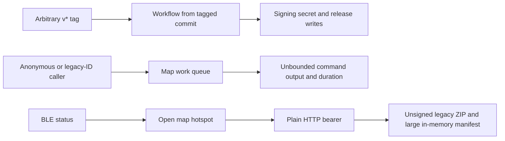
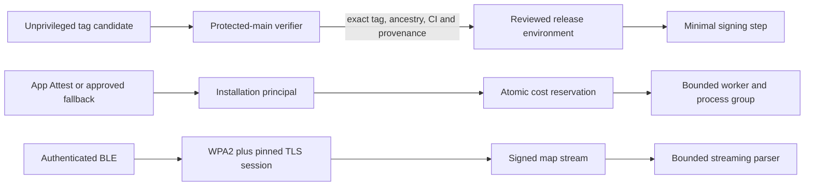

# Repository Audit Remediation Implementation Plan

## Status and baseline

This is an implementation plan only. It does not close any finding, change a
GitHub setting, publish a branch, build or deploy software, or validate either
Waveshare device physically.

The plan was authored on 2026-08-27 on local branch
`plan/repository-audit-remediation`, rebased directly onto the then-current
GitHub `main` commit
`718e32b3ed9e798d2c7c7ef6e734435b559003ca`. The prior audit was last
validated at `1e544f3ba3f8f26fb137c83f880b241269423d29`. The intervening `main`
changes are confined to the Strava route-import implementation and its
documentation/tests plus an immutable development map-platform image
promotion; they do not touch the open finding paths below.

Before starting any implementation pull request, fetch `origin`, rebase the
work onto the then-current `origin/main`, and repeat the finding-specific
checks. GitHub rules, environments, collaborators, secrets, and Actions
settings are live state and must be queried again rather than inferred from
this point-in-time plan.

## Selected Design And Constraints

The selected design is a set of independently reviewable changes joined by
three durable trust boundaries:

1. A tag may request a release build, but only a workflow definition loaded
   from protected `main`, after validating the exact tag and build provenance,
   may enter the firmware-signing environment.
2. A caller-supplied installation ID is routing data, never proof of identity.
   Production installation issuance is attested, every private map operation
   requires the installation secret, and expensive work consumes an atomic,
   cost-weighted reservation before it enters the queue.
3. Authenticated BLE bootstraps every device-transfer session. A map transfer
   uses a per-session WPA2 hotspot credential and a BLE-pinned TLS identity;
   production firmware ultimately accepts only the signed map stream.

Local correctness fixes remain separate from those migrations: the legacy FMB
reader becomes alignment-safe, generic multipolygons retain every component
and hole, debug rasterization becomes opt-in, subprocess execution gains hard
budgets, watch URLs require confirmation, and the legacy archive parser becomes
streaming and bounded.

### Security and compatibility invariants

- No reusable production secret is embedded in the iOS or watchOS app.
- A legacy UUID, query parameter, map ID, job ID, or bearer value shared by
  multiple installations can never establish ownership.
- Idempotent retries do not consume a second admission reservation.
- A retryable worker error remains observably `QUEUED`; it never passes through
  a terminal `FAILED` state.
- Firmware releases remain immutable and continue to carry the existing build,
  factory-bundle, signature, and GitHub attestation chain.
- Candidate code and artifacts cannot execute with or read a signing secret.
- Release recovery continues to consume already-immutable assets and cannot
  mint or replace a release.
- Transfer credentials are generated per session, never logged, and revoked on
  BLE-session loss, generation change, explicit stop, or timeout.
- Every parser has explicit limits for input bytes, records, nesting, strings,
  aggregate expansion, and allocations. Allocation failure is a typed rejection,
  not a reboot or partial activation.
- Existing signed-map-stream validation remains fail closed throughout rollout.
- The IceNav-derived renderer architecture and full-screen LVGL buffer strategy
  are not changed by this work.
- CI and simulator evidence are not presented as physical-device evidence.
  Flashing either board requires a separate, device-specific confirmation.

### Current and target boundaries





### Decisions and rejected shortcuts

| Area | Selected design | Why | Shortcut not selected |
| --- | --- | --- | --- |
| Firmware releases | Unprivileged candidate workflow plus protected-default-branch publisher and reviewed environment | The workflow that receives secrets is not sourced from the tag and independently proves the candidate SHA | Adding only a semantic-version regex to the existing tag workflow still lets tagged code reach secrets |
| Installation identity | Keychain installation credential, production App Attest enrollment, and request assertions for expensive operations | A public app cannot safely carry a global secret, while attestation raises the cost of automated enrollment and replay | Treating an installation UUID or the old shared bearer as proof merely renames the original flaw |
| Map admission | Atomic cost reservations across installation, IP, and global capacity | Request count alone does not reflect area, renderer, source, or worker cost | Raising the anonymous IP quota or queue cap only changes the exhaustion threshold |
| Device transport | Per-session WPA2 plus a separate device TLS identity pinned over authenticated BLE | It protects the bearer and payload on hotspot and LAN paths without inventing a custom transport cipher | WPA2 alone does not protect the LAN fallback; request HMAC alone does not provide confidentiality |
| Generic polygon holes | Deterministic decomposition to bounded hole-free polygons in the existing generic FMB representation | It fixes geometry without forcing an immediate new renderer format on every deployed device | Dropping holes is incorrect; introducing FMB v5 before measuring decomposition cost expands rollout risk unnecessarily |
| Legacy archive parsing | Streaming schema parser with an SD-backed compact index and hard limits | Peak RAM becomes independent of manifest size within fixed buffers | Lowering the 2 MiB limit alone can still duplicate nearly the entire allowed input |

If generic-polygon decomposition cannot meet the amplification and equivalence
gates in this plan, stop that work package and design a ring-aware FMB version
as a separately reviewed protocol migration. Do not silently discard holes.
Likewise, if BLE-pinned TLS cannot meet the device memory and throughput gates,
stop the transport rollout and document a hotspot-only, replay-safe alternative
for review; do not fall back to a plaintext reusable bearer on LAN.

## Source Revision And Drift Check

### Open finding inventory

| Audit ID | Still-observed behavior on the baseline | Primary evidence path |
| --- | --- | --- |
| 1 | Any pushed `v*` tag selects the workflow source and can reach the signing job | `.github/workflows/firmware-release.yml` |
| 4 | The legacy FMB decoder dereferences 16-bit values at potentially odd addresses | `esp32/lib/maps/src/maps.cpp` |
| 5 | Map mode starts an open hotspot, exposes a token over HTTP, and retains the unsigned legacy archive route | `esp32/lib/device_transfer/device_transfer_http.cpp`, `esp32/lib/map_transfer/map_transfer.cpp` |
| 6 | Several map reads/cancel paths accept an unregistered installation ID as sufficient ownership scope | `map-platform/backend/map_platform/api.py` |
| 7 | Anonymous callers can enqueue expensive jobs subject mainly to an IP count and a global active-job cap | `map-platform/backend/map_platform/api.py` and backend admission configuration |
| 8 | Privileged workflows use mutable Action version tags and repository SHA-pinning enforcement is disabled | `.github/workflows/*.yml` and live GitHub Actions settings |
| 9 | Generic `MultiPolygon` extraction keeps only `coordinates[0][0]`, dropping other components and holes | `tools/OSM_Extract/scripts/funcs.py` |
| 10 | Every non-empty block renders a 4096 by 4096 PNG into `test_imgs` | `tools/OSM_Extract/scripts/extract_features.py`, `tools/OSM_Extract/scripts/funcs.py` |
| 11 | `CommandRunner.run_streaming` retains all output, only frames newline progress, and has no wall deadline | `map-platform/backend/map_platform/pipeline.py` |
| A | A valid watch custom URL drains directly into `startOutdoorCyclingWorkout()` | `BikeComputerWatchApp.swift`, `WatchWorkoutManager.swift` |
| B | Legacy archive validation loads up to 2 MiB of JSON, duplicates file objects, and has no manifest file-count cap | `esp32/lib/map_transfer/map_transfer.cpp` |

PR #292 improved the dedicated building-relation pipeline, but it did not
change the generic `get_geoms` path in finding 9. PR #297 rotated and hardened
the signed map-stream trust material, but it did not remove the legacy archive
path in findings 5 and B. Those improvements must be preserved rather than
counted as closure for the broader findings.

### Closed findings retained as regression gates

| Audit ID | Current closure to preserve | Regression evidence |
| --- | --- | --- |
| 2 | Firmware publication refuses replacement and verifies the immutable release and assets | `.github/scripts/tests/test_workflow_policy.py`, successful tag release `v0.3.4-release.1` |
| 3 | Retryable map failures are persisted directly back to `QUEUED` | `map-platform/backend/tests/test_worker.py::test_retryable_failure_is_never_observable_as_terminal` |

### Required recheck at each implementation start

1. Record `git ls-remote origin refs/heads/main` and the proposed PR base SHA.
2. Diff each evidence path from this plan's baseline to that SHA.
3. Query repository rulesets, branch protection, Actions permissions,
   `sha_pinning_required`, deployment environments, reviewers, and bypass rules.
4. Search merged PRs for an overlapping fix and run its tests before duplicating
   work.
5. Update the finding matrix with `open`, `partially mitigated`, `fixed in
   source`, `deployed`, and `physically validated` as separate states.

### External design constraints checked

The release split follows GitHub's documented `workflow_run` boundary: the
later workflow can receive secrets and write tokens even when the first is
unprivileged, and GitHub therefore warns against checking out or executing
untrusted content in that privileged workflow. See GitHub's
[`workflow_run` event documentation](https://docs.github.com/en/actions/reference/workflows-and-actions/events-that-trigger-workflows#workflow_run)
and [secure-use guidance](https://docs.github.com/en/actions/reference/security/secure-use).
The pinning work also follows GitHub's repository option requiring Actions to
use [full-length commit SHAs](https://docs.github.com/en/repositories/managing-your-repositorys-settings-and-features/enabling-features-for-your-repository/managing-github-actions-settings-for-a-repository).

The installation design follows Apple's server-verification contract: each
attestation/assertion uses a unique server challenge, the server validates the
app identity and environment, later assertions cover the request data, and the
stored assertion counter must increase. See Apple's
[App Attest server validation guide](https://developer.apple.com/documentation/devicecheck/validating-apps-that-connect-to-your-server).

## Affected Components

| Component | Planned source changes | Planned test or operational evidence |
| --- | --- | --- |
| Release orchestration | Split `.github/workflows/firmware-release.yml`; add a protected publisher/verifier; minimize permissions and secret scope | `.github/scripts/tests/test_workflow_policy.py`, candidate/publisher negative tests, one non-production release rehearsal |
| Workflow supply chain | Pin every external Action and reusable workflow by full commit SHA; add update automation and a policy scanner | Workflow policy unit tests, `actionlint`, live setting receipt |
| Backend API identity | `map_platform/api.py`, installation storage, rate limits, data migration, monitoring | `test_api.py`, `test_installations.py`, `test_rate_limits.py`, auth matrix and replay tests |
| Backend admission and execution | Durable reservation storage, worker claim/release logic, `CommandRunner`, metrics | `test_worker.py`, `test_pipeline_progress.py`, new command-runner and load tests |
| iOS managed-service client | `BicinoServiceSession.swift`, `OfflineMapPlatform.swift`, `OfflineMapManager.swift`, Keychain and attestation client | `ios-app/BikeComputerTests`, development/production configuration tests, migration tests |
| Firmware transfer server | `device_transfer_http.*`, BLE DSTS contract, transfer state, TLS identity storage | `test_device_transfer_http_limits.cpp`, `test_device_transfer_network_protocol.cpp`, BLE protocol tests, both-board benchmarks |
| iOS device transfer | `DeviceTransferManager.swift`, BLE status decoder, hotspot configuration, pinned TLS session | iOS host tests, connection/revocation tests, both-board transfer matrix |
| Firmware map installation | `map_transfer.*`, map-stream capability policy, legacy archive flags | `test_map_transfer.cpp`, `test_map_stream_install.cpp`, malformed/fuzz corpus, heap traces |
| Firmware FMB decoding | Extract a pure bounded legacy decoder from `maps.cpp` | `test_map_block_format.cpp`, unaligned v1-v4 fixtures under ASan/UBSan |
| OSM extraction | `funcs.py`, `extract_features.py`, packaging callers and CLI | new geometry fixtures, `test_feature_types.py`, `test_map_format.py`, target-3 CLI tests |
| watchOS launch policy | `BikeComputerWatchApp.swift`, `WatchWorkoutManager.swift`, root confirmation UI | `WatchWorkoutManagerTests.swift`, URL and HealthKit-start negative tests |
| Documentation and operations | BLE protocol, map rollout runbook, backend README, release runbook, incident/rollback commands | Link and policy checks; signed settings/deployment receipts where supported |

## Ordered Work Packages

Each work package should be one reviewable pull request unless its acceptance
tests require an inseparable client/server pair. Feature flags default to the
current compatible behavior until the corresponding migration gate is met.

### WP0 - Freeze contracts, limits, and evidence

Dependencies: none.

1. Create a checked-in remediation matrix that maps every audit ID above to
   owner, PR, feature flag, source status, deployment status, and physical
   validation status. Do not use a single ambiguous `done` field.
2. Capture current production capability telemetry without logging tokens,
   passphrases, installation IDs, map IDs, or request bodies:
   app build, firmware renderer target, signed-stream support, legacy ZIP use,
   anonymous/registered job creation, manifest file counts, command wall time,
   output bytes, and queue cost.
3. Define versioned error codes and metrics before behavior changes:
   `installation_attestation_required`, `installation_credential_required`,
   `legacy_map_access_retired`, `admission_capacity_exhausted`,
   `command_wall_time_exceeded`, `command_output_truncated`,
   `manifest_limit_exceeded`, and `legacy_map_archive_disabled`.
4. Set initial bounded-parser constants from the largest retained production
   fixtures. The starting review values are 2 MiB manifest bytes, 8,192 files,
   240 UTF-8 bytes per path, eight JSON nesting levels, no duplicate normalized
   paths, and cumulative uncompressed bytes no greater than both the artifact
   contract and free storage minus the existing reserve. Adjust them only from
   captured evidence and record the reason.
5. Document every feature flag, its safe default, owner, removal condition, and
   maximum compatibility lifetime. A flag must not become a permanent bypass.

Acceptance:

- The baseline can distinguish old-client traffic from new-client traffic
  without retaining identifiers or secrets.
- Every later work package has a named rollback flag or an explicit reason it
  is not safely reversible.
- The two already-closed findings have regression tests in the required CI set.

### WP1 - Alignment-safe legacy FMB decoding

Dependencies: WP0 limit definitions.

1. Extract the legacy v1/v2 base polygon/polyline decoder from `maps.cpp` into
   a pure component that accepts `std::span<const uint8_t>` or an equivalent
   pointer/length view.
2. Implement a checked little-endian cursor with `readU8`, `readLE16`,
   `readLEI16`, and bounded byte-slice operations. Use byte assembly or
   `memcpy`; never cast an arbitrary byte address to a wider integer pointer.
3. Check count multiplication and offset addition before advancing. Reject
   truncated, overflowing, excessive-count, trailing-byte, or invalid-bounds
   inputs with a stable format error.
4. Keep the rendering structures and output semantics unchanged. The renderer
   consumes decoded values only after the full block has passed structural
   validation.
5. Route all legacy-version callers through the same decoder so a future edit
   cannot reintroduce an unchecked v1 path.

Tests:

- Golden v1-v4 blocks produce the same decoded primitives as the baseline.
- Each fixture is decoded from offsets zero through seven in a padded buffer.
- Truncation at every byte boundary, maximum counts, count overflow, invalid
  bounds, and trailing bytes fail deterministically.
- Host tests run with AddressSanitizer and UndefinedBehaviorSanitizer.
- Production firmware builds use `esp32/tools/build_firmware.py` for both
  Waveshare production environments; hardware rendering is a later explicit
  validation gate.

Acceptance:

- No decoder-relevant cast from arbitrary FMB bytes to `uint16_t *` or
  `int16_t *` remains.
- Unaligned fixtures pass on the host and malformed fixtures do not allocate
  based on unvalidated counts.

### WP2 - Correct generic polygon extraction and opt-in debug images

Dependencies: WP0 geometry/output budgets. Independent of WP1.

1. Replace the `MultiPolygon` shortcut in `get_geoms` with schema validation
   that constructs every component as `Polygon(component[0], component[1:])`.
   Treat a `Polygon` identically: first ring is the exterior and remaining
   rings are interiors.
2. Normalize ring closure/orientation deterministically, reject non-finite
   coordinates, repair only the explicitly supported invalidities, and emit a
   typed diagnostic for dropped geometry. Do not silently select a component.
3. After clipping, decompose polygons with interiors into deterministic,
   hole-free simple polygons accepted by the existing FMB base-polygon
   encoding. With the repository-pinned Shapely 2.0.7, triangulate the complete
   ring vertex set, intersect candidates with the source polygon, flatten the
   polygonal results, and reject any result that still contains an interior
   after the bounded decomposition pass. Quantize and validate the union, then
   sort output by a stable geometry key so repeated runs are byte-identical.
4. Apply per-source-feature and per-block amplification caps. If decomposition
   would exceed the cap, fail that build with a typed geometry-limit error;
   do not fill the hole or omit the rest of the multipolygon.
5. Add area/symmetric-difference equivalence checks to test tooling. Coverage
   of the decomposed pieces must equal the clipped source polygon within the
   quantization tolerance, pieces must not overlap in their interiors, and no
   piece may cover a source hole.
6. Make PNG rendering opt-in with `--debug-image-dir` and
   `--debug-image-limit`. Default both local and backend production invocations
   to no images. Reject a debug directory inside `VECTMAP` so images cannot be
   packaged accidentally.
7. Render explicit-debug polygons through a per-feature mask so interior rings
   remain transparent instead of being painted with the global background.

Tests:

- Add fixtures for disjoint multipolygon islands, one component with a hole,
  multiple holes, clipping across a hole, invalid rings, and an amplification
  limit case.
- Assert component count, area equivalence, deterministic FMB bytes, and
  absence of pixels inside holes in an explicit debug image.
- Assert default extraction creates neither `test_imgs` nor PNG artifacts.
- Run the OSM extraction unit suite and backend artifact validation against
  target 1, target 2, and target 3 outputs.

Acceptance:

- Every valid generic multipolygon component survives extraction and holes are
  absent from the filled FMB geometry.
- Production map output contains no debug image, and ordinary extraction no
  longer pays the 4096 by 4096 allocation/render cost.

### WP3 - Bounded subprocess execution

Dependencies: WP0 metrics and typed errors.

1. Give `CommandRunner.run_streaming` explicit `wall_timeout_seconds`, optional
   `idle_timeout_seconds`, `max_captured_output_bytes`,
   `max_progress_record_bytes`, and `termination_grace_seconds` arguments.
   Production call sites must pass a named policy; tests may use a small
   default policy.
2. Use an incremental UTF-8 decoder and frame on both carriage return and
   newline. Coalesce CRLF, emit progress records as they arrive, and cap a
   record that never produces a delimiter.
3. Replace the unbounded list/join with a byte-bounded head-and-tail or tail
   ring. Include truncation counts and the retained diagnostic tail in typed
   failures. Callbacks receive streamed records but do not imply retention.
4. Enforce wall time with `time.monotonic()`. On timeout, cancellation, or
   callback failure, signal the entire process group with `SIGTERM`, drain for
   the configured grace period, then use `SIGKILL` and reap every child.
5. Preserve existing cgroup OOM and peak-RSS observations. Add wall-time,
   idle-time, raw-output bytes, retained-output bytes, truncation, termination
   reason, and exit status to command metrics.
6. Inventory every caller. Commands whose machine-readable result is currently
   parsed from stdout must either receive a justified finite capture budget or
   write the result to a bounded file. Progress-only commands must not request
   full capture.
7. Define separate policies for source download/index, generic extraction,
   building preprocessing, conversion, packaging, and verification. Feed a
   timeout or cancellation into the normal retry classifier only where the
   operation is known to be safe and bounded to retry.

Tests:

- Child fixtures emit LF progress, CR progress, CRLF, split UTF-8 code points,
  a delimiter-free record larger than the cap, and output larger than the
  capture ring.
- A child that forks a grandchild is fully terminated on deadline and cancel.
- A silent child hits the configured idle deadline; a noisy child still hits
  the wall deadline.
- Errors expose only the bounded diagnostic tail and report truncation.
- Existing progress parsing and retry-state tests continue to pass.

Acceptance:

- Retained command output is bounded independently of command duration.
- No production subprocess can run without a wall-clock policy.
- Timeout and cancellation leave no live process group or partial success
  state.

### WP4 - Pin the GitHub Actions supply chain

Dependencies: none. Land before changing the privileged release architecture
so later reviews show immutable action identities.

1. Enumerate `uses:` in all workflow and composite-action YAML. Pin every
   external Action and reusable workflow to a full 40-character commit SHA,
   retaining the human-readable release tag in a comment.
2. Pin any workflow-level container image by digest or record it as a separate
   exception with owner and expiry. Local actions remain path references.
3. Extend `test_workflow_policy.py` with a YAML-aware repository-wide check:
   external `uses:` values must match the full-SHA form, local paths are
   allowed, and mutable branches/tags are rejected.
4. Add `actionlint` to CI and configure Dependabot's `github-actions` ecosystem
   so pinned revisions still receive reviewable update PRs.
5. After the source PR merges, enable the repository's
   `sha_pinning_required` Actions setting. Query it back through the GitHub API
   and retain the response with the implementation evidence.

Acceptance:

- Repository policy tests reject a newly introduced mutable Action tag.
- Live `sha_pinning_required` is true after rollout.
- Existing release, image, Pages, diagnostics, runtime, and CI workflows pass
  at their pinned revisions.

### WP5 - Separate firmware release intake from signing authority

Dependencies: WP4; preserve WP0 regression gates.

1. Split the release into an unprivileged candidate workflow triggered by
   semantic-version release tags and a publisher triggered by completion of
   that named candidate workflow. The publisher file must live on and execute
   from the repository default branch.
2. Give the candidate only read permissions required to run ordinary CI,
   diagnostics, and both production builds. It may upload artifacts but has no
   signing, release-write, Pages-write, GitHub App private key, or deployment
   environment access.
3. Make the publisher's first job a metadata-only gate. Using code checked out
   from protected `main`, before downloading or executing candidate content,
   verify all of the following:

   - event repository and candidate workflow identity match this repository;
   - the event is a successful tag run, not a branch or fork run;
   - the tag matches the repository's release-version grammar;
   - the event head SHA equals the current peeled tag target;
   - the commit is an ancestor of the current protected `origin/main`;
   - required CI and diagnostics completed successfully for that exact SHA;
   - artifact names, target set, embedded full SHA, runtime attestation,
     factory-bundle manifest, and checksums form one internally consistent set;
   - no release with the tag already exists.

4. The privileged publisher must not restore candidate-writable caches, execute
   candidate binaries/scripts, interpolate candidate text into shell code, or
   process candidate archives before the metadata gate succeeds. After the
   gate, treat candidate artifacts as hostile data until the expected names,
   sizes, digests, paths, and embedded provenance have all passed protected-main
   verification.
5. Pass the verified SHA, tag, candidate run ID, artifact digest set, and gate
   receipt to later jobs as immutable outputs. Re-resolve the tag immediately
   before signing and publishing to close the retargeting window.
6. Create a dedicated `firmware-release` GitHub environment with at least one
   required reviewer, no admin bypass, and tag rules limited to the release
   grammar. Store signing and release-preflight credentials only there. Keep
   `github-pages` as a separate deployment environment, and split signing/
   release publication from the downstream Pages deployment so each job enters
   only the environment appropriate to its authority.
7. Scope the manifest private key to the single signing step rather than job
   `env`. That step runs only repository-owned, protected-main signing code and
   consumes already-validated data files; candidate artifacts are never
   executed.
8. Add a tag ruleset for `v*` that restricts creation to the release authority,
   blocks updates and deletion, and has an explicit, minimal bypass list. Record
   the ruleset ID and read-back JSON.
9. Keep draft-first publication, exact asset verification, immutable release
   conversion, release attestation verification, and the default-branch-only
   Pages recovery flow intact.
10. Plan a later move from a long-lived private key to a cloud KMS/HSM reached by
   GitHub OIDC. That is additional defense in depth, not a prerequisite for
   closing the tag-to-secret path once the protected publisher is in place.

Negative tests and rehearsal:

- Tag a commit not on `main`, retarget a tag after candidate completion, submit
  a malformed version, omit one target, alter an embedded SHA, alter an asset,
  rerun an old candidate, and pre-create the release. Each attempt must fail
  before environment approval or secret access.
- A fork or branch run must not trigger the publisher.
- A valid protected-main candidate requires environment approval, publishes
  once, becomes immutable, verifies all assets, and produces a receipt joining
  tag, SHA, candidate run, publisher run, artifacts, and release ID.
- Pages recovery succeeds only from those immutable assets and has no signing
  secret.

Acceptance:

- No workflow definition selected by an arbitrary tag can access a signing or
  release-preflight secret.
- A tag outside protected `main` cannot reach environment approval.
- The immutable-release regression from audit finding 2 remains green.

### WP6 - Establish installation principals and retire ID-as-bearer access

Dependencies: WP0 telemetry. Server and iOS changes may be separate PRs but
must deploy in the ordered compatibility sequence below.

1. Introduce one backend dependency that resolves an `InstallationPrincipal`
   from `clientInstallationId` plus `X-Installation-Token`. Use constant-time
   token verification and return the same not-found response for another
   installation's resource as for a missing resource.
2. Require that principal on map-job create/list/get/cancel, display-name,
   library/download-receipt mutations, map-pack metadata, and download-URL
   creation. Signed artifact-download URLs remain short-lived capabilities but
   may only be minted by the owning principal.
3. Remove optional-auth branches from these handlers. Treat query installation
   IDs strictly as an asserted routing key that must equal the authenticated
   principal.
4. Do not auto-claim a legacy job from a matching UUID or the old global bearer.
   A current app that cannot authenticate an old pending job recreates it with
   the same idempotent request parameters under its new principal. A legacy
   ready artifact is exposed only through an explicitly public catalog policy,
   never through guessed ownership.
5. Version the compatibility behavior with server flags:

   - `observe`: authenticated clients use the new path; legacy access is counted;
   - `read-only`: legacy clients cannot enqueue or cancel and receive an upgrade
     response for mutations;
   - `disabled`: all private legacy access returns a stable upgrade/credential
     error and no resource data.

6. Update `BicinoServiceSession` to register or refresh before any managed map
   operation, keep the credential in Keychain, attach it uniformly, and retry
   once after an authenticated refresh. Remove `legacyBearerToken` and
   UserDefaults fallback only after the disabled gate has held through the
   agreed support window.
7. Make local migration explicit: preserve display names and requested bounds,
   mark unauthenticated remote job references stale, resubmit nonterminal work,
   and never report an old server job as recovered unless the new principal
   owns it.

Tests:

- Build an endpoint matrix covering missing ID, ID only, token only, malformed
  token, wrong principal, valid principal, expired signed URL, and replayed URL.
- Assert list/get/cancel and all download-minting routes reveal no cross-owner
  existence or metadata.
- Assert the old global bearer cannot replace an installation token.
- iOS migration tests cover fresh install, valid Keychain credential, rotated
  server secret, missing Keychain state, an App Attest key invalidated by app
  reinstall or restore, legacy pending job, and resubmission. A replacement
  attested key creates a new principal; possession of the old installation
  token alone cannot rebind the lost key or claim its jobs.

Acceptance:

- No private map endpoint accepts a client installation ID without proof of its
  registered credential.
- No code path turns knowledge of a legacy ID into a new credential or resource
  claim.

### WP7 - Attested enrollment and cost-aware admission control

Dependencies: WP3 command budgets and WP6 principal model.

1. Add a short-lived, single-use installation challenge endpoint. Production
   first issuance submits an Apple App Attest key attestation bound to the
   challenge, app identifier, and environment. After verification, the server
   issues the installation ID and credential and binds them to that attested
   key. Persist only the material required to verify later assertions.
2. Require a fresh server challenge and an App Attest assertion over a canonical
   digest of that challenge, method, path, installation ID, idempotency key,
   renderer/profile identity, and request body for expensive map creation.
   Consume the challenge once, require the assertion counter to increase
   strictly, serialize concurrent assertions for a key, and reject replay.
   Evaluate DeviceCheck only as a documented fallback for devices on which App
   Attest is unavailable.
3. Keep a separate development channel that can use a locally configured test
   attestation provider. Production must fail closed if attestation storage or
   verification is unavailable; there is no global app API key bypass.
4. Derive a conservative integer cost before creating a job from requested
   area, source regions, renderer target, 3D-building mode, estimated block
   count, and known cache state. Store policy version and inputs with the job.
5. Reserve capacity atomically across four dimensions: installation rolling
   budget, IP enrollment/create budget, global queued cost, and global running
   cost. Idempotent replay returns the original job without another charge.
6. Convert queued reservation to running reservation during claim, renew it
   with the worker lease, and release it on terminal state, cancellation, stale
   lease reconciliation, or rejected publication. Use a durable reconciliation
   command to repair leaked reservations after a crash.
7. Reserve a small operator/health capacity partition so abusive public work
   cannot prevent maintenance or recovery. Return structured `429`/`503`
   responses with bounded `Retry-After`; do not reveal global tenant details.
8. Join command wall-time, peak memory, output, and actual processed-block
   metrics back to the cost-policy version. Tighten estimates from evidence but
   never lower hard safety ceilings automatically.

Tests and load validation:

- Attestation challenge replay, assertion replay, wrong app/environment/key,
  counter rollback, invalid body digest, unavailable verifier, and development
  bypass in production all fail closed.
- Parallel requests cannot exceed any atomic quota and an idempotent race
  creates one job/reservation.
- Cancellation, worker crash, retry, stale lease, and terminal publication
  release or retain exactly the intended reservation.
- A load test demonstrates bounded queued cost and memory while anonymous,
  unattested, and over-budget callers receive no worker allocation.

Acceptance:

- Anonymous callers cannot create map jobs in production.
- Mass public installation issuance alone is insufficient to enqueue work
  without valid app attestation and available cost budget.
- No admitted job can escape the subprocess deadlines from WP3.

### WP8 - Secure device-transfer bootstrap and signed-stream cutover

Dependencies: WP0 telemetry. Coordinate firmware, iOS, and BLE documentation.

1. Generate a cryptographically random WPA2 passphrase for every hotspot
   transfer mode, including `map`. Remove the mode-specific open-AP branch.
   Publish SSID and passphrase only in DSTS over the authenticated BLE
   notification path; redact them from serial logs and diagnostics.
2. Add a dedicated device TLS key/certificate lifecycle separate from the map
   signing key and BLE authorization key. Store the private key in protected
   device storage, expose its certificate fingerprint through authenticated
   BLE, and rotate through a versioned migration rather than silently changing
   a trusted identity.
3. Serve transfer endpoints over TLS on both hotspot and LAN. The iOS transfer
   session accepts only the certificate fingerprint delivered for the current
   authenticated BLE generation; system/public CAs and trust-on-first-use are
   not substitutes on this local endpoint.
4. Keep a random per-session HTTP authorization token inside the TLS channel.
   Bind it to transfer mode, BLE connection identity, and transfer generation.
   Revoke it and stop accepting new requests on BLE disconnect, authenticated
   session replacement, timeout, explicit stop, or completed activation.
5. Never place the token in a URL, UI, metric, or log. Use an authorization
   header, `Cache-Control: no-store`, bounded request headers, and the existing
   request-generation check.
6. Add explicit firmware capabilities for `secureTransferV1`,
   `signedMapStreamV1`, and legacy archive policy. iOS selects a transfer only
   after capability negotiation; it never downgrades from secure/signed to
   legacy in response to a transport error.
7. During the compatibility window, allow a legacy archive only on firmware
   that explicitly advertises it and only if its canonical manifest is covered
   by the existing map-signing trust chain. Do not treat a ZIP hash supplied by
   the same transport as an authenticity proof.
8. Once signed-stream telemetry covers the supported app/firmware floor,
   disable legacy archive issuance in the production backend, disable legacy
   archive install in production firmware, and remove the iOS downgrade code.
   Old firmware receives update guidance rather than an unsigned map.
9. Update `docs/ble-protocol.md` and the rollout runbook with the certificate
   fingerprint, session-generation, revocation, error, and capability contract.

Tests:

- Map, diagnostics, debug, and firmware-update hotspot paths all require WPA2.
- Wrong certificate, stale BLE generation, stale token, token from another
  mode, reconnect, timeout, AP restart, and LAN/hotspot transition fail closed.
- Packet/log inspection finds neither passphrase nor token outside the
  authenticated BLE/TLS boundary.
- A transport failure cannot trigger an unsigned downgrade.
- Signed stream transfer, resume, verification, activation, and post-reconnect
  state refresh continue to work.

Acceptance:

- A map hotspot is never open.
- A reusable bearer is never sent over plaintext HTTP.
- Production map activation accepts only content authenticated by the trusted
  map-signing key after the cutover gate.

### WP9 - Bounded streaming legacy archive validation

Dependencies: WP0 constants. Land before or with WP8 even though legacy
archives will later be disabled; local/imported archives remain hostile input.

1. Replace `readTextFile(..., kMaxManifestBytes)` plus `fileObjects()` with a
   schema-specific streaming JSON reader using fixed-size input/token buffers.
   Reject unknown duplicate keys, excessive nesting, invalid UTF-8, unsafe
   controls, noncanonical paths, and trailing data.
2. Validate one file descriptor at a time. Write the normalized descriptor to
   a compact staging index on SD, including fixed-size digest bytes, path
   offset/length, declared bytes, and verification state. Do not retain the
   full JSON or a vector of per-file JSON substrings in RAM.
3. Enforce the WP0 file-count/path/manifest limits before creating each index
   record. Check integer operations, cumulative declared bytes, free-space
   reserve, archive entry count, duplicate normalized paths, local/central ZIP
   agreement, metadata/extra-field sizes, compression ratio, and exact extracted
   bytes.
4. Authenticate the canonical manifest before trusting descriptors. For signed
   streams, continue incremental signature/hash verification. For a temporary
   legacy archive, require the signed envelope introduced by WP8 before any
   activation.
5. Make extraction transactional: write only under the staging generation,
   mark each verified record, fsync receipts as required, and atomically expose
   the map only after every descriptor and renderer file passes validation.
6. Catch allocation failures at the archive boundary, clear partial state, and
   surface `manifest_allocation_failed` or the more specific bounded-parser
   error through DSTS. Never continue with a partial descriptor set.
7. Delete the compact index and partial files on rejection, cancellation, or
   successful activation according to the existing transaction recovery rules.

Tests and fuzzing:

- Cover zero files, exactly 8,192 files, one over the cap, maximum path, one
  over the path cap, duplicate paths after normalization, manifest at/over byte
  cap, nesting, invalid UTF-8, integer overflow, ZIP disagreement, zip bomb,
  truncated data, and simulated allocation failure.
- Power-cut/restart fixtures at every index/extraction/receipt phase recover to
  either the prior active map or a fully verified new map.
- Run the parser corpus under host ASan/UBSan and a coverage-guided fuzzer.
- Measure peak internal heap, PSRAM, stack high-water mark, SD temporary bytes,
  and install time on both production targets with the largest supported pack.

Acceptance:

- Peak manifest-parser RAM is bounded by fixed buffers and does not scale with
  the number of files.
- Over-limit and allocation-failure inputs reject cleanly without reboot,
  partial activation, or damage to the active map.

### WP10 - Require user confirmation for watch URL workout starts

Dependencies: none.

1. Change `handleLaunchURL` to validate and enqueue a short-lived
   `PendingWorkoutLaunchRequest`; it must never call or schedule
   `startOutdoorCyclingWorkout` directly.
2. Present a foreground confirmation state in `WatchWorkoutRootView` with
   explicit Start and Cancel actions. Include workout type and source without
   trusting display text from the URL.
3. Expire the request on timeout, background transition, replacement by a new
   request, setup failure, or an already-active workout. Reopening a URL must
   not accumulate tasks or duplicate a start.
4. Keep strict scheme, host, path, and query validation. Unknown parameters,
   duplicate values, or non-canonical requests are ignored and recorded only as
   redacted diagnostics.
5. If one-tap complication launch is still a product requirement, implement it
   later as a reviewed App Intent/system-mediated action with Apple's workout
   authorization behavior; do not use a generic custom URL as a hidden consent
   bypass.

Tests:

- Opening a valid URL causes zero HealthKit start calls before confirmation.
- Confirm starts exactly once; cancel, expiry, backgrounding, invalid URL,
  duplicate URL, unavailable HealthKit, and active workout start zero times.
- Recovery and direct in-app start paths remain unchanged.

Acceptance:

- No custom URL can start a workout without a fresh foreground user action.

### WP11 - Remove compatibility flags and close the audit

Dependencies: all applicable work packages and rollout gates.

1. Re-run the original exploit/reproduction for every finding against the exact
   release candidates, not only unit-test fixtures.
2. Remove anonymous job creation, optional installation authentication, old
   global bearer storage, unsigned archive issuance/installation, plaintext
   device HTTP, and the compatibility flags whose exit criteria are satisfied.
3. Search for stale downgrade paths and old environment variables. Update
   deployment templates so a missing security setting fails startup rather
   than restoring legacy behavior.
4. Re-query GitHub rules, Actions settings, environments, reviewers, bypasses,
   release immutability, and exact workflow SHAs. Attach receipts to the closure
   review.
5. Mark source, CI, staging, production, and physical-device validation
   separately for every finding. A finding closes only at the level supported
   by evidence.

## Compatibility And Migration

### Recommended rollout sequence

1. Land WP1-WP4 and WP10. These are local correctness/policy changes with no
   intentional production protocol break.
2. Land and rehearse WP5, then apply its GitHub environment, ruleset, and
   Actions-setting changes. Do not create the first real release until the
   negative-path rehearsal passes.
3. Ship the iOS credential/attestation support from WP6-WP7 while the backend is
   in `observe`. Measure enrollment and authenticated-map success.
4. Stop legacy map mutations, then require authenticated principals for all
   private reads after the supported app floor is met. Resubmit local pending
   requests under the new principal; do not claim legacy server rows.
5. Ship TLS/WPA2/signed-stream-capable firmware and iOS support from WP8 with
   the bounded parser from WP9. Validate both production boards explicitly.
6. Disable production unsigned archives and legacy client access, observe one
   full release interval, then remove fallback code and flags in WP11.

### Compatibility matrix

| Client/device | During migration | Final state |
| --- | --- | --- |
| New app, new firmware | Attested installation, secure transfer, signed stream | Supported |
| New app, old firmware with signed stream but no TLS | Explicit update-required response once secure transfer is enforced | Unsupported after cutoff |
| Old app, new firmware | No silent downgrade; update guidance | Unsupported after app cutoff |
| Old app, old firmware | Read-only only during the measured compatibility window; no new expensive work | Unsupported |
| Legacy server job known only by UUID | Recreate nonterminal request under the authenticated principal | Never claimable by UUID |
| Public catalog artifact | Governed by explicit catalog visibility and signed artifact policy | May remain public; not confused with private ownership |

Database/schema migrations must be additive first: add principal, attestation,
cost-policy, and reservation fields; deploy readers that tolerate null legacy
rows; backfill only nonsecurity metadata; then enforce non-null values for new
rows. Never synthesize credentials for existing IDs.

## Tactical Protections During Migration

Before the structural changes are fully deployed:

- Restrict release-tag creation/update/deletion and require manual approval on
  the current signing environment as soon as operationally possible.
- Reduce anonymous map-create limits, cap global queued cost conservatively,
  and alert on enrollment/create bursts. This reduces exposure but does not
  close findings 6 or 7.
- Prefer signed map streams whenever both sides advertise them and emit a
  redacted metric whenever a legacy archive is selected.
- Require a WPA2 passphrase for map hotspots before enabling LAN/TLS work. This
  narrows hotspot exposure but does not by itself close the plaintext-LAN path.
- Disable debug PNG generation in production invocations immediately through
  configuration once the opt-in switch exists.
- Configure conservative external worker deadlines while the per-command
  policies are being calibrated.

Each tactical protection must be labeled `partial mitigation` until the
structural acceptance criteria are satisfied.

## Tests And Security Validation

### Required automated suites

Run the smallest affected suites in each PR and the full gates before the
rollout PR:

```sh
python -m unittest discover -s .github/scripts/tests
python -m unittest discover -s map-platform/backend/tests
python -m unittest discover -s tools/OSM_Extract/tests
python -m unittest discover -s esp32/tools/tests
(cd esp32 && python tools/build_firmware.py WAVESHARE_AMOLED_175_PRODUCTION)
(cd esp32 && python tools/build_firmware.py WAVESHARE_AMOLED_206_PRODUCTION)
(cd ios-app && ./scripts/run-navigation-tests.sh)
(cd ios-app && ./scripts/xcodebuild-cli.sh \
  -project BikeComputer/BikeComputer.xcodeproj \
  -scheme BikeComputer -destination 'generic/platform=iOS' \
  CODE_SIGNING_ALLOWED=NO build)
```

Use the repository wrappers rather than a raw `pio run` or raw `xcodebuild`
when the wrapper defines the project contract. Add focused watch test commands
to the existing iOS script set if the watch target is not covered by the
ordinary build.

### Adversarial validation matrix

| Boundary | Required adversarial case | Expected result |
| --- | --- | --- |
| Release | Tag points outside `main`, tag moves, candidate artifact SHA differs, candidate workflow is rerun | Publisher stops before environment/secrets |
| Workflow | Mutable external `uses:` added | CI policy fails |
| Installation | ID only, stolen job ID, wrong token, replayed attestation, issuance flood | No data/work; stable auth/admission error |
| Queue | Many parallel high-cost requests and idempotent races | Atomic caps hold; one reservation per logical request |
| Process | Infinite output, silent hang, forked child, cancellation race | Bounded memory, whole group reaped, typed failure |
| Transfer | Open-AP attempt, wrong TLS pin, stale token/generation, forced downgrade | Connection or authorization fails closed |
| Archive | Zip bomb, duplicate path, excess files, allocation failure, power cut | No reboot/partial activation; old map remains active |
| FMB | Odd-aligned buffer and truncation at every boundary | Valid fixture decodes; malformed fixture rejects |
| Geometry | Multiple islands and holes crossing block boundaries | Deterministic area-equivalent output |
| Watch | Crafted valid URL without screen confirmation | Zero workout starts |

### Evidence discipline

For every work package, retain:

- exact source SHA and dirty-state check;
- exact test commands and exit results;
- feature-flag/config state;
- staging and production deployment identity where relevant;
- GitHub rules/environment read-back where relevant; and
- device model, stable serial, firmware artifact SHA, app build, and observed
  behavior for any separately authorized physical validation.

A successful build is not proof of deployment, and a deployment is not proof
of device behavior.

## Performance And Resource Benchmarks

Record baselines and candidate results using identical fixtures and host/device
conditions. The thresholds below are release gates, not optimization targets.

| Change | Metric and gate |
| --- | --- |
| FMB checked cursor | No material frame-time regression on the retained renderer benchmark; zero sanitizer findings |
| Generic polygon decomposition | Byte-identical repeat runs; symmetric-difference within quantization tolerance; fail before exceeding the reviewed per-feature/per-block amplification cap |
| Debug image opt-in | Default extraction creates zero PNGs and avoids the 4096 by 4096 image allocation |
| Command runner | Retained output never exceeds configured bytes plus fixed decoder overhead; deadline overshoot no more than termination grace plus scheduler tolerance |
| Admission | Queued/running cost never exceeds configured capacity under parallel load; reconciliation returns leaked reservations to zero |
| Device TLS | On both production boards, no watchdog reset or transfer starvation; record TLS handshake heap, minimum free internal heap, PSRAM, stack high-water, throughput, and battery/power impact |
| Archive parser | Peak parser RAM stays within fixed-buffer design for one-file and 8,192-file manifests; active-map integrity survives all limit and power-cut cases |
| Full transfer | Signed-stream installation remains within the agreed user-facing transfer-time budget on both hotspot and LAN |

Do not weaken validation to meet a benchmark. If TLS or geometry decomposition
misses a gate, stop and review the alternate architecture documented above.

## Rollout And Rollback

### Release and GitHub controls

Roll out source policy first, then environment/ruleset/settings changes, then a
non-production candidate and negative-path rehearsal. Rollback may disable the
publisher and restore the previous immutable release/Pages content, but it must
not re-enable a tag-sourced signing secret. If publishing is blocked, pause
releases while correcting the protected publisher.

### Backend identity and admission

Move `observe` to `read-only` to `disabled` only after authenticated success,
attestation availability, error rate, and legacy-traffic thresholds are met.
Rollback can return one stage for already-authenticated clients or temporarily
pause new work. It must not restore ID-only ownership or anonymous expensive
jobs. Preserve reservation ledgers during rollback and run reconciliation.

### Device transfer and archives

Roll out by explicit capability intersection and both-board validation. Keep the
last known-good signed firmware artifact available. Rollback may disable LAN,
pause map transfer, or return to the previous signed-stream build for devices
that already support it. It must not restore an open AP, plaintext reusable
bearer, unsigned production archive, or accept a map signed by an untrusted key.

### Geometry and process changes

Retain representative known-good map artifacts and compare exact outputs.
Rollback the extractor or command policy if it creates incorrect maps or false
timeouts, while keeping debug rendering disabled and external worker caps in
place. Never serve a newly generated artifact that failed geometry or artifact
validation.

### Watch launch change

Rollback may remove URL-start support entirely. It must not restore automatic
workout start from a generic URL.

## Acceptance Criteria

The remediation program is complete only when all of the following are true:

1. The exact current `main` SHA has been re-audited and no merged change has
   invalidated the plan's assumptions.
2. An arbitrary tag cannot select code that receives signing credentials or
   release-write authority; protected-main ancestry and artifact provenance are
   verified before a reviewed environment is entered.
3. All external Actions are full-SHA pinned, policy-enforced in CI, and live
   GitHub SHA-pinning enforcement is enabled.
4. No private map operation treats an installation ID as a credential, and
   production job creation requires both a registered principal and valid
   attestation/admission capacity.
5. Queue and process cost, memory, output, wall time, and child lifetime remain
   within explicit bounds under adversarial load.
6. Device map transfer uses per-session WPA2 and BLE-pinned TLS; tokens are
   scoped/revoked and never cross plaintext transport.
7. Production map activation has no unsigned legacy downgrade. Any retained
   local archive path is authenticated, bounded, transactional, and fuzzed.
8. Legacy FMB input is decoded without unaligned integer dereferences and all
   malformed boundary fixtures reject cleanly.
9. Generic multipolygons preserve all components and holes with deterministic,
   area-equivalent output, and debug PNGs are absent by default.
10. A watch custom URL cannot start HealthKit work without fresh foreground
    confirmation.
11. Immutable release publication and direct `QUEUED` retry persistence remain
    protected by regression tests.
12. Source, CI, staging, production, and both-board physical evidence are
    reported separately; no finding is marked physically validated without the
    corresponding authorized device run.

## Open Decisions

These choices require product/operator input or measurements before their
named work package exits review; they do not block the earlier independent
packages:

- Name the required reviewer(s) and minimal bypass actor for the
  `firmware-release` environment and `v*` tag ruleset.
- Choose the KMS/HSM provider and key-rotation window for the post-remediation
  signing-key migration.
- Set the minimum supported iOS build, firmware versions, observe/read-only
  thresholds, and legacy cutoff window from WP0 telemetry.
- Confirm whether DeviceCheck is an acceptable production fallback when App
  Attest is genuinely unavailable, and define its tighter quota.
- Approve the first cost-policy weights and global/operator capacity partition
  from staging load measurements.
- Confirm the 8,192-file and geometry-amplification caps against the largest
  retained production map corpus.
- Decide whether one-tap complication workout start remains a requirement. If
  yes, scope an App Intent follow-up; generic URL auto-start remains prohibited.

No open decision authorizes a temporary return to tag-sourced secrets,
ID-as-bearer ownership, anonymous expensive work, open map hotspots, plaintext
bearers, unsigned production maps, unbounded parsers/processes, dropped geometry,
or workout auto-start from a URL.
