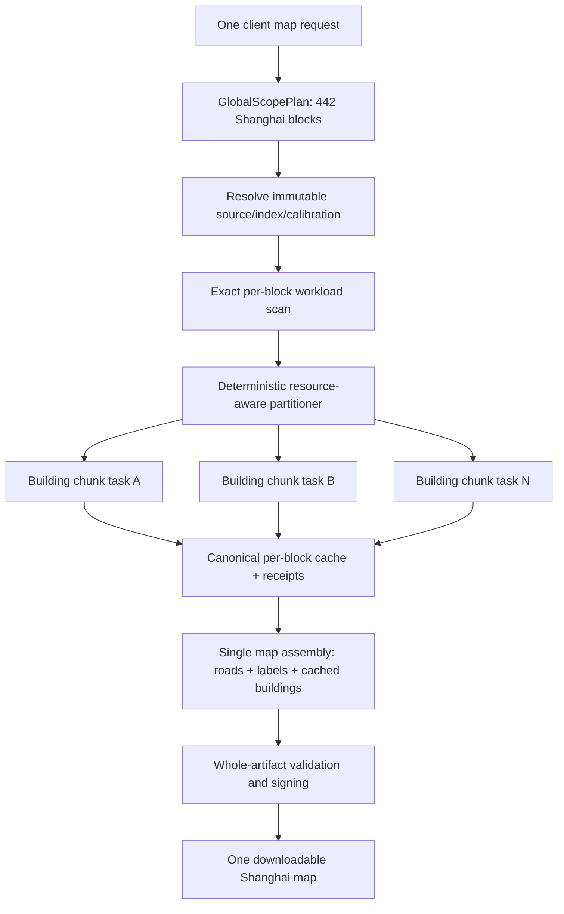

# Shanghai City-Scale 3D Map Orchestration Implementation Plan

## Status and scope

This document is the implementation contract and rollout plan. It was authored on branch
`docs/shanghai-3d-map-long-term-plan` from `origin/main` at
`796b35c9b94c436a3269feffe1c30adffca2f7d9`.

The selected-area pipeline, source-snapshot index, sealed calibration
generation, bounded relation closure, canonical FMB v4 building block cache,
and 1,200 km² source-area hard cap already exist. This plan begins at that
shipped boundary. It defines the remaining architecture needed to generate one
large 3D map of Shanghai without raising a monolithic job's memory limits until
it happens to pass.

Implementation status as of 2026-08-19: Phase 0 evidence is checked in as
machine-readable benchmark fixtures, the read-only worker cgroup/resource
report exists, and Phase 1 global planning has a deterministic shadow path.
Phase 2's SQLite WAL parent/task/attempt/receipt store, lease fencing, crash
recovery, authenticated diagnostics, and operator inspection commands are now
implemented, including durable exact-workload receipt handoff, canonical
global-to-chunk scope projection, monotonic parent stages, receipt-based
aggregate block progress, and capability-aware memory/CPU reservations with a
concurrency-one default for heavy work. The parent worker now dispatches the
chunked path behind an explicit rollout mode, reopens failed plans for retry,
executes cache-aware child tasks, and performs fail-closed cache-only assembly.
The retained-observation path now emits a reviewable, capability-bound p95
calibration artifact without changing admission automatically; zero-work cache
hits are excluded from training observations. Read-only operator alerts,
authenticated alert diagnostics, a CLI alert surface, and an OOM/split/lease/
cache/receipt runbook are also implemented. Production still uses the existing
monolithic executor and hard ceilings until the benchmark, golden-equivalence,
deployment, and physical acceptance gates are complete.

The core decision is:

> Keep one user-visible map job and one deterministic downloadable artifact,
> but execute its building preparation as multiple durable, independently
> leased, resource-bounded chunk tasks that publish canonical per-block cache
> entries before one final assembly step.

The Geofabrik region remains the immutable source snapshot. It is not the
processing-size limit. The 1,200 km² source-area cap becomes an absolute ceiling
for each internal building chunk, not for the user's complete map.

## Current evidence

### Full Shanghai target

The requested bbox is:

```text
left=121.11 bottom=30.8 right=122.02 top=31.29
```

Running that bbox through the current scope planner with only the global area
cap relaxed gives:

| Measurement | Current planner result |
| --- | ---: |
| Requested approximate area | 4,734,175,248 m² (4,734.18 km²) |
| Aligned output area | 7,415,529,472 m² (7,415.53 km²) |
| Selected source area | 7,505,969,152 m² (7,505.97 km²) |
| FMB output blocks | 442 |
| Calibration target cells | 140 |
| Calibration sample cells | 192 |
| Source/output ratio | 1.0122 |

These are projected processing metrics, not Shanghai's administrative land
area. Complete 4,096 m Web-Mercator blocks explain why aligned output is much
larger than the approximate requested area.

At 7,505.97 km² of source scope, the full bbox needs at least seven chunks even
if area were the only constraint. Dense-building workload means the correct
number may be higher.

### Production-image validation on 2026-08-18

The 1,200 km² policy was validated with immutable image:

```text
ghcr.io/seichris/open-bike-computer-map-platform@sha256:a698050644a4d7c0e1290a9e8882a52d6907d5492d6e1794d93e174b06812a74
```

Two equal-area Shanghai requests showed why area alone cannot be the chunk
budget:

| Measurement | Central Shanghai | West Shanghai |
| --- | ---: | ---: |
| Job ID | `ce3a5e791c1442048bb0` | `80c77ad5b6474d898a16` |
| Requested selection | 587.916755 km² | 587.916755 km² |
| Derived source scope | 1,090.781184 km² | 1,090.781184 km² |
| Output blocks | 63 | 63 |
| Relation-closure objects | 560,791 | 325,093 |
| Result | Failed at 500,000-object guard | Ready |
| End-to-end time | N/A | 737.868 s (12m 17.868s) |
| Worker cgroup peak | N/A | 4,172,988,416 bytes (about 3.89 GiB) |
| Artifact bytes | N/A | 8,874,415 |

The west job succeeded close to the area ceiling, while the same-area central
job deterministically exceeded the independent object guard. Therefore:

1. 1,200 km² is a reasonable absolute area ceiling for one task, but not a
   sufficient admission rule.
2. The 500,000-object guard should remain fail-closed.
3. The planner needs density, closure, geometry, memory, and cache-miss budgets
   in addition to area.
4. A deterministic limit breach must split work; it must not retry the same
   monolithic inputs.

### Phase 0 boundary evidence on 2026-08-19

The validation deployment then measured the exact user-sized Shanghai request,
the larger China request that was attempted from the app, and the bounded
development override. These observations are retained as the first version of
the Phase 0 benchmark contract:

| Measurement | Shanghai at current policy | Shanghai with bounded dev override | Larger China request |
| --- | ---: | ---: | ---: |
| Job ID | `d7fc2b82dc924107aa09` | `e79c891c12d44ac882f8` | `707d717d591145c6a731` |
| Requested area | 631.792599 km² | 631.792599 km² | 3,344.321671 km² |
| Derived source scope | 971.243520 km² | 971.243520 km² | Rejected before source planning |
| Output blocks | 56 | 56 | 285 candidate blocks |
| Closure objects | 552,499 | 552,499 | Not measured |
| Relation-object policy | 500,000 | 600,000, dev-only | Not reached |
| Result | Failed closed | Ready | Failed `building_scope_exceeded` |
| Processing time | N/A | 929.889504 s | 0.210659 s across three attempts |
| Worker cgroup peak | N/A | 4,033,191,936 bytes (~3.76 GiB) | No extraction started |
| Artifact bytes | N/A | 14,948,080 | N/A |

The successful 600,000-object run is a calibration observation, not a
production policy change: its worker cgroup had `memory.max=max`, so it does
not establish a safe memory reservation. The 3,344 km² request was rejected by
the current monolithic output-area gate (285 candidate blocks versus a maximum
of 71 at the 1,200 km² source-area policy), before relation closure or source
extraction. No production environment was changed.

Phase 0 policy decision:

- retain 1,200 km² and 500,000 closure objects as production per-task hard
  ceilings;
- retain 600,000 only as a bounded validation override while benchmarking;
- admit a large user request through a global plan, then enforce those limits
  on internal chunks; and
- add an explicit worker cgroup memory limit and resource report before any
  concurrency or production ceiling change.

### Existing components to preserve

The new architecture must build on, not replace:

- `map-platform/backend/map_platform/building_scope.py`: canonical selected
  scope planning and current policy limits;
- `tools/OSM_Extract/scripts/building_source_index.py`: immutable
  source-snapshot index and complete relation closure;
- `tools/OSM_Extract/scripts/building_block_cache.py`: canonical per-4,096 m
  building-section cache with atomic publication and locks;
- `map-platform/backend/map_platform/building_identity.py`: source, rules,
  algorithm, grid, and encoding identities;
- `map-platform/backend/map_platform/pipeline.py`: map preparation, progress,
  artifact assembly, validation, and publication;
- `map-platform/backend/map_platform/jobs.py` and `worker.py`: user-visible job
  ownership, leases, attempts, cancellation, and terminal publication;
- FMB v4's 2 MiB per-block limit and Bike Map Stream v1's 512 MiB payload
  limit; and
- the existing iOS contract: one map request, one progress surface, one
  downloadable/installable map.

## Goals

1. Generate the supplied Shanghai bbox as one renderer-format-3 map without a
   monolithic source-scope or closure-object increase.
2. Bound every building task by measured resource work, not requested area
   alone.
3. Keep output bytes independent of the number, order, or placement of
   processing chunks.
4. Reuse source indexes, calibration generations, and completed building
   blocks across requests and retries.
5. Recover from worker loss and deterministic chunk underestimation without
   restarting already completed blocks.
6. Preserve complete relations, holes, parts, height provenance, clipping wall
   masks, labels, routes, roads, and current device formats.
7. Present one durable job to the client while exposing enough internal detail
   for operators to diagnose every chunk.
8. Support safe concurrency on the current Coolify host, with a clear path to
   multiple workers or hosts if storage is moved to a shared backend.
9. Keep fair scheduling so one Shanghai request cannot starve all smaller maps.
10. Retain a fast rollback to the current monolithic executor for maps that fit
    its proven limits.

## Non-goals

- Do not raise the 500,000 relation-object hard guard as the solution.
- Do not turn the 1,200 km² per-task ceiling into an unlimited or
  operator-configurable client value.
- Do not split Shanghai into multiple user-visible maps merely to fit server
  processing. A separate product decision is required if the final artifact
  itself exceeds device/format limits.
- Do not change FMB v4, FMA1, Bike Map Stream v1, firmware rendering, or BLE
  transfer formats unless retained evidence proves those formats cannot carry
  the final artifact.
- Do not change building heights or geometry based on chunk boundaries.
- Do not download or independently calibrate a Geofabrik source per chunk.
- Do not introduce network-backed enrichment, external building data, or a
  nondeterministic height model.
- Do not expose internal child tasks as maps the iOS app must manage.

## Design invariants

### One source identity

Every task in one parent job uses the same verified source snapshot SHA,
source-index identity, rules SHA, calibration generation, producer image, and
building profile. A source change creates a new parent identity; no task may
silently switch snapshots.

### One global output-block set

The parent owns the complete ordered set of FMB block coordinates. Chunks own
temporary subsets of those coordinates. A block belongs to exactly one active
chunk generation at a time, although the source relation closure may overlap
between neighboring chunks.

### Partition-invariant bytes

Canonical building sections are keyed per global block and must be identical
whether generated alone, in a 10-block chunk, or in the old monolithic job.
Chunk IDs, task order, attempts, worker IDs, timings, and partition-plan hashes
are operational metadata and must not enter FMB bytes or build compatibility
identity.

The final artifact identity continues to bind canonical input and output
content: request geometry, output block set, source/rules/calibration/build
identities, label/language policy, and per-block content hashes.

### Fail closed for geometry

A relation that cannot be closed, a block that cannot be validated, or an
assembly missing one required block fails the parent. No partial 3D map is
published as complete.

### Separate user admission from worker safety

There are two distinct policies:

1. **Global map policy** decides whether one requested artifact is reasonable
   using output block count, predicted/final artifact bytes, retention quota,
   and device/format constraints.
2. **Chunk execution policy** protects workers using source area, exact closure
   counts, geometry complexity, estimated memory, cache misses, and runtime.

The Geofabrik file size or provider-region area is neither policy. It affects
source-index warm-up and storage only.

## Recommended architecture



### Parent build stages

The parent job moves through these internal stages while retaining the public
status values expected by existing clients:

1. `global_scope_planning`
2. `source_preparation`
3. `chunk_planning`
4. `building_chunks`
5. `map_assembly`
6. `artifact_validation`
7. `artifact_publication`

Only the parent can publish a map artifact or transition the public job to
`ready`.

### Global scope plan

Split the current overloaded `ScopePlan` into two canonical documents:

- `GlobalBuildingPlan`: requested selection, complete ordered output blocks,
  source snapshot/rules/profile requirements, global calibration cells,
  global map policy, and a stable plan hash.
- `BuildingChunkPlan`: a subset of output blocks, its bounded source union,
  exact closure/workload receipt, chunk-policy version, and execution limits.

`GlobalBuildingPlan` must be computable for a map larger than 1,200 km². The
current source-area cap moves to `BuildingChunkPlan` validation. The global
plan still has abuse and format bounds; it is not unbounded.

Initial global admission should require all of the following:

- output blocks are within a reviewed server-side maximum that admits the 442
  block Shanghai target;
- the artifact-size estimator predicts the final Bike Map Stream payload below
  512 MiB with a safety margin;
- no individual FMB block is predicted to exceed 2 MiB;
- source and cache retention quotas can hold the attempt; and
- the installation/request rate limits and active-job quota pass.

Predictions are admission aids, not wire-format exceptions. Final exact sizes
are checked again before signing. If the Shanghai artifact exceeds a hard
format limit, fail with a typed `map_artifact_limit_exceeded`; do not truncate
features. A later format-sharding plan would then be required.

## Multi-dimensional chunk policy

### Hard ceilings and planning targets

Use hard ceilings for correctness/safety and lower targets for predictable
operation. Initial values are proposals to validate on the current Coolify
host:

| Resource | Planning target | Hard ceiling | Basis |
| --- | ---: | ---: | --- |
| Source area | 800,000,000 m² | 1,200,000,000 m² | Retain the deployed hard cap while leaving buffer/variance headroom |
| Closure objects | 350,000 | 500,000 | West Shanghai succeeded at 325,093; central failed at 560,791 |
| Estimated peak resident memory | 70% of worker cgroup limit | 85% reservation refusal; cgroup remains absolute | West Shanghai peaked near 3.89 GiB |
| Predicted task wall time | 10 minutes | 30-minute lease window with heartbeat renewal | Keeps recovery bounded without killing healthy work by estimate alone |
| Missing building blocks | 48 | Area/complexity ceilings remain authoritative | Prevents one cold chunk from owning most of a city build |

Targets influence partitioning. Hard ceilings reject a task at both plan and
runtime. Values are versioned in `BuildingChunkPolicy`; changing them does not
change canonical block bytes, but it changes the operational plan identity and
benchmark contract.

Object count is the total unique node, way, and relation closure, matching the
current guard. Memory estimation additionally uses nodes, ways, relations,
vertices, rings, holes, outlines, parts, unresolved containment candidates,
and block-cache misses. No single scalar replaces the raw counters.

### Worker memory contract

Add an explicit memory limit to the production worker container and record it
in worker capability/benchmark identity. The scheduler reserves memory before
leasing a chunk. It must never start two roughly 4 GiB tasks merely because two
CPU slots are idle.

Start production chunk concurrency at one. Raise it only when retained
benchmarks prove the sum of reservations, API/maintenance overhead, filesystem
cache, and Docker overhead fits with at least 15% host headroom. Concurrency is
an operator policy, not a client option.

## Workload measurement

### Source-index workload query

Extend `building_source_index.py` with a read-only workload operation that can
evaluate an exact proposed block set without materializing all GeoJSON or
Shapely geometry.

For a proposed chunk it must return:

- seed ways and relations intersecting the buffered block union;
- exact upward parent and downward member closure;
- unique relation, way, node, and total object counts;
- total node references/vertices and stored relation-member count;
- candidate building outlines and parts;
- known ring/hole counts where the index can derive them cheaply;
- calibration target/sample cell IDs;
- cached versus missing output blocks; and
- a canonical `closurePlanSha256` over the selected object IDs and source-index
  identity.

Use SQLite temporary tables or an equivalent set-oriented query for closure and
counts. Do not allocate/decode every node geometry merely to decide that a
chunk is too large. The runtime materializer validates the receipt against the
same source-index identity.

### Per-block statistics

Build a source-index side table keyed by global FMB block coordinates. Store
cheap seed and geometry counters, never derived output bytes. It is an
acceleration hint: exact union closure is still calculated before a chunk is
accepted because relations shared by blocks make naive sums inaccurate.

The table identity includes source-index algorithm and source snapshot. It can
be rebuilt atomically and must not be reused across identities.

### Memory/performance model

Add a versioned chunk resource model beside the existing preparation estimator.
Train/calibrate it only from retained successful tasks with the same relevant
algorithm and worker class. Until it has enough observations, use conservative
coefficients and split earlier.

The model predicts peak RSS and wall time from raw workload counters. Its
prediction never overrides the hard source/object limits. An OOM or material
underprediction downgrades confidence and triggers a smaller retry partition,
not a larger worker limit.

## Deterministic partitioning

### Algorithm

Use deterministic recursive spatial bisection over the selected global block
set:

1. Remove blocks already present and valid in the canonical building block
   cache; they need receipts, not work.
2. Split disconnected block components first.
3. Measure the exact workload for each remaining component.
4. Accept it if every planning target passes.
5. Otherwise evaluate cuts at block boundaries along the longer spatial axis.
6. Score each cut by the maximum normalized resource load, relation-closure
   duplication, perimeter/source-buffer overhead, and block imbalance.
7. Select the lowest score with stable coordinate tie-breakers and recurse.
8. Validate every leaf against hard ceilings and serialize the ordered chunk
   plan.

Do not use a fixed latitude/longitude grid. Fixed grids move pathological
density to boundary cases, ignore cache hits, and produce poor work balance.

### Chunk source scope

Each chunk uses the union of its complete output blocks plus the current 256 m
geometry buffer. The source index closes full relations by ID, so calibration
halos do not widen chunk extraction. Compact contiguous chunks are preferred to
reduce duplicated boundary relations.

Chunk source area is measured from the exact buffered projected union. An
implementation may query an enclosing rectangle for index acceleration only if
it applies exact union intersection before accepting workload and records both
query-envelope and union areas.

### Runtime split fallback

Planning and execution use the same immutable index, but runtime can still
discover underestimated geometry cost.

- If a deterministic object/memory/geometry guard is hit and the chunk owns
  two or more missing blocks, mark it `split_required`, partition it into
  smaller children, and retain all block receipts already published.
- Do not consume the ordinary transient retry budget for that split.
- If one global block alone exceeds a hard guard, fail with
  `building_pathological_block` including the block coordinates and workload
  receipt. Raising a global guard requires a separately reviewed benchmark.
- `building_object_limit_exceeded` remains non-retryable inside a worker. The
  coordinator, not the worker retry loop, converts it into a deterministic
  split decision.

## Durable task orchestration

### Data model

Add a transactional internal task store with at least:

#### `map_build_plans`

- parent job ID and global plan hash;
- immutable input identities;
- stage and terminal state;
- expected output block count;
- planning policy/model versions;
- cancellation generation; and
- created/updated timestamps.

#### `map_build_tasks`

- deterministic task ID, parent ID, kind, and sorted block set;
- chunk/closure plan hashes and resource estimates;
- state: `pending`, `leased`, `ready`, `split`, `failed`, or `cancelled`;
- lease owner/token/expiry and heartbeat;
- transient attempt count and split depth;
- typed error and next-eligible timestamp; and
- output receipt set hash.

#### `map_build_block_receipts`

- parent/task ID and global block coordinate;
- canonical block-cache identity and content SHA;
- producer identity and validation result; and
- publication timestamp.

#### `map_build_task_attempts`

- worker capability identity;
- start/end/outcome;
- predicted and actual resource counters;
- phase timings and peak RSS; and
- typed failure without secrets or local paths.

### Storage implementation

Define a store interface and transactional invariants first. For the current
single Coolify host, SQLite WAL on the local persistent volume is acceptable if
all workers share the same local filesystem and integration tests cover crash
recovery and concurrent claims. Parent/task transitions that must agree belong
in one transaction; JSON files must not be a second mutable source of truth.

Before moving chunk workers to multiple hosts, use PostgreSQL (or another
reviewed transactional coordinator) and move block/source artifacts to the
existing object-storage abstraction. SQLite on NFS or copied volumes is not a
supported horizontal-scaling design.

### Task identity and leasing

Task IDs derive from parent input identity, task kind, sorted block IDs,
chunk-policy version, and split generation. A transient retry reuses the task
ID. A deterministic split creates new child IDs and permanently marks the
parent task `split`.

Claims are atomic. A worker renews a short lease while it reports progress. An
expired lease makes the task eligible again only after its attempt directory is
fenced by lease token. Stale workers cannot publish receipts after ownership
changes.

### Cancellation

Cancelling the parent increments a cancellation generation and prevents new
leases. Active workers observe it between source extraction, materialization,
normalization, block encoding, and cache publication. Valid globally keyed
block-cache entries already published may remain reusable; parent-specific
temporary manifests and the final artifact are removed by retention policy.

## Chunk execution and block publication

1. Revalidate source/index/calibration/chunk identities and lease token.
2. Recheck the canonical block cache. Concurrent jobs may have satisfied some
   or all misses after planning.
3. Materialize exact bounded source plus the retained relation closure receipt.
4. Run current deterministic relation association, containment fallback,
   height resolution, topology normalization, seam-safe clipping, and FMB v4
   building encoding.
5. Publish each canonical block section through existing per-block locks and
   atomic content-hash manifests.
6. Record one block receipt only after rereading and validating the cache entry.
7. Mark the chunk ready when every assigned missing block has a valid receipt.

Chunk success produces no user artifact. It produces reusable building block
sections and receipts only.

Relation members may be processed in more than one neighboring chunk. This is
acceptable correctness overhead. The required gate is that any shared output
block has byte-identical building content in every partitioning test.

## Final map assembly

Add an explicit assembly mode to the current pipeline:

1. Require a valid receipt for every global output block.
2. Run the existing ordinary-feature and label pipeline for the complete parent
   output scope.
3. Compose FMB files by reading building sections from the canonical cache in
   global block order. Assembly must not fall back to monolithic building
   normalization on a cache miss; it returns `building_chunks_incomplete` to
   the coordinator.
4. Produce FMA1 and current ZIP/Bike Map Stream artifacts.
5. Validate every FMB block, whole manifest, signatures, content lengths,
   artifact receipts, 2 MiB block ceiling, and 512 MiB stream ceiling.
6. Publish once under the parent job's artifact-publication lease.

Road and label preparation remain whole-map stages initially because current
Shanghai evidence does not show a safety failure there. Keep the task-kind
interface generic enough to add label chunks later, but do not duplicate the
building orchestration prematurely.

## Artifact and reuse identity

The following affect output/reuse identity:

- exact request geometry and ordered global output blocks;
- source provider/region/snapshot SHA;
- source-index, closure, calibration, rules, normalization, building profile,
  FMB, label, and producer identities;
- canonical per-block content hashes; and
- current signed manifest inputs.

The following are diagnostics only and must not affect canonical output:

- number and shape of chunks;
- chunk policy and resource-model versions;
- worker IDs, task IDs, leases, scheduling order, concurrency, timings, retries,
  split generations, and cache race outcomes.

This distinction allows a warm rebuild or improved partitioner to reuse the
same block content and produce the same map bytes.

## Scheduling and fairness

Use a scheduler that considers both fairness and reserved resources:

- limit active chunk tasks per parent;
- alternate ready work across parent jobs instead of draining one city job;
- reserve memory and CPU weight before leasing;
- prioritize final assembly when all building receipts are ready so completed
  work does not sit unpublished;
- allow cache-hit tasks to complete without a heavy-worker slot; and
- apply existing installation/job quotas to the parent, not every internal
  chunk.

Start with one heavy building task at a time. After evidence supports
concurrency two, cap one parent at one slot when another parent is waiting.

## Progress and user experience

The iOS app continues polling one parent job. Extend additive progress fields,
without reinterpreting existing completed-block counters:

```json
{
  "phase": "building_chunks",
  "unit": "blocks",
  "completed": 137,
  "total": 442,
  "completedBlocks": 137,
  "totalBlocks": 442,
  "activeChunks": 1,
  "readyChunks": 3,
  "totalChunks": 11,
  "indeterminate": false
}
```

Completed blocks count validated cache receipts, not tasks or source objects.
If a chunk splits, total blocks and completed blocks remain monotonic. Chunk
count may grow and is advisory.

Preparation estimates aggregate:

- remaining uncached block workload;
- current queue/resource reservations;
- observed task throughput for the exact worker/model identity;
- final label/assembly estimate; and
- a confidence range rather than a single precise timestamp.

Do not add internal task IDs or source object keys to the public response.
Expose detailed plans through authenticated operator diagnostics and CLI only.

## Observability

Persist and surface:

- global requested/output/source metrics and block count;
- initial/final chunk count and every split reason;
- per-chunk source/query-union area and area ratio;
- seed and closure node/way/relation counts;
- outlines, parts, rings, holes, vertices, containment candidates, and encoded
  points;
- predicted versus actual wall time and peak RSS;
- cache hits, misses, race hits, bytes, lock wait, and receipts;
- duplicate closure work across chunks;
- scheduler wait, lease renewals/expiry, transient retries, and cancellations;
- label, assembly, validation, signing, storage, and total parent timings; and
- final artifact bytes, files, FMB maximum block bytes, and manifest receipts.

Add operator commands such as:

```text
map-platform build-plan inspect <job-id>
map-platform build-plan tasks <job-id>
map-platform build-plan retry <job-id> --failed-transient
```

The retry command must not override hard guards. Policy overrides remain code
and deployment changes through review.

Alert on:

- any task above 85% of its memory limit;
- deterministic runtime split rate above the reviewed baseline;
- stale leases or repeated worker loss;
- cache corruption or receipt mismatch;
- parent progress without a heartbeat;
- final artifact approaching format limits; and
- p95 queue or completion SLO regression.

## Failure and retry matrix

| Failure | Coordinator action |
| --- | --- |
| Source area/object/geometry target exceeded during planning | Split before enqueue |
| Hard guard exceeded with multiple blocks | Mark task split and enqueue smaller children |
| Hard guard exceeded by one block | Fail parent with `building_pathological_block` |
| Source snapshot/index/calibration identity changed | Fail parent; a new request resolves a new identity |
| Worker process lost or lease expired | Retry same task after fencing stale attempt |
| Transient filesystem/process error | Bounded exponential retry with jitter |
| Invalid/incomplete relation | Fail closed; do not publish affected blocks |
| Cache entry corrupt | Quarantine and regenerate the affected block |
| Parent cancelled | Stop new leases, cooperatively stop active work, never assemble |
| Assembly sees missing receipt | Return to chunk coordination; do not build buildings monolithically |
| FMB/manifest/signature validation fails | Fail parent and retain diagnostic receipts |
| Final stream exceeds 512 MiB | Fail typed; require product/format decision |

Transient task attempts default to three. Deterministic splits have their own
bounded depth based on block count; they are not retries. A task cannot split
below one global block.

## Security and abuse controls

- Keep parent request/install/IP rate limits unchanged; internal task count
  cannot multiply the client's quota consumption or bypass it.
- Cap output blocks, retained bytes, active parents, active tasks, and split
  depth server-side.
- Validate every serialized block coordinate, integer area/count, hash,
  policy version, and task transition.
- Never expose local source/cache paths, Coolify metadata, secrets, or raw OSM
  object sets through public errors.
- Fence publication by lease token and parent cancellation generation.
- Treat source/index/cache/task artifacts as untrusted after disk reads and
  verify schema, identity, path containment, length, and content hash.
- Keep signed artifact generation in the worker; the API still does not receive
  the map-signing private key.

## Implementation phases

### Phase 0 — Retained benchmark and policy contract

1. Check in the two 587.916755 km² validation observations with source/image,
   request, scope, closure counts, timings, peak memory, cache, and artifact
   receipts where available.
2. Add the full bbox as a synthetic scope fixture with the 442 expected blocks
   and metrics listed above.
3. Define versioned `GlobalBuildingPolicy`, `BuildingChunkPolicy`, and worker
   capability schemas.
4. Add production worker cgroup/resource limits and a read-only resource
   report; do not enable concurrency yet.

**Exit gate:** evidence is reproducible and policy values are reviewed before
they control admission or execution.

**Current status:** evidence and policy fixtures are implemented and tested;
the production worker memory limit remains intentionally unset pending host
capacity review. The 600,000-object value is validation-only and is not part of
the production contract. The worker resource report now emits a stable
versioned capability envelope and identity hash; it is recorded with task
attempts when a coordinator claims work. The report remains read-only and no
production heavy-task concurrency is enabled yet. The validation Coolify
canary on `d3ae60c2` measured a 12-CPU worker with no cgroup memory cap, a
4,186,312,704-byte cgroup peak, and a 3,990,401,024-byte source-extraction
resident peak while host available memory stayed above 41 GiB.

### Phase 1 — Global planning and workload queries

1. Refactor `building_scope.py` into global and chunk planning without changing
   existing small-map output.
2. Extend `building_source_index.py` with exact workload/closure receipts and
   per-block acceleration statistics.
3. Implement deterministic resource-aware partitioning and canonical plan
   serialization.
4. Run the planner in shadow mode on current target-3 jobs while the monolithic
   executor remains authoritative.

**Exit gate:** repeated/shuffled inputs produce identical global/chunk plans;
the central test is split below every hard ceiling; the west and full bbox
plans have recorded predicted resource totals.

**Current status:** global scope planning, deterministic recursive partitioning,
exact source-index workload counters, durable workload-scan receipt promotion,
canonical global-to-chunk scope projection, and shadow diagnostics are
implemented. The validation canary accepted a 631,792,599 m² request as one
global plan with 56 output blocks under the 600,000 relation ceiling; the
source index recorded 903,545 nodes, 156,448 ways, and 892 relations. The
central/west/full-bbox workload benchmarks still need to be run and wired into
the deployed coordinator before this exit gate is complete. Shadow failures
persist a deterministic parent plan and workload-scan child tasks without
changing the authoritative monolithic build.

### Phase 2 — Durable coordinator store

1. Implement transactional parent/task/attempt/receipt tables and migrations.
2. Add atomic claims, lease fencing, heartbeats, cancellation generations,
   split transitions, and crash recovery.
3. Project internal state into the existing parent `MapJob` API without
   exposing child maps.
4. Add fairness and resource reservations with concurrency one.

**Current status:** the SQLite WAL schema, idempotent plan/task insertion,
atomic claims, lease heartbeats and expiry recovery, cancellation generation,
split transitions, immutable block receipts, receipt-set hashes, durable exact
workload receipts, monotonic parent-stage transitions, receipt-based aggregate
progress, and authenticated/API plus CLI diagnostics are implemented and
covered by fault and identity tests. Claims can now record a worker capability,
refuse tasks above the 85% memory headroom threshold, and reserve memory/CPU in
a durable resource-pool ledger; reservations are released on heartbeat expiry,
completion, split, cancellation, or lease recovery. The default heavy-task
concurrency is one. A workload-scan receipt now promotes the deterministic
child to a pending `building_chunk`. The chunked parent worker consumes those
scans, resumes failed plans without discarding successful receipts, and records
runtime resource summaries and receipt-set identity. The public parent-job
response projects additive coordinator progress and preserves legacy counters,
while detailed task, receipt, attempt, and reservation diagnostics remain
authenticated; fair scheduling now uses a durable last-claimed round-robin
cursor and reserves at most one slot per parent while another parent has
unrepresented pending work. Weighted quotas and admission-aware priority
policies remain pending.
Authenticated plan diagnostics now include an observational p95 resource-model
summary grouped by the stable worker capability identity; groups below the
reviewed sample count remain explicitly uncalibrated and do not alter
admission. `build-plan resource-model` produces a versioned calibration
artifact only after the sample floor is met. The validation canary produced 56
durable block receipts, retained the parent plan, and completed with max
heavy-task concurrency one.

**Exit gate:** fault-injection tests prove no double publication, lost task,
stale-worker receipt, non-monotonic progress, or cancellation resurrection.

### Phase 3 — Chunk-only building generation

1. Add a chunk execution entry point to `pipeline.py` and the extractor.
2. Reuse source/index/calibration once per parent/source identity.
3. Generate only missing canonical building block sections.
4. Publish validated per-block receipts transactionally.
5. Convert runtime deterministic guard failures into coordinator split signals.

**Exit gate:** all relation, height, seam, cache, and FMB golden fixtures are
byte-identical across monolithic and multiple partition layouts.

**Current status:** the canonical chunk scope projection, bounded chunk
execution entry point, cache-manifest reread, and transactional per-block
receipt publication are implemented and invoked by the parent worker for
`chunked_allowlist`/`chunked` jobs. Source-index, calibration, and source
identity are frozen once per parent; cache hits become zero-work child tasks;
exact workload scans promote to bounded child execution; and multi-block guard
failures emit deterministic split tasks. The validation Coolify canary ran the
live `chunked_allowlist` path and published all 56 block receipts without a
split or retry. The durable receipt-set hash is explicitly tested across
different task groupings and completion order; monolithic-vs-partition
byte-level golden equivalence, measured benchmarks, and production allowlist
rollout remain pending.

### Phase 4 — Cache-only final assembly

1. Add an assembly mode that requires every building receipt.
2. Keep ordinary features and labels whole-map and compose cached building
   sections.
3. Validate and sign one parent artifact under the existing publication lease.
4. Add exact final format/device size checks.

**Exit gate:** one multi-chunk request produces the same validated artifact as
a high-limit reference build; deleting one receipt prevents publication.

**Current status:** an explicit cache-only assembly entry point now requires
every global block receipt, rereads and matches the canonical cache manifests,
extracts whole-map roads/labels, and passes a fail-closed cache-only flag to the
extractor. A cache miss cannot silently re-enter monolithic building
normalization. Assembly now validates the final ZIP size and published ZIP
receipt before the parent can enter `ready`. The parent worker invokes this
assembly after every block receipt is ready, records final ZIP validation and
receipt-set metrics, and cannot fall back to monolithic building normalization.
The validation canary produced one 14,948,371-byte ZIP with 56 FMB entries;
ZIP testing passed and the largest FMB was 623,771 bytes. The recorded artifact
SHA-256 is `8ea288c0066c210ccb1802029d84b8bd351a2d50c790596e067871517842be17`.
Final partition-invariant artifact identity, whole-artifact signature/device
gates, and the high-limit reference comparison remain pending. The coordinator
also derives a canonical block receipt-set identity ordered by global block
coordinates, which is the input to the remaining partition-invariant artifact
comparison.

### Phase 5 — Progress, estimates, operations, and retention

1. Aggregate monotonic block progress and phase estimates into the parent.
2. Add authenticated operator plan/task diagnostics and monitoring events.
3. Add cache/task retention that preserves reusable canonical blocks while
   cleaning parent attempt data; successful receipts and resource observations
   remain retained for calibration.
4. Add alarms and runbooks for splits, OOMs, stale leases, corrupt cache, and
   final size limits.

**Current status:** additive parent progress, authenticated plan/task/resource
diagnostics, capability-aware reservations, and retained worker observations
are implemented. The maintenance loop now prunes only old failed/cancelled
coordinator evidence while retaining successful plans and canonical cache
blocks. The validation canary retained phase timings, source-extraction peak
resident memory, cgroup resource reports, cache-hit counts, receipt-set hash,
and final ZIP validation. Read-only alerts cover failed/split tasks, stale
leases and heartbeats, OOM/cache-integrity failures, memory-headroom warnings,
and incomplete receipt sets; the operator runbook documents safe recovery and
publication gates. Production benchmark evidence remains pending.

**Exit gate:** operators can explain every minute and resource peak of a
Shanghai build from retained data, while current iOS clients still complete the
same one-job workflow.

### Phase 6 — Controlled concurrency and deployment

1. Ship `shadow`, `chunked_allowlist`, and `chunked` execution modes through the
   normal immutable-image promotion path.
2. Validate with concurrency one, then concurrency two only if memory and host
   headroom gates pass.
3. Keep the existing target-3 installation allowlist and promotion approvals.
4. Run the central, west, full-bbox, sparse, relation-heavy, cache-warm,
   cancellation, and worker-loss suites.
5. Validate final download, transfer, install, activation, rendering, and route
   navigation on supported physical Bicino targets before broad production
   enablement.

**Current status:** the exact implementation image was published by the
repository's immutable GHCR workflow and deployed only to the validation
Coolify app with `chunked_allowlist` and concurrency one. Canary job
`2ffd2ec5462e482e93b7` reached `ready`; all three validation containers report
healthy. Production containers remain pinned to their prior image digest.
Physical validation, central/west/full benchmark coverage, and production
promotion are still required.

**Exit gate:** the complete acceptance matrix passes on the exact promoted
image and production worker class.

## Tests and acceptance gates

### Planning and policy

- The supplied bbox produces the exact 442-block global plan and is not rejected
  by the per-chunk 1,200 km² ceiling.
- No accepted chunk exceeds 1,200,000,000 m² or 500,000 closure objects.
- Central Shanghai is split even though its area matches the successful west
  case.
- Cached blocks are omitted from heavy work without changing final block order.
- Partitioning is deterministic across input ordering, process restarts, and
  worker concurrency.
- High latitude, source edge, polygon holes, route corridors, disconnected
  selections, and single pathological blocks are covered.

### Geometry and byte identity

- Buildings and relations crossing every possible chunk/block boundary retain
  all members, holes, roles, parts, heights, provenance, and real wall bits.
- Artificial block clip edges never gain facade walls.
- The same block generated monolithically, alone, and in at least three chunk
  layouts has the same canonical building-section hash.
- Final FMB/FMA1/ZIP/stream manifests are byte-identical when canonical inputs
  match, regardless of task ordering and cache warmth.
- Existing renderer targets 1 and 2 remain byte-compatible.

### Orchestration and faults

- Two workers cannot own or publish the same task attempt.
- A stale worker cannot publish after lease expiry or cancellation.
- Process kill at every phase resumes without losing valid completed blocks.
- Deterministic splits do not decrement completed blocks or consume transient
  attempts.
- Transient retries are bounded and preserve identity.
- Parent cancellation stops scheduling and prevents final publication.
- Cache corruption, disk-full, source change, OOM, invalid relation, missing
  receipt, signing failure, and oversized artifact paths are tested.

### Performance and resource gates

Retain exact source/image/worker identities and raw results. Initial service
objectives, subject to a reviewed Phase 0 benchmark update, are:

- central 587.916755 km² completes successfully without any task crossing a
  hard guard;
- no heavy task exceeds 85% of its worker memory limit;
- p95 task heartbeat/progress gaps remain below 60 seconds;
- full-bbox cold generation completes within 90 minutes at concurrency one or
  within 60 minutes at an approved higher concurrency;
- a fully warm building-block rebuild completes within 20 minutes;
- final artifact remains below 512 MiB and every FMB block below 2 MiB;
- chunk coordination adds no more than 5% CPU and 2% artifact-storage overhead
  relative to the sum of equivalent building work; and
- no small target-3 job regresses more than 10% in warm end-to-end latency.

If evidence requires changing a threshold, update the versioned benchmark
contract and explain the capacity trade-off. Do not silently relax production
settings.

### Shanghai product gate

The implementation is not complete merely because server CI is green. For the
exact bbox:

1. one job reaches `ready` and exposes one artifact;
2. artifact and signed-manifest receipts validate;
3. iOS downloads the exact artifact and reports its final size;
4. device free-space preflight passes with a safety reserve;
5. transfer, installation, activation, and rollback survive interruption;
6. the map opens and pans across former chunk boundaries with no visible seam,
   missing building, or inconsistent height; and
7. a representative Shanghai route renders and navigates on each supported
   hardware target without memory, SD, thermal, or responsiveness regression.

## Rollout

1. **Planner shadow:** calculate global/chunk plans and resource predictions,
   but continue current monolithic execution for maps that fit current guards.
2. **Offline chunk execution:** run central/west/full fixtures without public
   artifact publication and compare canonical block hashes.
3. **Validation service:** enable chunked mode for explicit jobs on the
   validation Coolify app; keep concurrency one.
4. **Production allowlist:** promote an immutable image and enable one reviewed
   installation. Monitor every task and final artifact.
5. **Shanghai physical gate:** download/install/render the exact full-bbox
   artifact on supported devices.
6. **Capacity canary:** expand target-3 allowlist and optionally concurrency
   only after retained memory/CPU/queue evidence.
7. **Default chunked execution:** make chunked mode authoritative for large
   target-3 jobs; keep monolithic mode as a bounded rollback path.

## Rollback

- Disable new chunk leases first; allow already leased tasks to finish or
  cancel them through the coordinator.
- Keep valid canonical building block entries because their output identity is
  partition-independent.
- Maps within current whole-job guards may return to monolithic execution.
- Maps larger than current guards fail with a typed temporary-unavailable
  result while chunked mode is disabled; never bypass the guards during
  rollback.
- Do not downgrade or rewrite already signed artifacts. Existing maps remain
  downloadable/installable through their ordinary retention window.
- Preserve task attempts, resource evidence, plan hashes, and failed receipts
  long enough for incident analysis.

## Open decisions to resolve with Phase 0 evidence

1. What exact worker cgroup memory limit leaves safe host headroom on the
   production Coolify server?
2. Do the 800 km²/350,000-object planning targets minimize total work, or does a
   different target reduce duplicated relations and wall time?
3. Is concurrency two safe on the current host, or should throughput come from
   cache reuse before parallelism?
4. Does the full Shanghai artifact remain comfortably below 512 MiB with all
   labels and 3D buildings?
5. Is whole-map label generation still safe at 442 blocks, or does retained
   evidence justify a later label-task phase?
6. What global output-block/retained-byte quota supports Shanghai while
   preventing abusive low-density requests?
7. Should production remain SQLite/single-host after this milestone, or is
   multi-host demand strong enough to provision PostgreSQL plus shared object
   storage?

None of these decisions changes the fundamental architecture: one global map,
bounded internal tasks, canonical per-block publication, and one final
artifact.

## Execution checklist

- [x] Retain central/west validation evidence and the full-bbox scope fixture.
- [x] Version global and chunk policies plus a read-only worker resource report.
- [x] Separate global scope admission from chunk safety validation.
- [x] Add exact source-index workload/closure receipts.
- [x] Implement deterministic resource-aware partitioning and shadow compare.
- [x] Add transactional parent/task/attempt/receipt orchestration primitives.
- [x] Add lease fencing, cancellation generations, split transitions, and
      authenticated/CLI task diagnostics.
- [ ] Version and train the retained resource model and worker capability identity.
- [x] Add bounded memory/CPU reservations with a concurrency-one heavy-task default.
- [x] Add fair scheduling across parent jobs.
- [x] Implement chunk-only canonical building block generation.
- [x] Emit typed multi-block runtime split signals and deterministic bisection.
- [x] Convert split signals into bounded workload-scan child enqueue transitions.
- [x] Implement cache-only final assembly and whole-artifact validation.
- [ ] Preserve partition-invariant block and artifact identity.
- [x] Add public aggregate progress and authenticated operator diagnostics.
- [x] Add conservative failed/cancelled task-evidence retention without
      deleting reusable canonical cache blocks.
- [x] Add read-only coordinator alerts and an operator runbook for splits,
      OOMs, stale leases, corrupt cache, and final receipt/size failures.
- [ ] Pass geometry, relation, height, seam, cache, orchestration, fault, and
      compatibility suites.
- [ ] Pass central, west, and exact full-bbox server benchmarks.
- [x] Deploy the immutable candidate to validation Coolify and complete one
      632 km² Shanghai chunked canary with retained resource/artifact evidence.
- [ ] Promote through immutable image/Coolify allowlist workflow.
- [ ] Pass physical download, transfer, installation, rendering, and navigation
      gates on supported devices.

## Definition of done

The long-term Shanghai path is complete only when:

- the exact user bbox is accepted as one global map and internally partitioned;
- every task stays within versioned area, object, memory, and runtime safety
  policy without globally raising the existing hard guards;
- deterministic task splits recover from dense central Shanghai while
  retaining completed block work;
- source, calibration, geometry, height, seam, and block bytes remain identical
  across partition layouts;
- one validated and signed artifact is published, remains within format limits,
  and is installed as one map by iOS;
- operators can inspect every task, resource prediction, retry, split, cache
  receipt, and parent timing;
- worker loss, cancellation, corruption, oversized output, and rollback paths
  fail safely; and
- the exact production image passes retained server and physical-device
  Shanghai acceptance evidence.
