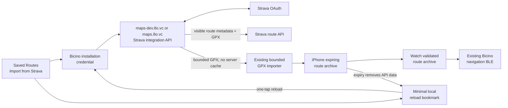

# Strava route URL import implementation plan

Prepared on 2026-08-27 from freshly fetched GitHub `origin/main` at
`fdfc2be1cc96170690548b04e7aef67756ad7322` on branch
`plan/strava-route-import`. After implementation and validation, the branch was
rebased without conflict onto freshly fetched `origin/main` at
`d396b60a28f3f2041e8659ca8659bbb4a6ef54f3`.

This document is the reviewed implementation contract for the Strava
integration on this branch. It does not contain credentials and does not by
itself authorize or perform a production rollout.

Implementation status on this branch: the backend, shared retention contract,
iPhone import/reload UI, Watch expiry path, tests, and operator/privacy
documentation are implemented. The feature remains disabled until the
Strava-side applications, credentials, capacity, privacy/branding review, live
OAuth validation, deployment, and physical iPhone/Watch/Bicino gates are
completed.

The product accepts either a route selected from the authenticated athlete's
route catalog or a normal Strava route URL such as
`https://www.strava.com/routes/3009840108578231836`. Both paths require Strava
OAuth authorization. The implementation must not scrape the public Strava web
page or use a shared personal access token.

## Outcome

Add **Import from Strava** directly below **Import GPX** in the iPhone Saved
Routes section. The complete rider flow is:

1. Open **Import from Strava**.
2. If Bicino is not connected to Strava, complete Strava OAuth using the single
   **Connect with Strava** action.
3. Bicino loads every page of routes created by the authenticated athlete,
   including private routes under `read_all`. The rider can select a cycling
   route or paste a canonical Strava route URL for a specific route.
4. Bicino imports any cycling route that Strava makes visible to the connected
   account under its granted scopes. Public routes require `read`; private
   routes require `read_all`.
5. The route appears in the existing Saved Routes library and uses the existing
   validated archive, Apple Watch transfer, offline navigation, and Bicino BLE
   display paths.
6. Bicino identifies the route as Strava-sourced, shows its expiry, and removes
   it from iPhone and Apple Watch according to the enforced retention policy or
   when the rider disconnects Strava.
7. A reload button on every Strava route fetches the same route again without
   another paste, replaces its geometry, and starts a new seven-day cache
   window. After geometry expires, a minimal reload row remains available.

No firmware or BLE protocol change is required. Strava supplies route geometry;
it does not become a second navigation runtime.

## Feasibility decision

The feature is technically feasible through Strava's supported API:

- Strava uses OAuth 2.0. A registered application receives a client ID and
  client secret; this is not a single anonymous API key.
- `GET /api/v3/routes/{id}` returns route metadata and
  `GET /api/v3/routes/{id}/export_gpx` returns the GPX payload.
- Every route API request requires an athlete access token. Private routes
  additionally require `read_all`.
- Newly registered applications begin with athlete capacity 1. Strava currently
  allows a dashboard upgrade to capacity 10; a wider Bicino rollout needs the
  appropriate access tier before launch.

Official references:

- [Strava authentication](https://developers.strava.com/docs/authentication/)
- [Strava route API reference](https://developers.strava.com/docs/reference/#api-Routes-getRouteAsGPX)
- [Strava rate limits and athlete capacity](https://developers.strava.com/docs/rate-limits/)
- [Strava API policy](https://www.strava.com/legal/api_policy)
- [Strava API changelog](https://developers.strava.com/docs/changelog/)
- [Strava brand guidelines](https://developers.strava.com/guidelines/)

### Meaning of “any Strava route” in this release

The URL field accepts any syntactically valid canonical route URL. A successful
import requires a cycling route that Strava's authenticated API makes visible
to the account connected to this Bicino installation under the granted scopes.
The route may have been created by another athlete.

Do not add an HTML, embedded-page, undocumented endpoint, headless browser, or
polyline-scraping fallback. If Strava's authenticated API does not return the
route to the connected account, Bicino reports that it is unavailable.

### Retention decision

Strava's current policy permits at most a seven-day cache and separately
requires a route deletion made on Strava to be reflected within 48 hours. For
the first release:

- set Strava route archive lifetime to the full seven days from backend fetch;
- encode the deletion deadline into the existing `deleteAfter` archive field;
- reject any Strava archive without an expiry or with an expiry beyond the
  code-level seven-day maximum;
- remove all route geometry and API-derived metadata on both iPhone and Watch
  at expiry;
- retain only the route ID/canonical URL originally pasted by the rider, its
  Bicino-local alias, and local route identity so a reload button can remain;
- purge all Strava routes and connection data when the rider disconnects.

The separate 48-hour deletion rule is an early-deletion path, not the normal
cache lifetime. While connected and online, iPhone revalidates cached route
availability when the previous successful validation is more than 24 hours old
and purges immediately when Strava authoritatively reports the route
unavailable. Disconnect, revocation, and an explicit Bicino delete also purge
immediately. Transient network or Strava failures do not destroy an otherwise
unexpired offline route.

Because an offline Watch cannot independently poll Strava, confirm this
seven-day cache plus connected-device revalidation model against the then-
current policy before release. The seven-day maximum remains compiled into the
provider policy so configuration cannot silently exceed it.

This plan treats route geometry as a temporary Strava-backed cache, not as a
permanent user-owned GPX export. The existing **Import GPX** path remains the
permanent user-owned option.

## Current `main` baseline

The repository already has most of the route-side implementation needed:

- `ios-app/BikeComputer/BikeComputer/Views/PlannedRoutesView.swift` renders
  Saved Routes and the existing **Import GPX** button.
- `ios-app/BikeComputer/RideShared/GPXRouteImporter.swift` securely parses at
  most 4 MiB and 50,000 points, rejects XML entity declarations, validates
  coordinates, and creates a route archive.
- `ios-app/BikeComputer/BikeComputer/Managers/PhoneRouteLibrary.swift` owns the
  durable iPhone route library and Watch transfer state.
- `ios-app/BikeComputer/RideShared/NavigationRouteArchive.swift` records
  provider identity, content integrity, and optional `deleteAfter` retention.
- `ios-app/BikeComputer/RideShared/RouteProviderContract.swift` fail-closes
  durable storage to explicitly reviewed providers.
- `ios-app/BikeComputer/RideShared/NavigationRouteFileStore.swift` prunes
  invalid and expired archives.
- `ios-app/BikeComputer/BikeComputerWatch/Managers/WatchRouteLibrary.swift`
  validates, stores, and prunes the same archive format on Watch.
- `ios-app/BikeComputer/BikeComputer/Models/OfflineMapPlatform.swift` and
  `OfflineMapManager.swift` already implement installation-scoped backend
  credentials, Keychain persistence, and authenticated requests to the managed
  map service.
- `map-platform/backend/map_platform/api.py` already validates the
  installation ID and `X-Installation-Token` for installation-owned endpoints,
  applies persistent rate limits, and uses the shared `/data` volume.
- Debug and Release already have distinct service hosts and URL-scheme values:
  `maps-dev.8o.vc` / `bikecomputer-dev` and
  `maps.8o.vc` / `bikecomputer`.

The implementation should extend these seams instead of adding a parallel
route store, custom XML parser, client-held Strava token, or firmware route
format.

## Product decisions locked by this plan

### 1. Route browsing and URL import are authenticated

Without a usable `read_all` connection, the import sheet exposes only
**Connect with Strava**. After OAuth, it loads every paginated route created by
the authenticated athlete and exposes the specific-route URL field. Each
cycling route and valid pasted URL has an **Import** action; run routes remain
visible but are not importable into cycling navigation.

After OAuth, the sheet explains that Bicino will read route name and geometry,
temporarily keep the selected route for offline navigation, and let the rider
disconnect and delete the data. Link to the Bicino privacy policy. Strava's
authorization screen owns the permission disclosure; do not claim that
URL-only anonymous import is possible.

### 2. Supported URL grammar is intentionally narrow

Accept only HTTPS URLs whose normalized host is exactly `strava.com` or
`www.strava.com` and whose path is exactly:

```text
/routes/<route-id>
/routes/<route-id>/
```

The parser may discard a normal query string or fragment after validating the
scheme, host, port, user information, and path. Reject:

- `http` URLs;
- non-default ports or embedded credentials;
- lookalike or arbitrary Strava subdomains;
- segment, activity, athlete, club, and shortened URLs;
- extra path components; and
- zero, negative, signed, decimal, or oversized IDs.

Keep the route ID as a canonical decimal string matching
`[1-9][0-9]{0,18}` and verify it is no greater than signed 64-bit maximum.
Strava moved route IDs to 64-bit values and supplies `id_str`; never use an
iOS `Int` assumption or JavaScript number for identity.

The backend accepts only the validated route ID, never the pasted URL. This
prevents the feature from becoming an SSRF or general URL-fetch endpoint.

### 3. OAuth and all Strava secrets are backend-owned

The iPhone contains no Strava client secret, access token, refresh token, or
personal API token. It continues to hold only its existing Bicino
installation-scoped credential in the Keychain.

The backend:

- creates a short-lived, one-time OAuth session bound to the Bicino
  installation;
- constructs the official Strava mobile authorization URL;
- receives the HTTPS OAuth callback;
- validates state and granted scopes;
- exchanges the code using the client secret;
- encrypts the resulting athlete ID and token bundle at rest; and
- returns only a success/failure callback to the app's build-specific scheme.

Use separate Strava applications for Development and Production. Their client
secrets, callback domains, athlete capacities, and test users stay isolated.

### 4. Bicino validates route identity and cycling type before GPX export

Before exporting GPX, the backend calls `GET /routes/{id}` and verifies:

- the response `id_str` or numeric ID equals the requested canonical ID;
- the route type is cycling (`type == 1`).

Only then call `GET /routes/{id}/export_gpx` with the same athlete token. A run
route, unavailable route, or inconsistent response fails closed without
returning geometry.

### 5. The backend is a bounded mediator, not a route store or generic proxy

The backend holds OAuth connection state but never persists route metadata,
GPX bytes, decoded coordinates, polylines, or route archives. It reads at most
4 MiB plus one byte from the fixed Strava GPX endpoint and streams the validated
response to the requesting installation with `Cache-Control: private, no-store`.

The iPhone remains the trust boundary for GPX parsing and archive creation. It
uses the same parser and limits as local GPX import, which avoids divergent
geometry rules between Python, iPhone, Watch, and Bicino.

### 6. Strava is an expiring provider, not user-provided GPX

Add a reviewed provider identity such as:

```text
providerID: strava.route
attribution: Strava
storageScope: durable, but expiry required
maximum retention: 7 days
initial archive lifetime: 7 days
```

Do not label the downloaded bytes `User-provided GPX`. Refactor the GPX parser
to take a closed import-source descriptor so only known callers can choose:

- provider metadata;
- external route ID and canonical source URL;
- route UUID and revision;
- created/fetched time and mandatory deletion time; and
- generic step wording such as **Follow Strava route**.

Local file import keeps its existing durable, unexpired
`user.imported-gpx` policy and behavior.

### 7. Reload is one tap and preserves one saved route

Store a validated optional source reference in the route archive containing the
provider ID, canonical external route ID, and canonical source URL. Add backward-
compatible decoding so existing version-1 archives without this optional field
remain valid.

Every current or expired Strava route row has a reload button. With a live
connection, one tap fetches the current GPX immediately. If OAuth must be
renewed, that same tap starts OAuth and automatically resumes the reload after
authorization; the rider never pastes the URL again.

If the same Strava route is imported or reloaded before or after expiry:

- reuse its Bicino route UUID from the active archive or retained reload
  bookmark;
- increment the route revision;
- replace the geometry and reset the full seven-day expiry;
- preserve the rider's local display-name override; and
- use the existing exact-revision Watch replacement flow.

At expiry, delete the archive, API-derived route name, endpoints, distance,
geometry, steps, and Watch copy. Keep a separate local
`StravaRouteReloadBookmarkV1` containing only:

- the canonical route ID and URL parsed from the rider's pasted input;
- the Bicino-generated route UUID and last revision;
- an optional Bicino-local alias entered by the rider; and
- non-sensitive reload/error timestamps.

Create this bookmark only from the rider's pasted input and Bicino-local
fields; never backfill or enrich it from Strava API/GPX data. It may remain
until the rider deletes the row or disconnects because it is the rider's input
and Bicino-local state, not retained route content.

Render an expired bookmark as the local alias or **Strava route**, with
**Expired** and the reload button. Do not retain or display the Strava-provided
route name, endpoints, distance, preview, or geometry after expiry. Deleting
the row or choosing **Disconnect Strava and Delete Data** deletes the bookmark
too.

If no archive or bookmark matches, create a new route UUID. Never derive a
stable cross-user identity from an athlete ID or expose that ID in the route
archive.

### 8. Existing Watch and Bicino paths remain authoritative

The iPhone sends the same signed-by-content archive bytes and sync metadata to
Watch. Watch validates provider policy, content hash, encoded size, and
`deleteAfter` before installation. Navigation continues to send the existing
sliding route geometry, GPS, and maneuver payloads to Bicino.

Add a foreground/activation expiry reconciliation on both iPhone and Watch and
a deadline wake-up while a Strava route is selectable or active. Do not allow a
new ride to start when the archive cannot remain valid for the configured
maximum expected ride window. If the clock crosses `deleteAfter` while a route
is active, end that navigation route cleanly, retain workout recording, remove
the cached archive, and explain that the route expired and can be reloaded from
its Saved Routes row.

No route geometry is added to firmware persistence and no new BLE
characteristic is allocated.

## End-to-end architecture



### OAuth sequence

```text
iPhone -> Bicino backend
  POST /v1/integrations/strava/oauth-sessions
  X-Installation-Token + clientInstallationId

Backend
  creates random session ID and 256-bit state
  stores only a state hash, installation binding, expiry, and return channel
  returns official mobile app URL + web URL + callback scheme

iPhone
  uses the Strava app when available
  otherwise uses ASWebAuthenticationSession

Strava -> Bicino backend
  GET /v1/integrations/strava/oauth/callback?code=...&scope=...&state=...

Backend
  validates one-time state and callback
  exchanges code with client ID + client secret
  validates granted read scopes and athlete response
  encrypts token bundle atomically
  redirects to bikecomputer[-dev]://strava/oauth-complete?result=...

iPhone -> Bicino backend
  GET /v1/integrations/strava/connection
  confirms authoritative connection state

iPhone -> Bicino backend -> Strava
  GET /v1/integrations/strava/routes?page=N
  GET /athletes/{encryptedAthleteId}/routes?page=N&per_page=200
  repeats through the final page without exposing athlete ID or tokens
```

The callback deep link contains only an opaque OAuth session ID and result. It
must not contain the authorization code, athlete ID, access token, refresh
token, or an arbitrary return URL.

### Route import sequence

```text
iPhone
  parses URL locally -> canonical 64-bit route ID

iPhone -> Bicino backend
  POST /v1/integrations/strava/routes/{routeId}/gpx
  installation credential; no pasted URL

Backend -> Strava
  refresh access token if needed
  GET /routes/{routeId}
  verify route identity and cycling type
  GET /routes/{routeId}/export_gpx

Backend -> iPhone
  bounded GPX bytes
  fetched-at, delete-after, provider, and route-ID response headers

iPhone
  validates response contract
  parses with GPXRouteImporterV1
  creates strava.route archive with hard expiry
  installs in PhoneRouteLibrary
```

## Backend API contract

Add typed error envelopes to this integration rather than returning raw Strava
fault bodies. Do not expose whether another athlete's route exists.

### Start OAuth

`POST /v1/integrations/strava/oauth-sessions`

Authentication:

- required `clientInstallationId` query parameter;
- required `X-Installation-Token`; and
- existing installation verification plus a dedicated OAuth-start rate limit.

Successful response:

```json
{
  "sessionId": "oauth_...",
  "appAuthorizationUrl": "strava://oauth/mobile/authorize?...",
  "webAuthorizationUrl": "https://www.strava.com/oauth/mobile/authorize?...",
  "callbackScheme": "bikecomputer-dev",
  "expiresAt": "2026-08-27T12:34:56Z"
}
```

The backend chooses the callback URI and return scheme from the deployment
channel. The request must not supply them.

Request the minimum route scopes `read,read_all`. After exchange, store and
honor the scopes actually granted. If the rider grants only `read`, keep the
connection usable for public routes and surface that private routes require
reconnection with private-route permission.

### OAuth callback

`GET /v1/integrations/strava/oauth/callback`

This browser endpoint has no installation header, so its random state is the
authorization capability. Require:

- exact callback path and configured host;
- a 10-minute unexpired session;
- constant-time comparison of the state hash;
- one-time consumption before or atomically with code exchange;
- exact code/scope/error parameter cardinality and bounded lengths; and
- a fixed, deployment-owned deep-link destination.

On denial, invalid state, exchange failure, or missing required base scope,
render a minimal HTTPS result page and redirect only to the fixed app scheme
with a non-sensitive result code. Never echo upstream error bodies.

### Read connection status

`GET /v1/integrations/strava/connection`

Require installation authentication and return `Cache-Control: private,
no-store`:

```json
{
  "connected": true,
  "grantedScopes": ["read", "read_all"],
  "canReadPrivateRoutes": true,
  "connectedAt": "2026-08-27T12:34:56Z"
}
```

Do not return athlete name, profile image, location, raw athlete ID, or tokens;
the import UI does not need them.

### Disconnect and delete

`DELETE /v1/integrations/strava/connection`

Require installation authentication. Immediately mark the connection unusable,
call Strava's current Basic-authenticated `POST /oauth/revoke` endpoint with the
encrypted refresh token, and delete the local token bundle.
If Strava returns a retryable failure, retain only an encrypted, unusable
pending-revocation record and let maintenance retry with a strict deadline.
The endpoint remains available when new OAuth/import is feature-disabled.

The successful response instructs the iPhone to execute a provider purge. The
iPhone removes local Strava archives and reload bookmarks immediately and
durably queues exact Watch deletions. Watch also enforces each archive's
absolute expiry in case it remains unreachable during disconnect.

### List athlete routes

`GET /v1/integrations/strava/routes?page=N`

Require installation authentication, a live connection with `read_all`, and
dedicated per-installation and per-IP limits. The backend reads the encrypted
athlete ID and token, calls `GET /athletes/{id}/routes` with 200 routes per
page, and returns only `routeId`, `name`, `distanceMeters`,
`elevationGainMeters`, and normalized ride/run `type`, plus `page` and
`nextPage`. Every response uses `Cache-Control: private, no-store`. Athlete IDs,
tokens, arbitrary upstream fields, and raw Strava fault bodies never cross the
API boundary.

### Fetch route GPX

`POST /v1/integrations/strava/routes/{routeId}/gpx`

Require installation authentication, a live Strava connection, and a dedicated
per-installation and per-IP import limit. The endpoint takes no URL or request
body. On success return:

```text
Content-Type: application/gpx+xml
Cache-Control: private, no-store
X-Bicino-Route-Provider: strava.route
X-Bicino-External-Route-ID: 3009840108578231836
X-Bicino-Fetched-At: 2026-08-27T12:34:56Z
X-Bicino-Delete-After: 2026-09-03T12:34:56Z
```

The GPX body remains byte-for-byte as returned by Strava. The existing parser
selects the longest usable route or track and reads its embedded name. Use the
route ID as the fallback name; do not place arbitrary Unicode metadata in
custom headers.

### Revalidate an imported route

`POST /v1/integrations/strava/routes/{routeId}/validate`

Require installation authentication, a live Strava connection, and the same
strict route-ID and cycling-type checks as GPX fetch. The endpoint takes no
request body, performs only the route metadata lookup, and returns
`Cache-Control: private, no-store`:

```json
{
  "available": true,
  "checkedAt": "2026-08-28T12:34:56Z"
}
```

While connected and online, iPhone calls this endpoint when a Strava archive's
last successful validation is more than 24 hours old. A definitive
`strava_route_unavailable` or `strava_route_not_importable` response triggers
immediate phone/Watch geometry purge while preserving the user-supplied reload
bookmark. A token 401 enters the existing reconnect path. Rate limits,
timeouts, and upstream 5xx responses retain an otherwise unexpired offline
archive and retry at a later foreground opportunity. Reload uses the GPX
endpoint, not this validation endpoint, and starts a new seven-day window.

### Typed failures

Use stable codes and user-safe messages:

| HTTP | Code | Meaning |
| --- | --- | --- |
| 400 | `invalid_strava_route_id` | Server-side ID validation failed |
| 401 | `installation_credential_required` | Existing Bicino installation auth failed |
| 401 | `strava_not_connected` | This installation has no usable Strava connection |
| 403 | `strava_scope_required` | Required route scope was not granted |
| 403 | `strava_route_not_importable` | Route is not a cycling route |
| 404 | `strava_route_unavailable` | Route is absent, deleted, private, or unavailable |
| 409 | `strava_oauth_session_invalid` | OAuth state is expired, consumed, or inconsistent |
| 413 | `strava_route_too_large` | GPX exceeds the shared 4 MiB input limit |
| 429 | `strava_rate_limited` | Local or upstream quota requires retry later |
| 502 | `strava_invalid_response` | Upstream payload or identity was inconsistent |
| 503 | `strava_temporarily_unavailable` | Timeout, outage, or disabled integration |

Preserve a valid existing connection on ordinary upstream 5xx errors. On an
authoritative token 401, mark the connection disconnected, delete or revoke
the unusable token bundle, and require OAuth again.

## Backend persistence and security

Add an isolated SQLite store at `/data/strava-integrations.sqlite3`. Do not add
Strava fields to map-job JSON or the map-monitoring database.

### OAuth sessions

Store:

- random session ID;
- SHA-256 of the random state, never the raw state;
- bound installation ID;
- deployment channel and fixed return scheme enum;
- created, expires, consumed, and terminal-result timestamps; and
- bounded non-sensitive error code for diagnostics.

Prune expired sessions during API startup/requests and the existing maintenance
loop. Retain no successful authorization code.

### Connections

Store one active connection per installation:

- installation ID primary key;
- encrypted athlete ID, granted scopes, access token, rotating refresh token,
  access-token expiry, and connection timestamps;
- last successful status/import use for orphan detection;
- encryption-key ID and schema version;
- token revision for compare-and-swap refresh;
- optional short refresh lease; and
- disconnected or pending-revocation state.

Encrypt with AES-256-GCM using a dedicated random key from deployment secrets.
Bind ciphertext to installation ID, schema version, and key ID as additional
authenticated data. Do not reuse the installation HMAC secret, map download
secret, catalog credential, or map signing key.

Support a current encryption key and explicitly identified previous decryption
keys. Re-encrypt under the current key after a successful read so key rotation
does not strand connections. Fail startup if Strava is enabled with a missing,
short, malformed, or duplicate key configuration.

Because uninstalling the iPhone app cannot call disconnect, maintenance must
revoke and delete a Strava connection after 30 days with no authenticated
status or import use. Keep that inactivity limit code-capped and configurable
downward. This bounds orphaned OAuth credentials without requiring a Bicino
account system.

### Refresh-token rotation

Strava may rotate the refresh token on every refresh, immediately invalidating
the old value. Serialize refreshes per installation with a short database lease:

1. read and decrypt the current token revision;
2. claim the refresh lease in `BEGIN IMMEDIATE`;
3. call Strava outside the SQLite write transaction;
4. atomically replace access token, refresh token, expiry, and revision only if
   the lease and prior revision still match; and
5. release or expire the lease on every outcome.

Concurrent imports wait briefly for the winner and reread the new revision.
Never issue two refresh calls with the same token.

### Fixed upstream transport

Implement a small injectable Strava transport with:

- exact HTTPS hosts and paths owned in code;
- bearer tokens only in the `Authorization` header;
- no user-controlled base URL, proxy target, or redirect;
- TLS verification, connect/read deadlines, and bounded JSON/GPX reads;
- strict JSON types and ID comparison using strings/64-bit-safe integers;
- redacted exceptions and logs; and
- capture of `X-RateLimit-*`, `X-ReadRateLimit-*`, and `Retry-After` without
  logging request credentials.

Use the current documented `https://www.strava.com/api/v3` base at
implementation time. Encapsulate it as one audited constant because Strava's
2026 changelog says the replacement base becomes available on 2027-01-04.
Create a dated migration issue and test both exact hosts before the later
cutover; do not follow an arbitrary cross-host redirect.

### Local rate limits

Extend the existing persistent limiter with separately configurable, bounded
policies for:

- OAuth session creation per IP and per installation;
- route import and availability validation per IP and per installation; and
- disconnect attempts.

One import or reload currently costs two Strava read requests, an availability
validation costs one, and either may require a token refresh. Budget the Bicino
limits below the application's Strava read quota and surface the upstream reset
rather than retrying a 429 loop.

## iOS architecture

### Shared Bicino service session

Do not duplicate map-service installation issuance in a Strava-only client.
Extract the managed-host and installation-credential lifecycle currently in
`OfflineMapManager` into a reusable `BicinoServiceSession` (name may vary):

- resolve the build-owned service URL;
- load/save the installation credential in the existing Keychain service;
- issue, refresh, and recover a credential through `/v1/installations`;
- create installation-authenticated `URLRequest` values; and
- serialize concurrent registration/refresh attempts.

Inject the same session into `OfflineMapManager` and the Strava import
coordinator from the app composition root. Preserve existing map job ownership,
legacy migration, development/production isolation, and host fail-closed
behavior. This refactor gets focused regression tests before Strava endpoints
are added.

### URL and response models

Add portable, non-UI types for:

- `StravaRouteURLV1`, which implements the exact grammar and canonical ID;
- connection status and OAuth-session responses;
- typed backend errors and retry information;
- exact validation of provider/route/time response headers;
- `StravaRouteImportReceiptV1`, containing external ID, canonical URL,
  fetched time, deletion deadline, and validation time; and
- `StravaRouteReloadBookmarkV1`, containing only the user-supplied reference,
  Bicino route identity/revision, optional local alias, and local operation
  timestamps.

Reject a response when the requested route ID, provider header, dates, content
type, byte limit, or cache lifetime is inconsistent. The app never trusts an
upstream filename to choose a local path.

### OAuth coordinator

Add one app-lifetime `StravaIntegrationCoordinator` owned by the composition
root. It manages:

- current connection status;
- one in-flight OAuth session;
- `ASWebAuthenticationSession` and its presentation anchor;
- native Strava app handoff using the official `strava://` URL when installed;
- the pending validated route URL and whether it is a first import or reload;
- callback and foreground status reconciliation; and
- cancel-safe import/reload/revalidation tasks and typed UI state.

Register the existing build-channel URL scheme on the iPhone target, add
`BicinoURLScheme` to its Info.plist, and add `strava` to
`LSApplicationQueriesSchemes` for the required native-app availability check.
Route `bikecomputer[-dev]://strava/oauth-complete` to the coordinator before
passing unrelated HTTPS universal links to the existing map-share handler.

The callback router accepts only the configured scheme, exact host/path,
bounded opaque session ID, and known result values. It still asks the backend
for authoritative connection status; a deep link alone never establishes a
connection.

### Import, reload, and archive creation

Refactor `GPXRouteImporterV1` around a closed source descriptor while preserving
the local-import convenience API. The Strava path supplies:

- `RouteProviderPolicyV1.strava`;
- canonical external route reference;
- existing UUID/revision when replacing a matching route;
- server fetched and delete-after timestamps; and
- Strava-specific generic step text.

The parser remains responsible for XML and geometry. The provider policy and
archive remain responsible for retention. `PhoneRouteLibrary` gets narrow
`importStravaGPX(_:receipt:)`, `reloadStravaGPX(_:receipt:bookmark:)`,
`expireStravaRoute(id:)`, and `purge(providerID:)` operations; the view never
constructs provider metadata itself.

Persist the reload bookmark atomically with a successful first import. A reload
must write the replacement archive and updated bookmark as one logical
transaction: reuse the bookmark UUID, increment its revision, preserve its
local alias, replace the old geometry only after full validation, and set a new
seven-day `deleteAfter`. Failure leaves the prior unexpired archive or expired
bookmark intact.

### UI behavior

In `SavedRoutesSettingsSection`:

- place **Import from Strava** immediately after **Import GPX**;
- use a plain system icon until approved Strava brand assets are available;
- finish any route rename before presenting the import sheet; and
- keep the existing GPX file importer unchanged.

The import sheet contains:

- a text field labelled **Strava route URL** with paste support;
- inline canonical URL validation;
- connection/disclosure state;
- **Connect with Strava**, **Import Route**, and cancel actions as appropriate;
- progress for OAuth status and GPX import;
- a concise, actionable error that preserves the entered URL; and
- a **Disconnect Strava and Delete Data** action when connected.

Do not read `UIPasteboard` automatically on appearance. Standard text-field
paste or a system `PasteButton` keeps the action explicit.

For an unexpired saved Strava route, show **Powered by Strava**, a **View on
Strava** link using the canonical URL, an absolute/localized expiry, and a
trailing reload button using `arrow.clockwise`. Give the button an accessible
label such as **Reload [route name] from Strava**, show an in-row spinner while
it is working, and suppress concurrent reload taps for that identity. Keep
Strava text no more prominent than the Bicino UI and follow the current brand
guidelines.

At expiry, replace that row with the minimal bookmark row: local alias or
**Strava route**, **Expired**, optional **View on Strava** based only on the
originally pasted URL, and the same reload button. Do not show the prior Strava
name, endpoints, distance, preview, or expiry geometry. Tapping reload fetches
immediately when connected; if connection is absent or stale, that tap starts
OAuth and automatically resumes the fetch. A failed reload leaves the row and
its retry control available with an actionable inline error. The rider never
needs to paste the URL again.

After successful first import, dismiss the sheet, refresh Saved Routes, and
make the new row visible. After reload, update that same row in place with the
new revision and seven-day expiry. Deleting the row deletes both archive and
bookmark and queues the exact Watch deletion when needed.

Read the authenticated Strava capability before enabling **Import from Strava**
or a reload control. When the capability is disabled, keep existing routes and
expired bookmarks visible but disable reload with an unavailable explanation.
Hide the import entry for installations that have never connected. If a
connection, cached Strava route, or bookmark already exists, keep a management
row visible so **Disconnect Strava and Delete Data** remains reachable.

## Provider retention and deletion changes

Keep `RouteStorageScopeV1` wire-compatible. Extend the code-owned provider
policy rather than trusting a self-declared `.durable` flag:

```text
MapKit
  active use only

User-imported GPX
  durable; deleteAfter optional

Strava route
  durable cache only
  deleteAfter required
  deleteAfter <= createdAt + 7 days
  first-release deleteAfter = fetchedAt + 7 days

Unknown provider
  active use only unless explicitly reviewed later
```

Add distinct archive validation errors for missing required expiry and excessive
retention. Test exact-boundary behavior, sub-millisecond normalization, clock
skew, reload revision, existing archive compatibility, and forged provider
metadata.

### iPhone purge

`PhoneRouteLibrary.purge(providerID:)` must:

1. enumerate exact matching route identities;
2. remove their local archive files immediately;
3. clear display-name overrides and ready/install receipts;
4. persist exact Watch deletion tombstones before attempting delivery;
5. send deletions immediately when Watch is reachable; and
6. retry on later reachability without restoring route bytes.

Normal Strava expiry deletes the archive and every API-derived field, clears
ready/install receipts and stale pending-install state, and queues the exact
Watch deletion. It preserves only `StravaRouteReloadBookmarkV1`, including any
Bicino-local alias, so the expired row can reload the same route identity.
Explicit row deletion and provider disconnect delete that bookmark as well.

This compliance path is intentionally different from an ordinary user delete,
which currently keeps the iPhone record until Watch acknowledges deletion.

### Watch purge and expiry

Watch must:

- reject a Strava archive whose provider/expiry policy is invalid;
- prune expired selectable routes on launch, foreground, picker display, and a
  scheduled deadline;
- apply exact provider-purge tombstones received from iPhone;
- never start an expired or near-expiry route;
- stop only navigation, not the HealthKit workout, if hard expiry occurs during
  a ride; and
- acknowledge deletion so iPhone can retire its tombstone.

No route can become permanent because the phone is offline, the Watch is
unreachable, or the rider deletes the Bicino app. Reload is an iPhone Saved
Routes control; Watch stores no bookmark and receives a fresh exact-revision
archive only after iPhone reload succeeds.

## Backend implementation slices

### Slice 1: reusable Strava client and encrypted store

Files:

- add `map-platform/backend/map_platform/strava_client.py`;
- add `map-platform/backend/map_platform/strava_integrations.py`;
- add `map-platform/backend/tests/test_strava_client.py`;
- add `map-platform/backend/tests/test_strava_integrations.py`; and
- update `map-platform/backend/pyproject.toml` only if a runtime HTTP dependency
  is truly required. Prefer the existing standard-library transport style with
  dependency injection and bounded reads.

Completion:

- exact transport, route/athlete model validation, OAuth exchange/refresh/revoke,
  encrypted SQLite schema, state consumption, token rotation, migrations, and
  retention pruning pass isolated tests;
- corrupted ciphertext and unknown key IDs fail closed; and
- no secret or raw upstream body appears in logs or exceptions.

### Slice 2: authenticated API endpoints

Files:

- update `map-platform/backend/map_platform/api.py`;
- update `map-platform/backend/map_platform/rate_limits.py` only if the generic
  limiter needs no integration-specific change;
- update `map-platform/backend/tests/test_api.py`; and
- update `map-platform/backend/README.md`.

Completion:

- all endpoints enforce the contract above;
- callback state cannot be replayed or moved between installations/channels;
- route identity and cycling type are checked before GPX export;
- availability validation applies the same identity checks without returning
  route metadata or geometry;
- response reads stop at the shared byte bound; and
- TestClient coverage uses a fake injected Strava transport, never live tokens.

### Slice 3: deployment configuration and maintenance

Files:

- update `map-platform/backend/docker-compose.yml`;
- update `map-platform/deploy/compose.yaml`;
- update `map-platform/deploy/README.md`;
- update the maintenance path in `map-platform/backend/map_platform/cli.py`;
  and
- update deployment tests under `map-platform/deploy/tests/`.

Completion:

- API and maintenance receive only the Strava secrets they need;
- map workers never receive Strava client or token-encryption secrets;
- integration-disabled startup works without Strava configuration;
- integration-enabled startup fails closed on incomplete configuration;
- pending revocations and expired OAuth sessions are pruned; and
- the production Compose change follows the existing immutable image-promotion
  workflow rather than editing live Coolify configuration as an untracked step.

## iOS implementation slices

### Slice 4: shared service authentication

Files:

- add a focused service-session type under
  `ios-app/BikeComputer/BikeComputer/Services/`;
- update `OfflineMapManager.swift` to delegate installation credential work;
- update `BikeComputerApp.swift` and `ContentView.swift` composition; and
- add portable and XCTest regression coverage for credential reuse, host
  isolation, 401 recovery, and concurrent registration.

Completion:

- existing map jobs keep the same installation owner;
- Debug never sends credentials to Production or vice versa;
- no server-wide key enters the app; and
- all current offline-map tests remain green before Strava UI work begins.

### Slice 5: route source and retention contract

Files:

- update `NavigationRouteContract.swift` for optional source reference with
  backward-compatible decoding;
- update `RouteProviderContract.swift` for the reviewed Strava policy;
- update `NavigationRouteArchive.swift` for expiry requirements;
- update `GPXRouteImporter.swift` for closed source descriptors;
- add `StravaRouteReloadBookmark.swift` and its atomic local store;
- update `NavigationRouteFileStore.swift` for deadline scheduling and atomic
  archive/bookmark replacement hooks;
- update `PhoneRouteLibrary.swift`; and
- extend `ios-app/BikeComputerTests/RideSharedTests.swift`.

Completion:

- local GPX behavior is byte/semantics compatible;
- Strava archives require a valid bounded expiry;
- duplicate import/reload produces a new revision rather than an unrelated row;
- normal expiry removes API data but leaves only the user/local reload bookmark;
- explicit row deletion or disconnect removes the bookmark too;
- old archives decode; and
- phone and Watch stores remove the route at the same deadline.

### Slice 6: Strava client and OAuth coordinator

Files:

- add `StravaRouteURL.swift` under a portable shared/model location;
- add `StravaIntegrationClient.swift`;
- add `StravaIntegrationCoordinator.swift`;
- update `BikeComputer/Info.plist` and build-container verification scripts;
- update `ContentView.onOpenURL`; and
- add request, parser, callback-routing, cancellation, revalidation, reload, and
  error-mapping tests.

The Xcode project uses file-system-synchronized groups, so normal files under
the existing iPhone source root should join the target automatically. Add
explicit project references only for portable test sources outside that root.

### Slice 7: Saved Routes UI and compliance controls

Files:

- update `Views/PlannedRoutesView.swift`;
- add `Views/StravaRouteImportView.swift`;
- update `Views/SettingsView.swift` injection;
- update `BikeComputerApp.swift` composition if the coordinator is app-owned;
- update `BikeComputerWatch/Managers/WatchRouteLibrary.swift` and the Watch
  route picker/controller for expiry; and
- update `ios-app/README.md` and
  `docs/watch-bicino-navigation-validation.md`.

Completion:

- the new button is directly below **Import GPX**;
- paste-connect-import resumes across the supported OAuth handoffs;
- cancellation leaves no partial route, lost prior archive, or stuck busy state;
- unexpired Strava rows display attribution, expiry, and reload;
- expired rows display only the local bookmark, **Expired**, and reload;
- one reload tap reuses the route identity, preserves its alias, increments the
  revision, and begins a new seven-day window without another paste;
- disconnect performs the provider purge; and
- GPX import, renaming, Watch transfer, and deletion retain their current UI.

## Strava-side and deployment prerequisites

Create two Strava developer applications before enabling the feature:

| Environment | Suggested app | Callback domain | Backend | Return scheme |
| --- | --- | --- | --- | --- |
| Development | Bicino Dev | `maps-dev.8o.vc` | `https://maps-dev.8o.vc` | `bikecomputer-dev` |
| Production | Bicino | `maps.8o.vc` | `https://maps.8o.vc` | `bikecomputer` |

For each application, configure:

- accurate application name, category, website, support contact, and privacy
  policy URL;
- exact HTTPS callback domain;
- client ID;
- client secret, stored only in the matching backend's secret manager;
- `read` and `read_all` OAuth scopes at authorization time; and
- the athlete-capacity/access tier required for that rollout stage.

Backend secret/config inputs should include:

```text
MAP_PLATFORM_STRAVA_ENABLED
MAP_PLATFORM_STRAVA_CLIENT_ID
MAP_PLATFORM_STRAVA_CLIENT_SECRET
MAP_PLATFORM_STRAVA_REDIRECT_URI
MAP_PLATFORM_STRAVA_TOKEN_KEY_ID
MAP_PLATFORM_STRAVA_TOKEN_KEY_BASE64
MAP_PLATFORM_STRAVA_PREVIOUS_TOKEN_KEYS
MAP_PLATFORM_STRAVA_CONNECTION_IDLE_TTL_DAYS
MAP_PLATFORM_STRAVA_OAUTH_START_LIMIT_PER_HOUR
MAP_PLATFORM_STRAVA_ROUTE_IMPORT_LIMIT_PER_HOUR
MAP_PLATFORM_STRAVA_ROUTE_VALIDATION_LIMIT_PER_HOUR
MAP_PLATFORM_STRAVA_DISCONNECT_LIMIT_PER_HOUR
```

Validation rules:

- client ID is numeric and positive;
- client secret is non-empty and never logged;
- redirect URI is exact HTTPS, has no query/fragment, and matches the
  deployment's fixed host/path;
- encryption keys decode to exactly 32 random bytes and have unique IDs;
- route cache TTL is not operator-configurable; both backend and clients own
  the reviewed constant of 604,800 seconds and reject any later deadline;
- connection idle TTL defaults to 30 days and cannot be configured above the
  code-owned orphan-credential maximum; and
- Production cannot use Development callback host, client ID, return scheme,
  or token database namespace.

The client ID is not secret, but keeping it backend-configured avoids an app
update when Strava application registration changes. There is no API key or
token to commit to the repository.

Before enabling more than the developer's own account, verify the live Strava
dashboard athlete capacity. The initial capacity-1 state is suitable only for
Development. The current self-service capacity-10 upgrade is suitable only for
a bounded test cohort; do not advertise a public feature whose OAuth flow will
reject later athletes.

## Privacy, policy, and branding release gates

Before TestFlight outside the developer account:

1. Update Bicino's public privacy policy with the exact Strava route fields,
   purpose, temporary retention, token storage, withdrawal, deletion request,
   processor/hosting location, and Strava usage-data notice.
2. Confirm that sending a temporary route archive to the rider's paired Watch
   and using it to drive the rider's Bicino display fits the current registered
   application purpose and Strava terms.
3. Confirm the full seven-day route cache, 24-hour connected revalidation
   cadence, immediate authoritative-unavailable purge, and provider purge with
   the then-current API policy. Confirm how the policy's separate 48-hour
   deletion requirement applies to an offline iPhone or Watch.
4. Verify Strava application access tier and rate limits for the intended
   cohort.
5. Use current approved Connect/attribution assets and wording. Do not imply
   Strava endorsement or make its name more prominent than Bicino.
6. Provide a working disconnect/delete control even while import is disabled.
7. Record the policy version/date in the release evidence and re-check it before
   each material Strava rollout because Strava may update the agreement.

If a requirement cannot be met, keep the server capability disabled. Do not
substitute scraping or a shared developer token.

## Testing plan

### Portable Swift contract tests

Extend `ios-app/BikeComputerTests/RideSharedTests.swift` or add a focused
portable executable test for:

- valid bare and `www` URLs, trailing slash, query, and fragment;
- rejection of HTTP, credentials, ports, lookalike hosts, subdomains, segments,
  activities, extra path components, malformed IDs, and overflow;
- exact canonical route ID and URL generation;
- Strava response header and timestamp validation;
- response-body 0-byte, 4 MiB, and 4 MiB + 1 boundaries;
- existing user GPX import unchanged;
- Strava provider attribution and generic steps;
- required expiry, seven-day default/exact maximum, and excessive retention
  rejection;
- backward decoding of existing archives without source reference;
- reload bookmark encoding contains only the user-supplied reference and
  Bicino-local identity/alias fields, never API-derived route data;
- exact expiry removes archive/API data while preserving the reload bookmark;
- same-route reload preserves UUID/local alias, increments revision, replaces
  geometry atomically, and starts a new seven-day deadline;
- failed reload preserves the previous unexpired archive or expired bookmark;
- provider purge removes archive and bookmark and persists its tombstone; and
- phone/Watch expiry at the exact deadline.

Run:

```sh
cd ios-app
./scripts/run-navigation-tests.sh
```

### iOS XCTest and build coverage

Add deterministic injected-session tests for:

- installation credential reuse and refresh;
- OAuth start, denial, success, timeout, replay, and app termination;
- native Strava app and `ASWebAuthenticationSession` callback routing;
- callback scheme/host/path confusion attempts;
- resume of a pending first import or reload after OAuth;
- import/reload cancellation and per-route concurrent-tap suppression;
- active and expired row reload-button state, accessible label, and spinner;
- connected one-tap reload and OAuth-resumed reload without another paste;
- foreground revalidation cadence and authoritative-unavailable purge;
- transient revalidation failure retaining an unexpired offline route;
- typed 401/403/404/413/429/5xx presentation;
- disconnect and local provider purge; and
- Debug/Release URL scheme and service-host isolation.

Build with the repository wrapper:

```sh
cd ios-app
./scripts/xcodebuild-cli.sh \
  -project BikeComputer/BikeComputer.xcodeproj \
  -scheme BikeComputer \
  -destination 'generic/platform=iOS' \
  CODE_SIGNING_ALLOWED=NO \
  build
```

Also run the existing development/release container verification scripts after
adding the iPhone URL schemes. A release archive must contain `bikecomputer`
and must not contain `bikecomputer-dev` or a Strava client secret.

### Backend unit and API tests

Test with an injected fake Strava transport:

- configuration disabled/enabled and fail-closed secret validation;
- OAuth URL exactness, state entropy/hash, expiry, one-time use, installation
  binding, channel binding, and denial;
- token response validation and scope downgrade;
- AES-GCM round trip, tamper rejection, AAD isolation, key rotation, and
  unknown-key failure;
- serialized refresh-token rotation and crashed lease recovery;
- route ID equality using 64-bit-safe values;
- acceptance of visible cycling routes from another athlete;
- rejection of run routes, missing fields, wrong IDs, and malformed upstream
  JSON;
- validation endpoint identity/type checks, metadata-free success response,
  definitive-unavailable response, and transient-failure mapping;
- exact fixed-host requests and redirect refusal;
- GPX content type, empty body, byte limit, timeout, and upstream fault mapping;
- installation/IP rate limits and upstream quota headers;
- authoritative token 401 disconnect;
- synchronous and pending-retry revocation;
- automatic revocation and deletion of an idle orphaned connection;
- no route bytes in SQLite or backend work directories; and
- redaction of client secret, tokens, code, state, athlete ID, and GPX from logs.

Run:

```sh
cd map-platform/backend
python -m pip install -e '.[api,test,object-storage]'
python -m unittest discover -s tests
python -m unittest discover -s ../deploy/tests
```

### Development end-to-end matrix

Use a Development Strava application and Bicino Dev:

| Scenario | Expected result |
| --- | --- |
| Rider is signed out of Strava | Paste works; OAuth asks for sign-in; import resumes |
| Strava app installed | Native authorization returns to Bicino Dev |
| Strava app absent | `ASWebAuthenticationSession` completes and returns |
| OAuth denied | URL remains; no backend connection or route is created |
| Public cycling route from any athlete | Imports when visible with `read` |
| Private cycling route | Imports when visible with `read_all` |
| Private permission not granted | Actionable scope error; no fallback scrape |
| Another athlete's visible public route | Imports |
| Strava run route | Rejected as unsupported for Bicino cycling navigation |
| Provided example route | Imports when Strava exposes it to the connected test account |
| Expired access token | Exactly one serialized refresh, then import succeeds |
| App killed during OAuth | Foreground/status reconciliation completes or safely expires |
| GPX malformed/oversized | Existing importer/size error; no partial archive |
| Same route imported twice | One saved route, incremented revision and fresh seven-day expiry |
| Reload unexpired row | One tap replaces geometry in place and starts a fresh seven-day expiry |
| Reload expired row | No URL paste; same UUID/local alias returns with an incremented revision |
| Reload while disconnected | Same tap completes OAuth, resumes reload, and does not ask for the URL |
| Reload fails | Existing unexpired route or expired reload row remains usable/retryable |
| Watch reachable | Exact archive installs and reports Ready |
| Watch offline | Transfer queues; archive still expires independently |
| Seven-day deadline in accelerated test | Geometry/API metadata disappear on phone and Watch; minimal iPhone reload row remains; active navigation ends and workout continues |
| Strava route becomes unavailable | Next eligible online revalidation immediately purges phone/Watch geometry; reload bookmark remains |
| Disconnect while Watch offline | Phone purges immediately; Watch tombstone queues; hard expiry remains |
| Backend feature disabled | New import/reload unavailable; rows remain visible; disconnect/delete still works |

For physical validation, separately record:

- iPhone app/build identity;
- Watch app/build identity;
- backend image digest and deployment channel;
- Strava developer application environment and granted scopes;
- route ID and whether it was public/private without capturing its geometry;
- route archive expiry;
- Watch transfer acknowledgement; and
- Bicino firmware/device identity and visible navigation outcome.

An iOS build or backend unit test is not evidence that Watch transfer or Bicino
display worked on physical hardware.

## Observability

Emit structured, low-cardinality events such as:

- `strava_oauth_started`;
- `strava_oauth_completed` with granted-scope booleans;
- `strava_oauth_failed` with bounded error code;
- `strava_route_import_completed` with response byte bucket and duration;
- `strava_route_import_failed` with bounded stage/code;
- `strava_route_reload_completed/failed` with bounded stage/code;
- `strava_route_revalidation_completed/failed` with availability/result code;
- `strava_token_refreshed`;
- `strava_connection_revoked`;
- `strava_connection_idle_revoked`;
- `strava_route_expired`; and
- `strava_provider_purge_queued/completed`.

Never log or send telemetry containing:

- pasted or canonical route URLs;
- route IDs unless irreversibly keyed/pseudonymized for short-lived operational
  counting;
- athlete IDs or names;
- OAuth code/state;
- client secret, access token, or refresh token;
- GPX, route names, coordinates, bounds, or polylines; or
- full upstream response bodies.

Expose aggregate health and quota pressure to operators, not Strava data. A
backend health endpoint may report `stravaIntegration: enabled|disabled` but
must not make a live athlete-authenticated Strava request.

## Rollout order

1. Register Development and Production Strava applications, but enable neither
   backend capability.
2. Land the shared iOS service-session refactor with all current map tests
   green.
3. Land provider retention/source-reference changes with local GPX behavior
   unchanged.
4. Land encrypted backend store/client/endpoints disabled by default.
5. Deploy the disabled backend through the existing image-promotion workflow
   and verify configuration/health without tokens.
6. Configure only the Development Strava application and token encryption key
   on `maps-dev.8o.vc`.
7. Enable the authenticated Strava capability for Bicino Dev and validate the
   capacity-1 developer account matrix.
8. Complete policy/privacy/branding review and physical iPhone + Watch + Bicino
   validation.
9. Upgrade the Strava athlete capacity and run a bounded TestFlight cohort no
   larger than the live capacity.
10. Configure Production secrets, deploy backend first, verify callback and
    disconnect endpoints, then release the client UI.
11. Expand only while rate limits, refresh failures, reload/revalidation
    outcomes, pending revocations, and expiry/purge acknowledgements remain
    healthy.
12. Before 2027-01-04, validate the announced Strava API base migration and land
    a separately reviewed host cutover.

Expose Strava support through the authenticated `/v1/capabilities` response so
the client does not guess from app version or a failed import. The server may
disable new OAuth, imports, and reloads immediately while leaving status,
disconnect/delete, local expiry, expired bookmark rows, and Watch purge
operational.

## Rollback

Backend rollback must preserve encrypted-store schema compatibility and the
disconnect/delete endpoint. If import must stop:

- disable the advertised capability and new OAuth/GPX/validation endpoints;
- allow in-flight callbacks to finish safely or expire;
- keep token revocation and deletion available;
- let existing seven-day archives expire normally unless policy or an incident
  requires an immediate provider purge; and
- never roll back to a client/server combination that treats Strava archives as
  unbounded durable GPX.

Client rollback hides new entry points but must not remove provider-policy
decoding or expiry enforcement while Strava archives may still exist. A full
integration shutdown revokes every connection, purges the encrypted database,
queues provider deletion to paired Watches, and verifies no Strava secrets
remain in Coolify or backups beyond the documented deletion window.

## Acceptance criteria

### Product

- **Import from Strava** appears directly below **Import GPX**.
- Before authorization, the sheet shows only **Connect with Strava**.
- After authorization, every paginated athlete-created route is listed with
  name, distance, elevation, type, and an import action; the specific-route URL
  field is also available.
- Loading, empty, loading-more, expired-authorization, and API-error states are
  explicit and retryable where appropriate.
- OAuth is requested only when needed and returns to the correct app channel.
- Any cycling route visible under the rider's granted scopes imports into the
  existing Saved Routes library, including routes created by another athlete.
- A segment URL and a run route do not import.
- Every active or expired Strava row has a reload button.
- One reload tap updates that route in place, preserves its local alias, and
  starts a fresh seven-day window without another URL paste.
- The existing GPX import flow is unchanged.

### Security

- No Strava secret or athlete token is present in the app, repository, URL,
  analytics, or logs.
- Every non-callback backend endpoint requires the existing installation
  credential.
- OAuth state is high-entropy, installation/channel-bound, expiring, and
  one-time.
- Route identity and cycling type are verified before GPX export.
- Upstream hosts, redirects, response types, times, IDs, and byte counts fail
  closed.
- Tokens are encrypted at rest with rotation and serialized refresh.

### Retention and deletion

- A Strava archive always has `deleteAfter` and cannot exceed the compiled
  seven-day maximum.
- First-release archives expire after seven days on iPhone and Watch.
- Expiry removes all API-derived route data and Watch geometry while retaining
  only the user/local reload bookmark on iPhone.
- Connected iPhone revalidates when the last successful check is older than 24
  hours and purges geometry immediately on a definitive unavailable response.
- Explicit row deletion or disconnect removes the reload bookmark too.
- Disconnect immediately disables the backend connection and purges the phone;
  exact Watch deletion is retried until acknowledged or absolute expiry.
- An orphaned backend connection is revoked after the bounded inactivity
  period even when app uninstall prevented an explicit disconnect.
- Expiry stops navigation without stopping an active workout.
- User GPX archives remain durable and unaffected.

### Integration

- Backend, portable Swift, iOS build, container verification, and deployment
  tests pass.
- Debug and Release use distinct Strava apps, backend hosts, secrets, and return
  schemes.
- A physical Watch accepts and navigates the expiring archive.
- Bicino renders the route and instructions through the existing BLE contract.
- No firmware source or BLE protocol file changes are needed.

### Operations

- The live Strava athlete capacity covers the enabled cohort.
- Privacy and branding gates are complete.
- Quota, refresh, revoke, import, reload, revalidation, expiry, and purge
  metrics are observable without Strava data.
- Backend feature disable and full provider purge have been rehearsed in
  Development.

## Non-goals

- anonymous extraction from a public Strava page;
- Strava segments, activities, starred segments, route discovery, or a route
  browser;
- automatic synchronization of every Strava route;
- upload or modification of data in Strava;
- permanent conversion of Strava data into a user-owned GPX archive;
- server-side route geometry storage or route sharing;
- deriving turn-by-turn road instructions beyond the current GPX generic-step
  behavior;
- a new routing engine, MapKit replacement, firmware route store, or BLE
  characteristic; and
- Android, web, or unauthenticated backend support.

## Required inputs before implementation can be enabled

From the Strava side, Bicino needs a registered Development application first,
then a separate Production application. For each one the operator must provide
the matching backend with:

- client ID;
- client secret;
- configured callback domain and exact redirect URI;
- confirmed `read`/`read_all` consent flow;
- current athlete capacity/access tier; and
- approved application, privacy, and support metadata.

Separately, Bicino operations must generate the dedicated AES-256-GCM token
encryption key and configure the feature flag and bounded rate limits. End
users never provide an API key; each rider connects their own Strava account
through OAuth.
