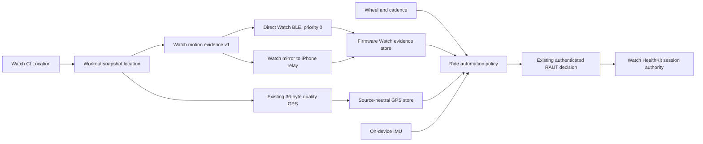

# Watch GPS Primary Auto-Pause and Auto-Resume Implementation Plan

## Profile-4 implementation amendment

Profile 4 restores the Watch-GPS-primary design below while retaining the
profile-3 coasting and route-continuity safety fixes:

- qualified raw Watch workout GPS is the primary pause/resume source;
- its five- and two-second windows advance only from distinct producer samples,
  never from a BLE heartbeat or firmware loop tick;
- when Watch GPS is unavailable, the profile-3 direct-sensor and ten-second
  device GPS-plus-IMU fallback paths remain available;
- trustworthy GPS-plus-IMU movement vetoes a pause and resets a pending stopped
  window instead of being ignored behind a nominal sensor source;
- generic HealthKit `cyclingSpeed` remains a visible metric but does not claim
  paired-sensor provenance unless the source is explicitly confirmed; and
- while the session reports paused, route points with quality physical movement
  evidence may continue route and distance recording, while stationary drift is
  rejected. This repairs a false-pause without creating a route gap.

Older trace schemas remain replayable for compatibility but are not the current
acceptance contract. The new transport uses CAP2 bit `23`, client version `21`,
workout schema `1.6`, and remains internal-control-only until the physical gates
pass.

## Outcome

Make Apple Watch motion evidence, direct cycling sensors, saved route distance,
and confirmed workout state agree during coasting, sensor dropout, and recovery.

For a confirmed running Watch-owned workout, the bike computer will:

- request automatic pause after qualified Watch GPS remains below `0.8 m/s`
  across distinct samples spanning five seconds;
- fall back to definitive wheel stopped evidence or ten continuous seconds of
  qualified device GPS-plus-IMU stopped evidence when Watch GPS is unavailable;
- show candidate progress before the pause request and show the existing
  automatic-pause state only after the Watch confirms the transition;
- continue receiving Watch location evidence while paused and retain only
  quality points that prove physical movement, preserving route and distance
  through a false pause while excluding drift;
- request automatic resume after qualified Watch GPS speed reaches at least
  `2.0 m/s` for two continuous seconds;
- never automatically resume a manually paused workout; and
- use wheel/cadence movement as a safety veto and alternate positive signal,
  while retaining the structured 36-byte GPS plus IMU path as a degraded
  fallback rather than the normal active-workout path.

This is intentionally not a minimal mapping of Watch speed into the existing
wheel-speed field. Watch GPS becomes an explicit, versioned evidence source
with its own capture time, sample identity, quality, thresholds, candidate
windows, diagnostics, compatibility gate, and physical acceptance criteria.

Automatic ride start is unchanged. This plan changes pause and resume only
after a Watch workout already exists.

## Baseline

This plan was prepared on branch
`plan/watch-gps-primary-auto-pause-resume` from freshly fetched GitHub
`origin/main` commit `d5f49fc2ceb17495a66c80c8230311bca6427d49`
(2026-08-24).

Current `main` has the following relevant behavior:

1. `WorkoutSnapshotV1` carries a Watch location with coordinate, capture time,
   horizontal accuracy, course, and speed.
2. `WatchWorkoutManager` considers a Watch location usable for presentation for
   up to ten seconds. Its `currentSpeed` prefers a paired cycling sensor over
   Watch location, so `currentSpeed` is not a reliable way to retain Watch GPS
   when both sources exist.
3. The core 16-byte workout frame carries displayed speed. The correlated
   extended 16-byte frame identifies that speed as paired-sensor or Watch GPS.
4. Direct Watch BLE gives workout frames queue priority `0`; its structured GPS
   packet has priority `1`. The workout speed can therefore be displayed before
   the 36-byte quality GPS packet is processed.
5. The iPhone workout relay coalesces changed workout frames at one second and
   heartbeats unchanged core/extended frames every five seconds. It does not
   provide a dedicated, sample-timestamped Watch GPS evidence frame.
6. Firmware `appendWorkoutSensorEvidence()` admits workout speed only when
   `SOURCE_PAIRED_SPEED_SENSOR` is set. `SOURCE_WATCH_GPS_SPEED` is transported
   and displayed but deliberately excluded from detector evidence.
7. The current policy has two pause paths: direct wheel/cadence for five
   seconds, or quality GPS plus low IMU motion for ten seconds. The GPS path
   already uses a stopped threshold of `0.8 m/s`.
8. The current resume paths are wheel/cadence movement for two seconds, or
   quality GPS at `2.0 m/s` plus positive IMU motion for four seconds.
9. The 36-byte GPS quality packet carries horizontal accuracy and sender sample
   age. The workout frames do not, so firmware receipt time currently cannot
   prove when Watch GPS measured the displayed speed.
10. `WatchRouteRecorder` keeps Core Location active while paused but returns
    before updating `latestLocation`. Consequently, a paused workout does not
    publish fresh Watch GPS speed that could drive automatic resume.
11. The existing ride-automation trace schema records wheel, cadence, selected
    structured GPS, and IMU observations, but has no Watch GPS observation or
    selected pause/resume path.
12. Production ride automation remains capability-gated. This change must not
    silently enable it in production firmware profiles.

The visible low speed and the detector's missing Watch evidence are therefore
two representations of the same Watch location with different contracts. The
implementation must preserve the fast delivery while adding the quality and
freshness semantics required for control.

## Product contract

### Watch GPS is primary during an active workout

When all of the following are true, Watch GPS owns the normal pause/resume
candidate path:

- the Watch workout is confirmed `running` or automatically `paused`;
- the workout session token matches the current firmware workout state;
- the authenticated client negotiated Watch motion evidence v1;
- the sample explicitly comes from `WorkoutSnapshotV1.location`, not the
  source-selected `currentSpeed` metric;
- speed, capture age, and horizontal accuracy are available and valid;
- the sample is no more than three seconds old at the firmware monotonic clock;
- horizontal uncertainty is no more than `12.5 m`; and
- the motion epoch and sample sequence are current for this active workout; and
- the frame's running-or-automatically-paused phase matches the firmware's
  confirmed workout phase.

Watch GPS remains primary even when the presentation speed comes from a paired
cycling sensor. This preserves the requested Watch behavior while keeping the
paired source independently available for conflicts and positive movement.

The structured GPS position selected by navigation or the source-neutral GPS
store must not be relabeled as Watch GPS. An iPhone location and a Watch
location can coexist and must remain distinguishable.

### Pause behavior

For a confirmed running workout:

1. A fresh qualified Watch GPS sample below `0.8 m/s` starts or advances the
   Watch pause candidate.
2. The candidate becomes a pause decision only when qualified Watch samples
   span at least `5,000 ms` with no sample gap greater than the Watch freshness
   window.
3. Exactly `0.8 m/s` is not stopped evidence; the comparison is strictly less
   than the threshold.
4. A duplicate frame or heartbeat for the same Watch location sample may keep
   transport health current but must not extend the observed sample span.
5. A fresh wheel speed at or above `1.5 m/s`, cadence at or above `20 rpm`, or
   trustworthy GPS-plus-IMU movement cancels the pause candidate. Positive
   physical movement wins over contradictory stopped evidence.
6. Cadence zero, cadence-only availability, sensor absence, and wheel dropout
   select the ten-second GPS-plus-IMU fallback. They never manufacture the
   five-second short-path stop.
7. IMU movement participates in the fallback and vetoes a stopped decision
   when the GPS movement evidence is trustworthy.
8. A stale, malformed, out-of-order, wrong-session, or poor-accuracy Watch
   sample resets the Watch candidate. Do not carry partial time into another
   source path.
9. The firmware emits the existing idempotent automatic-pause decision only
   after the five-second gate. The Watch remains the workout authority and must
   confirm the HealthKit session callback before any surface shows a confirmed
   automatic pause.

Short stops below five seconds do not pause. Delays after the five-second
decision caused by BLE control, Watch scheduling, or HealthKit confirmation are
measured separately from detector latency.

### Resume behavior

For a confirmed automatically paused workout:

1. The Watch must continue producing motion-location samples even though route
   and distance recording remain paused.
2. Fresh qualified Watch GPS speed at or above `2.0 m/s` for `2,000 ms`
   produces an automatic-resume decision.
3. A fresh direct wheel speed at or above `1.5 m/s` or cadence at or above
   `20 rpm` for the existing two-second sensor window may also resume. Positive
   movement is safe to act on and must not be blocked by a lagging Watch sample.
4. A fresh qualified Watch speed below `0.8 m/s` cancels a Watch resume
   candidate.
5. Values from `0.8 m/s` through values below `2.0 m/s` are the hysteresis
   band. They neither pause nor resume.
6. If both Watch and direct positive evidence are unavailable, the existing
   structured GPS `>= 2.0 m/s` plus moving IMU four-second path remains the
   fallback.
7. A manually paused workout ignores Watch GPS, wheel/cadence, structured GPS,
   and IMU resume evidence until the rider manually resumes.

Every confirmed pause or resume clears the opposite candidate and source-path
state. Existing manual-resume grace, decision retry suppression, sequence,
acknowledgement, and recovery behavior remains authoritative.

### Source arbitration

The active-workout policy uses these rules:

| Situation | Pause authority | Resume authority |
| --- | --- | --- |
| Qualified Watch GPS available | Watch GPS primary; fresh wheel/cadence movement vetoes | Watch GPS primary; direct positive movement may also resume |
| Watch GPS unavailable, direct sensor available | Existing direct-sensor path | Existing direct-sensor path |
| Watch and direct evidence unavailable | Existing quality GPS plus IMU fallback | Existing quality GPS plus IMU fallback |
| Watch GPS unhealthy during a Watch candidate | Reset Watch candidate, then begin fallback independently | Reset Watch candidate, then begin fallback independently |
| Manual pause | No automatic pause action | No automatic resume action |

A lower-authority fallback never inherits elapsed candidate time from Watch
GPS. Source switching is explicit and traceable.

### Presentation semantics

- The detector phase becomes `PauseCandidate` on the first qualified low Watch
  sample and reports progress against the five-second Watch window.
- The detector phase becomes `ResumeCandidate` on the first qualified moving
  Watch sample and reports progress against the two-second Watch window.
- Candidate UI is not a saved workout transition.
- The automatic-pause indicator is confirmed only after the Watch snapshot
  reports `paused` with automatic origin.
- A source-health diagnostic may distinguish `Watch GPS`, `Cycling sensor`, and
  `GPS + motion`, but normal ride UI must not expose packet sizes or protocol
  terminology.

## Decisions locked into this plan

1. Watch GPS is the normal pause/resume source for an active Watch-owned
   workout. This is not implemented by reusing the wheel field.
2. Build detector evidence from `WorkoutSnapshotV1.location.speed`, capture
   time, and horizontal accuracy. Do not use `currentSpeed` because paired
   sensor precedence can replace Watch speed there.
3. Add a dedicated authenticated Watch motion evidence frame on the workout
   telemetry transport. Do not wait for the lower-priority 36-byte GPS position
   packet before beginning the Watch candidate.
4. The motion frame is sample-based. Repeated publication of one location does
   not fabricate new GPS observations.
5. Sender sample age is converted to firmware monotonic capture time using the
   established `arrival - sampleAge` model. Wall-clock synchronization is not
   trusted for policy timing.
6. Carry horizontal accuracy with the fast Watch speed. A fast value without
   explicit quality is presentation-only and cannot control a workout.
7. Add a stable location sample epoch and sequence to the shared Watch snapshot
   so direct Watch BLE and Watch-to-iPhone relay preserve the same sample
   identity across process recovery. The iPhone relay must build this evidence
   from the authoritative raw Watch envelope, never from a presentation
   snapshot that may contain iPhone location fallback.
8. Continue location reception while automatically paused, but keep paused
   samples out of HealthKit route insertion, route distance, and moving-time
   metrics.
9. Allocate CAP2 bit `23` and client version `21` for
   `WATCH_GPS_MOTION_EVIDENCE_V1_FEATURE`, based on the next free values on the
   baseline commit. Re-check the allocation against current `main` immediately
   before implementation.
10. Preserve all existing core, extended, origin, legacy GPS, and quality GPS
    frame forms. Unsupported peers continue current behavior and fall back to
    existing detector sources.
11. Bump the ride-detection profile and trace schema. Old trace fixtures remain
    replayable; new traces identify Watch samples and the selected policy path.
12. Keep production capabilities gated until deterministic replay and physical
    acceptance pass on both supported Waveshare boards and both Watch transport
    topologies.

## End-state architecture



The fast motion frame and structured GPS packet may describe the same Watch
location, but they have different consumers. The motion frame drives the
primary active-workout speed gate. The structured packet continues to serve
maps, stationary geometry, source-neutral GPS health, and the GPS plus IMU
fallback.

## Shared Watch location contract

Extend `WorkoutLocationV1` with optional `motionSampleEpoch: UInt16?` and
`motionSampleSequence: UInt32?` values assigned by Watch. The epoch identifies
one recoverable Watch location-producer generation; the sequence advances for
new `CLLocation` samples within that epoch.

Contract rules:

- the epoch is nonzero, stored with the active Watch workout recovery identity,
  and advances before a recovered or replaced location producer publishes new
  evidence;
- the sequence advances only for a new accepted Core Location sample within
  the current epoch;
- an accepted motion location is no earlier than the workout start and has a
  capture timestamp strictly newer than the prior motion location in that
  epoch, so cached or reordered Core Location callbacks cannot advance motion
  evidence;
- snapshot heartbeats and unrelated HealthKit metric updates preserve the same
  epoch and sequence for the same location;
- the direct Watch builder and iPhone relay builder copy the same epoch and
  sequence;
- missing epoch or sequence means the peer is legacy and cannot produce motion
  evidence v1;
- a newer epoch resets the firmware Watch candidate and sequence baseline
  before its first sample is accepted;
- delayed older epochs and regressing sequences within the current epoch are
  rejected even when the iPhone-device authenticated BLE transport remained
  connected across a Watch process recovery;
- epoch and sequence wraparound comparisons use serial-number arithmetic and
  are covered by tests; and
- both values are session-local evidence identity, never rider or device
  identity.

Adding the optional field must preserve decoding of old snapshots and old
recovery records. Update sanitization, merge, equality, fixtures, and schema
minor tests wherever `WorkoutLocationV1` is copied or validated.

Keep presentation freshness and detector freshness separate. The existing
ten-second Watch location presentation window may remain for UI continuity,
while the motion evidence sender includes the real sample age and firmware
enforces the stricter three-second detector limit.

Do not assume the current `2 m` Core Location distance filter will always
produce enough distinct stationary samples for a five-second detector window.
Add an explicit ride-automation motion demand to `WatchLocationService` that
uses the most demanding active consumer configuration and targets new source
samples no more than two seconds apart while running or automatically paused.
Use `kCLDistanceFilterNone` for that demand if physical measurement shows it is
required. Core Location still owns the actual callback cadence: missed source
samples make evidence unhealthy rather than causing the app to synthesize GPS
samples. Measure the battery impact before production enablement.

## Workout motion evidence v1 protocol

### Capability negotiation

Add, subject to the implementation-time allocation recheck:

- `WATCH_GPS_MOTION_EVIDENCE_V1_CLIENT_VERSION = 20`;
- `WATCH_GPS_MOTION_EVIDENCE_V1_FEATURE = 1UL << 22`;
- iPhone `supportsWatchGPSMotionEvidenceV1`; and
- direct Watch `supportsWatchGPSMotionEvidenceV1`.

Firmware advertises the bit only when it can decode, validate, store, trace,
and apply the source in ride automation. The sender transmits kind `4` only
after negotiation. Ride automation support remains a separate capability.

### Frame layout

Add workout telemetry frame kind `4`, `WatchMotion`, with a fixed 16-byte v1
payload:

| Offset | Field | Encoding |
| ---: | --- | --- |
| 0 | Frame kind | `UInt8`, value `4` |
| 1 | Flags | bit 0 fix valid; bit 1 speed available; bit 2 accuracy available; bit 3 current Watch sample; bit 4 automatically-paused phase; bits 5...7 zero |
| 2 | Session token | `UInt16LE`, must match the active workout |
| 4 | Motion sample sequence | `UInt32LE` within the current epoch |
| 8 | Watch speed | `UInt16LE` centimetres/second; `0xFFFF` unavailable |
| 10 | Horizontal accuracy | `UInt16LE` decimetres; `0xFFFF` unavailable |
| 12 | Sample age | `UInt16LE` milliseconds; `0xFFFF` unavailable |
| 14 | Motion sample epoch | nonzero `UInt16LE` producer generation |

Validation rules:

- unknown flags or a zero motion sample epoch reject the frame;
- `fix valid` requires speed, accuracy, sample age, current-sample flag, and a
  nonzero session token;
- valid running evidence requires the phase bit clear; valid automatic-resume
  evidence requires the phase bit set; a frame that does not match the
  firmware's confirmed workout phase is ignored without changing evidence;
- flag/sentinel disagreement rejects the frame;
- speed and accuracy encode only finite nonnegative source values;
- sample age is computed at send time and saturates to unavailable rather than
  wrapping;
- malformed frames never update presentation, evidence, or freshness;
- wrong-session and stale-sequence frames are ignored without resetting a
  newer valid sample; and
- transport/authentication reset clears the Watch evidence store immediately.

The frame carries no coordinates. Exact location continues only in the
existing GPS path and remains excluded from normal ride-automation traces.

### Scheduling and queue priority

The new frame must preserve the observed speed advantage:

- a new Watch location schedules `WatchMotion` immediately at workout priority
  `0` rather than waiting for the one-second generic metric coalescing timer;
- coalesce multiple unsent motion frames to the newest valid sample;
- do not let motion coalescing remove or split a pending core/extended lifecycle
  transaction;
- send an initial motion frame with the first active workout frame bundle;
- send a bounded one-second evidence heartbeat carrying the same sample
  sequence and increasing sample age when no new location arrives;
- a heartbeat maintains transport observability but does not advance the
  sample-span window;
- explicit unavailability or session termination clears the sender and
  receiver state; and
- route, navigation, and structured GPS writes retain their current lower
  priorities.

Generalize the iPhone `sendWorkoutTelemetryPair` transaction to admit an
optional motion frame without weakening the atomic core/extended publication
contract. The direct Watch queue needs a distinct coalescing identity for
motion evidence so replacing a location sample cannot delete lifecycle frames.

## Watch location while paused

Refactor `WatchRouteRecorder` reception into two stages:

1. validate and publish the newest motion/location sample while the workout is
   active, using a motion timestamp gate that rejects pre-workout, duplicate,
   and regressing capture times but does not apply the route pause gate; then
2. apply the route timestamp gate, distance accumulation, batching, and
   HealthKit insertion while running; while paused, apply the stricter
   quality-movement filter before those same operations.

While automatically paused:

- Core Location updates remain active through the existing workout consumer;
- fresh accepted locations update the snapshot and motion sample sequence;
- a paused point enters `HKWorkoutRouteBuilder` only when reported speed and
  horizontal accuracy, or displacement beyond combined uncertainty, prove
  physical movement;
- accepted moving points advance route distance continuously across the false
  pause, while stationary drift does not;
- pause/resume does not create a route segment break; only an explicit route
  discontinuity does; and
- delayed, duplicate, regressing, or poor-quality paused points remain excluded.

Manual pause still cannot auto-resume. It may continue receiving location under
the current consumer behavior, but its evidence is ignored by firmware policy.
Battery optimization for long manual pauses may be considered separately only
if it does not complicate route recovery or automatic-pause semantics.

Recovery must restore enough pause origin to decide whether fresh motion
evidence is eligible. A recovered automatically paused workout restarts the
location evidence flow; a recovered manual pause remains automation-ineligible.

## Firmware evidence and policy changes

### Watch evidence store

Add an allocation-free state object under `esp32/lib/ble_navigation/` or
`esp32/lib/ride_automation/` containing:

- active session token;
- last accepted motion sample epoch;
- last accepted sample sequence;
- speed and horizontal uncertainty;
- firmware-monotonic capture time reconstructed from arrival and sample age;
- last frame arrival time;
- availability/quality flags;
- authenticated transport generation; and
- bounded counters for applied, duplicate, stale, malformed, wrong-session,
  sequence-regression, and lifecycle-phase-mismatch frames.

Only the BLE owner path mutates the store. The ride runtime consumes a coherent
snapshot. Reset on disconnect, authentication reset, writer-lease transfer,
workout token change, confirmed running/automatically-paused phase change,
idle/ended workout, and firmware runtime reset.

### Evidence model

Extend `RideEvidenceObservation` with explicit Watch fields rather than
overloading wheel or selected GPS:

```cpp
TimedMetric watchGpsSpeedMetersPerSecond;
TimedMetric watchGpsHorizontalUncertaintyMeters;
TimedFlag watchGpsFixValid;
uint32_t watchGpsSampleSequence;
bool watchGpsSampleSequenceAvailable;
uint16_t watchGpsSampleEpoch;
bool watchGpsSampleEpochAvailable;
```

Extend normalized evidence with:

- `watchGpsKnown`;
- `watchGpsStopped`;
- `watchGpsResumeMoving`;
- `watchGpsSampleAdvanced`;
- Watch/direct and Watch/structured-source conflicts; and
- an explicit selected pause/resume path.

Add Watch-specific evidence and health mask bits without renumbering existing
bits. Bump any transport or diagnostic schema that serializes those masks.

### Versioned profile

Bump the ride-detection profile version and add:

```cpp
uint32_t watchGpsFreshnessMs = 3'000;
float watchGpsStoppedMetersPerSecond = 0.8F;
float watchGpsResumeMetersPerSecond = 2.0F;
float watchGpsMaximumHorizontalUncertaintyMeters = 12.5F;
uint32_t watchGpsPauseMs = 5'000;
uint32_t watchGpsResumeMs = 2'000;
uint32_t watchGpsMaximumSampleGapMs = 3'000;
```

These are firmware policy constants, not user-facing settings. `Auto-Pause`
remains the only user control for this behavior.

### Candidate timing

Do not use firmware loop time alone to infer five seconds of Watch samples.
Add a Watch sample-span latch that:

- begins at the first qualified source capture time;
- advances only when a newer accepted sample sequence arrives;
- requires low-speed qualified samples spanning at least five seconds;
- resets on a sample gap greater than three seconds, poor quality, threshold
  contradiction, confirmed lifecycle-phase, session, or motion-epoch change,
  or moving wheel/cadence veto;
- handles `millis()`, motion-epoch, and sample-sequence wraparound; and
- reports candidate start and progress using reconstructed monotonic capture
  times.

Resume uses the same model with a two-second span and moving threshold.
Generic core/extended heartbeats cannot manufacture elapsed evidence.

### Policy path selection

Add `WatchGpsPrimary` to the pause-path model and expose the selected path in
detector status and trace output.

For pause:

1. Apply manual and feature suppression.
2. If Watch GPS is qualified, evaluate Watch primary and a direct-moving veto.
3. Otherwise evaluate the existing direct-sensor path.
4. Otherwise evaluate existing structured GPS plus IMU fallback.

For resume:

1. Run only for `AutomaticallyPaused`.
2. Accept qualified Watch moving evidence or existing direct moving evidence,
   each with its own two-second sample/duration gate.
3. Use structured GPS plus moving IMU only when the higher paths are
   unavailable.

Switching paths resets the old path's candidate. Pending automatic decisions
use source-aware contradiction rules so newer positive Watch or direct evidence
can cancel a pending pause before Watch confirmation.

Automatic start continues using the current sensor and GPS plus IMU windows;
Watch motion evidence is ignored while lifecycle is idle or starting.

## Diagnostics and trace evolution

Bump the privacy-safe ride-automation trace schema and add:

- Watch GPS speed value and age;
- Watch GPS horizontal-accuracy value and age;
- bounded motion-epoch and sample-sequence change indicators;
- Watch evidence health;
- selected pause/resume path;
- candidate sample span and largest sample gap;
- source-conflict counters; and
- motion-frame applied, duplicate, stale, phase-mismatch, and rejected counters.

Do not record coordinates, raw HealthKit metrics, session tokens, owner keys, or
raw Core Location objects. Keep schema-2 replay support by treating missing
Watch fields as unavailable and selecting the historical paths.

Standard diagnostics should report source health and aggregate latency buckets:

- Watch capture to frame enqueue;
- frame enqueue to firmware arrival;
- first qualified low sample to pause decision;
- decision to Watch confirmation;
- first qualified moving sample to resume decision; and
- decision to Watch confirmation.

These buckets distinguish detector latency from BLE and HealthKit latency.

## Implementation sequence

### Phase 1: shared contract and negotiated transport

1. Add the optional Watch motion sample epoch and sequence to
   `WorkoutLocationV1` and preserve old snapshot/recovery decoding.
2. Add capability client version `21` and CAP2 bit `23`, after rechecking the
   live allocation.
3. Add kind-4 frame builder/decoder, golden vectors, authenticated native and
   fallback handling, and reset semantics.
4. Add priority-0 scheduling for direct Watch and iPhone relay without changing
   existing lifecycle frame atomicity.
5. Keep firmware policy unchanged while collecting decode/scheduling counters.

Deliverable: new peers exchange trustworthy Watch motion evidence, but it
cannot yet control a workout.

### Phase 2: paused-location continuity and shadow policy

1. Refactor Watch route reception so motion samples continue while paused and
   route/distance writes remain stopped.
2. Add the firmware Watch evidence store and source-neutral observation fields.
3. Add profile version, sample-span latches, source arbitration, evidence masks,
   and trace schema.
4. Run Watch primary pause/resume in shadow mode and compare decisions against
   the current direct and GPS plus IMU paths.

Deliverable: trace replay can quantify Watch decision latency and disagreement
without sending automatic controls.

### Phase 3: internal automatic control

1. Enable Watch-primary pause/resume decisions only in existing internal ride
   automation builds.
2. Preserve current RAUT acknowledgement, confirmation, cancellation, manual
   precedence, and recovery behavior.
3. Expose candidate progress and selected-source diagnostics.
4. Run the full topology and physical matrix below.

Deliverable: internal builds control real Watch workouts with Watch GPS as the
primary active-workout source.

### Phase 4: staged production enablement

1. Lock the profile version and trace-set hash after calibration.
2. Enable the new capability only for the board/profile combinations that pass
   physical acceptance.
3. Roll out new app/Watch support before advertising firmware control broadly,
   while preserving fallback for mixed versions.
4. Monitor aggregate diagnostic counters for stale evidence, source conflicts,
   false pause, resume latency, and confirmation failures.

No phase may bypass the existing production ride-automation gate merely because
the new contract and host tests pass.

## Expected code surface

### Firmware

- `esp32/lib/ble_navigation/device_capabilities_protocol.hpp`
- `esp32/lib/ble_navigation/workout_telemetry_protocol.hpp`
- `esp32/lib/ble_navigation/workout_telemetry_state.hpp`
- `esp32/lib/ble_navigation/workout_telemetry_runtime.*`
- `esp32/lib/ble_navigation/ble_navigation.cpp`
- a new bounded Watch motion evidence state/decoder if separation from generic
  workout presentation keeps responsibilities clearer
- `esp32/lib/ride_automation/ride_detection_profile.hpp`
- `esp32/lib/ride_automation/ride_automation_policy.hpp`
- `esp32/lib/ride_automation/ride_automation_runtime.cpp`
- `esp32/lib/ride_automation/ride_automation_trace.hpp`
- host tests and replay fixtures under `esp32/tools/tests/`

### iPhone and Watch

- `ios-app/BikeComputer/WorkoutShared/WorkoutContract.swift`
- `ios-app/BikeComputer/WorkoutShared/WorkoutRuntimeLogic.swift`
- `ios-app/BikeComputer/WorkoutShared/WorkoutDeviceFrames.swift`
- `ios-app/BikeComputer/BikeComputerWatch/Managers/WatchRouteRecorder.swift`
- `ios-app/BikeComputer/BikeComputerWatch/Managers/WatchLocationService.swift`
- `ios-app/BikeComputer/BikeComputerWatch/Managers/WatchWorkoutManager.swift`
- `ios-app/BikeComputer/BikeComputerWatch/Managers/WatchWorkoutRecoveryStore.swift`
- `ios-app/BikeComputer/BikeComputerWatch/Managers/WatchWorkoutDeviceBridge.swift`
- `ios-app/BikeComputer/BikeComputerWatch/Managers/WatchDeviceLink.swift`
- `ios-app/BikeComputer/BikeComputer/Managers/WorkoutDeviceRelay.swift`
- `ios-app/BikeComputer/BikeComputer/Managers/BLEManager.swift`
- capability code under `ios-app/BikeComputer/RideShared/`
- workout contract, relay, BLE, and Watch platform tests

### Documentation

- `docs/ble-protocol.md`
- `docs/ride-automation-traces.md`
- this plan if implementation discoveries require a reviewed contract change

## Automated tests

### Firmware protocol and state tests

Cover:

- exact motion-frame golden bytes for zero, threshold-adjacent, and moving
  speeds;
- capability advertisement by client version;
- native and fallback authenticated transport;
- unknown flags, zero motion epoch, bad sentinel/flag combinations, invalid
  token, stale age, and malformed length rejection;
- running/automatically-paused phase-bit acceptance and lifecycle-phase
  mismatch rejection;
- duplicate, out-of-order, epoch/sequence wraparound, and transport-reset
  sequences;
- a Watch producer epoch change while the iPhone-device BLE session remains
  connected;
- session-token replacement and idle/end clearing; and
- old core/extended/origin frames remaining unchanged.

### Firmware policy tests

Cover:

- Watch speed `< 0.8 m/s` for `4,999 ms` does not pause;
- qualified low Watch samples spanning `5,000 ms` pause exactly once;
- `0.8 m/s` does not count as stopped;
- one repeated low sample and heartbeats cannot create a five-second span;
- a sample gap greater than three seconds resets the candidate;
- poor accuracy or stale age resets the candidate;
- fresh moving wheel/cadence cancels a Watch pause candidate;
- stopped or missing wheel/cadence does not delay Watch pause;
- Watch primary prevents a lower-path contradiction from silently changing the
  selected source;
- source loss starts a new fallback candidate with zero inherited duration;
- Watch speed `>= 2.0 m/s` spanning two seconds resumes exactly once;
- the hysteresis band neither pauses nor resumes;
- direct positive movement can resume an automatically paused workout;
- structured GPS plus IMU remains a fallback;
- manually paused workouts never auto-resume;
- pending-decision cancellation is source aware;
- delayed frames from the prior lifecycle phase cannot advance pause or resume;
- profile, timestamp, and sequence wraparound;
- producer-epoch replacement resets the candidate without losing replay
  determinism; and
- legacy schema-2 traces reproduce their previous decisions.

### Swift contract and scheduling tests

Cover:

- old snapshots decode without `motionSampleEpoch` or `motionSampleSequence`;
- the epoch survives active-workout recovery and advances when a recovered
  producer replaces the prior producer;
- the sequence advances only for a new Watch location within that epoch;
- cached pre-workout, duplicate-time, and out-of-order locations do not advance
  the motion sample sequence;
- the ride-automation location demand selects and restores Core Location
  configuration without disrupting navigation or route recording;
- detector motion uses `snapshot.location.speed` even when `currentSpeed` comes
  from a paired cycling sensor;
- direct Watch and iPhone relay encode identical kind, flags, session token,
  epoch, sequence, speed, and accuracy for the same snapshot, while each
  computes sample age at its own send time;
- both senders derive the lifecycle-phase flag from the authoritative Watch
  snapshot rather than presentation fallback;
- sample age grows on heartbeat while sample sequence remains fixed;
- stale or invalid Watch location produces explicit unavailability;
- new motion replaces only queued motion, never core/extended lifecycle frames;
- new location motion is priority `0` and structured GPS remains priority `1`;
- unsupported firmware receives no kind-4 frame;
- paused location updates publish motion snapshots, accept quality physical
  movement into the route, and reject stationary drift;
- pause/resume preserves one distance segment and excludes delayed or regressing
  points;
- automatic-pause recovery restarts motion evidence; and
- manual-pause recovery remains auto-resume-ineligible.

Run the focused workout contract/platform suites, BLE/navigation contract tests,
firmware host tests, trace replay, and ordinary/production build matrices before
physical testing. A build does not establish device behavior.

## Physical validation matrix

Identify the connected Waveshare board before every build/upload/device action.
Run the accepted matrix on both `WAVESHARE_AMOLED_175` and
`WAVESHARE_AMOLED_206` before advertising production support.

### Connection topologies

- Watch directly connected to Bicino, without iPhone relay.
- Watch mirrored through iPhone to Bicino.
- Handoff between iPhone and direct Watch control at safe session boundaries.
- Active navigation while the Watch workout is running.
- Structured GPS delayed, coalesced, missing, and recovered while motion frames
  continue.
- BLE disconnect/reconnect during low-speed and moving candidates.

### Pause timing and false-pause cases

- Stops of 2, 4, 5, 10, 30, 90, and 180 seconds.
- Slow rolling and coasting below `0.8 m/s` for more than five seconds,
  confirming no cadence-only short-path pause and no route-distance gap.
- Coasting with zero cadence but Watch GPS above the moving threshold.
- Watch GPS below `0.8 m/s` while a paired wheel sensor reports movement.
- Stationary bike with GPS drift and good, marginal, and poor accuracy.
- Urban canyon, tunnel entrance, covered parking, and under-tree stops.
- Handling the bike, rough vibration, trainer use, and wheel spin while
  stationary.
- Watch location sample stalls, duplicate heartbeats, and delayed mirror
  delivery.

### Resume and paused-route integrity

- Resume after automatic pause at speeds below, equal to, and above `2.0 m/s`.
- Pedal/wheel movement before Watch GPS rises.
- Automatically paused workout with direct Watch BLE and with iPhone relay.
- Manual pause followed by riding: remain manually paused.
- At least ten repeated pause/resume cycles in one workout.
- Confirm quality movement points from a false paused interval remain in the
  HealthKit route and cycling distance stays continuous.
- Confirm stationary GPS drift while paused neither enters the route nor
  advances cycling distance.
- Confirm resume continues the existing route segment without a jump across
  accepted movement and without admitting rejected drift.

### Stability and power

- Four-hour mixed navigation/workout soak per board and transport topology.
- Measure motion-frame cadence, queue depth, drops, BLE gaps, loop latency,
  heap/PSRAM, Watch battery, and device battery against the current build.
- Verify touch, display, maps, route updates, audio, SD, diagnostics, and
  ownership authentication remain healthy.
- Inject Watch/iPhone termination, recovery, writer-lease transfer, and device
  reboot at every candidate/request/acknowledgement/confirmation boundary.

## Acceptance gates

The feature is complete only when all of these pass:

1. **Primary-source proof:** traces show qualified Watch GPS selected for normal
   active-workout pause/resume in both direct and relayed topologies.
2. **Pause timing:** the firmware decision occurs after a qualified Watch sample
   span of `5.0 s`, within a calibrated `+/- 0.5 s` scheduling tolerance, and
   never before five seconds.
3. **Resume timing:** the firmware decision occurs after a qualified moving
   Watch sample span of `2.0 s`, within `+/- 0.5 s`, only after automatic pause.
4. **End-to-end latency:** decision-to-confirmation latency is separately
   measured; the agreed internal target is confirmed pause within seven seconds
   of the first qualified low sample and confirmed resume within four seconds
   of the first qualified moving sample under healthy BLE.
5. **No duplicate evidence:** heartbeats, retries, reconnects, and mirrored
   duplicates never fabricate sample duration or duplicate transitions.
6. **Conflict safety:** fresh moving wheel/cadence prevents every contradictory
   Watch-driven pause in the physical matrix.
7. **Lifecycle precedence:** no motion candidate carries evidence across a
   confirmed running/automatically-paused change, manual pause, finish,
   discard, recovery, or session-generation boundary.
8. **Route integrity:** zero paused points or paused-distance growth in saved
   HealthKit workouts, including recovery and delayed batches.
9. **Fallback:** mixed-version peers and Watch evidence loss preserve the
   existing direct and GPS plus IMU behavior without carrying candidate time
   across sources.
10. **Compatibility:** old app/new firmware and new app/old firmware retain
    manual workouts, presentation telemetry, and existing GPS packets without
    malformed writes.
11. **Observability:** every decision identifies profile, selected path, sample
    age/quality buckets, and candidate timing without recording coordinates.
12. **Hardware stability:** both boards pass long-run BLE, display, touch, IMU,
    SD, map, power, and recovery gates.

CI and host replay are necessary but not sufficient. Production capability
advertisement remains off until the physical gates pass.

## Non-goals

- Changing automatic ride-start evidence or thresholds.
- Treating displayed speed without sample age and quality as control evidence.
- Replacing the existing 36-byte GPS packet used by maps and fallback fusion.
- Making iPhone GPS look like Watch GPS.
- Requiring cadence to resume; coasting remains valid movement.
- Automatically resuming a manually paused workout.
- Automatically ending or discarding a workout.
- Adding user-facing threshold sliders.
- Claiming parity with Apple's undisclosed Auto-Pause classifier.
