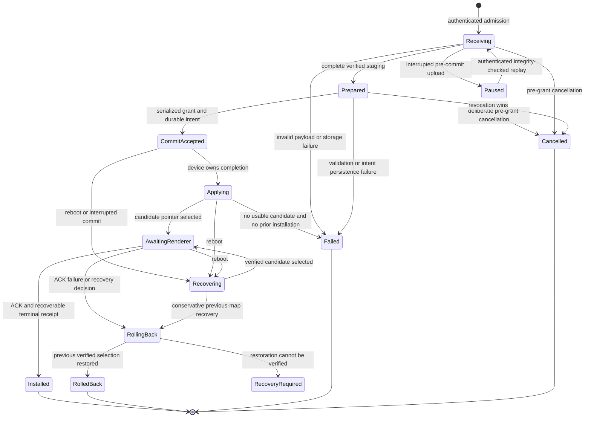
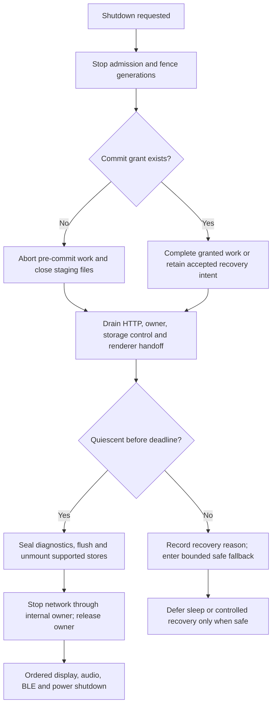

# Wi-Fi device operation lifecycle implementation plan

## Status, scope, and evidence

Planning date: **2026-09-30 (Asia/Singapore)**. Source baseline: freshly fetched
`origin/main` at **`d43ef487db3a85691d186067fb78f1d0952ca877`**. This document
was authored on `plan/wifi-device-operation-lifecycle` in an isolated managed
worktree. The dirty primary checkout is not an implementation input.

This is a complete implementation and qualification plan, **not a runtime
implementation or a claim that the proposed tests have passed**. It covers maps,
firmware OTA, diagnostics, remote debugging, shared transport ownership, durable
results, storage recovery, and explicit/disconnected shutdown. It preserves the
existing renderer and full-screen LVGL buffer/full-refresh strategy. It does not
authorize device writes, signing-key changes, releases, or worldwide enablement.

The authoritative input is the full ChatGPT Pro review supplied at
`/Users/chris/.codex/attachments/d137e374-4746-4bc2-8cd0-c5290b53cf48/Pasted text.txt`,
including its source inventory, limitations, recommendations, and qualification
matrix. Its [original conversation](https://chatgpt.com/c/6abcf8a8-6680-83ea-818f-cc42e66e1696)
is a provenance reference; the supplied text is the complete review input.
The review inspected pinned main `d45e9edb903e4d4f098593eb7f005e1c900e66e9`
and #540 patch `6c4120afa84047c36c36db34195e47651ce5a9b7` through a GitHub
connector and did not execute tests or operate an iPhone/board.

| Evidence category | What is established | Limit of the evidence |
| --- | --- | --- |
| Current source inspection for this plan | F1/F2/F4/F5/F6 paths remain; #540 read-back and previous-map recovery are present at the base SHA | No deterministic race reproduction, firmware build, or runtime test was performed while writing this plan |
| Supplied GitHub/CI history | #541 source-generation fix and #543 worker promotion merged; #540 merged after exact-head CI Gate and 1.75 ordinary/production/remote-debug builds; final #540 head `3aab22c4693b54490473e7b884d75e55f8db6eca` | Historical checks supplied by the originating task; not rerun here and not qualification of future phases |
| Supplied deployed context | Fixed production worker promotion is merged | This plan does not independently verify current deployed image, health, or rollout settings |
| Operator-reported hardware | Regular Bicino downloaded/transferred one small signed map; the 1.75 board displayed it and retained it after full power off/on; board image came from original #540 patch `6c4120afa84047c36c36db34195e47651ce5a9b7` | One successful flow, not final-merged-image qualification, controlled fault injection, or representative scale/resource testing |
| Controlled power interruption | No new evidence in this task | Host read-back and ordinary reboot cannot establish FAT/SD power-loss ordering |
| Production qualification | Worldwide signed-map rollout remains closed; 2.06 and storage-interruption qualification remain outstanding | No row above closes those gates |

The review did not audit every line of its source inventory, the operation
owner's entire tail, all host tests, the external debugging browser, or all board
configurations. It explicitly excluded detailed reads of
`device_transfer_network_protocol.hpp`, `device_transfer_http_limits.hpp`,
`device_transfer_tls.hpp`, and `response_write_policy.hpp`. This plan verifies
the principal finding paths and test entry points, not an exhaustive new audit.
Each implementation PR must inspect its complete affected call graph, including
those headers and configuration-specific paths. Retrieval limitations in the
original review do not constitute missing implementation evidence or executed
tests.

## Problem and current architecture

The repository already has substantial secure shared transport. Authenticated
BLE entry delivers the HTTPS endpoint, fresh hotspot password, token, TLS leaf
pin/identity, and transfer generation. `HttpTransferServer` supplies shared TLS,
session revocation, request authorization, worker-stop fencing, and failure
handling to maps, OTA, diagnostics, and debug. The PSRAM-backed TLS/HTTP worker
dispatches Wi-Fi and flash/cache-sensitive work to an internal-RAM
`DeviceOperationOwner`; timeout/mismatched commands poison ownership rather than
pretending late work stopped. Preserve that structure.

The iOS `DeviceTransferManager` is a shared component used by independently
orchestrated managers. Map upload has a separate background URLSession delegate
and persisted HTTP records. Activation, BLE reconciliation, and cleanup have
different lifetimes. No common per-device operation lease presently joins all
those lifetimes. Token generation is authority for the current connection, not
a durable installation identifier.

`DurableMapDownloadCoordinator` already persists attempts for backend-to-phone
artifact downloads. Reuse its tested ownership/persistence patterns, but do not
confuse those download attempts with phone-to-device commit/activation records;
the latter require authenticated device identity and durable device results.

The actual map path is the **signed stream**. Firmware rejects old session/archive
installation routes with `signed_stream_required`; legacy iOS methods and older
protocol prose are not evidence that firmware accepts that flow. Current stream
HTTP 200 `status: ready` means finalized staging, not installed. Stream replay
reuses integrity-checked completed files; it is not arbitrary byte-offset HTTP
resume. `finish()` calls parser completion and writes ready/pending metadata.
Response completion closes/unwinds the HTTP path and dispatches activation.
Activation selects a pointer and hands the root to the renderer; only renderer
acknowledgement publishes terminal installation success, and failure rolls back.
Current response-abort/revocation cleanup also participates in this transaction.

| Consumer | Preserve network/execution policy | Completion boundary |
| --- | --- | --- |
| Map | Device hotspot; background file upload, later reconciliation | Exact artifact and operation accepted by renderer and represented by recoverable terminal state |
| Firmware OTA | Device hotspot; same-image maintenance boot, fresh owner authentication and foreground control/upload | Matching image and successful post-reboot boot acceptance, or recorded rollback/failure |
| Diagnostics | Configured LAN attempted; phone endpoint failure permits orderly hotspot fallback; verified complete-chunk cache | Requested complete chunks have expected lengths/hashes and the adapter reports completion |
| Remote debug | Configured LAN supported even if phone cannot reach it; hotspot supported; browser may be the real client | Session readiness/lifetime, then confirmed stop; readiness is not durable installation |

## Goals and invariants

1. **No false map success.** A provisional pointer, HTTP completion, changed map
   ID, cached status, or status sequence alone never proves the expected live
   operation installed. Matching `activating` remains pending. A post-reboot
   reconstruction requires fresh authenticated recovery/renderer evidence.
2. **One cancellation linearization point.** Revocation before grant prevents
   any boot-activatable intent. Grant before revocation gives the device
   responsibility for completion/recovery. Lost responses produce unknown
   outcomes, never a fictitious cancellation or blind duplicate install.
3. **One owner of each device session.** A lease spans acquisition, upload,
   confirmation/recovery, and teardown. Delegates release their own claims;
   only the session owner removes network configuration or exits a mode.
4. **Identity survives transport changes.** Operation/artifact identity survives
   BLE reconnect, reboot, token rotation, suspension, termination, and relaunch.
   Connection epoch and authorization generation fence callbacks separately.
5. **Result and cleanup are independent.** Installed can coexist with cleanup
   unresolved. Failed/cancelled can coexist with resumable staging. No retry
   starts while a conflicting device operation remains unresolved.
6. **Shutdown admits no new work.** Pre-commit work aborts; granted commits
   complete or leave deliberate recoverable intent. Workers, renderer/storage
   control, diagnostics, and mounted files quiesce before ordered teardown.
7. **Security and execution protections persist.** Keep BLE ownership, pinned
   TLS, redirect rejection, signed artifacts, generation revocation, internal
   execution ownership, worker-stop fencing, timeout poisoning, and resume
   integrity checks. Never accept arbitrary self-signed certificates.
8. **Recovery is conservative and repeatable.** Preserve the only verified
   usable map, do not guess between candidates, and retain journals when
   restoration cannot be verified. Read-back is not a power-loss guarantee.
9. **Policy specialization is explicit.** Common lifecycle ownership must not
   erase diagnostics/debug LAN differences or OTA's SD-independent acceptance.
10. **Evidence remains separated.** Source, host, CI/build, deployed, operator
    report, controlled physical interruption, and production acceptance have
    distinct records per exact artifact and board family.

## Reconciliation with existing plans

This plan owns the operation/session/commit contract across consumers. It does
not replace previously implemented transport, map format, backend, renderer,
BLE controller, or storage-driver work. Older plans retain historical evidence;
their old pending/complete statements must be refreshed against the PR's base.

| Existing document | Reuse and reconciliation |
| --- | --- |
| [Map-transfer Wi-Fi startup](map-transfer-wifi-startup-reliability-implementation-plan.md) | Internal operation owner, PSRAM worker, measured admission, retained AP subreasons and response-close handoff are the implemented baseline. Do not repeat the early proposal to move the worker. Extend repeated-cycle and teardown qualification; its older failed-transfer records do not negate the supplied later successful small-map run. |
| [Firmware OTA maintenance](firmware-ota-maintenance-implementation-plan.md) | Keep same-image maintenance boot, signed inactive-slot install, fresh reconnect/authentication, commit boundary and post-boot acceptance. Later implementation notes/current source take precedence over earlier conditional PSRAM-worker wording. Generalize ownership without adding SD dependence or partition migration. |
| [Device map presence](device-map-presence-implementation-plan.md) | Keep exact-content merging, authenticated complete status, device-only previews, and stale-presence clearing. Tighten green-check/success derivation to confirmed selection; candidate presence cannot confer live-operation success. |
| [Firmware runtime/cache/SD hardening](firmware-runtime-cache-sd-hardening-implementation-plan.md) | Reuse native SDMMC, bounded remount, stable backend and quiescing existing users. Add transaction power-cut coverage; neither native transport nor immediate read-back proves persistence. Preserve locked build/attestation workflow. |
| [Ride diagnostics](ride-diagnostics-logging-implementation-plan.md) | Reuse bounded durable events and complete-chunk integrity/cache. Extend operation correlation and shutdown sealing; do not duplicate the recorder. |
| [Real-device browser debugging](bicino-real-device-browser-debugging-implementation-plan.md), [debug usage](../remote-device-debugging.md) | Preserve opt-in debug profiles, authenticated sessions, browser revocation, bounded capture/request work, and intentionally retained LAN without phone reachability. |
| [Bluetooth architecture](bluetooth-connection-reliability-architecture-implementation-plan.md), [current reassessment](bluetooth-reliability-reassessment-2026-09-06.md) | Reuse generation-aware queues, authenticated writer roles, critical delivery and reconnect semantics. New transfer epochs supplement these rather than redesigning Watch/iPhone control ownership. Shutdown integration must not lose critical BLE release intent. |
| [Map reuse](issue-508-map-reuse-implementation-plan.md), [city-scale orchestration](shanghai-city-scale-3d-map-orchestration-implementation-plan.md) | Backend preparation/cache identities and producer receipts remain separate from device-operation UUIDs. Large artifacts feed scale qualification; no backend rewrite is needed for F1–F6. |
| [Map stream rollout](../map-stream-rollout-runbook.md), [factory release](../firmware-factory-release.md) | Existing cohort, immutable artifact/build identity, trust and per-target hardware gates remain the rollout authority. This plan adds lifecycle evidence before expansion. |

## Findings verified against the planning baseline

Paths below are relative to repository root. Function names are the stable
implementation references; original review line numbers belong to its pinned
revisions and should not be copied to future PRs. The links here target this
plan's immutable base.

| ID | Current source observation and qualification | Work and tests |
| --- | --- | --- |
| **F1** | [`MapActivationReconciler.evaluate`](https://github.com/seichris/open-bike-computer/blob/d43ef487db3a85691d186067fb78f1d0952ca877/ios-app/BikeComputer/BikeComputer/Managers/OfflineMapManager.swift#L778) observes `activating` then falls through to active-session or changed-map success. Existing test has a same-session pending case, but misses replacement/new-session fallthrough. | P1 and P4/P5; T1, T4, T7. Remove provisional/map-ID-only success, bind terminal receipts, constrain reboot reconstruction. |
| **F2** | [`handleInstallStream` finalization boundary](https://github.com/seichris/open-bike-computer/blob/d43ef487db3a85691d186067fb78f1d0952ca877/esp32/lib/map_transfer_http/map_transfer_http.cpp#L500) sets `cancelled` after authorization recheck then still calls `receiver->finish()`. Parser `finish()` calls `onComplete`; install `writeFinalMetadata()` writes `.ready` and pending intent. | P2 then P4; T2, T3, T8. Abort separately; serialize grant with revocation before boot-eligible writes; update response callbacks. |
| **F3** | [`recoverStreamActivationTransaction`](https://github.com/seichris/open-bike-computer/blob/d43ef487db3a85691d186067fb78f1d0952ca877/esp32/lib/map_transfer/map_transfer.cpp#L2105) and `writeActiveMap` already contain #540 verified previous restoration and full pointer read-back. | **Implemented baseline**, not a request to reimplement #540. P6 qualification and narrowly justified hardening; T8, T9. |
| **F4** | [`enterMapTransfer`](https://github.com/seichris/open-bike-computer/blob/d43ef487db3a85691d186067fb78f1d0952ca877/ios-app/BikeComputer/BikeComputer/Managers/DeviceTransferManager.swift#L867) catches join failures, but request/status/security/timeout/cancellation paths before that catch lack acquisition-wide cleanup. `withBackgroundTransferLifecycle` starts after entry. | P3; T5. Cover the accepted-or-possibly-accepted entry transaction and persist unresolved cleanup. |
| **F5** | [`urlSession(_:task:didCompleteWithError:)`](https://github.com/seichris/open-bike-computer/blob/d43ef487db3a85691d186067fb78f1d0952ca877/ios-app/BikeComputer/BikeComputer/Models/OfflineMapPlatform.swift#L3133) removes configuration using other background tasks' SSID use, excluding foreground confirmation/other consumers. | P3/P5; T6, T7, T10. Lease-owned cleanup; physical disconnection timing remains to be measured. |
| **F6** | [`processDisconnectedShutdown`](https://github.com/seichris/open-bike-computer/blob/d43ef487db3a85691d186067fb78f1d0952ca877/esp32/src/main.cpp#L1463) calls `Power::deviceShutdown`; [`deviceShutdown`](https://github.com/seichris/open-bike-computer/blob/d43ef487db3a85691d186067fb78f1d0952ca877/esp32/lib/power/power.cpp#L144) seals diagnostics then shuts peripherals/deep sleep without a common map/OTA/storage barrier. | P6; T11, T8, T12. Bypass is source-confirmed; corruption is a risk, not a demonstrated physical result. |

F2's current cancelled branch returns an error without the review's described
explicit in-memory reset; this detail differs from the review narrative but does
not remove finish-after-revocation or its persisted-state consequence. Existing
`responseDidComplete` may discard a deferred candidate when revoked, and
`responseDidAbort` discards one when a response aborts. They do not repair a
cancelled path that never creates that deferred record. Both callbacks must also
change when grants become irreversible, or they would discard accepted work.

F3's characterization as a current-main defect is stale following #540 merge.
F5 is a definite ownership error, not proof that every configuration removal
immediately disconnects iOS. Stale/cross-device callback attribution is an
architectural risk requiring T10, not an established exploit; TLS pinning still
protects the connection. Low-memory floors are rejection guards, not measured
success guarantees. F6 and SD durability require targeted reproduction.

## Proposed durable architecture

### Per-device iOS coordination and leases

Introduce a `DeviceOperationCoordinator` actor per authenticated device and an
app-scoped registry that routes background events to those actors. Proposed new
files live under `ios-app/BikeComputer/BikeComputer/Managers/` and operation
models/store under `Models/`; names are proposals, not existing symbols.
Keep `BLEManager` and observable UI adapters on `@MainActor`; bridge immutable
identity-tagged events into the actor. Do not move CoreBluetooth/UI state into
unsafely isolated code.

The actor owns admission, acquisition/exit, credential epoch snapshots, network
selection, hotspot lifetime, background attachment, cancellation, operation
records, and cleanup. `DeviceTransferManager` remains the tested network/BLE
adapter but all entry/exit/removal calls require ownership. Map/OTA/diagnostics
and debug adapters declare policy and consumer-specific progress/acceptance.

Lease identity is `(deviceID, operationID, leaseID, connectionEpoch,
networkGeneration)`. Individual upload, confirmation, status, and browser-control
claims belong to the same admitted device operation. Release is idempotent;
an old lease can release only itself. The coordinator persists logical claims
needed to reconstruct active background tasks, not live Swift task handles.

Start conservatively: one admitted network mode per device; map and OTA are
exclusive mutations; diagnostics and debug are also mutually exclusive modes
until firmware explicitly supports compatible concurrent consumers. Queue or
return a concrete busy result for contention; do not silently switch modes.
Multiple consumers within an operation may share its endpoint. Add cross-mode
sharing only after an explicit compatibility table and tests demonstrate it.

An app-wide hotspot manager serializes configuration apply/removal across device
actors. The same SSID may be reused by different boards; SSID alone is not an
ownership key. Because iOS configuration removal is keyed by SSID, it must be
fenced by the current configuration generation and all claims, including pending
apply callbacks. A late old apply/remove completion cannot tear down the newer
session. Switching the phone's accessory network is admitted explicitly; a
second actor cannot concurrently redirect a first actor's connection.

Acquisition starts before sending DTRN. Persist `enter_requested` and whether
remote acceptance is possible. Every unsuccessful acquisition executes bounded
cleanup independent of parent task cancellation. Verify fresh authenticated
mode/token clearance for the original device/epoch. If disconnected, record
`cleanup_unresolved`; reconnect/retry reconciles it before another admission.
Never send an old exit command after the actor has changed device/session.

On terminal result, release consumers, request remote exit if still owned,
observe worker/mode clearance where available, and remove the current owned
hotspot only after the final network claim ends. On bounded uncertainty, release
local resources deliberately and persist remote cleanup intent for reconnect;
do not hold the AP forever or rewrite installed as failed. Firmware automatic
exit may end the AP before the phone confirms; fresh authenticated BLE result
query remains the recovery route.

### Durable identity and storage records

Separate four identities:

| Identity | Lifetime and authority |
| --- | --- |
| Authenticated stable `deviceID` | Firmware ownership identity verified during bootstrap; not just CoreBluetooth peripheral UUID, SSID, endpoint, or a copied SD record |
| Random `operationID` | One logical attempt, generated/persisted before entry; survives reconnection/reboot; same-artifact reinstall uses a new ID |
| Artifact identity | Map ID plus canonical/signed manifest receipts and stream digest/length; OTA signed manifest/image SHA and target; diagnostics capture/chunk IDs; absent for session-only debug |
| Connection/session epoch | iOS local epoch, firmware boot/session identity and token/transfer generation; ephemeral authorization and callback fence |

Retain content-derived map `sessionId` for stream reuse and existing roots; do
not substitute an operation UUID into signed manifest/content identity. Device
operation metadata is a separate local envelope bound to the verified receipts.
Do not modify signatures to encode transport sessions.

Proposed versioned operation record (conceptual JSON; exact bounded wire names
and limits must be frozen in P4):

```json
{
  "schemaVersion": 1,
  "deviceID": "authenticated-device-id",
  "operationID": "random-uuid",
  "kind": "map",
  "artifact": {
    "mapID": "logical-map-id",
    "contentSessionID": "existing-content-identity",
    "manifestReceipt": "sha256",
    "signedManifestReceipt": "sha256",
    "streamSHA256": "sha256",
    "streamBytes": 12345
  },
  "phase": "commit_accepted",
  "revision": 4,
  "commitAccepted": true,
  "result": null,
  "confirmedSelection": null,
  "cleanup": "pending"
}
```

Firmware persists bounded identity/state/result/recovery data; iOS additionally
persists operation intent, expected artifact, previous confirmed selection,
background namespace/task IDs, last verified receipt, and cleanup claims. Do not
persist bearer tokens, hotspot passwords, or LAN credentials in operation JSON
or logs. Preserve existing device-only Keychain ownership of secrets. Saved pin
metadata is not authority to resume after reconnect: require fresh BLE bootstrap.

Map records use the existing SD transaction/storage abstraction with versioned,
checksummed bounded records, atomic replacement/read-back, and recovery
generation. OTA result/boot binding remains **SD independent**, using existing
firmware-maintenance/boot acceptance facilities and a bounded internal persistent
record where needed; quantify NVS wear and failures before adding writes. Debug
has session/cleanup records rather than a fake installed artifact; diagnostics
records immutable capture/chunk receipts rather than mutating map success.

Persist only state transitions/checkpoints, not every byte/progress callback.
Preserve the current and unresolved operations and a bounded terminal history;
never evict the only unresolved result. Define a client result acknowledgement
and retention/tombstone window before pruning. An expired unknown ID returns
`result_unavailable` and prompts conservative reconciliation, not a new implicit
attempt. Status revisions are monotonic within record/boot scope and are not
timestamps or success proofs.

### Device state and app observation state



These are map domain states; OTA's applying/acceptance adapter uses image reboot
and normal-boot acceptance, not renderer acknowledgement. Diagnostics/debug
terminate as completed/stopped. App observation is orthogonal:
`in_progress`, `commit_accepted`, `result_unknown`, `installed_confirmed`,
`failed_or_rolled_back`, or `cancelled_before_commit`, plus independent
`cleanup_pending/unresolved/complete`. A dropped response changes knowledge,
not the firmware transaction. Recovery-required is nonterminal until deliberate
repair/failure disposition. Timeout never manufactures a terminal device result.

Keep candidate selection and last confirmed installation separate. A map can be
selected provisionally while renderer ACK is pending; status reports both, with
operation identity. Write/verify the terminal receipt after the renderer accepts
the exact root/receipt; then publish installed. If that receipt cannot persist,
leave confirmation/recovery pending even if the screen currently renders.
Preserve previous root/journal evidence until this terminal boundary; reconcile
existing consumed-marker/journal cleanup ordering with the new receipt lifetime.
Post-boot recovery must verify selected content and renderer readiness before
reconstructing success. A later runtime degradation does not erase historical
success; report a separate current-selection health/rollback event linked to the
original operation, so the UI stops showing that artifact as currently usable.

### Authorization-to-commit boundary and sequence

P2 provides the immediate safety repair using the existing shared commit concept.
P4 then separates **prepared, non-boot-activatable staging** from durable accepted
intent. Proposed capability `deviceOperationV1` and authenticated operation
prepare/commit/query/cancel messages are additive; endpoint and BLE opcode names
are finalized with framing limits, not silently assumed to exist today.

For the new contract, complete stream validation produces prepared staging.
An authenticated idempotent commit command reserves a grant under the same
serialization as revocation/admission. Persist accepted operation intent before
creating any `.ready`/pending marker that recovery can activate. Do not hold the
transport mutex through SD writes: reserve a fenced grant, perform IO on the
appropriate owner, then publish the durable state. Revocation after reservation
cannot cancel the grant. If intent write fails, publish explicit failure only
when safe; uncertain partial persistence is recovery-required. A crash between
reservation and durable intent cannot leave boot-eligible staging without a valid
accepted record. Before grant, cancel/resume never creates ready candidates.

```mermaid
sequenceDiagram
    participant App as iOS coordinator
    participant BLE as Authenticated bootstrap
    participant HTTP as Shared pinned HTTPS
    participant Op as Device operation owner
    participant SD as Map transaction store
    participant Render as Renderer
    App->>App: Persist device + operation + artifact intent
    App->>BLE: Acquire mode with fenced identity
    BLE-->>App: Fresh endpoint, token, generation, TLS pin
    App->>HTTP: Signed stream, operation ID, known length
    HTTP->>SD: Verify and checkpoint staging
    HTTP-->>App: Prepared receipt (not installed)
    App->>HTTP: Commit expected operation + artifact
    HTTP->>Op: Serialize grant against revocation
    alt Revocation wins
        Op->>SD: Abort or retain nonactivatable staging
        HTTP-->>App: Cancelled before commit
    else Grant wins
        Op->>SD: Persist accepted intent, then ready/pending metadata
        HTTP-->>App: Commit accepted (response may be lost)
        Op->>SD: Journal and verified candidate pointer
        Op->>Render: Request exact root transition
        alt Renderer accepts
            Render-->>Op: ACK for expected root/operation
            Op->>SD: Persist terminal installed receipt
        else Renderer fails
            Render-->>Op: Failed ACK
            Op->>SD: Verify and restore previous map; persist outcome
        end
        App->>BLE: Query original operation after reconnect if needed
        BLE-->>App: Authenticated terminal or unresolved result
    end
    App->>App: Persist result; release claims; reconcile cleanup
```

HTTP socket completion becomes a scheduling/unwind boundary, not authority to
discard accepted work. Update `responseDidComplete`, `responseDidAbort`, deferred
activation tokens, failed `sendJson`, and duplicate callbacks consistently.
They may abort/discard before grant; after grant they must keep/schedule recovery
and never relabel accepted work as cancelled. Activation still runs only after
TLS/parser stack state has unwound. Preserve deliberate close for the stream
response and avoid global keep-alive changes.

Retry `(deviceID, operationID, artifact)` is idempotent: same input returns state
or terminal receipt; conflicting digest/kind for an existing ID returns conflict.
Check existing operation before pruning staging or uploading again. Interrupted
files must still pass completed-prefix/checkpoint/length/hash verification during
whole-stream replay. Grant does not weaken trust verification or allow a new
unauthorized request to write under a revoked token.

Resuming a paused operation keeps its ID. A terminal cancelled/failed operation
cannot be resurrected by replay; a deliberate new attempt gets a new ID and may
reuse only independently verified staging content under the existing integrity
rules. Retrying an already installed ID queries its receipt without activating
the map again.

### Protocol and backward compatibility

- Add versioned operation capability and bounded identity/result fields to
  generic transfer status and map status; support authenticated HTTP query and
  chunked BLE query so reconciliation works after AP teardown. Maintain complete
  chunk/session assembly and limits. Distinguish unknown version, unsupported
  capability, result not found/expired, busy, and identity conflict.
- Update firmware `ble_navigation.cpp/.hpp`, iOS `BLEManager.swift`,
  `NavigationProtocol.swift`, shared status models and host/Swift tests together.
  Prefer existing authenticated control/status channels; add no new UUID unless
  existing framing demonstrably cannot express bounded requests.
- New iOS with old firmware: apply P1 conservative pending behavior; only fresh
  matching terminal activation proves a live attempt. Missing durable receipts
  after reboot stays unconfirmed unless a documented fresh recovery/renderer
  check can establish exact content. Never retain the changed-map fallback to
  make legacy firmware look successful. Explain upgrade/retry limitations.
- Old iOS with new firmware: legacy signed-stream upload can use a server-side
  operation ID and the P2 implicit grant before finalization; retain HTTP ready
  shape and existing terminal activation fields. New durable correctness
  guarantees and all-consumer leasing require the new app. The old app's
  pointer-derived success bug cannot be cured by protocol documentation alone;
  constrain rollout to fixed app identities as existing approval controls allow.
- Do not reopen unsigned archive/manifest-HEAD installation for compatibility.
  Preserve signed stream format/trust and old local previews.
- Migrate iOS persisted upload descriptors atomically to versioned operation
  records. A legacy descriptor lacks stable device identity: quarantine it as
  needing authenticated reconciliation; do not bind it to whichever board is
  connected. Verify against known saved device/artifact history or require a
  deliberate retry after reconciliation. Retain original records until migrated.
- Migrate firmware journal/ready formats with dual readers and versioned writes.
  Valid legacy pending maps retain conservative #540 recovery; they are not proof
  of a newly authorized operation or a new receipt. Pre-upgrade legacy intent has
  unknown historical authorization; explicitly report that limitation. New
  prepared records must not look like legacy `.ready` records to older firmware.
- Unknown/corrupt new metadata fails closed without deleting previous content.
  Downgrade is allowed only after unresolved operations drain and metadata
  compatibility is verified; never boot older firmware that guesses from new
  records. Decide the downgrade marker/capability floor before shipping P4.
- Rewrite [BLE protocol](../ble-protocol.md) signed-stream/operation sections
  when the contract is frozen, in the same PR as wire changes. Document HTTP
  ready versus prepared/grant/installed, BLE receipts, abort callbacks, replay,
  and recovery; identify legacy prose explicitly rather than relying on it.

### Background, suspension, termination, and relaunch

Persist intent before side effects. Background descriptor/task description must
include schema/device/operation/artifact identity, upload attempt ID and app
namespace; retain existing Debug/Release background namespace isolation.
URLSession delegate durably records bytes/HTTP result, then submits a tagged
event to the coordinator; it cannot mark installed or remove hotspot configuration.
Persist response receipt before delivering continuation/OS completion where
available. A crash between callback delivery and coordinator consumption must be
recoverable from the record. Correlate by namespace plus task ID/attempt, not a
reused task integer alone.

On launch, restore coordinator records and attach URLSession tasks, reconstruct
claims, then reconcile authenticated device state. Orphan task with valid
descriptor is attached conservatively; missing/malformed identity cannot mutate
another operation. Duplicate callback/result ingestion is idempotent. Delayed
old HTTP results may update their historical record but cannot update current
BLE/UI state. Require matching device, operation, artifact, connection epoch,
boot/session and transfer generation at every status application, including
`BLEManager.applyAuthenticatedMapTransferStatus`.

iOS is not guaranteed to run activation polling or BLE control while suspended.
Granted device work must finish/recover without that polling. Reconciliation is
persisted and resumed on available background events or foreground relaunch,
without promising execution while force-terminated. OTA persists unknown
finalize/boot result and reauthenticates; diagnostics retains only complete valid
chunks; debug suspension revokes or preserves the session only according to the
declared policy and actual authenticated BLE lifetime.

### Shared firmware shutdown and quiescence

Introduce a mode-neutral shutdown coordinator/barrier at composition in
`esp32/src/main.cpp`, backed by existing owner, storage control, server and
recorder facilities. It must guard all explicit/disconnected/deep-sleep entry
paths, not only transfer inactivity. Audit all profile-specific direct radio,
peripheral and deep-sleep callers before connecting the barrier.



No worker waits for itself, no filesystem work on the UI, and no server-stop wait
while holding the server/installer lock. Define lock ordering, asynchronous ACKs,
timeouts and progress watchdog before implementation. Include recovery task,
rollback storage-control task, diagnostics producers/seal, renderer outstanding
root, and open files in the barrier. Automatic light-sleep power locks remain
useful but do not establish explicit shutdown safety.

Make `Power::deviceShutdown` and the low-level deep-sleep primitive require an
issued barrier permit or funnel through the coordinator; a caller cannot bypass
the barrier by calling the low-level method. Remove or serialize redundant direct
radio stops in `Power::powerDeepSleep` so Wi-Fi teardown remains internal-owner
work, including profile-specific paths. Keep boot-only radio setup distinct from
an in-flight shutdown. Verify both permit rejection and successful ordered entry.

Choose a bounded initial policy in P6: 5 seconds for admission stop/pre-commit
abort and ordinary worker drain; accepted map work retains its existing bounded
activation policy, with a proposed 30-second no-progress shutdown watchdog and
an absolute ten-minute limit. OTA uses its existing bounded commit/reboot path.
Validate/tune these values from measured worst-case IO and owner behavior before
production, rather than silently extending them. Report which sub-barrier failed.

On deadline, persist recovery intent where writes are safe; use the existing RTC
fault capsule as supporting diagnostics when storage is unavailable. RTC is not
a guarantee across full power removal. **Do not call deep sleep while a worker
may still write.** After bounded failure, leave shutdown deferred in a low-power
safe state or enter a deliberately reviewed controlled-reset recovery path only
after proving late work cannot access storage. Poisoned ownership stays terminal
for that boot. A user physically removing power remains an interruption test,
not a software shutdown barrier. Terminal work and network stop precede owner
release; keep internal owner available for Wi-Fi teardown.

## Implementation sequence and bounded PRs

P1 and P2 are immediate safety changes on the existing contract. P3 can follow
without waiting for the full operation wire protocol. P4 establishes that
protocol and storage migration before P5 adoption. P6 depends on accepted-intent
semantics and can be split into barrier and durability-test PRs. P7 is a
qualification/rollout workstream, not a broad combined runtime PR.

| Phase / proposed PR | Dependency | Bounded implementation and exact starting points | Exit gate |
| --- | --- | --- | --- |
| **P1 — Require terminal map activation** | Fresh baseline | `OfflineMapManager.swift`: `MapActivationReconciler.evaluate`, `confirmActivatedMap`, `reconcileLastTransfer`, `isCachedPackInstalled`; ensure Saved Maps uses confirmed rather than provisional identity. Change fallback policy without a renderer refactor. | T1 fails under current replacement/new-session behavior and passes; T4 preserves legacy pending/fast terminal cases; no pointer-only live success |
| **P2 — Fence map finalization against revocation** | P1 preferred; technically independent | `map_transfer_http.cpp/.hpp`: `handleInstallStream`, `deferActivationUntilResponse`, `responseDidComplete`, `responseDidAbort`, `beginDeferredActivation`; `map_stream_receiver.cpp/.hpp`, parser/install completion and explicit abort API; shared `beginAuthorizedCommit/endAuthorizedCommit` and commit policy. | T2/T3 deterministic cancel-first/grant-first, lost/aborted response and reboot cases; no accepted grant discarded by callback |
| **P3a — Own acquisition and hotspot lifetime** | P1/P2 semantics | Proposed iOS coordinator/lease registry; `DeviceTransferManager.enterMapTransfer`, `exitMapTransfer`, `joinDeviceNetworkIfNeeded`, removal helpers; `OfflineMapManager.transferPack/withBackgroundTransferLifecycle`; background delegate releases a claim. Persist bounded unresolved acquisition cleanup. | T5/T6; cancellation-independent cleanup across full entry; no zero-owner gap between upload and confirmation |
| **P3b — Migrate all consumers to common leases** | P3a | `FirmwareUpdateManager`, `DeviceDiagnosticsTransferManager`, debug entry/exit methods and app composition share registry; explicit mode compatibility and app-wide hotspot fencing. Preserve consumer execution/network policy. | T10/T12 plus existing OTA, diagnostics fallback, retained-LAN debug and BLE queue tests |
| **P4a — Durable firmware operation contract** | P2; align P3 events | Proposed bounded operation policy/store in `esp32/lib/device_transfer/`; operation-ID admission/query/cancel/grant; prepared versus accepted map metadata; `map_transfer.cpp` journal/recovery; terminal receipt persistence after renderer ACK. Integrate OTA receipt adapter without SD requirement. | T2/T3/T8/T10; same-ID retry returns same result; digest conflict fails; post-reboot exact-operation query works |
| **P4b — Wire schema and migration** | P4a design frozen; land compatible slices together | HTTP/BLE status/query, `ble_navigation.cpp/.hpp`, `BLEManager`, `NavigationProtocol`, `OfflineMapPlatform` status/receipt models; dual-reader migration, bounds, unknown versions and signed-stream documentation. | Host/Swift golden vectors, legacy/new pair matrix, status chunk limits, metadata downgrade gate; no unsigned fallback |
| **P5 — Persist post-upload reconciliation** | P3, P4 | Proposed iOS operation store; `BackgroundMapUploadDescriptor`, state store/namespace, delegate restore/completion; `OfflineMapManager.reconcileLastTransfer/confirmStreamActivation`; app launch/background event composition; epoch-tagged HTTP status application. | T7/T10; callback/store crash boundaries and relaunch; installed plus cleanup-unresolved preserved separately |
| **P6a — Gate shutdown on quiescence** | P2, P4 accepted-intent rules | `main.cpp.processDisconnectedShutdown`, `power.cpp/.hpp`, transfer server stop/owner release; storage-control, renderer, diagnostics shutdown ACKs; audit light/deep-sleep and reboot callers. | T11 with delayed/poisoned workers and storage failures; no bypass, deadlock, or indefinite wait |
| **P6b — Harden and qualify storage transactions** | P4, P6a; retains F3 | `MapTransferInstaller.recoverStreamActivationTransaction/recoverInterruptedActivation/writeActiveMap`, stream storage IO seam, previous root retention and operation result ordering. Add mutation-level crash model; change runtime only for demonstrated gaps. | T8/T9 host exhaustive fault points plus separate physical power-cut gate; #540 regressions remain intact |
| **P7 — Resource and physical release qualification** | All affected phases exact-head CI/build green | Instrument existing authenticated resource/stack diagnostics and lifecycle events; per-board/per-profile matrix, representative SD/iPhone/network coverage; rollout receipts. | T12 and physical matrix; approved cohort only; worldwide gate remains closed until all required evidence and approvals |

P2 must reuse but review the existing commit helper: currently authorization and
the `commitInProgress_` flag are checked/set under server state lock. Extend it
to verify mode, write permission, operation/artifact binding, no shutdown
admission and a unique grant, not just a bare global boolean. Record a grant
owner across deferred activation and renderer/rollback, not only the TLS method
stack. Use RAII/explicit ownership transfer so exceptions/early returns release
pre-grant resources and never end another grant. Failed grant returns an abort
result without invoking finalizing finish. Grant lifetime ends only at verified
terminal/recovery disposition, before shutdown/network release. Interim implicit
legacy grant semantics must be documented and tested; P4 replaces the combined
prepare/finalize path with independently queryable durable intent.

Before requesting P2's implicit grant, expose and verify parser completeness
without calling its finalizing `finish()`: declared length, verified manifest and
completed file counts/hashes must already agree. Truncated/invalid streams remain
pre-commit failures or resumable uploads. Do not grant a commit merely because
the socket ended. Add those cases to T2 alongside the last-byte race.

For each phase: fetch fresh main, reconcile changed functions, land focused
tests with the fix, verify exact head CI, and record runtime/physical gates
separately. Do not hold P1/P2 for cross-consumer extraction or reimplement secure
transport as part of extraction. Planned PR labels are work units, not existing
GitHub PRs or assertions of completion.

## File and existing-test implementation map

| Repository modules/functions | Existing coverage to extend and its limits |
| --- | --- |
| `ios-app/BikeComputer/BikeComputer/Managers/OfflineMapManager.swift`: reconciler, `transferPack`, `confirmStreamActivation`, `confirmActivatedMap`, lifecycle wrapper and last-transfer reconciliation | `NavigationProtocolTests.swift`: `testMapActivationReconciliationMatrix`, `testMapActivationConfirmationOrchestration`, `testOfflineMapManagerReconcilesInterruptedActivation`, `testMapTransferOutcomePolicy`, `testMapTransferActivationAcknowledgementSequence`, exact-content inventory tests. Change unsafe expectations rather than keeping them as compatibility requirements. |
| `Managers/DeviceTransferManager.swift`: all four entry/exit paths, join/observation/probe policy and configuration removal; `Managers/DeviceTransferSecurity.swift`: authority, leaf pin and redirect handling | Same Swift file: `testDeviceTransferHandshakePolicy`, `testDeviceNetworkJoinTimeoutPolicy`, `testDeviceTransferServerProbePolicy`, `testDeviceTransferManagerWaitsForMapToken`, `testDeviceTransferManagerUsesFreshDeviceSessionWithoutMapStatus`, debug cancellation/exit/retained-LAN tests, firmware cancellation/rejection/reconnect tests; retain security policy coverage. Pure mocks do not exercise real NEHotspot behavior. |
| `Models/OfflineMapPlatform.swift`: `MapTransferDeviceClient`, descriptor/arbitration/record/state-store/namespace and URLSession restoration/delegates | `testBackgroundMapUploadRestorationState`, `testBackgroundMapUploadArbitration`, `testBackgroundMapUploadSessionNamespace`, `testBackgroundMapUploadResponseBufferIsBounded`, `testMapStreamBackgroundUploadRequest`, `testMapTransferUploadResumeContract`; extend with device/operation/attempt identity and crash recovery. |
| `Managers/OfflineMapManager.swift`: existing `DurableMapDownloadCoordinator` for backend-to-phone attempts | `ios-app/scripts/run-durable-map-attempt-tests.py` and `ios-app/tests/durable-download-host/AttemptTests.swift` exercise production coordinator extraction, continuation/persistence/resume ownership. Keep these intact; build analogous device-operation tests without repurposing backend download IDs as device grants. |
| `Managers/BLEManager.swift`: connection resets, complete `DSTS/MSTS` assembly, `applyAuthenticatedMapTransferStatus`; `Utilities/NavigationProtocol.swift`; app composition in `BikeComputerApp.swift` | Swift chunk retransmission/status parsing and generation-aware BLE queue tests; protocol golden vectors. Add explicit context to HTTP-derived status application, not a certificate-only gate. |
| `Managers/FirmwareUpdateManager.swift`, `Managers/DeviceDiagnosticsTransferManager.swift`; debug session adapter through `DeviceTransferManager` | Swift `testFirmwarePendingIdentityReconciliation`, pending restoration/manifest/bounds/signature request tests; diagnostics policy/interrupted-chunk/rejection/entry-failure/end-to-end tests. `ios-app/scripts/run-ride-diagnostics-tests.sh` for recorder/export contracts. |
| `esp32/lib/device_transfer/device_transfer_http.cpp/.hpp`, TLS implementation, network-owner/failure/HTTP-limits/network-protocol/response-write headers; `esp32/lib/firmware_update/device_operation_owner.cpp/.hpp` | `test_device_transfer_failure_policy.cpp`, `test_device_transfer_failure_contract.py`, `test_device_transfer_http_limits.cpp`, `test_device_transfer_network_protocol.cpp`, `test_device_transfer_tls_contract.py`, `test_firmware_internal_owner_policy.cpp`. Keep poisoning, stop fencing, pin identity-slot/socket lifetime tests; add executable scheduling harness beyond source-string assertions. |
| `esp32/lib/map_transfer_http/map_transfer_http.cpp/.hpp`: upload, callbacks, activation, `takeActivatedMapRoot`, `acknowledgeActivatedMapRoot`, storage-control rollback | `test_map_activation_handoff.py` currently checks source structure/internal-owner/response-close/unsigned rejection; add C++ policy/integration tests for actual grant and ACK event ordering rather than claiming string tests reproduce races. |
| `esp32/lib/map_transfer/map_stream_receiver.cpp/.hpp`, `map_stream_parser.cpp/.hpp`, `map_stream_install.cpp/.hpp`, `map_transfer.cpp/.hpp` | `test_map_stream_format.cpp`, `test_map_stream_compiled_trust.cpp`, `test_map_stream_install.cpp`, `test_map_transfer.cpp`; existing install storage seam, checkpoint/replay/structural validation and journal faults are foundations. |
| `esp32/lib/firmware_update/firmware_update_http.cpp`, maintenance and boot acceptance; diagnostics HTTP/recorder; `device_debug_http.cpp` | `test_firmware_update_policy.cpp` already exercises cancel-first/commit-first and generic boundary; maintenance policy/BLE contract tests; `test_ride_diagnostics_http_policy.cpp`, queue/control/format tests and HTTP/session/storage contracts; preserve debug route/profile exclusion. |
| `esp32/src/main.cpp`, `esp32/lib/power/power.cpp/.hpp`, `power_management`, storage and map-view storage-control composition | Existing `test_power_management_policy.cpp`, disconnected-shutdown policy coverage and sleep-audit/boot tests. Add quiescence integration, async producer drain and all-callers checks. Existing light-sleep assertions do not prove explicit shutdown storage safety. |

All paths above exist at the planning baseline except explicitly proposed files.
The principal firmware host compile/run commands are maintained in
[CI workflow](../../.github/workflows/ci.yml). There is no assumed new global
host-test runner. Add targeted new policy/harness executables to the existing
command list. Keep architecture source contracts as supplementary guardrails.

## Regression and fault-injection suites

IDs T1–T12 are this plan's test work packages; F1–F6 remain the review's original
finding identifiers. Tests described as new are requirements, not existing passes.

| Test ID | Deterministic test and required assertion | Phase / finding |
| --- | --- | --- |
| **T1** | New pointer + new content session visible while `activating`, for first/replacement/same-ID reinstall; delay renderer ACK then fail and restore previous. App stays pending, then failed/rolled-back. Also changed-map ID without receipt, wrong artifact/device, retained installed status, duplicate/out-of-order sequences. | P1/P4; F1 |
| **T2** | Schedule revocation before last byte, after last byte before finish, at grant lock, during intent/ready writes, and after grant. Cancel-first leaves no ready/pending/autonomous boot activation; grant-first completes/reconciles and never reports cancelled-before-commit. Parser abort closes files without `onComplete`. | P2/P4; F2 |
| **T3** | Drop prepared/commit/status/exit response independently; fail response enqueue, TLS write, close handshake and callback delivery; deliver abort/complete twice or late after token rotation. Granted work persists/queryable; pre-grant discard stays nonactivatable; no duplicate activation. | P2/P4/P5; F2 and durable completion |
| **T4** | Legacy firmware/current-status compatibility: fresh matching terminal acceptance, activating with exact pointer, absent status after reboot, conflicting receipts, cached sequence/wrap, unknown capability. No map-ID-only fallback; no false failure from an ambiguous network error. | P1/P4/P5; F1 |
| **T5** | Inject failure/cancel at request enqueue, possible remote accept, each status poll, security metadata parse/pin check, timeout, network apply, probe and lease handoff. Cleanup executes despite cancelled parent; reconnect reconciles unresolved exit; old cleanup cannot exit successor mode. | P3; F4 |
| **T6** | Background upload completes while confirmation owns AP; multiple claims, repeated release, same SSID across boards, late apply/remove callback, new mode pending. Only final current-generation claim can remove configuration. Unknown descriptor cannot authorize removal. | P3/P5; F5 |
| **T7** | Persist/reload at every operation transition and delegate/store handoff; no live Swift tasks on reconstruction. Duplicate completion, orphan task, retired task, absent response body, app namespace changes, background completion handler delivery after durable ingest. Reconcile after relaunch without auto-success or blind replay. | P5; F1/F5 |
| **T8** | Storage crash model after every mutation: part write/sync/rename, checkpoint, manifest/receipts, accepted intent, `.ready`, pending, activation journal, pointer temp/backup/rename/flush/read-back, renderer ACK/terminal record, consumed marker and cleanup. Lose/reorder unflushed writes independently of readable state; reboot repeatedly. Only authorized accepted intent activates; only old/new verified usable root selected. | P2/P4/P6; F2/F3/F6 |
| **T9** | First install with no previous map; valid/invalid candidate + missing/unreadable pointer + valid previous; invalid/mismatched previous ID/root/receipt/target; failed restoration write/read-back; temp/backup leftovers; multiple candidates; full/removed/corrupt SD. Repeated recovery preserves only good root and journal on unresolved repair; no arbitrary candidate or fabricated success. | P6; F3 |
| **T10** | Two devices, reconnect/boot/session/token rotation, late HTTP/BLE/delegate callback, repeated operation ID with different digest/kind, map+OTA and diagnostics+debug contention, old background task+new operation. Device/epoch guards reject attribution; old tokens fail; exact retry returns same terminal result. | P3–P5; identity and ownership |
| **T11** | Shutdown during receive, finalization, pointer update, renderer wait, rollback, boot recovery, OTA finalize and diagnostics seal. Delay/fail each ACK; poison owner; time out worker stop and unmount. Admission stops; pre-grant abort/granted recovery ordering holds; no self-wait/deadlock; no unsafe forced sleep on deadline. | P6; F6 |
| **T12** | All-consumer mode/network transitions under low/fragmented memory, repeated start/stop, large stream/manifest, low SD and TLS setup failure. Safe rejection, bounded cleanup, stale/poisoned worker not reused, no owner/file/task leaks, resource counters redact secrets. | P3/P6/P7; memory/security |

Retain/extend #540 tests by exact existing names:
`testActivePointerWriteFailureRemainsRecoverable`,
`testUnreadableActivePointerRestoresPreviousMap`,
`testInvalidReadyRootAndMissingPointerRestorePreviousMap`,
`testRecoveryCompletesReadyPointerTransaction`,
`testRecoveryRollsBackCorruptReadySelection`,
`testBootDoesNotGuessBetweenMultipleReadyRoots`, `testSemanticBackupRecovery`,
and `testConsumedReadyRootsAreNotReactivatedAndArePruned` in
`esp32/tools/tests/test_map_stream_install.cpp`. New T8/T9 must expose the limits
of immediate read-back rather than merely duplicating those assertions.

For race tests, inject barriers around actual policy/IO boundaries and compare
old behavior to repaired behavior; do not use wall-clock sleeps as proof of
ordering. For storage, extend the existing `MapStreamStorage` seam and introduce
a narrow installer IO seam if pointer/journal mutations bypass it. Model
read-visible versus power-durable state, truncation, failed close/sync/rename,
write reorder and backup restoration. Exhaust every named fault index with at
least three recovery passes and re-interruption during recovery. Physical SD
controllers may have failure modes the host model cannot represent.

### Automated command entry points for future implementation PRs

Run the portable Swift suite serially from the implementing worktree:

```sh
cd ios-app
./scripts/run-navigation-tests.sh
./scripts/run-ride-diagnostics-tests.sh
./scripts/xcodebuild-cli.sh -project BikeComputer/BikeComputer.xcodeproj \
  -scheme BikeComputer -destination 'generic/platform=iOS' \
  CODE_SIGNING_ALLOWED=NO build
```

Run focused Python source contracts from `esp32/` and use the same C++ compile
dependencies/macros as the current CI step (mbedcrypto required for signed-stream
fixtures). Do not confuse these source contracts with executable race tests:

```sh
cd esp32
python3 -m unittest tools.tests.test_map_activation_handoff \
  tools.tests.test_device_transfer_failure_contract \
  tools.tests.test_device_transfer_tls_contract
```

Firmware build gates use `esp32/tools/build_firmware.py` and a clean exact-head
worktree after connected model identification, per AGENTS.md. Qualify ordinary,
production and debug profiles independently where affected. Automatic CI builds
1.75 ordinary/production; it does **not** establish 2.06 build coverage. Dispatch
the documented manual 2.06/all-board CI when authorized by the implementation
task/release scope and record the exact run. Do not use raw PlatformIO or ambient
Python fallbacks. This documentation-only task runs none of those runtime gates.

## All-consumer network and lifecycle matrix

Execute the applicable cells for each consumer, not a map-only smoke test. Cross
the event rows with its supported LAN/hotspot policy and with before/after grant
where there is a commit. Unsupported combinations have explicit refusal tests.

| Scenario | Maps | Firmware OTA | Diagnostics | Remote debug | Evidence required |
| --- | --- | --- | --- | --- | --- |
| Happy path | First and replacement signed map, renderer ACK and reboot selection | Signed inactive image, maintenance reconnect and accepted normal boot | Complete hash/length verified chunks cached/exported | Browser requests/capture, readiness then stop | Host + real iPhone/board; browser for debug |
| Network policy | Hotspot; LAN request refused under current policy | Hotspot; unsupported LAN refused | Phone-reachable LAN; unreachable LAN falls back after ordered exit | LAN retained when reachable only by browser; hotspot fallback per declared policy | Policy tests + real LAN/AP |
| Join/readiness | Denied/late apply; unknown vs changed SSID; pin probe failure | Same plus expected maintenance reconnect | Same; fresh firmware rejection before network fallback | No phone-reachability prerequisite on confirmed LAN | Mocks + real NEHotspot and pinned HTTPS |
| BLE disconnect | Before upload, during bytes, final byte, after grant, before ACK | Begin/data/finalize/boot selection/reboot | Abort authority, retain verified chunks | Browser authority revoked and worker drained | Deterministic host + real BLE |
| Wi-Fi loss | Upload and activation query loss, safe replay/unknown result | Upload/finalize response loss, exact-image reconcile | Mid-chunk discarded; complete cached chunks preserved | Browser connection loss, session retained/stopped as policy says | Host transport + physical link loss |
| App background/lock | OS upload can continue; activation stays pending until verified | Foreground transfer loss/unknown finalize preserved | Partial chunk never published; resume valid cache | Session follows BLE authority, not a fictitious immortal task | Real iPhone lock/background/suspension |
| Terminate/relaunch | Every phase; attach tasks and reconcile device-bound record | Restore expected image/device, reauthenticate and query boot | Restore complete chunk inventory and request remaining data | Show inactive/unresolved unless freshly authenticated readiness | Host store + real process termination/relaunch |
| Cancel | Pre-grant nonactivatable staging; post-grant completion pending | Precommit abort; granted finalize/reboot finishes | Cancel download and keep only verified work | Stop/revoke active browser requests | Host barriers + physical timing |
| Lost responses | Upload/prepared, commit, status, exit separately | Begin/finalize/postboot acceptance separately | Metadata/chunk/exit separately | Enter/exit response loss, reconcile current session | Transport injection + physical |
| Contention | Map+OTA, old task+new map, diagnostics/debug request | Reject/queue against map, ride or unresolved commit | Reject/queue against debug/mutation | Existing mode not displaced; leases persist through browser stop | Deterministic schedule + physical |
| Identity | Switch board, same SSID, epoch/token/boot rotation and late old callback | Reconnect to exact device/image; old result cannot finish new update | Capture ID/device mismatch cannot poison cache | Stale browser token/generation denied | Host + two boards/iPhone/browser |
| Storage | Full/removed SD; invalid previous; interrupted pointer/journal/result | No SD present; internal store failure; rejected image/rollback | Full/removed SD/FFat policy, corrupt chunk | Capture/diagnostic failures remain bounded | Host IO fault model + physical |
| Shutdown | Upload/activation/rollback/recovery barrier | Grant/finalize/reboot barrier | Recorder seal and downloader drain | Revoke/drain browser requests before network stop | Host sequencing + physical |
| Resource pressure | Large/map-heavy draw + TLS/replay/ACK | Maintenance minima and repeated signed OTA | Chunk download plus recording pressure | Browser/capture load with normal rendering | Instrumented board; host only covers policy |

Physical testing must distinguish background, suspension, system termination,
user force-quit, and relaunch; successful host Swift tasks prove none of iOS's
runtime scheduling behavior. Measure whether/when configuration removal disrupts
association instead of asserting every removal immediately disconnects.

## Physical gates and storage durability qualification

Maintain separate checklists for **WAVESHARE_AMOLED_175** and
**WAVESHARE_AMOLED_206**. Neither inherited build history nor one successful
1.75 map transfer closes the 2.06 gate. Before each write, identify current board
and stable USB serial, clean Git/profile, attested image/flash plan and approved
scope; follow [AGENTS.md](../../AGENTS.md) and
[hardware documentation](../../hardware/README.md). Physical iPhone automation
uses the available agent-device workflow when provisioned; revalidate pairing,
Developer Mode, app variant and runner signing rather than assuming old state.
Use Brave through the Codex extension for browser interaction unless task/repo
instructions explicitly choose Chrome.

For each board/profile candidate, record app build/bundle/Git, firmware Git,
target/profile/hash, device identity/serial, signed-map receipts and producer
identity, card vendor/capacity/FAT configuration, network topology, exact event
and fault index, renderer result, terminal/cleanup result and evidence files.
Keep ordinary, production and debug-profile bytes separate. Use authenticated
production boot acceptance where serial BOOT_META is disabled; diagnostic-profile
captures do not qualify a production substitute.

Proposed minimum qualification campaign, to be committed as exact-candidate
acceptance records before rollout:

| Physical gate | Minimum per board | Required result |
| --- | --- | --- |
| Normal maps | First and replacement small signed map, representative large map, 10 complete operation cycles per artifact class | Exact content, renderer ACK/result and subsequent fresh selection agree; no false success or leaked mode |
| Startup/resources | 100 start/stop cycles covering all four modes, plus fragmented-memory stress and failure admission; at least 20 cycles per mode | Free/minimum/largest internal/DMA/PSRAM and owner/TLS/renderer stack high-water recorded; no declining baseline/leaked task; floors retain measured per-target reserve |
| Real iPhone lifecycle | Each all-consumer matrix background/lock/termination/relaunch and join/cancel/lost-response scenario, 3 repetitions | Correct durable state, claims and cleanup; no unsupported promise of suspended BLE polling |
| Identity/contention | Two boards with same SSID; device switch and late callbacks; all specified mode pairs, 3 repetitions | Current device/UI never accepts another operation's result; no cross-cleanup |
| OTA/diagnostics/debug | Signed OTA accept/reject/rollback; chunk hash/length interruption; debug LAN/browser revoke, 3 repetitions each | Existing security/completion/worker-stop behavior retained; OTA does not require SD |
| Orderly shutdown | Every T11 phase, including delayed ACK and timeout, 3 repetitions | Safe barrier or explicit bounded deferred/recovery outcome; no unsafe forced sleep |
| Cold boot persistence | First and replacement install, 10 full power removals each | Fresh recovery and renderer-ready exact map selected; distinguish all-power removal from USB reset |
| Controlled power cut | Every named map metadata mutation and recovery mutation, before/after, first/replacement; 3 repeats per point on at least 3 representative FAT32 cards per board | Old/new verified usable map retained according to policy; no unauthorized new activation; repeat recovery deterministic; uncertain restoration retains evidence |

The power-cut campaign includes ready/pending/accepted record creation, journal
phase, active pointer temp/backup/rename/read-back, terminal receipt before/after
renderer ACK, consumed marker, backup deletion and journal cleanup. Include
invalid/mismatched previous roots, failure to restore/read back, multiple ready
candidates, and interruption during the recovery itself. First install may
legitimately recover no installed map; it must not invent a previous map or
success. Keep fixtures and pre/post card images where practical; use dedicated
test cards and preserve useful journals on failure.

Arm evidence capture before an intentional reset/power cut. Do not reopen USB
serial just to inspect a successful/in-progress map operation: it can reset the
board. Cold-start proof requires actual removal of USB and battery power, not a
warm USB reset. Read-back establishes immediate consistency only. ESP32 FAT/SD
directory synchronization does not provide the desktop fsync guarantee; card
controller ordering remains a residual physical risk even after finite tests.
If tests cannot preserve the only usable map with current primitives, block
rollout and design a bounded dual-record/sequence recovery change rather than
claiming flush/rename is sufficient.

## Acceptance, rollout, rollback, and remaining decisions

Implementation acceptance requires T1–T12 relevant to each phase green at exact
head, coherent protocol/schema migrations, all-consumer contention tests, and
separate ordinary/production/debug plus 2.06 build records. A source change can
merge with an explicit hardware gate only under repository policy: exclude the
affected capability from production or record maintainer acceptance of residual
risk. Merge is not production acceptance.

Physical/production acceptance requires per-board evidence above, no early
installed result, no pre-grant autonomous activation, durable exact-operation
result recovery after lost response/relaunch, no orphan cleanup, bounded safe
shutdown, security retained, and measured repeat-cycle headroom. Record failures,
not only eventual retries. Any unexplained reset, root loss, receipt mismatch,
stale attribution, poisoned-owner reuse or unsafe shutdown blocks expansion.

Roll out in this order:

1. Land P1/P2 with focused host regression evidence; keep existing map rollout
   restrictions. Deploy no runtime change merely because this plan exists.
2. Land compatible shared leases, operation capability/dual readers and durable
   iOS reconciliation. Gate stronger protocol on capability and fixed app/build
   identity; update docs with the actual contract in the wire-change PR.
3. Qualify dedicated devices/cards and iPhone variants, then exact production
   candidates on 1.75 and 2.06 separately. Keep diagnostics/debug release-profile
   exclusions and same-image OTA maintenance safeguards.
4. Promote only an approved narrow cohort using the existing signed-stream
   runbook and immutable worker/app/firmware receipts. Recheck deployed digests,
   trust/config and health live at promotion; #541/#543 merge history is not a
   blanket current-deployment or lifecycle qualification statement.
5. Expand only after per-board/card/lifecycle acceptance and explicit rollout
   approval. Worldwide signed-map rollout remains closed until then.

Rollback is an operation-aware procedure. Stop new admission/rollout selection,
retain current and previous artifacts, allow accepted work to terminal/recoverable
state, reconcile durable receipts, then disable the new protocol/cohort. A bad
app must not reupload blindly to compensate for an unknown device result. Prefer
forward fixes to already-written incompatible metadata; firmware downgrade must
pass the explicit metadata compatibility gate. Preserve #540 and signed-stream
trust rather than reverting to pre-fix pointer behavior or unsigned installation.
If backend promotion changes are required later, restore the complete prior
digest-pinned Compose lock, both anchors and source markers through the existing
promotion PR workflow; do not mutate production image variables directly. No
signing-key rotation/deletion is part of this plan.

Unresolved decisions must be closed with design/tests in the named phase:

| Decision / residual risk | Owner phase and required resolution |
| --- | --- |
| Stable authenticated device identity and SD cloning | P4: bind records to ownership device identity, verify moved-card behavior, and treat copied operation records as foreign while preserving legitimate map presence |
| New wire names, limits and atomic grant lifetime | P2/P4: prove full authorization checks, lock ordering/unique grant, explicit prepared/accepted semantics, receipt query over BLE/HTTP and bounds |
| Legacy prepared/ready migration and downgrade floor | P4: specify exactly which old records can recover and how unknown historical authorization is exposed; stop older firmware misreading new staging |
| Terminal receipt durability/backend choice and retention | P4/P6: SD map versus SD-independent OTA, checksums/generations, pruning ACK/tombstones, IO failure and NVS wear budgets |
| Renderer receipt boundary and previous-root retention | P4/P6: ensure cleanup cannot delete rollback evidence before confirmed terminal result; boot reconstruction verifies exact renderer-ready selection |
| iOS common actor integration and OS task lifetime | P3/P5: registry/actor/MainActor isolation, same-SSID app-wide fencing, durable ingest before OS completion, no assumption of force-quit execution |
| Cross-consumer compatibility | P3: retain exclusive modes first; justify any later sharing with firmware capabilities and tested lease rules |
| Shutdown deadline/fallback | P6: measure progress/IO bounds, define safe deferred state and whether a controlled reset can ever be used; never silently force deep sleep with active writes |
| Memory reserves and stack ownership | P7: measure each board/profile/large artifact, fragmentation, repeated all-mode cycles; rejection floor remains insufficient as success evidence |
| FAT/SD real power persistence | P6/P7: finite host/physical tests reduce risk but do not guarantee every controller timing; document card coverage and failures, block broad rollout if safe recovery fails |
| Old app false-success policy | P1/P4/rollout: fixed app/build floor or constrained cohort; new firmware cannot promise an old pointer-based UI never lies |

### Broader recommendation traceability

These R labels are local tracking labels, not extra findings attributed to the
review. Together with the F1–F6 table they cover the complete supplied input.

| Recommendation/risk | Architecture / phase | Test and acceptance evidence |
| --- | --- | --- |
| R1 common per-device coordinator and specialized leases/policies | iOS ownership; P3 | T5/T6/T10; full LAN/hotspot matrix |
| R2 durable device/operation/artifact identity and stale epochs | Record schema, callback guards; P4/P5 | T4/T7/T10; two-device physical gate |
| R3 explicit authorization-to-commit, unknown versus accepted/cancelled/installed | Commit sequence; P2/P4 | T2/T3/T8; grant-first/cancel-first and physical final-byte cancellation |
| R4 persisted background activation/relaunch reconciliation | Background registry/store; P5 | T7/T10; real suspension/termination/lock tests |
| R5 idempotent retry/resume and durable completion | Query/result retention, whole-stream integrity; P4/P5 | T3/T8/T10; lost-response and checkpoint corruption |
| R6 shutdown admission/quiescence/bounded recovery/ordered teardown | Shutdown barrier; P6 | T11/T8; per-board interrupted and orderly shutdown |
| R7 BLE bootstrap, TLS pin/redirect, token/generation revocation | Existing secure transport retained; P2–P5 | Existing security/TLS contracts plus executable unauthorized/stale request tests |
| R8 internal owner, worker-stop fences, poisoning/timeouts | Existing execution split retained; P2/P3/P6 | T3/T11/T12; late worker and poisoned owner fail closed |
| R9 internal/DMA/PSRAM fragmentation/repeated startup | Resource measurements; P7 | T12 and 100-cycle per-board instrumentation |
| R10 pointer/journal read-back versus real persistence; all recovery edge cases | #540 retained, receipt ordering and storage fault model; P6/P7 | T8/T9 and each-mutation physical card campaign |
| R11 signed-stream protocol documentation and legacy mismatch | Additive capability/migration; P4 | Wire vectors, compatibility matrix and code/document agreement |
| R12 evidence limitations and conservative rollout | Evidence ledger/runbook; every phase/P7 | Exact-head CI/build separated from deployed/operator/power-cut/production records |

### Documentation verification record

Documentation checks completed: all relative Markdown links resolve; named
regression tests exist in current source; immutable source anchors were checked
against the base files; F1–F6, R1–R12 and T1–T12 are present and mapped to phases;
Mermaid/code fences are balanced and state/sequence references were reviewed;
Markdown whitespace check passed. Only this new plan is included in the planning
change. The base SHA is recorded above and in the handoff. Mermaid diagrams were
reviewed as source, not verified through a rendering engine. No runtime test,
firmware build, CI dispatch, hardware action, deployment, or production approval
is claimed by documentation validation.
