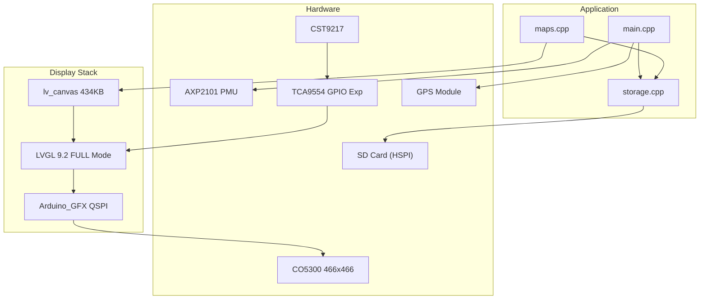

# IceNav-v3: Waveshare ESP32-S3 AMOLED 1.75" Port

**Target Board:** [Waveshare ESP32-S3 Touch AMOLED 1.75"](https://www.waveshare.com/esp32-s3-touch-amoled-1.75.htm)

**Goal:** Get the vector map view working on this 466×466 round AMOLED display with CO5300 driver.

---

## Summary of Changes

| Category | Files Changed | Purpose |
|----------|---------------|---------|
| Board Config | 1 new, 1 modified | Define new board and build environment |
| Display Driver | 2 new, 2 modified | Arduino_GFX driver for CO5300 AMOLED |
| LVGL Integration | 2 modified | LVGL 9 setup with RGB565 for Arduino_GFX |
| Map Rendering | 3 modified | Vector maps via LVGL Canvas API |
| Storage | 2 modified | SPI mode SD card, FFat fallback |
| GUI Screens | 9 modified | Compatibility with disabled features |
| Utilities | 4 modified | Feature flag guards |
| Build/Test | 4 new/modified | Partitions, test files, sdkconfig |

---

## New Files

### Platform/Board Configuration

#### [boards/waveshare-esp32-s3-amoled-1.75.json](file:///Users/chris/Documents/Workspace/esp32-bike-computer/IceNav-v3/boards/waveshare-esp32-s3-amoled-1.75.json)

Custom PlatformIO board definition for the Waveshare hardware:
- **MCU:** ESP32-S3 @ 240MHz
- **Flash:** 16MB QIO
- **PSRAM:** 8MB OPI
- **USB:** CDC-on-boot enabled
- **Upload:** 921600 baud

#### [partitions.csv](file:///Users/chris/Documents/Workspace/esp32-bike-computer/IceNav-v3/partitions.csv)

Custom partition layout for 16MB flash:
- `nvs`: 20KB
- `otadata`: 8KB
- `app0`: 6MB (OTA slot 0)
- `app1`: 6MB (OTA slot 1)
- `ffat`: 3MB (FAT filesystem for map data)

---

### Display Panel Driver

#### [lib/panel/WAVESHARE_AMOLED_175.hpp](file:///Users/chris/Documents/Workspace/esp32-bike-computer/IceNav-v3/lib/panel/WAVESHARE_AMOLED_175.hpp)

Header declaring the CO5300 AMOLED configuration:
- **Display:** 466×466 round AMOLED
- **Interface:** QSPI (4-wire) via Arduino_GFX
- **Touch:** CST9217 capacitive touch @ I2C 0x5A
- Dual implementation paths: `USE_ARDUINO_GFX` (active) or LovyanGFX fallback

#### [lib/panel/WAVESHARE_AMOLED_175.cpp](file:///Users/chris/Documents/Workspace/esp32-bike-computer/IceNav-v3/lib/panel/WAVESHARE_AMOLED_175.cpp)

Full implementation of display and touch initialization:

```cpp
// QSPI Bus Configuration
Arduino_ESP32QSPI *bus = new Arduino_ESP32QSPI(
    12,  // CS
    38,  // SCK
    4, 5, 6, 7  // D0-D3
);
Arduino_CO5300 *gfx = new Arduino_CO5300(bus, 39 /*RST*/, 0 /*rotation*/);
```

**Key Functions:**
- `setupDisplay()` – Initializes gfx, sets brightness to max
- `setupLVGLforArduinoGFX()` – Creates LVGL 9 display, allocates PSRAM buffer (~43KB), registers flush callback
- `my_disp_flush()` – Uses `gfx->draw16bitRGBBitmap()` for RGB565 output
- `readTouch()` / `my_touchpad_read()` – CST9217 I2C touch driver (currently disabled via `DISABLE_TOUCH`)

---

### Map Data (Test Tiles)

#### [data/VECTMAP/](file:///Users/chris/Documents/Workspace/esp32-bike-computer/IceNav-v3/data/VECTMAP/)

Sample vector map tiles for the region:
- `4_13.fmp`, `4_14.fmp`, `5_13.fmp`, `5_14.fmp`

These `.fmp` files are parsed by [maps.cpp](file:///Users/chris/Documents/Workspace/esp32-bike-computer/IceNav-v3/lib/maps/src/maps.cpp) `readMapBlock()`.

---

## Modified Files

### Build Configuration

#### [platformio.ini](file:///Users/chris/Documents/Workspace/esp32-bike-computer/IceNav-v3/platformio.ini)

New environment `[env:WAVESHARE_AMOLED_175]`:

| Setting | Value |
|---------|-------|
| Platform | pioarduino (Arduino Core 3.x) |
| Board | esp32-s3-devkitc-1 with custom memory |
| Partitions | `partitions.csv` |
| Filesystem | fatfs |

**Key Build Flags:**
```ini
-DWAVESHARE_AMOLED_175
-DUSE_ARDUINO_GFX        # Use Arduino_GFX instead of LovyanGFX
; -DDEFAULT_LAT=31.224     # Test coordinates (Shanghai)
; -DDEFAULT_LON=121.460
-DDEFAULT_LAT=35.16755     # Test coordinates (Hilton Nagoya)
-DDEFAULT_LON=136.89451
-DDISABLE_TOUCH=1        # GPIO conflict with SD card
-DDISABLE_CLI=1          # Core 3.x compatibility
-DDISABLE_COMPASS=1
-DDISABLE_GESTURES=1
-DDISABLE_WEB_SERVER=1
-DDISABLE_BLUETOOTH=1
-DDISABLE_OTA_UPGRADE=1
-DDISABLE_ADVANCED_GUI=1
```

**Library Changes:**
- Added `moononournation/GFX Library for Arduino @ ^1.4.7`
- Disabled LovyanGFX (not compatible with CO5300)
- Disabled EasyPreferences, WiFi CLI, AsyncTCP (Core 3.x issues)

---

### Hardware Abstraction

#### [include/hal.hpp](file:///Users/chris/Documents/Workspace/esp32-bike-computer/IceNav-v3/include/hal.hpp)

Added `WAVESHARE_AMOLED_175` section (lines 177-218):

| Pin Group | Pins |
|-----------|------|
| I2C (Touch/PMU) | SDA=15, SCL=14 |
| QSPI Display | CS=12, CLK=38, D0-D3=4,5,6,7, RST=39 |
| Touch | SDA=15, SCL=16, INT=21, RST=20 |
| SD Card | CLK=14, CMD=17, D0=16, D3/CS=21 |

> **Note:** GPIO 21 conflict between Touch INT and SD CS — currently SD wins via `DISABLE_TOUCH`.

---

### Display Layer

#### [lib/tft/tft.cpp](file:///Users/chris/Documents/Workspace/esp32-bike-computer/IceNav-v3/lib/tft/tft.cpp)

Conditional compilation for Arduino_GFX:

```cpp
#ifdef USE_ARDUINO_GFX
  setupDisplay();           // From WAVESHARE_AMOLED_175.cpp
  TFT_WIDTH = SCREEN_WIDTH; // 466
  TFT_HEIGHT = SCREEN_HEIGHT;
#else
  tft.init();               // LovyanGFX path
  ...
#endif
```

Functions `tftOn()` / `tftOff()` now use `gfx->setBrightness()` and `gfx->displayOn()/Off()`.

#### [lib/tft/tft.hpp](file:///Users/chris/Documents/Workspace/esp32-bike-computer/IceNav-v3/lib/tft/tft.hpp)

Added Arduino_GFX includes and extern declarations:
```cpp
#ifdef USE_ARDUINO_GFX
#include "../panel/WAVESHARE_AMOLED_175.hpp"
extern Arduino_CO5300 *gfx;
#endif
```

---

### LVGL Configuration

#### [lib/lvgl/lv_conf.h](file:///Users/chris/Documents/Workspace/esp32-bike-computer/IceNav-v3/lib/lvgl/lv_conf.h)

LVGL 9.2.2 configuration:
- `LV_COLOR_DEPTH = 16` (RGB565)
- `LV_USE_STDLIB_MALLOC = LV_STDLIB_BUILTIN`
- `LV_MEM_SIZE = 64KB`
- `LV_DEF_REFR_PERIOD = 33ms`
- Canvas widget enabled (`LV_USE_CANVAS = 1`)

#### [lib/lvgl/src/lvglSetup.cpp](file:///Users/chris/Documents/Workspace/esp32-bike-computer/IceNav-v3/lib/lvgl/src/lvglSetup.cpp)

Initialization paths split:

```cpp
void initLVGL() {
#ifdef USE_ARDUINO_GFX
  setupLVGLforArduinoGFX();  // Uses panel driver
#else
  lv_init();
  display = lv_display_create(TFT_WIDTH, TFT_HEIGHT);
  lv_display_set_flush_cb(display, displayFlush);  // LovyanGFX DMA
  ...
#endif
```

`loadMainScreen()` modified to:
- Skip satellite search (using `DEFAULT_LAT/LON`)
- Force vector map mode and zoom=6
- Directly generate and display map

---

### Vector Map Rendering

#### [lib/maps/src/maps.hpp](file:///Users/chris/Documents/Workspace/esp32-bike-computer/IceNav-v3/lib/maps/src/maps.hpp)

Added `zoom` field to `ViewPort` struct. Updated tile dimensions to 466×466 for AMOLED.

#### [lib/maps/src/maps.cpp](file:///Users/chris/Documents/Workspace/esp32-bike-computer/IceNav-v3/lib/maps/src/maps.cpp)

**Major Refactor:** Replaced TFT_eSprite with LVGL Canvas API.

Key changes:
1. **POSIX File API** (lines 366-412) — Bypasses newlib's 3-stream limit:
   ```cpp
   int fd = ::open(filePath.c_str(), O_RDONLY);
   ssize_t bytesRead = ::read(fd, file, fileSize);
   ::close(fd);
   ```

2. **`fillPolygon()` rewritten** (lines 546-639) — Direct buffer writes to LVGL canvas:
   ```cpp
   lv_draw_buf_t *draw_buf = lv_canvas_get_draw_buf(canvas);
   uint16_t *buf = (uint16_t *)draw_buf->data;
   // Scanline fill with RGB565 byte-swap
   uint16_t color = (p.color >> 8) | (p.color << 8);
   buf[row_offset + cx] = color;
   ```

3. **Debug logging** added throughout `readVectorMap()` for polygon/polyline counts.

#### [lib/maps/src/mapVars.h](file:///Users/chris/Documents/Workspace/esp32-bike-computer/IceNav-v3/lib/maps/src/mapVars.h)

Updated constants:
- `MAPBLOCKS_MAX = 4` (was 3) — More corner tile coverage
- `BACKGROUND_COLOR = 0xEF5D` — Beige/tan for land areas

---

### Storage

#### [lib/storage/storage.cpp](file:///Users/chris/Documents/Workspace/esp32-bike-computer/IceNav-v3/lib/storage/storage.cpp)

SD card initialization for Waveshare board (lines 68-126):
- Uses Arduino `SD.begin()` in SPI mode (not SDMMC)
- Pins: CS=21, CLK=14, MOSI=15, MISO=16
- 1MHz initial speed with 400kHz fallback

FFat initialization (lines 230-262):
- Mounts internal flash partition at `/sdcard` as fallback
- Enables loading map tiles from flash when SD unavailable

#### [lib/storage/storage.hpp](file:///Users/chris/Documents/Workspace/esp32-bike-computer/IceNav-v3/lib/storage/storage.hpp)

Added `#include <SD.h>` and `#include <FFat.h>` conditionally.

---

### Main Application

#### [src/main.cpp](file:///Users/chris/Documents/Workspace/esp32-bike-computer/IceNav-v3/src/main.cpp)

**AXP2101 Power Management** (lines 150-212):
```cpp
// Enable DLDO1 (3.3V for display)
Wire.beginTransmission(0x34);
Wire.write(0x90); Wire.write(0x9C);  // Enable + 3.3V
Wire.endTransmission();

// Power cycle all LDOs for SD card stability
for (uint8_t reg : {0x92, 0x93, 0x94, 0x95, 0x96, 0x97}) {
  // Disable then re-enable each LDO
}

Wire.end();  // Release I2C pins for SD (GPIO 14/15 shared)
```

**GPS Bypass** (lines 278-289):
```cpp
#if defined(DEFAULT_LAT) && defined(DEFAULT_LON)
  gps.gpsData.latitude = DEFAULT_LAT;   // 49.6238773
  gps.gpsData.longitude = DEFAULT_LON;  // 7.5503425
  isGpsFixed = true;
  loadMainScreen();  // Skip satellite search
#endif
```

---

### GUI Screens (Feature Guards)

These files received `#ifdef DISABLE_*` guards to compile without optional features:

| File | Guards Added |
|------|--------------|
| [buttonBar.cpp](file:///Users/chris/Documents/Workspace/esp32-bike-computer/IceNav-v3/lib/gui/src/buttonBar.cpp) | `DISABLE_BLUETOOTH`, `DISABLE_CLI` |
| [deviceSettingsScr.cpp](file:///Users/chris/Documents/Workspace/esp32-bike-computer/IceNav-v3/lib/gui/src/deviceSettingsScr.cpp) | `DISABLE_ADVANCED_GUI` |
| [gpxDetailScr.cpp](file:///Users/chris/Documents/Workspace/esp32-bike-computer/IceNav-v3/lib/gui/src/gpxDetailScr.cpp) | `DISABLE_ADVANCED_GUI` |
| [gpxScr.cpp](file:///Users/chris/Documents/Workspace/esp32-bike-computer/IceNav-v3/lib/gui/src/gpxScr.cpp) | `DISABLE_ADVANCED_GUI` |
| [mainScr.cpp](file:///Users/chris/Documents/Workspace/esp32-bike-computer/IceNav-v3/lib/gui/src/mainScr.cpp) | `DISABLE_GESTURES` |
| [notifyBar.cpp](file:///Users/chris/Documents/Workspace/esp32-bike-computer/IceNav-v3/lib/gui/src/notifyBar.cpp) | `DISABLE_BLUETOOTH` |
| [searchSatScr.cpp](file:///Users/chris/Documents/Workspace/esp32-bike-computer/IceNav-v3/lib/gui/src/searchSatScr.cpp) | `DISABLE_ADVANCED_GUI` |
| [settingsScr.cpp](file:///Users/chris/Documents/Workspace/esp32-bike-computer/IceNav-v3/lib/gui/src/settingsScr.cpp) | `DISABLE_CLI`, `DISABLE_WEB_SERVER` |
| [splashScr.cpp](file:///Users/chris/Documents/Workspace/esp32-bike-computer/IceNav-v3/lib/gui/src/splashScr.cpp) | Minor compatibility |

---

### Utility Libraries

| File | Changes |
|------|---------|
| [compass.cpp](file:///Users/chris/Documents/Workspace/esp32-bike-computer/IceNav-v3/lib/compass/compass.cpp) | `#ifndef DISABLE_COMPASS` guard |
| [compass.hpp](file:///Users/chris/Documents/Workspace/esp32-bike-computer/IceNav-v3/lib/compass/compass.hpp) | Conditional includes |
| [gps.hpp](file:///Users/chris/Documents/Workspace/esp32-bike-computer/IceNav-v3/lib/gps/gps.hpp) | Minor refactoring |
| [gestures.cpp](file:///Users/chris/Documents/Workspace/esp32-bike-computer/IceNav-v3/lib/utils/src/gestures.cpp) | `#ifndef DISABLE_GESTURES` guard |
| [gestures.hpp](file:///Users/chris/Documents/Workspace/esp32-bike-computer/IceNav-v3/lib/utils/src/gestures.hpp) | Conditional includes |
| [firmUpgrade.cpp](file:///Users/chris/Documents/Workspace/esp32-bike-computer/IceNav-v3/lib/upgrade/src/firmUpgrade.cpp) | `#ifndef DISABLE_OTA_UPGRADE` guard |
| [firmUpgrade.hpp](file:///Users/chris/Documents/Workspace/esp32-bike-computer/IceNav-v3/lib/upgrade/src/firmUpgrade.hpp) | Conditional includes |
| [power.cpp](file:///Users/chris/Documents/Workspace/esp32-bike-computer/IceNav-v3/lib/power/power.cpp) | AXP2101 awareness |
| [power.hpp](file:///Users/chris/Documents/Workspace/esp32-bike-computer/IceNav-v3/lib/power/power.hpp) | Conditional PMU includes |
| [settings.cpp](file:///Users/chris/Documents/Workspace/esp32-bike-computer/IceNav-v3/lib/settings/settings.cpp) | Feature flag defaults |
| [settings.hpp](file:///Users/chris/Documents/Workspace/esp32-bike-computer/IceNav-v3/lib/settings/settings.hpp) | New setting flags |
| [panelSelect.hpp](file:///Users/chris/Documents/Workspace/esp32-bike-computer/IceNav-v3/lib/panel/panelSelect.hpp) | Added WAVESHARE_AMOLED_175 include |
| [widgets.hpp](file:///Users/chris/Documents/Workspace/esp32-bike-computer/IceNav-v3/lib/gui/src/widgets.hpp) | Display size awareness |
| [mainScr.hpp](file:///Users/chris/Documents/Workspace/esp32-bike-computer/IceNav-v3/lib/gui/src/mainScr.hpp) | Extern declarations |

---

## Critical Fixes (Commits 8354aaa → 9a9396f)

### 1. Display Black Stripes (FIXED)

**Problem:** Horizontal black stripes appeared at fixed Y positions during map rendering.

**Root Cause:** LVGL partial rendering mode (1/5 screen buffer) created gaps at flush boundaries between render cycles.

**Solution in `WAVESHARE_AMOLED_175.cpp`:**
```cpp
// Allocate FULL SCREEN buffer in PSRAM (466×466×2 = 434KB)
lv_buf = heap_caps_malloc(buf_size, MALLOC_CAP_SPIRAM);
lv_display_set_buffers(display, lv_buf, NULL, buf_size, 
                        LV_DISPLAY_RENDER_MODE_FULL);

// Low-level flush for complete control
void my_disp_flush(lv_display_t *disp, const lv_area_t *area, uint8_t *px_map) {
  gfx->startWrite();
  gfx->writeAddrWindow(area->x1, area->y1, w, h);
  gfx->writePixels((uint16_t *)px_map, w * h);
  gfx->endWrite();
  lv_display_flush_ready(disp);
}
```

---

### 2. SD Card Failure After Touch (FIXED)

**Problem:** SD card worked at boot but failed with "no token received" after touch/scroll interaction.

**Root Cause:** Default SPI (FSPI/SPI2) shared internal resources with QSPI display driver. Display flush operations corrupted SD card SPI state.

**Solution in `storage.cpp` — Use dedicated HSPI bus:**
```cpp
#ifdef WAVESHARE_AMOLED_175
  static SPIClass hspi(HSPI);  // Dedicated bus, isolated from QSPI
  hspi.begin(SD_CLK, SD_MISO, SD_MOSI, SD_CS);
  SD.begin(SD_CS, hspi, 4000000, "/sdcard");
#endif
```

**Solution in `main.cpp` — Init order matters:**
```cpp
// Display MUST init before SD card
initTFT();    // Settles QSPI bus first
storage.initSD();  // Then init SD on HSPI
```

---

### 3. Polygon Clipping Issue (FIXED)

**Problem:** Buildings/polygons didn't render in lower portion of screen.

**Root Cause:** `fillPolygon()` clipped Y to `mapScrHeight` instead of actual buffer height.

**Solution in `maps.cpp`:**
```cpp
// Old: if (maxY >= Maps::mapScrHeight)
// Fixed: Clip to actual buffer dimensions
if (maxY >= buf_h)
    maxY = buf_h - 1;
```

---

### 4. Touch Input (RE-ENABLED)

Touch now works via TCA9554 GPIO expander for CST9217 reset control.

**Key code in `WAVESHARE_AMOLED_175.cpp`:**
```cpp
bool initTouchController() {
  // TCA9554 at 0x20 controls touch reset via GPIO expander
  Wire.beginTransmission(TCA9554_ADDR);  // 0x20
  Wire.write(0x03);  // Config register
  Wire.write(0x00);  // All pins as outputs
  Wire.endTransmission();
  
  // Toggle reset pin (P1)
  Wire.write(0x01); Wire.write(0x00);  // RST LOW
  delay(20);
  Wire.write(0x01); Wire.write(0x02);  // RST HIGH
  delay(50);
  
  touchInitialized = true;
  return true;
}
```

---

### 5. I2C Bus Stability

I2C bus recovery added in `main.cpp` setup:
```cpp
// Clock out any stuck transactions
pinMode(I2C_SCL, OUTPUT);
for (int i = 0; i < 16; i++) {
  digitalWrite(I2C_SCL, LOW);  delayMicroseconds(5);
  digitalWrite(I2C_SCL, HIGH); delayMicroseconds(5);
}
Wire.begin(I2C_SDA, I2C_SCL, 100000);
```

---

## Updated Pin Configuration

| Function | Pin | Notes |
|----------|-----|-------|
| I2C SDA | GPIO 15 | Touch, PMU, GPIO expander |
| I2C SCL | GPIO 14 | Touch, PMU, GPIO expander |
| SD CS | GPIO 41 | **Changed from 21** |
| SD MOSI | GPIO 1 | |
| SD MISO | GPIO 3 | |
| SD CLK | GPIO 2 | |
| QSPI CS | GPIO 12 | Display |
| QSPI CLK | GPIO 38 | Display |
| Touch INT | GPIO 21 | Now available (SD CS moved) |

---

## Known Issues & TODOs

1. **I2C Intermittent Errors** — `ESP_ERR_INVALID_STATE` appears occasionally but doesn't affect touch functionality.

2. **Render maps disabled** — PNG tile loading not implemented for Arduino_GFX path. Only vector maps work.

3. **No compass** — Disabled due to EasyPreferences dependency issues with Arduino Core 3.x.

---

## Build & Flash

```bash
# Build for Waveshare AMOLED
pio run -e WAVESHARE_AMOLED_175

# Upload
pio run -e WAVESHARE_AMOLED_175 -t upload

# Monitor
pio device monitor -b 115200
```

---

## Architecture Diagram



